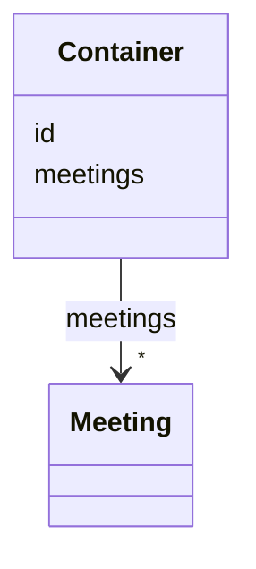

# Class: Container 


URI: [ops:Container](https://ch.paf.link/schema/operations/Container)





<!-- no inheritance hierarchy -->


## Slots

| Name | Cardinality and Range | Description | Inheritance |
| ---  | --- | --- | --- |
| [id](id.md) | 1 <br/> [String](String.md) |  | direct |
| [meetings](meetings.md) | * <br/> [Meeting](Meeting.md) |  | direct |


## Identifier and Mapping Information


### Schema Source


* from schema: https://ch.paf.link/schema/operations


## Mappings

| Mapping Type | Mapped Value |
| ---  | ---  |
| self | ops:Container |
| native | ops:Container |


## LinkML Source

<!-- TODO: investigate https://stackoverflow.com/questions/37606292/how-to-create-tabbed-code-blocks-in-mkdocs-or-sphinx -->

### Direct

<details>
```yaml
name: Container
from_schema: https://ch.paf.link/schema/operations
slots:
- id
- meetings
tree_root: true

```
</details>

### Induced

<details>
```yaml
name: Container
from_schema: https://ch.paf.link/schema/operations
attributes:
  id:
    name: id
    from_schema: https://ch.paf.link/schema/operations
    rank: 1000
    slot_uri: dcterm:identifier
    identifier: true
    alias: id
    owner: Container
    domain_of:
    - Container
    - Meeting
    range: string
    required: true
  meetings:
    name: meetings
    from_schema: https://ch.paf.link/schema/operations
    rank: 1000
    slot_uri: ops:meeting
    alias: meetings
    owner: Container
    domain_of:
    - Container
    range: Meeting
    multivalued: true
    inlined_as_list: true
tree_root: true

```
</details>