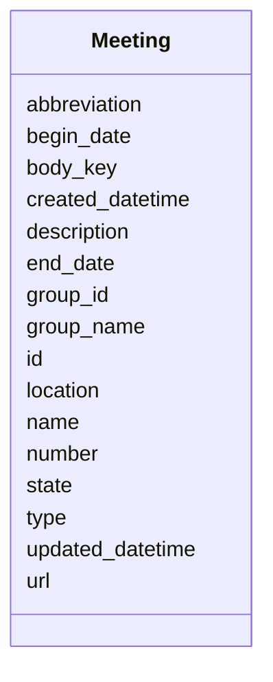

# Class: Meeting 


URI: [ops:Meeting](https://ch.paf.link/schema/operationsMeeting)





<!-- no inheritance hierarchy -->


## Slots

| Name | Cardinality and Range | Description | Inheritance |
| ---  | --- | --- | --- |
| [id](id.md) | 1 <br/> [String](String.md) |  | direct |
| [body_key](body_key.md) | 0..1 <br/> [String](String.md) |  | direct |
| [name](name.md) | 0..1 <br/> [String](String.md) |  | direct |
| [url](url.md) | 0..1 <br/> [String](String.md) |  | direct |
| [number](number.md) | 0..1 <br/> [String](String.md) |  | direct |
| [abbreviation](abbreviation.md) | 0..1 <br/> [String](String.md) |  | direct |
| [group_name](group_name.md) | 0..1 <br/> [String](String.md) |  | direct |
| [group_id](group_id.md) | 0..1 <br/> [String](String.md) |  | direct |
| [begin_date](begin_date.md) | 0..1 <br/> [Datetime](Datetime.md) |  | direct |
| [end_date](end_date.md) | 0..1 <br/> [Datetime](Datetime.md) |  | direct |
| [state](state.md) | 0..1 <br/> [String](String.md) |  | direct |
| [description](description.md) | 0..1 <br/> [String](String.md) |  | direct |
| [location](location.md) | 0..1 <br/> [String](String.md) |  | direct |
| [type](type.md) | 0..1 <br/> [String](String.md) |  | direct |
| [updated_datetime](updated_datetime.md) | 0..1 <br/> [String](String.md) |  | direct |
| [created_datetime](created_datetime.md) | 0..1 <br/> [String](String.md) |  | direct |


## Usages

| used by | used in | type | used |
| ---  | --- | --- | --- |
| [Container](Container.md) | [meetings](meetings.md) | range | [Meeting](Meeting.md) |


## Identifier and Mapping Information


### Schema Source


* from schema: https://ch.paf.link/schema/operations


## Mappings

| Mapping Type | Mapped Value |
| ---  | ---  |
| self | ops:Meeting |
| native | ops:Meeting |


## LinkML Source

<!-- TODO: investigate https://stackoverflow.com/questions/37606292/how-to-create-tabbed-code-blocks-in-mkdocs-or-sphinx -->

### Direct

<details>
```yaml
name: Meeting
from_schema: https://ch.paf.link/schema/operations
slots:
- id
- body_key
- name
- url
- number
- abbreviation
- group_name
- group_id
- begin_date
- end_date
- state
- description
- location
- type
- updated_datetime
- created_datetime

```
</details>

### Induced

<details>
```yaml
name: Meeting
from_schema: https://ch.paf.link/schema/operations
attributes:
  id:
    name: id
    from_schema: https://ch.paf.link/schema/operations
    rank: 1000
    slot_uri: dcterm:identifier
    identifier: true
    alias: id
    owner: Meeting
    domain_of:
    - Container
    - Meeting
    range: string
    required: true
  body_key:
    name: body_key
    from_schema: https://ch.paf.link/schema/operations
    rank: 1000
    alias: body_key
    owner: Meeting
    domain_of:
    - Meeting
    range: string
  name:
    name: name
    from_schema: https://ch.paf.link/schema/operations
    rank: 1000
    alias: name
    owner: Meeting
    domain_of:
    - Meeting
    range: string
  url:
    name: url
    from_schema: https://ch.paf.link/schema/operations
    rank: 1000
    alias: url
    owner: Meeting
    domain_of:
    - Meeting
    range: string
  number:
    name: number
    from_schema: https://ch.paf.link/schema/operations
    rank: 1000
    alias: number
    owner: Meeting
    domain_of:
    - Meeting
    range: string
  abbreviation:
    name: abbreviation
    from_schema: https://ch.paf.link/schema/operations
    rank: 1000
    alias: abbreviation
    owner: Meeting
    domain_of:
    - Meeting
    range: string
  group_name:
    name: group_name
    from_schema: https://ch.paf.link/schema/operations
    rank: 1000
    alias: group_name
    owner: Meeting
    domain_of:
    - Meeting
    range: string
  group_id:
    name: group_id
    from_schema: https://ch.paf.link/schema/operations
    rank: 1000
    alias: group_id
    owner: Meeting
    domain_of:
    - Meeting
    range: string
  begin_date:
    name: begin_date
    from_schema: https://ch.paf.link/schema/operations
    rank: 1000
    alias: begin_date
    owner: Meeting
    domain_of:
    - Meeting
    range: datetime
  end_date:
    name: end_date
    from_schema: https://ch.paf.link/schema/operations
    rank: 1000
    alias: end_date
    owner: Meeting
    domain_of:
    - Meeting
    range: datetime
  state:
    name: state
    from_schema: https://ch.paf.link/schema/operations
    rank: 1000
    alias: state
    owner: Meeting
    domain_of:
    - Meeting
    range: string
  description:
    name: description
    from_schema: https://ch.paf.link/schema/operations
    rank: 1000
    alias: description
    owner: Meeting
    domain_of:
    - Meeting
    range: string
  location:
    name: location
    from_schema: https://ch.paf.link/schema/operations
    rank: 1000
    alias: location
    owner: Meeting
    domain_of:
    - Meeting
    range: string
  type:
    name: type
    from_schema: https://ch.paf.link/schema/operations
    rank: 1000
    alias: type
    owner: Meeting
    domain_of:
    - Meeting
    range: string
  updated_datetime:
    name: updated_datetime
    from_schema: https://ch.paf.link/schema/operations
    rank: 1000
    alias: updated_datetime
    owner: Meeting
    domain_of:
    - Meeting
    range: string
  created_datetime:
    name: created_datetime
    from_schema: https://ch.paf.link/schema/operations
    rank: 1000
    alias: created_datetime
    owner: Meeting
    domain_of:
    - Meeting
    range: string

```
</details>