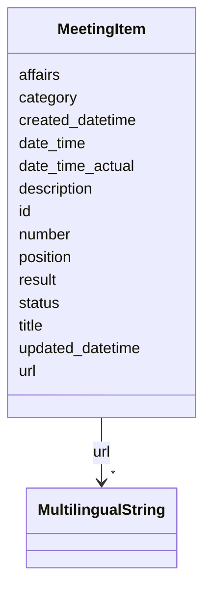

# Class: MeetingItem 


URI: [ops:MeetingItem](https://ch.paf.link/schema/operations/MeetingItem)





<!-- no inheritance hierarchy -->


## Slots

| Name | Cardinality and Range | Description | Inheritance |
| ---  | --- | --- | --- |
| [id](id.md) | 1 <br/> [String](String.md) |  | direct |
| [date_time](date_time.md) | 0..1 <br/> [Datetime](Datetime.md) |  | direct |
| [date_time_actual](date_time_actual.md) | 0..1 <br/> [Datetime](Datetime.md) |  | direct |
| [position](position.md) | 0..1 <br/> [String](String.md) |  | direct |
| [number](number.md) | 0..1 <br/> [String](String.md) |  | direct |
| [title](title.md) | 0..1 <br/> [String](String.md) |  | direct |
| [affairs](affairs.md) | 0..1 <br/> [String](String.md) |  | direct |
| [description](description.md) | 0..1 <br/> [String](String.md) |  | direct |
| [status](status.md) | 0..1 <br/> [String](String.md) |  | direct |
| [result](result.md) | 0..1 <br/> [String](String.md) |  | direct |
| [url](url.md) | * <br/> [MultilingualString](MultilingualString.md) |  | direct |
| [category](category.md) | 0..1 <br/> [String](String.md) |  | direct |
| [updated_datetime](updated_datetime.md) | 0..1 <br/> [Datetime](Datetime.md) | The last time this record was updated | direct |
| [created_datetime](created_datetime.md) | 0..1 <br/> [Datetime](Datetime.md) | The time this record was created | direct |


## Usages

| used by | used in | type | used |
| ---  | --- | --- | --- |
| [Container](Container.md) | [meeting_items](meeting_items.md) | range | [MeetingItem](MeetingItem.md) |


## Identifier and Mapping Information


### Schema Source


* from schema: https://ch.paf.link/schema/operations


## Mappings

| Mapping Type | Mapped Value |
| ---  | ---  |
| self | ops:MeetingItem |
| native | ops:MeetingItem |


## LinkML Source

<!-- TODO: investigate https://stackoverflow.com/questions/37606292/how-to-create-tabbed-code-blocks-in-mkdocs-or-sphinx -->

### Direct

<details>
```yaml
name: MeetingItem
from_schema: https://ch.paf.link/schema/operations
slots:
- id
- date_time
- date_time_actual
- position
- number
- title
- affairs
- description
- status
- result
- url
- category
- updated_datetime
- created_datetime

```
</details>

### Induced

<details>
```yaml
name: MeetingItem
from_schema: https://ch.paf.link/schema/operations
attributes:
  id:
    name: id
    from_schema: https://ch.paf.link/schema/operations
    rank: 1000
    slot_uri: dcterm:identifier
    identifier: true
    alias: id
    owner: MeetingItem
    domain_of:
    - Container
    - Legislature
    - Session
    - Meeting
    - MeetingItem
    range: string
    required: true
  date_time:
    name: date_time
    from_schema: https://ch.paf.link/schema/operations
    rank: 1000
    alias: date_time
    owner: MeetingItem
    domain_of:
    - MeetingItem
    range: datetime
  date_time_actual:
    name: date_time_actual
    from_schema: https://ch.paf.link/schema/operations
    rank: 1000
    alias: date_time_actual
    owner: MeetingItem
    domain_of:
    - MeetingItem
    range: datetime
  position:
    name: position
    from_schema: https://ch.paf.link/schema/operations
    rank: 1000
    alias: position
    owner: MeetingItem
    domain_of:
    - MeetingItem
    range: string
  number:
    name: number
    from_schema: https://ch.paf.link/schema/operations
    rank: 1000
    alias: number
    owner: MeetingItem
    domain_of:
    - Session
    - Meeting
    - MeetingItem
    range: string
  title:
    name: title
    from_schema: https://ch.paf.link/schema/operations
    rank: 1000
    alias: title
    owner: MeetingItem
    domain_of:
    - MeetingItem
    range: string
  affairs:
    name: affairs
    from_schema: https://ch.paf.link/schema/operations
    rank: 1000
    alias: affairs
    owner: MeetingItem
    domain_of:
    - MeetingItem
    range: string
  description:
    name: description
    from_schema: https://ch.paf.link/schema/operations
    rank: 1000
    alias: description
    owner: MeetingItem
    domain_of:
    - Legislature
    - Session
    - Meeting
    - MeetingItem
    range: string
  status:
    name: status
    from_schema: https://ch.paf.link/schema/operations
    rank: 1000
    alias: status
    owner: MeetingItem
    domain_of:
    - MeetingItem
    range: string
  result:
    name: result
    from_schema: https://ch.paf.link/schema/operations
    rank: 1000
    alias: result
    owner: MeetingItem
    domain_of:
    - MeetingItem
    range: string
  url:
    name: url
    from_schema: https://ch.paf.link/schema/operations
    rank: 1000
    alias: url
    owner: MeetingItem
    domain_of:
    - Legislature
    - Session
    - Meeting
    - MeetingItem
    range: MultilingualString
    multivalued: true
    inlined: true
    inlined_as_list: true
  category:
    name: category
    from_schema: https://ch.paf.link/schema/operations
    rank: 1000
    alias: category
    owner: MeetingItem
    domain_of:
    - MeetingItem
    range: string
  updated_datetime:
    name: updated_datetime
    description: The last time this record was updated
    from_schema: https://ch.paf.link/schema/operations
    rank: 1000
    alias: updated_datetime
    owner: MeetingItem
    domain_of:
    - Legislature
    - Session
    - Meeting
    - MeetingItem
    range: datetime
  created_datetime:
    name: created_datetime
    description: The time this record was created
    from_schema: https://ch.paf.link/schema/operations
    rank: 1000
    alias: created_datetime
    owner: MeetingItem
    domain_of:
    - Legislature
    - Session
    - Meeting
    - MeetingItem
    range: datetime

```
</details>