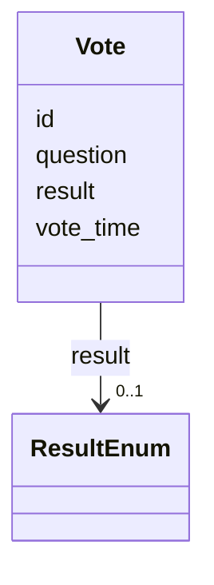

# Class: Vote 


URI: [tutorial:Vote](https://ch.paf.link/schema/tutorial/Vote)





<!-- no inheritance hierarchy -->


## Slots

| Name | Cardinality and Range | Description | Inheritance |
| ---  | --- | --- | --- |
| [id](id.md) | 1 <br/> [String](String.md) |  | direct |
| [question](question.md) | 1 <br/> [String](String.md) |  | direct |
| [vote_time](vote_time.md) | 0..1 <br/> [Datetime](Datetime.md) | [en] The date and time when the vote was cast | direct |
| [result](result.md) | 0..1 <br/> [ResultEnum](ResultEnum.md) |  | direct |


## Usages

| used by | used in | type | used |
| ---  | --- | --- | --- |
| [AgendaItem](AgendaItem.md) | [votes](votes.md) | range | [Vote](Vote.md) |
| [Container](Container.md) | [votes](votes.md) | range | [Vote](Vote.md) |


## Identifier and Mapping Information


### Schema Source


* from schema: https://ch.paf.link/schema/tutorial


## Mappings

| Mapping Type | Mapped Value |
| ---  | ---  |
| self | tutorial:Vote |
| native | tutorial:Vote |


## LinkML Source

<!-- TODO: investigate https://stackoverflow.com/questions/37606292/how-to-create-tabbed-code-blocks-in-mkdocs-or-sphinx -->

### Direct

<details>
```yaml
name: Vote
from_schema: https://ch.paf.link/schema/tutorial
slots:
- id
- question
- vote_time
- result

```
</details>

### Induced

<details>
```yaml
name: Vote
from_schema: https://ch.paf.link/schema/tutorial
attributes:
  id:
    name: id
    from_schema: https://ch.paf.link/schema/tutorial
    rank: 1000
    identifier: true
    alias: id
    owner: Vote
    domain_of:
    - Session
    - AgendaItem
    - Vote
    - Container
    range: string
    required: true
  question:
    name: question
    from_schema: https://ch.paf.link/schema/tutorial
    rank: 1000
    alias: question
    owner: Vote
    domain_of:
    - Vote
    range: string
    required: true
  vote_time:
    name: vote_time
    description: '[en] The date and time when the vote was cast.

      [de] Das Datum und die Uhrzeit, zu der die Abstimmung abgegeben wurde.

      '
    from_schema: https://ch.paf.link/schema/tutorial
    rank: 1000
    slot_uri: tutorial:voteTime
    alias: vote_time
    owner: Vote
    domain_of:
    - Vote
    range: datetime
  result:
    name: result
    from_schema: https://ch.paf.link/schema/tutorial
    rank: 1000
    alias: result
    owner: Vote
    domain_of:
    - Vote
    range: result_enum

```
</details>