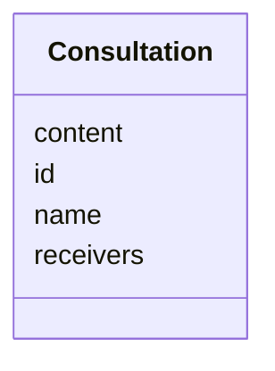

# Class: Consultation


URI: [chpaf:Consultation](https://ch.paf.link/Consultation)





<!-- no inheritance hierarchy -->


## Slots

| Name | Cardinality and Range | Description | Inheritance |
| ---  | --- | --- | --- |
| [id](id.md) | 1 <br/> [String](String.md) |  | direct |
| [name](name.md) | 1 <br/> [String](String.md) |  | direct |
| [content](content.md) | 1 <br/> [String](String.md) |  | direct |
| [receivers](receivers.md) | * <br/> [String](String.md) |  | direct |


## Usages

| used by | used in | type | used |
| ---  | --- | --- | --- |
| [Container](Container.md) | [consultations](consultations.md) | range | [Consultation](Consultation.md) |


## Identifier and Mapping Information


### Schema Source


* from schema: https://ch.paf.link/schema/consultation


## Mappings

| Mapping Type | Mapped Value |
| ---  | ---  |
| self | chpaf:Consultation |
| native | chpaf:Consultation |


## LinkML Source

<!-- TODO: investigate https://stackoverflow.com/questions/37606292/how-to-create-tabbed-code-blocks-in-mkdocs-or-sphinx -->

### Direct

<details>
```yaml
name: Consultation
from_schema: https://ch.paf.link/schema/consultation
slots:
- id
- name
- content
- receivers

```
</details>

### Induced

<details>
```yaml
name: Consultation
from_schema: https://ch.paf.link/schema/consultation
attributes:
  id:
    name: id
    from_schema: https://ch.paf.link/schema/consultation
    rank: 1000
    identifier: true
    alias: id
    owner: Consultation
    domain_of:
    - Consultation
    - Container
    range: string
    required: true
  name:
    name: name
    from_schema: https://ch.paf.link/schema/consultation
    rank: 1000
    slot_uri: dcterm:title
    alias: name
    owner: Consultation
    domain_of:
    - Consultation
    range: string
    required: true
  content:
    name: content
    from_schema: https://ch.paf.link/schema/consultation
    rank: 1000
    alias: content
    owner: Consultation
    domain_of:
    - Consultation
    range: string
    required: true
  receivers:
    name: receivers
    from_schema: https://ch.paf.link/schema/consultation
    rank: 1000
    slot_uri: chpaf:receiver
    alias: receivers
    owner: Consultation
    domain_of:
    - Consultation
    range: string
    multivalued: true
    inlined_as_list: true

```
</details>