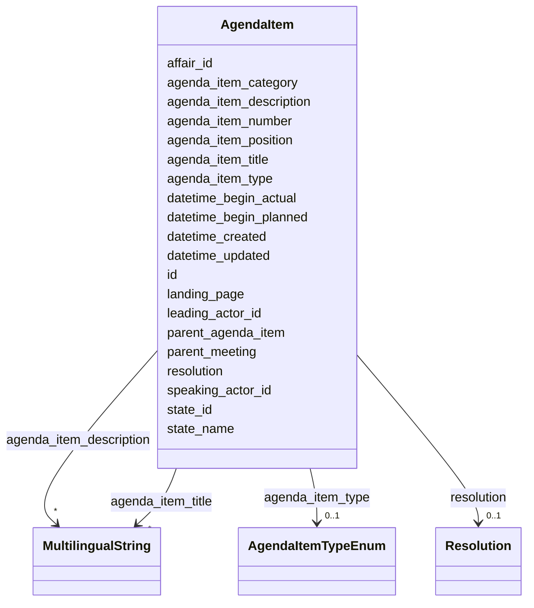

# Class: AgendaItem 


_[en] An agenda item of a meeting._

_[de] Ein Traktandum einer Sitzung.  _

__


URI: [ops:AgendaItem](https://ch.paf.link/schema/operations/AgendaItem)





<!-- no inheritance hierarchy -->


## Slots

| Name | Cardinality and Range | Description | Inheritance |
| ---  | --- | --- | --- |
| [id](id.md) | 1 <br/> [String](String.md) |  | direct |
| [parent_meeting](parent_meeting.md) | 0..1 <br/> [String](String.md) | [en] The linked meeting ID that groups the current meeting | direct |
| [agenda_item_type](agenda_item_type.md) | 0..1 <br/> [AgendaItemTypeEnum](AgendaItemTypeEnum.md) | [en] Type of agenda item, distinguishing individual items from groups | direct |
| [datetime_begin_planned](datetime_begin_planned.md) | 0..1 <br/> [Datetime](Datetime.md) | [en] Planned date and time for the start of the meeting or agenda item | direct |
| [datetime_begin_actual](datetime_begin_actual.md) | 0..1 <br/> [Datetime](Datetime.md) | [en] Actual date and time for the start of the meeting or agenda item | direct |
| [agenda_item_number](agenda_item_number.md) | 0..1 <br/> [String](String.md) | [en] Sequential number of the agenda item (string type to support roman numer... | direct |
| [agenda_item_position](agenda_item_position.md) | 0..1 <br/> [Integer](Integer.md) | [en] Integer position of the agenda item in the meeting sequence | direct |
| [leading_actor_id](leading_actor_id.md) | 0..1 <br/> [String](String.md) | [en] The leading department for the agenda item | direct |
| [speaking_actor_id](speaking_actor_id.md) | 0..1 <br/> [String](String.md) | [en] The speaker or head of the department for the agenda item | direct |
| [agenda_item_title](agenda_item_title.md) | * <br/> [MultilingualString](MultilingualString.md) | [en] Title of the agenda item | direct |
| [affair_id](affair_id.md) | 0..1 <br/> [String](String.md) | [en] The connection to the affairs (business items) of the agenda item | direct |
| [agenda_item_description](agenda_item_description.md) | * <br/> [MultilingualString](MultilingualString.md) | [en] Subtitle or detailed description of the agenda item | direct |
| [state_id](state_id.md) | 0..1 <br/> [String](String.md) | State identifier (reference to state enum or custom state) | direct |
| [state_name](state_name.md) | 0..1 <br/> [String](String.md) | [en] Custom state description for the meeting | direct |
| [landing_page](landing_page.md) | 0..1 <br/> [String](String.md) | [en] URL providing further information | direct |
| [agenda_item_category](agenda_item_category.md) | 0..1 <br/> [String](String.md) | [en] Category for grouped agenda items (e | direct |
| [parent_agenda_item](parent_agenda_item.md) | 0..1 <br/> [String](String.md) | [en] If needed, this slot builds a hierarchy of agenda items | direct |
| [resolution](resolution.md) | 0..1 <br/> [Resolution](Resolution.md) | [en] The resolutionor decision taken on this agenda item | direct |
| [datetime_updated](datetime_updated.md) | 0..1 <br/> [Datetime](Datetime.md) | The last time this record was updated | direct |
| [datetime_created](datetime_created.md) | 0..1 <br/> [Datetime](Datetime.md) | The time this record was created | direct |


## Usages

| used by | used in | type | used |
| ---  | --- | --- | --- |
| [Container](Container.md) | [agenda_items](agenda_items.md) | range | [AgendaItem](AgendaItem.md) |
| [JointDebate](JointDebate.md) | [agenda_items](agenda_items.md) | range | [AgendaItem](AgendaItem.md) |


## Identifier and Mapping Information


### Schema Source


* from schema: https://ch.paf.link/schema/operations


## Mappings

| Mapping Type | Mapped Value |
| ---  | ---  |
| self | ops:AgendaItem |
| native | ops:AgendaItem |


## LinkML Source

<!-- TODO: investigate https://stackoverflow.com/questions/37606292/how-to-create-tabbed-code-blocks-in-mkdocs-or-sphinx -->

### Direct

<details>
```yaml
name: AgendaItem
description: "[en] An agenda item of a meeting.\n[de] Ein Traktandum einer Sitzung.\
  \  \n"
from_schema: https://ch.paf.link/schema/operations
slots:
- id
- parent_meeting
- agenda_item_type
- datetime_begin_planned
- datetime_begin_actual
- agenda_item_number
- agenda_item_position
- leading_actor_id
- speaking_actor_id
- agenda_item_title
- affair_id
- agenda_item_description
- state_id
- state_name
- landing_page
- agenda_item_category
- parent_agenda_item
- resolution
- datetime_updated
- datetime_created

```
</details>

### Induced

<details>
```yaml
name: AgendaItem
description: "[en] An agenda item of a meeting.\n[de] Ein Traktandum einer Sitzung.\
  \  \n"
from_schema: https://ch.paf.link/schema/operations
attributes:
  id:
    name: id
    from_schema: https://ch.paf.link/schema/operations
    rank: 1000
    slot_uri: dcterm:identifier
    identifier: true
    alias: id
    owner: AgendaItem
    domain_of:
    - Container
    - Legislature
    - Session
    - Meeting
    - AgendaItem
    - Voting
    - IndividualVote
    - Election
    - Attendance
    - IndividualAttendance
    - Speech
    - TextSegment
    - Motion
    - Media
    range: string
    required: true
  parent_meeting:
    name: parent_meeting
    description: '[en] The linked meeting ID that groups the current meeting.

      [de] Die verknüpfte Sitzungs-ID, die die aktuelle Sitzung gruppiert.

      '
    from_schema: https://ch.paf.link/schema/operations
    rank: 1000
    alias: parent_meeting
    owner: AgendaItem
    domain_of:
    - Meeting
    - AgendaItem
    - Voting
    - Election
    range: string
  agenda_item_type:
    name: agenda_item_type
    description: '[en] Type of agenda item, distinguishing individual items from groups.

      [de] Art des Traktandums, unterscheidet Einzeltraktanden von Traktandengruppen.

      '
    from_schema: https://ch.paf.link/schema/operations
    rank: 1000
    alias: agenda_item_type
    owner: AgendaItem
    domain_of:
    - AgendaItem
    range: agenda_item_type_enum
  datetime_begin_planned:
    name: datetime_begin_planned
    description: '[en] Planned date and time for the start of the meeting or agenda
      item.

      [de] Geplantes Datum und Uhrzeit für den Beginn der Sitzung oder des Tagesordnungspunkts.

      '
    from_schema: https://ch.paf.link/schema/operations
    rank: 1000
    alias: datetime_begin_planned
    owner: AgendaItem
    domain_of:
    - AgendaItem
    range: datetime
  datetime_begin_actual:
    name: datetime_begin_actual
    description: '[en] Actual date and time for the start of the meeting or agenda
      item.

      [de] Tatsächliches Datum und Uhrzeit für den Beginn der Sitzung oder des Tagesordnungspunkts.

      '
    from_schema: https://ch.paf.link/schema/operations
    rank: 1000
    alias: datetime_begin_actual
    owner: AgendaItem
    domain_of:
    - AgendaItem
    range: datetime
  agenda_item_number:
    name: agenda_item_number
    description: '[en] Sequential number of the agenda item (string type to support
      roman numerals).

      [de] Laufnummer des Traktandums (String-Typ zur Unterstützung römischer Ziffern).

      '
    from_schema: https://ch.paf.link/schema/operations
    rank: 1000
    alias: agenda_item_number
    owner: AgendaItem
    domain_of:
    - AgendaItem
    range: string
  agenda_item_position:
    name: agenda_item_position
    description: '[en] Integer position of the agenda item in the meeting sequence.

      [de] Ganzzahlige Position des Traktandums in der Sitzungsreihenfolge.

      '
    from_schema: https://ch.paf.link/schema/operations
    rank: 1000
    alias: agenda_item_position
    owner: AgendaItem
    domain_of:
    - AgendaItem
    range: integer
  leading_actor_id:
    name: leading_actor_id
    description: '[en] The leading department for the agenda item.

      [de] Das federführende Departement für den Tagesordnungspunkt.

      '
    from_schema: https://ch.paf.link/schema/operations
    rank: 1000
    alias: leading_actor_id
    owner: AgendaItem
    domain_of:
    - AgendaItem
    range: string
  speaking_actor_id:
    name: speaking_actor_id
    description: '[en] The speaker or head of the department for the agenda item.

      [de] Der Sprecher oder Departementsvorsteher für den Tagesordnungspunkt.

      '
    from_schema: https://ch.paf.link/schema/operations
    rank: 1000
    alias: speaking_actor_id
    owner: AgendaItem
    domain_of:
    - AgendaItem
    range: string
  agenda_item_title:
    name: agenda_item_title
    description: '[en] Title of the agenda item.

      [de] Titel des Traktandums.

      '
    from_schema: https://ch.paf.link/schema/operations
    rank: 1000
    alias: agenda_item_title
    owner: AgendaItem
    domain_of:
    - AgendaItem
    range: MultilingualString
    multivalued: true
    inlined: true
    inlined_as_list: true
  affair_id:
    name: affair_id
    description: '[en] The connection to the affairs (business items) of the agenda
      item.

      [de] Die Verbindung zu den Geschäften (Geschäftsgegenständen) des Tagesordnungspunkts.

      '
    from_schema: https://ch.paf.link/schema/operations
    rank: 1000
    alias: affair_id
    owner: AgendaItem
    domain_of:
    - AgendaItem
    - Voting
    - Election
    range: string
  agenda_item_description:
    name: agenda_item_description
    description: '[en] Subtitle or detailed description of the agenda item.

      [de] Untertitel oder ausführliche Beschreibung des Traktandums.

      '
    from_schema: https://ch.paf.link/schema/operations
    rank: 1000
    alias: agenda_item_description
    owner: AgendaItem
    domain_of:
    - AgendaItem
    range: MultilingualString
    multivalued: true
    inlined: true
    inlined_as_list: true
  state_id:
    name: state_id
    description: State identifier (reference to state enum or custom state)
    from_schema: https://ch.paf.link/schema/operations
    rank: 1000
    alias: state_id
    owner: AgendaItem
    domain_of:
    - AgendaItem
    range: string
  state_name:
    name: state_name
    description: '[en] Custom state description for the meeting.

      [de] Benutzerdefinierte Zustandsbeschreibung für die Sitzung.

      '
    from_schema: https://ch.paf.link/schema/operations
    rank: 1000
    alias: state_name
    owner: AgendaItem
    domain_of:
    - Meeting
    - AgendaItem
    range: string
  landing_page:
    name: landing_page
    description: '[en] URL providing further information.

      [de] URL mit weiteren Informationen.

      '
    from_schema: https://ch.paf.link/schema/operations
    rank: 1000
    slot_uri: ops:landingPage
    alias: landing_page
    owner: AgendaItem
    domain_of:
    - Legislature
    - Meeting
    - AgendaItem
    - Voting
    - Election
    - Speech
    range: string
  agenda_item_category:
    name: agenda_item_category
    description: '[en] Category for grouped agenda items (e.g., introduction, by department,
      technical agenda items).

      [de] Kategorie für gruppierte Traktanden (z.B. Einführung, nach Departement,
      technische Traktanden).

      '
    from_schema: https://ch.paf.link/schema/operations
    rank: 1000
    alias: agenda_item_category
    owner: AgendaItem
    domain_of:
    - AgendaItem
    range: string
  parent_agenda_item:
    name: parent_agenda_item
    description: '[en] If needed, this slot builds a hierarchy of agenda items.

      [de] Wenn erforderlich, baut dieser Slot eine Hierarchie von Tagesordnungspunkten
      auf.

      '
    from_schema: https://ch.paf.link/schema/operations
    rank: 1000
    alias: parent_agenda_item
    owner: AgendaItem
    domain_of:
    - AgendaItem
    - Voting
    - Election
    range: string
  resolution:
    name: resolution
    description: '[en] The resolutionor decision taken on this agenda item.

      [de] Die Resolution oder Entscheidung zu diesem Traktandum.

      '
    from_schema: https://ch.paf.link/schema/operations
    rank: 1000
    alias: resolution
    owner: AgendaItem
    domain_of:
    - AgendaItem
    range: Resolution
  datetime_updated:
    name: datetime_updated
    description: The last time this record was updated
    from_schema: https://ch.paf.link/schema/operations
    rank: 1000
    alias: datetime_updated
    owner: AgendaItem
    domain_of:
    - Legislature
    - Session
    - Meeting
    - AgendaItem
    - Voting
    - IndividualVote
    - Election
    - Attendance
    - IndividualAttendance
    - Speech
    range: datetime
  datetime_created:
    name: datetime_created
    description: The time this record was created
    from_schema: https://ch.paf.link/schema/operations
    rank: 1000
    alias: datetime_created
    owner: AgendaItem
    domain_of:
    - Legislature
    - Session
    - Meeting
    - AgendaItem
    - Voting
    - IndividualVote
    - Election
    - Attendance
    - IndividualAttendance
    - Speech
    range: datetime

```
</details>