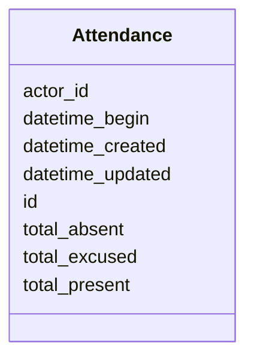

# Class: Attendance 


_[en] Attendance record for a meeting or voting session._

_[de] Anwesenheitsliste für eine Sitzung oder Abstimmung._

__


URI: [ops:Attendance](https://ch.paf.link/schema/operations/Attendance)





<!-- no inheritance hierarchy -->


## Slots

| Name | Cardinality and Range | Description | Inheritance |
| ---  | --- | --- | --- |
| [id](id.md) | 1 <br/> [String](String.md) |  | direct |
| [datetime_begin](datetime_begin.md) | 0..1 <br/> [Datetime](Datetime.md) | [en] The date and time when the meeting or voting begins | direct |
| [actor_id](actor_id.md) | 0..1 <br/> [String](String.md) | [en] The political body organized by the term of office (e | direct |
| [total_absent](total_absent.md) | 0..1 <br/> [Integer](Integer.md) | [en] Total number of absent members | direct |
| [total_present](total_present.md) | 0..1 <br/> [Integer](Integer.md) | Total number of members present | direct |
| [total_excused](total_excused.md) | 0..1 <br/> [Integer](Integer.md) | Total number of excused absences | direct |
| [datetime_updated](datetime_updated.md) | 0..1 <br/> [Datetime](Datetime.md) | The last time this record was updated | direct |
| [datetime_created](datetime_created.md) | 0..1 <br/> [Datetime](Datetime.md) | The time this record was created | direct |


## Usages

| used by | used in | type | used |
| ---  | --- | --- | --- |
| [Container](Container.md) | [attendances](attendances.md) | range | [Attendance](Attendance.md) |


## Identifier and Mapping Information


### Schema Source


* from schema: https://ch.paf.link/schema/operations


## Mappings

| Mapping Type | Mapped Value |
| ---  | ---  |
| self | ops:Attendance |
| native | ops:Attendance |


## LinkML Source

<!-- TODO: investigate https://stackoverflow.com/questions/37606292/how-to-create-tabbed-code-blocks-in-mkdocs-or-sphinx -->

### Direct

<details>
```yaml
name: Attendance
description: '[en] Attendance record for a meeting or voting session.

  [de] Anwesenheitsliste für eine Sitzung oder Abstimmung.

  '
from_schema: https://ch.paf.link/schema/operations
slots:
- id
- datetime_begin
- actor_id
- total_absent
- total_present
- total_excused
- datetime_updated
- datetime_created

```
</details>

### Induced

<details>
```yaml
name: Attendance
description: '[en] Attendance record for a meeting or voting session.

  [de] Anwesenheitsliste für eine Sitzung oder Abstimmung.

  '
from_schema: https://ch.paf.link/schema/operations
attributes:
  id:
    name: id
    from_schema: https://ch.paf.link/schema/operations
    rank: 1000
    slot_uri: dcterm:identifier
    identifier: true
    alias: id
    owner: Attendance
    domain_of:
    - Container
    - Legislature
    - Session
    - Meeting
    - AgendaItem
    - Voting
    - IndividualVote
    - Election
    - Attendance
    - IndividualAttendance
    - Speech
    - TextSegment
    - Motion
    - Media
    range: string
    required: true
  datetime_begin:
    name: datetime_begin
    description: '[en] The date and time when the meeting or voting begins.

      [de] Das Datum und die Uhrzeit, zu der die Sitzung oder Abstimmung beginnt.

      '
    from_schema: https://ch.paf.link/schema/operations
    rank: 1000
    alias: datetime_begin
    owner: Attendance
    domain_of:
    - Voting
    - Election
    - Attendance
    - Speech
    range: datetime
  actor_id:
    name: actor_id
    description: '[en] The political body organized by the term of office (e.g., Regierungsrat,
      Nationalrat, Ständerat).

      [de] Das politische Organ, das durch die Amtsdauer organisiert wird (z.B. Regierungsrat,
      Nationalrat, Ständerat).

      '
    from_schema: https://ch.paf.link/schema/operations
    rank: 1000
    alias: actor_id
    owner: Attendance
    domain_of:
    - Legislature
    - Meeting
    - Voting
    - IndividualVote
    - Election
    - Attendance
    - IndividualAttendance
    - Speech
    range: string
  total_absent:
    name: total_absent
    description: '[en] Total number of absent members. Distinction between absent/excused
      absent - presence is tracked on attendance list.

      [de] Gesamtzahl abwesender Mitglieder. Unterscheidung zwischen abwesend/entschuldigt
      abwesend - Anwesenheit wird auf Anwesenheitsliste verfolgt.

      '
    from_schema: https://ch.paf.link/schema/operations
    rank: 1000
    alias: total_absent
    owner: Attendance
    domain_of:
    - Voting
    - Election
    - Attendance
    range: integer
  total_present:
    name: total_present
    description: Total number of members present
    from_schema: https://ch.paf.link/schema/operations
    rank: 1000
    alias: total_present
    owner: Attendance
    domain_of:
    - Attendance
    range: integer
  total_excused:
    name: total_excused
    description: Total number of excused absences
    from_schema: https://ch.paf.link/schema/operations
    rank: 1000
    alias: total_excused
    owner: Attendance
    domain_of:
    - Attendance
    range: integer
  datetime_updated:
    name: datetime_updated
    description: The last time this record was updated
    from_schema: https://ch.paf.link/schema/operations
    rank: 1000
    alias: datetime_updated
    owner: Attendance
    domain_of:
    - Legislature
    - Session
    - Meeting
    - AgendaItem
    - Voting
    - IndividualVote
    - Election
    - Attendance
    - IndividualAttendance
    - Speech
    range: datetime
  datetime_created:
    name: datetime_created
    description: The time this record was created
    from_schema: https://ch.paf.link/schema/operations
    rank: 1000
    alias: datetime_created
    owner: Attendance
    domain_of:
    - Legislature
    - Session
    - Meeting
    - AgendaItem
    - Voting
    - IndividualVote
    - Election
    - Attendance
    - IndividualAttendance
    - Speech
    range: datetime

```
</details>