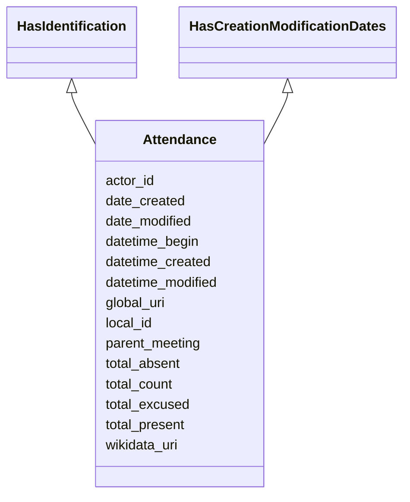

---
search:
  boost: 10.0
---

# Class: Attendance 


_[en] Aggregated attendance record for a meeting (number of members present, absent, excused)._

_[de] Aggregierte Anwesenheitsliste für eine Sitzung (Anzahl Anwesende, Abwesende, Entschuldigte)._

__


<div data-search-exclude markdown="1">


URI: [ops:Attendance](https://ch.paf.link/schema/operations/Attendance)



```mermaid
 classDiagram
    class Attendance
    click Attendance href "../Attendance/"
      HasIdentification <|-- Attendance
        click HasIdentification href "../HasIdentification/"
      HasCreationModificationDates <|-- Attendance
        click HasCreationModificationDates href "../HasCreationModificationDates/"
      
      Attendance : actor_id
        
      Attendance : date_created
        
      Attendance : date_modified
        
      Attendance : datetime_begin
        
      Attendance : datetime_created
        
      Attendance : datetime_modified
        
      Attendance : global_uri
        
      Attendance : local_id
        
      Attendance : parent_meeting
        
      Attendance : total_absent
        
      Attendance : total_count
        
      Attendance : total_excused
        
      Attendance : total_present
        
      Attendance : wikidata_uri
        
      
```


## Inheritance
* **Attendance** [ [HasIdentification](HasIdentification.md) [HasCreationModificationDates](HasCreationModificationDates.md)]


## Slots

| Name | Cardinality and Range | Description | Inheritance |
| ---  | --- | --- | --- |
| [parent_meeting](parent_meeting.md) | 0..1 <br/> [String](String.md) | [en] The linked meeting ID that groups the current meeting | direct |
| [datetime_begin](datetime_begin.md) | 0..1 <br/> [Datetime](Datetime.md) | [en] The date and time when the meeting or voting begins | direct |
| [actor_id](actor_id.md) | 0..1 <br/> [String](String.md) | [en] The political body organized by the term of office (e | direct |
| [total_count](total_count.md) | 0..1 <br/> [Integer](Integer.md) | [en] Total number of members of the body (reference value for quorum calculat... | direct |
| [total_present](total_present.md) | 0..1 <br/> [Integer](Integer.md) | Total number of members present | direct |
| [total_absent](total_absent.md) | 0..1 <br/> [Integer](Integer.md) | [en] Total number of absent members | direct |
| [total_excused](total_excused.md) | 0..1 <br/> [Integer](Integer.md) | Total number of excused absences | direct |
| [local_id](local_id.md) | 0..1 <br/> [String](String.md) | [de] Lokaler Identifikator | [HasIdentification](HasIdentification.md) |
| [global_uri](global_uri.md) | 1 <br/> [Uriorcurie](Uriorcurie.md) | [de] Eine eindeutige, global gültige URI für die Entität | [HasIdentification](HasIdentification.md) |
| [wikidata_uri](wikidata_uri.md) | 0..1 <br/> [Uriorcurie](Uriorcurie.md) | [de] Eine URI, die auf eine Wikidata-Entität verweist, z | [HasIdentification](HasIdentification.md) |
| [date_created](date_created.md) | 0..1 <br/> [Date](Date.md) | [de] Das Datum, an dem eine Entität erstellt wurde | [HasCreationModificationDates](HasCreationModificationDates.md) |
| [datetime_created](datetime_created.md) | 0..1 <br/> [Datetime](Datetime.md) | [de] Das Datum und die Uhrzeit, an dem eine Entität erstellt wurde | [HasCreationModificationDates](HasCreationModificationDates.md) |
| [date_modified](date_modified.md) | 0..1 <br/> [Date](Date.md) | [de] Das Datum, an dem eine Entität zuletzt geändert wurde | [HasCreationModificationDates](HasCreationModificationDates.md) |
| [datetime_modified](datetime_modified.md) | 0..1 <br/> [Datetime](Datetime.md) | [de] Das Datum und die Uhrzeit, an dem eine Entität zuletzt geändert wurde | [HasCreationModificationDates](HasCreationModificationDates.md) |


## Usages

| used by | used in | type | used |
| ---  | --- | --- | --- |
| [Container](Container.md) | [attendances](attendances.md) | range | [Attendance](Attendance.md) |
| [IndividualAttendance](IndividualAttendance.md) | [parent_attendance](parent_attendance.md) | range | [Attendance](Attendance.md) |


## Identifier and Mapping Information


### Schema Source


* from schema: https://ch.paf.link/schema/operations


## Mappings

| Mapping Type | Mapped Value |
| ---  | ---  |
| self | ops:Attendance |
| native | ops:Attendance |


## LinkML Source

<!-- TODO: investigate https://stackoverflow.com/questions/37606292/how-to-create-tabbed-code-blocks-in-mkdocs-or-sphinx -->

### Direct

<details>
```yaml
name: Attendance
description: '[en] Aggregated attendance record for a meeting (number of members present,
  absent, excused).

  [de] Aggregierte Anwesenheitsliste für eine Sitzung (Anzahl Anwesende, Abwesende,
  Entschuldigte).

  '
from_schema: https://ch.paf.link/schema/operations
mixins:
- HasIdentification
- HasCreationModificationDates
slots:
- parent_meeting
- datetime_begin
- actor_id
- total_count
- total_present
- total_absent
- total_excused

```
</details>

### Induced

<details>
```yaml
name: Attendance
description: '[en] Aggregated attendance record for a meeting (number of members present,
  absent, excused).

  [de] Aggregierte Anwesenheitsliste für eine Sitzung (Anzahl Anwesende, Abwesende,
  Entschuldigte).

  '
from_schema: https://ch.paf.link/schema/operations
mixins:
- HasIdentification
- HasCreationModificationDates
attributes:
  parent_meeting:
    name: parent_meeting
    description: '[en] The linked meeting ID that groups the current meeting.

      [de] Die verknüpfte Sitzungs-ID, die die aktuelle Sitzung gruppiert.

      '
    from_schema: https://ch.paf.link/schema/operations
    rank: 1000
    owner: Attendance
    domain_of:
    - Meeting
    - AgendaItem
    - Voting
    - Election
    - Attendance
    range: string
  datetime_begin:
    name: datetime_begin
    description: '[en] The date and time when the meeting or voting begins.

      [de] Das Datum und die Uhrzeit, zu der die Sitzung oder Abstimmung beginnt.

      '
    from_schema: https://ch.paf.link/schema/operations
    rank: 1000
    owner: Attendance
    domain_of:
    - Voting
    - Election
    - Attendance
    - Speech
    range: datetime
  actor_id:
    name: actor_id
    description: '[en] The political body organized by the term of office (e.g., Regierungsrat,
      Nationalrat, Ständerat).

      [de] Das politische Organ, das durch die Amtsdauer organisiert wird (z.B. Regierungsrat,
      Nationalrat, Ständerat).

      '
    from_schema: https://ch.paf.link/schema/operations
    rank: 1000
    owner: Attendance
    domain_of:
    - Legislature
    - Meeting
    - Voting
    - IndividualVote
    - Election
    - Attendance
    - IndividualAttendance
    - Speech
    range: string
  total_count:
    name: total_count
    description: '[en] Total number of members of the body (reference value for quorum
      calculations).

      [de] Gesamtzahl aller Mitglieder des Gremiums (Bezugsgrösse für Quorum-Berechnungen).

      '
    from_schema: https://ch.paf.link/schema/operations
    rank: 1000
    owner: Attendance
    domain_of:
    - Attendance
    range: integer
  total_present:
    name: total_present
    description: Total number of members present
    from_schema: https://ch.paf.link/schema/operations
    rank: 1000
    owner: Attendance
    domain_of:
    - Attendance
    range: integer
  total_absent:
    name: total_absent
    description: '[en] Total number of absent members. Distinction between absent/excused
      absent - presence is tracked on attendance list.

      [de] Gesamtzahl abwesender Mitglieder. Unterscheidung zwischen abwesend/entschuldigt
      abwesend - Anwesenheit wird auf Anwesenheitsliste verfolgt.

      '
    from_schema: https://ch.paf.link/schema/operations
    rank: 1000
    owner: Attendance
    domain_of:
    - Voting
    - Election
    - Attendance
    range: integer
  total_excused:
    name: total_excused
    description: Total number of excused absences
    from_schema: https://ch.paf.link/schema/operations
    rank: 1000
    owner: Attendance
    domain_of:
    - Attendance
    range: integer
  local_id:
    name: local_id
    description: '[de] Lokaler Identifikator. Bspw. eine UUID aus dem Ratsinformationssystem.

      [en] Local identifier. For example, a UUID from the council information system.

      '
    from_schema: https://ch.paf.link/schema/operations
    rank: 1000
    slot_uri: mcm:localId
    owner: Attendance
    domain_of:
    - HasIdentification
    range: string
  global_uri:
    name: global_uri
    description: '[de] Eine eindeutige, global gültige URI für die Entität.

      [en] A unique, globally valid URI for the entity.

      '
    from_schema: https://ch.paf.link/schema/operations
    rank: 1000
    slot_uri: mcm:globalURI
    identifier: true
    owner: Attendance
    domain_of:
    - HasIdentification
    range: uriorcurie
    required: true
  wikidata_uri:
    name: wikidata_uri
    description: '[de] Eine URI, die auf eine Wikidata-Entität verweist, z.B. https://www.wikidata.org/wiki/Q39
      für die Schweiz.

      [en] A URI that refers to a Wikidata entity, e.g. https://www.wikidata.org/wiki/Q39
      for Switzerland.

      '
    from_schema: https://ch.paf.link/schema/operations
    rank: 1000
    slot_uri: mcm:wikidataUri
    owner: Attendance
    domain_of:
    - HasIdentification
    range: uriorcurie
  date_created:
    name: date_created
    description: '[de] Das Datum, an dem eine Entität erstellt wurde.

      [en] The date when an entity was created.

      '
    from_schema: https://ch.paf.link/schema/operations
    rank: 1000
    slot_uri: mcm:dateCreated
    owner: Attendance
    domain_of:
    - HasCreationModificationDates
    range: date
  datetime_created:
    name: datetime_created
    description: '[de] Das Datum und die Uhrzeit, an dem eine Entität erstellt wurde.

      [en] The date and time when an entity was created.

      '
    from_schema: https://ch.paf.link/schema/operations
    rank: 1000
    slot_uri: mcm:datetimeCreated
    owner: Attendance
    domain_of:
    - HasCreationModificationDates
    range: datetime
  date_modified:
    name: date_modified
    description: '[de] Das Datum, an dem eine Entität zuletzt geändert wurde.

      [en] The date when an entity was last modified.

      '
    from_schema: https://ch.paf.link/schema/operations
    rank: 1000
    slot_uri: mcm:dateModified
    owner: Attendance
    domain_of:
    - HasCreationModificationDates
    range: date
  datetime_modified:
    name: datetime_modified
    description: '[de] Das Datum und die Uhrzeit, an dem eine Entität zuletzt geändert
      wurde.

      [en] The date and time when an entity was last modified.

      '
    from_schema: https://ch.paf.link/schema/operations
    rank: 1000
    slot_uri: mcm:datetimeModified
    owner: Attendance
    domain_of:
    - HasCreationModificationDates
    range: datetime

```
</details></div>