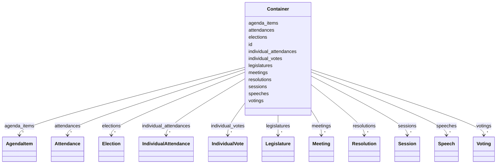

# Class: Container 


URI: [ops:Container](https://ch.paf.link/schema/operations/Container)





<!-- no inheritance hierarchy -->


## Slots

| Name | Cardinality and Range | Description | Inheritance |
| ---  | --- | --- | --- |
| [id](id.md) | 1 <br/> [String](String.md) |  | direct |
| [legislatures](legislatures.md) | * <br/> [Legislature](Legislature.md) |  | direct |
| [sessions](sessions.md) | * <br/> [Session](Session.md) |  | direct |
| [meetings](meetings.md) | * <br/> [Meeting](Meeting.md) |  | direct |
| [agenda_items](agenda_items.md) | * <br/> [AgendaItem](AgendaItem.md) |  | direct |
| [votings](votings.md) | * <br/> [Voting](Voting.md) | Collection of voting records | direct |
| [elections](elections.md) | * <br/> [Election](Election.md) | Collection of election records | direct |
| [individual_votes](individual_votes.md) | * <br/> [IndividualVote](IndividualVote.md) | Collection of individual vote records | direct |
| [attendances](attendances.md) | * <br/> [Attendance](Attendance.md) | Collection of attendance records | direct |
| [individual_attendances](individual_attendances.md) | * <br/> [IndividualAttendance](IndividualAttendance.md) | Collection of individual attendance records | direct |
| [speeches](speeches.md) | * <br/> [Speech](Speech.md) | Collection of speech records | direct |
| [resolutions](resolutions.md) | * <br/> [Resolution](Resolution.md) | Collection of resolutionrecords | direct |


## Identifier and Mapping Information


### Schema Source


* from schema: https://ch.paf.link/schema/operations


## Mappings

| Mapping Type | Mapped Value |
| ---  | ---  |
| self | ops:Container |
| native | ops:Container |


## LinkML Source

<!-- TODO: investigate https://stackoverflow.com/questions/37606292/how-to-create-tabbed-code-blocks-in-mkdocs-or-sphinx -->

### Direct

<details>
```yaml
name: Container
from_schema: https://ch.paf.link/schema/operations
slots:
- id
- legislatures
- sessions
- meetings
- agenda_items
- votings
- elections
- individual_votes
- attendances
- individual_attendances
- speeches
- resolutions
tree_root: true

```
</details>

### Induced

<details>
```yaml
name: Container
from_schema: https://ch.paf.link/schema/operations
attributes:
  id:
    name: id
    from_schema: https://ch.paf.link/schema/operations
    rank: 1000
    slot_uri: dcterm:identifier
    identifier: true
    alias: id
    owner: Container
    domain_of:
    - Container
    - Legislature
    - Session
    - Meeting
    - AgendaItem
    - Voting
    - IndividualVote
    - Election
    - Attendance
    - IndividualAttendance
    - Speech
    - TextSegment
    - Motion
    - Media
    range: string
    required: true
  legislatures:
    name: legislatures
    from_schema: https://ch.paf.link/schema/operations
    rank: 1000
    slot_uri: ops:legislature
    alias: legislatures
    owner: Container
    domain_of:
    - Container
    range: Legislature
    multivalued: true
    inlined_as_list: true
  sessions:
    name: sessions
    from_schema: https://ch.paf.link/schema/operations
    rank: 1000
    slot_uri: ops:session
    alias: sessions
    owner: Container
    domain_of:
    - Container
    range: Session
    multivalued: true
    inlined_as_list: true
  meetings:
    name: meetings
    from_schema: https://ch.paf.link/schema/operations
    rank: 1000
    slot_uri: ops:meeting
    alias: meetings
    owner: Container
    domain_of:
    - Container
    - Session
    range: Meeting
    multivalued: true
    inlined_as_list: true
  agenda_items:
    name: agenda_items
    from_schema: https://ch.paf.link/schema/operations
    rank: 1000
    slot_uri: ops:agendaItem
    alias: agenda_items
    owner: Container
    domain_of:
    - Container
    - JointDebate
    range: AgendaItem
    multivalued: true
    inlined_as_list: true
  votings:
    name: votings
    description: Collection of voting records
    from_schema: https://ch.paf.link/schema/operations
    rank: 1000
    slot_uri: ops:voting
    alias: votings
    owner: Container
    domain_of:
    - Container
    range: Voting
    multivalued: true
    inlined_as_list: true
  elections:
    name: elections
    description: Collection of election records
    from_schema: https://ch.paf.link/schema/operations
    rank: 1000
    slot_uri: ops:election
    alias: elections
    owner: Container
    domain_of:
    - Container
    range: Election
    multivalued: true
    inlined_as_list: true
  individual_votes:
    name: individual_votes
    description: Collection of individual vote records
    from_schema: https://ch.paf.link/schema/operations
    rank: 1000
    slot_uri: ops:individualVote
    alias: individual_votes
    owner: Container
    domain_of:
    - Container
    range: IndividualVote
    multivalued: true
    inlined_as_list: true
  attendances:
    name: attendances
    description: Collection of attendance records
    from_schema: https://ch.paf.link/schema/operations
    rank: 1000
    slot_uri: ops:attendance
    alias: attendances
    owner: Container
    domain_of:
    - Container
    range: Attendance
    multivalued: true
    inlined_as_list: true
  individual_attendances:
    name: individual_attendances
    description: Collection of individual attendance records
    from_schema: https://ch.paf.link/schema/operations
    rank: 1000
    slot_uri: ops:individualAttendance
    alias: individual_attendances
    owner: Container
    domain_of:
    - Container
    range: IndividualAttendance
    multivalued: true
    inlined_as_list: true
  speeches:
    name: speeches
    description: Collection of speech records
    from_schema: https://ch.paf.link/schema/operations
    rank: 1000
    slot_uri: ops:speech
    alias: speeches
    owner: Container
    domain_of:
    - Container
    range: Speech
    multivalued: true
    inlined_as_list: true
  resolutions:
    name: resolutions
    description: Collection of resolutionrecords
    from_schema: https://ch.paf.link/schema/operations
    rank: 1000
    slot_uri: ops:resolution
    alias: resolutions
    owner: Container
    domain_of:
    - Container
    range: Resolution
    multivalued: true
    inlined_as_list: true
tree_root: true

```
</details>