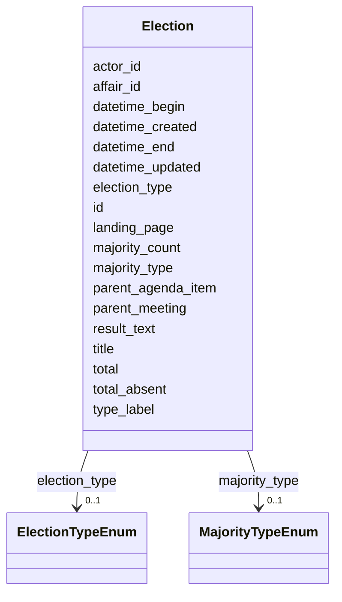

# Class: Election 


_[en] An election procedure for selecting persons to positions._

_[de] Ein Wahlverfahren zur Wahl von Personen in Positionen._

__


URI: [ops:Election](https://ch.paf.link/schema/operations/Election)





<!-- no inheritance hierarchy -->


## Slots

| Name | Cardinality and Range | Description | Inheritance |
| ---  | --- | --- | --- |
| [id](id.md) | 1 <br/> [String](String.md) |  | direct |
| [datetime_begin](datetime_begin.md) | 0..1 <br/> [Datetime](Datetime.md) | [en] The date and time when the meeting or voting begins | direct |
| [datetime_end](datetime_end.md) | 0..1 <br/> [Datetime](Datetime.md) | [en] The date and time when the meeting or voting ends | direct |
| [election_type](election_type.md) | 0..1 <br/> [ElectionTypeEnum](ElectionTypeEnum.md) | Type of election procedure | direct |
| [type_label](type_label.md) | 0..1 <br/> [String](String.md) | [en] Custom type label when standard type values don't apply | direct |
| [title](title.md) | 0..1 <br/> [String](String.md) |  | direct |
| [landing_page](landing_page.md) | 0..1 <br/> [String](String.md) | [en] URL providing further information | direct |
| [total_absent](total_absent.md) | 0..1 <br/> [Integer](Integer.md) | [en] Total number of absent members | direct |
| [total](total.md) | 0..1 <br/> [Integer](Integer.md) | [en] Total number of votes, excluding absent and president's vote | direct |
| [majority_type](majority_type.md) | 0..1 <br/> [MajorityTypeEnum](MajorityTypeEnum.md) | [en] Type of majority required for the vote (absolute, two-thirds, etc | direct |
| [majority_count](majority_count.md) | 0..1 <br/> [Integer](Integer.md) | [en] Number of votes required for the relevant majority threshold | direct |
| [result_text](result_text.md) | 0..1 <br/> [String](String.md) | [en] Free text describing the outcome of the vote, e | direct |
| [parent_meeting](parent_meeting.md) | 0..1 <br/> [String](String.md) | [en] The linked meeting ID that groups the current meeting | direct |
| [parent_agenda_item](parent_agenda_item.md) | 0..1 <br/> [String](String.md) | [en] If needed, this slot builds a hierarchy of agenda items | direct |
| [affair_id](affair_id.md) | 0..1 <br/> [String](String.md) | [en] The connection to the affairs (business items) of the agenda item | direct |
| [actor_id](actor_id.md) | 0..1 <br/> [String](String.md) | [en] The political body organized by the term of office (e | direct |
| [datetime_updated](datetime_updated.md) | 0..1 <br/> [Datetime](Datetime.md) | The last time this record was updated | direct |
| [datetime_created](datetime_created.md) | 0..1 <br/> [Datetime](Datetime.md) | The time this record was created | direct |


## Usages

| used by | used in | type | used |
| ---  | --- | --- | --- |
| [Container](Container.md) | [elections](elections.md) | range | [Election](Election.md) |


## Identifier and Mapping Information


### Schema Source


* from schema: https://ch.paf.link/schema/operations


## Mappings

| Mapping Type | Mapped Value |
| ---  | ---  |
| self | ops:Election |
| native | ops:Election |


## LinkML Source

<!-- TODO: investigate https://stackoverflow.com/questions/37606292/how-to-create-tabbed-code-blocks-in-mkdocs-or-sphinx -->

### Direct

<details>
```yaml
name: Election
description: '[en] An election procedure for selecting persons to positions.

  [de] Ein Wahlverfahren zur Wahl von Personen in Positionen.

  '
from_schema: https://ch.paf.link/schema/operations
slots:
- id
- datetime_begin
- datetime_end
- election_type
- type_label
- title
- landing_page
- total_absent
- total
- majority_type
- majority_count
- result_text
- parent_meeting
- parent_agenda_item
- affair_id
- actor_id
- datetime_updated
- datetime_created

```
</details>

### Induced

<details>
```yaml
name: Election
description: '[en] An election procedure for selecting persons to positions.

  [de] Ein Wahlverfahren zur Wahl von Personen in Positionen.

  '
from_schema: https://ch.paf.link/schema/operations
attributes:
  id:
    name: id
    from_schema: https://ch.paf.link/schema/operations
    rank: 1000
    slot_uri: dcterm:identifier
    identifier: true
    alias: id
    owner: Election
    domain_of:
    - Container
    - Legislature
    - Session
    - Meeting
    - AgendaItem
    - Voting
    - IndividualVote
    - Election
    - Attendance
    - IndividualAttendance
    - Speech
    - TextSegment
    - Motion
    - Media
    range: string
    required: true
  datetime_begin:
    name: datetime_begin
    description: '[en] The date and time when the meeting or voting begins.

      [de] Das Datum und die Uhrzeit, zu der die Sitzung oder Abstimmung beginnt.

      '
    from_schema: https://ch.paf.link/schema/operations
    rank: 1000
    alias: datetime_begin
    owner: Election
    domain_of:
    - Voting
    - Election
    - Attendance
    - Speech
    range: datetime
  datetime_end:
    name: datetime_end
    description: '[en] The date and time when the meeting or voting ends.

      [de] Das Datum und die Uhrzeit, zu der die Sitzung oder Abstimmung endet.

      '
    from_schema: https://ch.paf.link/schema/operations
    rank: 1000
    alias: datetime_end
    owner: Election
    domain_of:
    - Voting
    - Election
    - Speech
    range: datetime
  election_type:
    name: election_type
    description: Type of election procedure
    from_schema: https://ch.paf.link/schema/operations
    rank: 1000
    alias: election_type
    owner: Election
    domain_of:
    - Election
    range: election_type_enum
  type_label:
    name: type_label
    description: '[en] Custom type label when standard type values don''t apply.

      [de] Benutzerdefinierte Typbezeichnung, wenn Standardtypwerte nicht zutreffen.

      '
    from_schema: https://ch.paf.link/schema/operations
    rank: 1000
    alias: type_label
    owner: Election
    domain_of:
    - Resolution
    - Voting
    - IndividualVote
    - Election
    range: string
  title:
    name: title
    from_schema: https://ch.paf.link/schema/operations
    rank: 1000
    alias: title
    owner: Election
    domain_of:
    - Election
    - Motion
    - Media
    range: string
  landing_page:
    name: landing_page
    description: '[en] URL providing further information.

      [de] URL mit weiteren Informationen.

      '
    from_schema: https://ch.paf.link/schema/operations
    rank: 1000
    slot_uri: ops:landingPage
    alias: landing_page
    owner: Election
    domain_of:
    - Legislature
    - Meeting
    - AgendaItem
    - Voting
    - Election
    - Speech
    range: string
  total_absent:
    name: total_absent
    description: '[en] Total number of absent members. Distinction between absent/excused
      absent - presence is tracked on attendance list.

      [de] Gesamtzahl abwesender Mitglieder. Unterscheidung zwischen abwesend/entschuldigt
      abwesend - Anwesenheit wird auf Anwesenheitsliste verfolgt.

      '
    from_schema: https://ch.paf.link/schema/operations
    rank: 1000
    alias: total_absent
    owner: Election
    domain_of:
    - Voting
    - Election
    - Attendance
    range: integer
  total:
    name: total
    description: '[en] Total number of votes, excluding absent and president''s vote.

      [de] Gesamtzahl der Stimmen, ohne abwesende und Präsidentenstimmen.

      '
    from_schema: https://ch.paf.link/schema/operations
    rank: 1000
    alias: total
    owner: Election
    domain_of:
    - Voting
    - Election
    range: integer
  majority_type:
    name: majority_type
    description: '[en] Type of majority required for the vote (absolute, two-thirds,
      etc.).

      [de] Art der für die Abstimmung erforderlichen Mehrheit (absolut, Zweidrittel
      usw.).

      '
    from_schema: https://ch.paf.link/schema/operations
    rank: 1000
    alias: majority_type
    owner: Election
    domain_of:
    - Voting
    - Election
    range: majority_type_enum
  majority_count:
    name: majority_count
    description: '[en] Number of votes required for the relevant majority threshold.

      [de] Anzahl der Stimmen, die für die relevante Mehrheitsschwelle erforderlich
      sind.

      '
    from_schema: https://ch.paf.link/schema/operations
    rank: 1000
    alias: majority_count
    owner: Election
    domain_of:
    - Voting
    - Election
    range: integer
  result_text:
    name: result_text
    description: '[en] Free text describing the outcome of the vote, e.g., "Accepted
      with 78 votes".

      [de] Freitext zur Beschreibung des Ergebnisses der Abstimmung, z.B. "Mit 78
      Stimmen angenommen".

      '
    from_schema: https://ch.paf.link/schema/operations
    rank: 1000
    alias: result_text
    owner: Election
    domain_of:
    - Voting
    - Election
    range: string
  parent_meeting:
    name: parent_meeting
    description: '[en] The linked meeting ID that groups the current meeting.

      [de] Die verknüpfte Sitzungs-ID, die die aktuelle Sitzung gruppiert.

      '
    from_schema: https://ch.paf.link/schema/operations
    rank: 1000
    alias: parent_meeting
    owner: Election
    domain_of:
    - Meeting
    - AgendaItem
    - Voting
    - Election
    range: string
  parent_agenda_item:
    name: parent_agenda_item
    description: '[en] If needed, this slot builds a hierarchy of agenda items.

      [de] Wenn erforderlich, baut dieser Slot eine Hierarchie von Tagesordnungspunkten
      auf.

      '
    from_schema: https://ch.paf.link/schema/operations
    rank: 1000
    alias: parent_agenda_item
    owner: Election
    domain_of:
    - AgendaItem
    - Voting
    - Election
    range: string
  affair_id:
    name: affair_id
    description: '[en] The connection to the affairs (business items) of the agenda
      item.

      [de] Die Verbindung zu den Geschäften (Geschäftsgegenständen) des Tagesordnungspunkts.

      '
    from_schema: https://ch.paf.link/schema/operations
    rank: 1000
    alias: affair_id
    owner: Election
    domain_of:
    - AgendaItem
    - Voting
    - Election
    range: string
  actor_id:
    name: actor_id
    description: '[en] The political body organized by the term of office (e.g., Regierungsrat,
      Nationalrat, Ständerat).

      [de] Das politische Organ, das durch die Amtsdauer organisiert wird (z.B. Regierungsrat,
      Nationalrat, Ständerat).

      '
    from_schema: https://ch.paf.link/schema/operations
    rank: 1000
    alias: actor_id
    owner: Election
    domain_of:
    - Legislature
    - Meeting
    - Voting
    - IndividualVote
    - Election
    - Attendance
    - IndividualAttendance
    - Speech
    range: string
  datetime_updated:
    name: datetime_updated
    description: The last time this record was updated
    from_schema: https://ch.paf.link/schema/operations
    rank: 1000
    alias: datetime_updated
    owner: Election
    domain_of:
    - Legislature
    - Session
    - Meeting
    - AgendaItem
    - Voting
    - IndividualVote
    - Election
    - Attendance
    - IndividualAttendance
    - Speech
    range: datetime
  datetime_created:
    name: datetime_created
    description: The time this record was created
    from_schema: https://ch.paf.link/schema/operations
    rank: 1000
    alias: datetime_created
    owner: Election
    domain_of:
    - Legislature
    - Session
    - Meeting
    - AgendaItem
    - Voting
    - IndividualVote
    - Election
    - Attendance
    - IndividualAttendance
    - Speech
    range: datetime

```
</details>