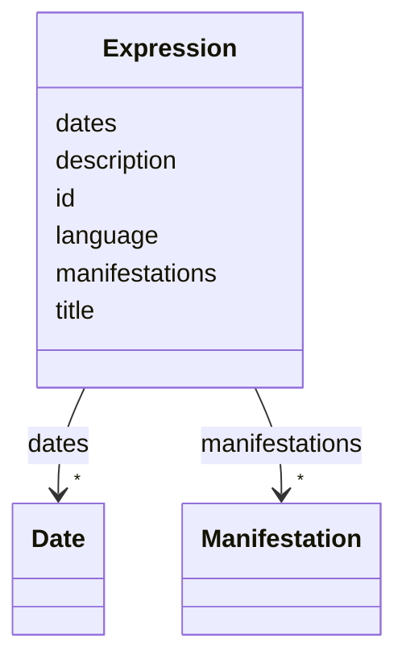

---
search:
  boost: 10.0
---

# Class: Expression 

<div data-search-exclude markdown="1">


URI: [ops:Expression](https://ch.paf.link/schema/operations/Expression)





<!-- no inheritance hierarchy -->

## Slots

| Name | Cardinality and Range | Description | Inheritance |
| ---  | --- | --- | --- |
| [id](id.md) | 1 <br/> [String](String.md) |  | direct |
| [dates](dates.md) | * <br/> [Date](Date.md) |  | direct |
| [language](language.md) | 0..1 <br/> [String](String.md) | [de] Sprachcode im ISO 639-1 Format | direct |
| [title](title.md) | 0..1 <br/> [String](String.md) |  | direct |
| [description](description.md) | 0..1 <br/> [String](String.md) |  | direct |
| [manifestations](manifestations.md) | * <br/> [Manifestation](Manifestation.md) |  | direct |


## Usages

| used by | used in | type | used |
| ---  | --- | --- | --- |
| [Work](Work.md) | [expressions](expressions.md) | range | [Expression](Expression.md) |


## Identifier and Mapping Information


### Schema Source


* from schema: https://ch.paf.link/schema/operations


## Mappings

| Mapping Type | Mapped Value |
| ---  | ---  |
| self | ops:Expression |
| native | ops:Expression |


## LinkML Source

<!-- TODO: investigate https://stackoverflow.com/questions/37606292/how-to-create-tabbed-code-blocks-in-mkdocs-or-sphinx -->

### Direct

<details>
```yaml
name: Expression
from_schema: https://ch.paf.link/schema/operations
slots:
- id
- dates
- language
- title
- description
- manifestations

```
</details>

### Induced

<details>
```yaml
name: Expression
from_schema: https://ch.paf.link/schema/operations
attributes:
  id:
    name: id
    from_schema: https://ch.paf.link/schema/operations
    rank: 1000
    identifier: true
    owner: Expression
    domain_of:
    - Work
    - Expression
    - Manifestation
    range: string
    required: true
  dates:
    name: dates
    from_schema: https://ch.paf.link/schema/operations
    rank: 1000
    slot_uri: meta:dates
    owner: Expression
    domain_of:
    - Expression
    - Manifestation
    range: Date
    multivalued: true
    inlined: true
    inlined_as_list: true
  language:
    name: language
    description: '[de] Sprachcode im ISO 639-1 Format.

      [en] Language code in ISO 639-1 format.

      '
    from_schema: https://ch.paf.link/schema/operations
    rank: 1000
    slot_uri: mcm:language
    owner: Expression
    domain_of:
    - Speech
    - MultilingualString
    - MultilingualValue
    - Expression
    range: string
    pattern: ^[a-z]{2}$
  title:
    name: title
    from_schema: https://ch.paf.link/schema/operations
    rank: 1000
    owner: Expression
    domain_of:
    - Election
    - Motion
    - Media
    - Expression
    range: string
  description:
    name: description
    from_schema: https://ch.paf.link/schema/operations
    rank: 1000
    owner: Expression
    domain_of:
    - Legislature
    - Meeting
    - Motion
    - Expression
    range: string
  manifestations:
    name: manifestations
    from_schema: https://ch.paf.link/schema/operations
    rank: 1000
    slot_uri: meta:manifestations
    owner: Expression
    domain_of:
    - Expression
    range: Manifestation
    multivalued: true
    inlined: true
    inlined_as_list: true

```
</details></div>