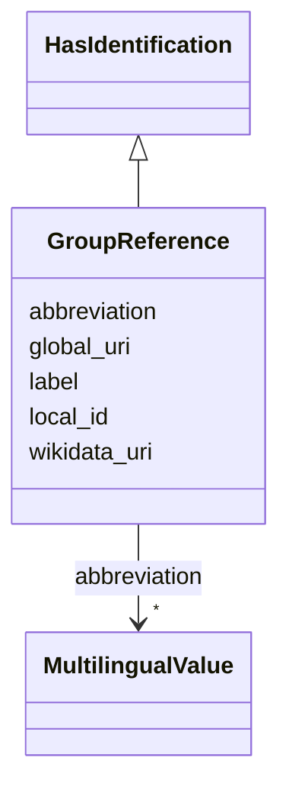

---
search:
  boost: 10.0
---

# Class: GroupReference 


_Lightweight reference to a group with key identification data at time of linking._

__


<div data-search-exclude markdown="1">


URI: [ops:GroupReference](https://ch.paf.link/schema/operations/GroupReference)





## Inheritance
* **GroupReference** [ [HasIdentification](HasIdentification.md)]


## Slots

| Name | Cardinality and Range | Description | Inheritance |
| ---  | --- | --- | --- |
| [label](label.md) | 0..1 <br/> [String](String.md) | Assign a label to a structured piece of information (e | direct |
| [abbreviation](abbreviation.md) | * <br/> [MultilingualValue](MultilingualValue.md) | Abbreviation (can be multilingual) | direct |
| [local_id](local_id.md) | 0..1 <br/> [String](String.md) | Local identifier | [HasIdentification](HasIdentification.md) |
| [global_uri](global_uri.md) | 1 <br/> [Uriorcurie](Uriorcurie.md) | A unique, globally valid URI for the entity | [HasIdentification](HasIdentification.md) |
| [wikidata_uri](wikidata_uri.md) | 0..1 <br/> [Uriorcurie](Uriorcurie.md) | A URI that refers to a Wikidata entity, e | [HasIdentification](HasIdentification.md) |


## Usages

| used by | used in | type | used |
| ---  | --- | --- | --- |
| [Legislature](Legislature.md) | [actor_id](actor_id.md) | range | [GroupReference](GroupReference.md) |
| [Meeting](Meeting.md) | [group_id](group_id.md) | range | [GroupReference](GroupReference.md) |
| [Meeting](Meeting.md) | [actor_id](actor_id.md) | range | [GroupReference](GroupReference.md) |
| [Voting](Voting.md) | [actor_id](actor_id.md) | range | [GroupReference](GroupReference.md) |
| [Election](Election.md) | [actor_id](actor_id.md) | range | [GroupReference](GroupReference.md) |
| [Attendance](Attendance.md) | [actor_id](actor_id.md) | range | [GroupReference](GroupReference.md) |


## Identifier and Mapping Information


### Annotations

| property | value |
| --- | --- |
| description_de | Leichtgewichtige Referenz auf eine Gruppe mit den wichtigsten Identifikationsmerkmalen zum Zeitpunkt der Verknüpfung.
 |


### Schema Source


* from schema: https://ch.paf.link/schema/operations


## Mappings

| Mapping Type | Mapped Value |
| ---  | ---  |
| self | ops:GroupReference |
| native | ops:GroupReference |


## LinkML Source

<!-- TODO: investigate https://stackoverflow.com/questions/37606292/how-to-create-tabbed-code-blocks-in-mkdocs-or-sphinx -->

### Direct

<details>
```yaml
name: GroupReference
annotations:
  description_de:
    tag: description_de
    value: 'Leichtgewichtige Referenz auf eine Gruppe mit den wichtigsten Identifikationsmerkmalen
      zum Zeitpunkt der Verknüpfung.

      '
description: 'Lightweight reference to a group with key identification data at time
  of linking.

  '
from_schema: https://ch.paf.link/schema/operations
mixins:
- HasIdentification
slots:
- label
- abbreviation

```
</details>

### Induced

<details>
```yaml
name: GroupReference
annotations:
  description_de:
    tag: description_de
    value: 'Leichtgewichtige Referenz auf eine Gruppe mit den wichtigsten Identifikationsmerkmalen
      zum Zeitpunkt der Verknüpfung.

      '
description: 'Lightweight reference to a group with key identification data at time
  of linking.

  '
from_schema: https://ch.paf.link/schema/operations
mixins:
- HasIdentification
attributes:
  label:
    name: label
    annotations:
      description_de:
        tag: description_de
        value: 'Möglichkeit bei einer strukturierten Information, ein Label zu vergeben
          (bspw. Anzeigename, Anstellung, etc.).

          '
    description: 'Assign a label to a structured piece of information (e.g., display
      name, position, etc.).

      '
    from_schema: https://ch.paf.link/schema/operations
    rank: 1000
    slot_uri: mcm:label
    owner: GroupReference
    domain_of:
    - TotalOther
    - PersonReference
    - GroupReference
    range: string
  abbreviation:
    name: abbreviation
    annotations:
      description_de:
        tag: description_de
        value: 'Abkürzung (kann mehrsprachig sein).

          '
    description: 'Abbreviation (can be multilingual).

      '
    from_schema: https://ch.paf.link/schema/operations
    rank: 1000
    slot_uri: mcm:abbreviation
    owner: GroupReference
    domain_of:
    - GroupReference
    range: MultilingualValue
    multivalued: true
    inlined: true
    inlined_as_list: true
  local_id:
    name: local_id
    annotations:
      description_de:
        tag: description_de
        value: 'Lokaler Identifikator. Bspw. eine UUID aus dem Ratsinformationssystem.

          '
    description: 'Local identifier. For example, a UUID from the council information
      system.

      '
    from_schema: https://ch.paf.link/schema/operations
    rank: 1000
    slot_uri: mcm:localId
    owner: GroupReference
    domain_of:
    - HasIdentification
    range: string
  global_uri:
    name: global_uri
    annotations:
      description_de:
        tag: description_de
        value: 'Eine eindeutige, global gültige URI für die Entität.

          '
    description: 'A unique, globally valid URI for the entity.

      '
    from_schema: https://ch.paf.link/schema/operations
    rank: 1000
    slot_uri: mcm:globalURI
    identifier: true
    owner: GroupReference
    domain_of:
    - HasIdentification
    range: uriorcurie
    required: true
  wikidata_uri:
    name: wikidata_uri
    annotations:
      description_de:
        tag: description_de
        value: 'Eine URI, die auf eine Wikidata-Entität verweist, z.B. https://www.wikidata.org/wiki/Q39
          für die Schweiz.

          '
    description: 'A URI that refers to a Wikidata entity, e.g. https://www.wikidata.org/wiki/Q39
      for Switzerland.

      '
    from_schema: https://ch.paf.link/schema/operations
    rank: 1000
    slot_uri: mcm:wikidataUri
    owner: GroupReference
    domain_of:
    - HasIdentification
    range: uriorcurie

```
</details></div>