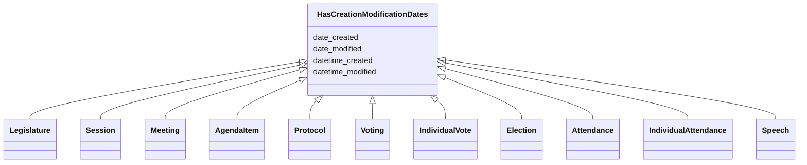

---
search:
  boost: 10.0
---

# Class: HasCreationModificationDates 


_A mixin class that provides slots for modeling creation and modification dates of an entity._

__


<div data-search-exclude markdown="1">


URI: [ops:HasCreationModificationDates](https://ch.paf.link/schema/operations/HasCreationModificationDates)





<!-- no inheritance hierarchy -->

## Class Properties

| Property | Value |
| --- | --- |
| Mixin | Yes |


## Slots

| Name | Cardinality and Range | Description | Inheritance |
| ---  | --- | --- | --- |
| [date_created](date_created.md) | 0..1 <br/> [Date](Date.md) | The date when an entity was created | direct |
| [datetime_created](datetime_created.md) | 0..1 <br/> [Datetime](Datetime.md) | The date and time when an entity was created | direct |
| [date_modified](date_modified.md) | 0..1 <br/> [Date](Date.md) | The date when an entity was last modified | direct |
| [datetime_modified](datetime_modified.md) | 0..1 <br/> [Datetime](Datetime.md) | The date and time when an entity was last modified | direct |


## Mixin Usage

| mixed into | description |
| --- | --- |
| [Legislature](Legislature.md) | [en] Term of office of a parliament as a legislative assembly |
| [Session](Session.md) | [en] A parliamentary session that groups multiple meetings and spans a specif... |
| [Meeting](Meeting.md) | [en] A general meeting class used for Sessions, Comittee Meetings, individual... |
| [AgendaItem](AgendaItem.md) | [en] An agenda item of a meeting |
| [Protocol](Protocol.md) | [en] The minutes of a meeting, recorded after the meeting |
| [Voting](Voting.md) | [en] A voting procedure with individual votes and results |
| [IndividualVote](IndividualVote.md) | [en] An individual vote cast by a member during a voting procedure |
| [Election](Election.md) | [en] An election procedure for selecting persons to positions |
| [Attendance](Attendance.md) | [en] Aggregated attendance record for a meeting (number of members present, a... |
| [IndividualAttendance](IndividualAttendance.md) | [en] Individual attendance record for a specific person at a meeting (linked ... |
| [Speech](Speech.md) | [en] A speech or statement made during a meeting (also called Votum or speake... |


## Identifier and Mapping Information


### Annotations

| property | value |
| --- | --- |
| description_de | Eine Mixin-Klasse, die Slots für die Modellierung von Erstellungs- und Änderungsdaten einer Entität zur Verfügung stellt.
 |


### Schema Source


* from schema: https://ch.paf.link/schema/operations


## Mappings

| Mapping Type | Mapped Value |
| ---  | ---  |
| self | ops:HasCreationModificationDates |
| native | ops:HasCreationModificationDates |


## LinkML Source

<!-- TODO: investigate https://stackoverflow.com/questions/37606292/how-to-create-tabbed-code-blocks-in-mkdocs-or-sphinx -->

### Direct

<details>
```yaml
name: HasCreationModificationDates
annotations:
  description_de:
    tag: description_de
    value: 'Eine Mixin-Klasse, die Slots für die Modellierung von Erstellungs- und
      Änderungsdaten einer Entität zur Verfügung stellt.

      '
description: 'A mixin class that provides slots for modeling creation and modification
  dates of an entity.

  '
from_schema: https://ch.paf.link/schema/operations
mixin: true
slots:
- date_created
- datetime_created
- date_modified
- datetime_modified

```
</details>

### Induced

<details>
```yaml
name: HasCreationModificationDates
annotations:
  description_de:
    tag: description_de
    value: 'Eine Mixin-Klasse, die Slots für die Modellierung von Erstellungs- und
      Änderungsdaten einer Entität zur Verfügung stellt.

      '
description: 'A mixin class that provides slots for modeling creation and modification
  dates of an entity.

  '
from_schema: https://ch.paf.link/schema/operations
mixin: true
attributes:
  date_created:
    name: date_created
    annotations:
      description_de:
        tag: description_de
        value: 'Das Datum, an dem eine Entität erstellt wurde.

          '
    description: 'The date when an entity was created.

      '
    from_schema: https://ch.paf.link/schema/operations
    rank: 1000
    slot_uri: mcm:dateCreated
    owner: HasCreationModificationDates
    domain_of:
    - HasCreationModificationDates
    range: date
  datetime_created:
    name: datetime_created
    annotations:
      description_de:
        tag: description_de
        value: 'Das Datum und die Uhrzeit, an dem eine Entität erstellt wurde.

          '
    description: 'The date and time when an entity was created.

      '
    from_schema: https://ch.paf.link/schema/operations
    rank: 1000
    slot_uri: mcm:datetimeCreated
    owner: HasCreationModificationDates
    domain_of:
    - HasCreationModificationDates
    range: datetime
  date_modified:
    name: date_modified
    annotations:
      description_de:
        tag: description_de
        value: 'Das Datum, an dem eine Entität zuletzt geändert wurde.

          '
    description: 'The date when an entity was last modified.

      '
    from_schema: https://ch.paf.link/schema/operations
    rank: 1000
    slot_uri: mcm:dateModified
    owner: HasCreationModificationDates
    domain_of:
    - HasCreationModificationDates
    range: date
  datetime_modified:
    name: datetime_modified
    annotations:
      description_de:
        tag: description_de
        value: 'Das Datum und die Uhrzeit, an dem eine Entität zuletzt geändert wurde.

          '
    description: 'The date and time when an entity was last modified.

      '
    from_schema: https://ch.paf.link/schema/operations
    rank: 1000
    slot_uri: mcm:datetimeModified
    owner: HasCreationModificationDates
    domain_of:
    - HasCreationModificationDates
    range: datetime

```
</details></div>