---
search:
  boost: 10.0
---

# Class: HasIdentification 


_A mixin class that provides slots for the identification of an entity._

__


<div data-search-exclude markdown="1">


URI: [ops:HasIdentification](https://ch.paf.link/schema/operations/HasIdentification)

```mermaid
 classDiagram
    class HasIdentification
    click HasIdentification href "../HasIdentification/"
      HasIdentification <|-- Container
        click Container href "../Container/"
      HasIdentification <|-- Legislature
        click Legislature href "../Legislature/"
      HasIdentification <|-- Session
        click Session href "../Session/"
      HasIdentification <|-- Meeting
        click Meeting href "../Meeting/"
      HasIdentification <|-- AgendaItem
        click AgendaItem href "../AgendaItem/"
      HasIdentification <|-- Protocol
        click Protocol href "../Protocol/"
      HasIdentification <|-- Voting
        click Voting href "../Voting/"
      HasIdentification <|-- IndividualVote
        click IndividualVote href "../IndividualVote/"
      HasIdentification <|-- Election
        click Election href "../Election/"
      HasIdentification <|-- Attendance
        click Attendance href "../Attendance/"
      HasIdentification <|-- IndividualAttendance
        click IndividualAttendance href "../IndividualAttendance/"
      HasIdentification <|-- Speech
        click Speech href "../Speech/"
      HasIdentification <|-- TextSegment
        click TextSegment href "../TextSegment/"
      HasIdentification <|-- Motion
        click Motion href "../Motion/"
      HasIdentification <|-- Media
        click Media href "../Media/"
      HasIdentification <|-- IsProcessStep
        click IsProcessStep href "../IsProcessStep/"
      
      HasIdentification : global_uri
        
      HasIdentification : local_id
        
      HasIdentification : wikidata_uri
        
      
```





<!-- no inheritance hierarchy -->

## Class Properties

| Property | Value |
| --- | --- |
| Mixin | Yes |


## Slots

| Name | Cardinality and Range | Description | Inheritance |
| ---  | --- | --- | --- |
| [local_id](local_id.md) | 0..1 <br/> [String](String.md) | Local identifier | direct |
| [global_uri](global_uri.md) | 1 <br/> [Uriorcurie](Uriorcurie.md) | A unique, globally valid URI for the entity | direct |
| [wikidata_uri](wikidata_uri.md) | 0..1 <br/> [Uriorcurie](Uriorcurie.md) | A URI that refers to a Wikidata entity, e | direct |


## Mixin Usage

| mixed into | description |
| --- | --- |
| [Container](Container.md) |  |
| [Legislature](Legislature.md) | [en] Term of office of a parliament as a legislative assembly |
| [Session](Session.md) | [en] A parliamentary session that groups multiple meetings and spans a specif... |
| [Meeting](Meeting.md) | [en] A general meeting class used for Sessions, Comittee Meetings, individual... |
| [AgendaItem](AgendaItem.md) | [en] An agenda item of a meeting |
| [Protocol](Protocol.md) | [en] The minutes of a meeting, recorded after the meeting |
| [Voting](Voting.md) | [en] A voting procedure with individual votes and results |
| [IndividualVote](IndividualVote.md) | [en] An individual vote cast by a member during a voting procedure |
| [Election](Election.md) | [en] An election procedure for selecting persons to positions |
| [Attendance](Attendance.md) | [en] Aggregated attendance record for a meeting (number of members present, a... |
| [IndividualAttendance](IndividualAttendance.md) | [en] Individual attendance record for a specific person at a meeting (linked ... |
| [Speech](Speech.md) | [en] A speech or statement made during a meeting (also called Votum or speake... |
| [TextSegment](TextSegment.md) | [en] A text segment such as cross-references or subtitles in meeting protocol... |
| [Motion](Motion.md) | [en] A formal proposal or motion submitted during proceedings |
| [Media](Media.md) | [en] Media files or documents (including protocols in PDF/HTML/WORD or links ... |
| [IsProcessStep](IsProcessStep.md) | A mixin class for a single step in a multi-stage process (e |


## Identifier and Mapping Information


### Annotations

| property | value |
| --- | --- |
| description_de | Eine Mixin-Klasse, die Slots für die Identifikation einer Entität zur Verfügung stellt.
 |


### Schema Source


* from schema: https://ch.paf.link/schema/operations


## Mappings

| Mapping Type | Mapped Value |
| ---  | ---  |
| self | ops:HasIdentification |
| native | ops:HasIdentification |


## LinkML Source

<!-- TODO: investigate https://stackoverflow.com/questions/37606292/how-to-create-tabbed-code-blocks-in-mkdocs-or-sphinx -->

### Direct

<details>
```yaml
name: HasIdentification
annotations:
  description_de:
    tag: description_de
    value: 'Eine Mixin-Klasse, die Slots für die Identifikation einer Entität zur
      Verfügung stellt.

      '
description: 'A mixin class that provides slots for the identification of an entity.

  '
from_schema: https://ch.paf.link/schema/operations
mixin: true
slots:
- local_id
- global_uri
- wikidata_uri

```
</details>

### Induced

<details>
```yaml
name: HasIdentification
annotations:
  description_de:
    tag: description_de
    value: 'Eine Mixin-Klasse, die Slots für die Identifikation einer Entität zur
      Verfügung stellt.

      '
description: 'A mixin class that provides slots for the identification of an entity.

  '
from_schema: https://ch.paf.link/schema/operations
mixin: true
attributes:
  local_id:
    name: local_id
    annotations:
      description_de:
        tag: description_de
        value: 'Lokaler Identifikator. Bspw. eine UUID aus dem Ratsinformationssystem.

          '
    description: 'Local identifier. For example, a UUID from the council information
      system.

      '
    from_schema: https://ch.paf.link/schema/operations
    rank: 1000
    slot_uri: mcm:localId
    owner: HasIdentification
    domain_of:
    - HasIdentification
    range: string
  global_uri:
    name: global_uri
    annotations:
      description_de:
        tag: description_de
        value: 'Eine eindeutige, global gültige URI für die Entität.

          '
    description: 'A unique, globally valid URI for the entity.

      '
    from_schema: https://ch.paf.link/schema/operations
    rank: 1000
    slot_uri: mcm:globalURI
    identifier: true
    owner: HasIdentification
    domain_of:
    - HasIdentification
    range: uriorcurie
    required: true
  wikidata_uri:
    name: wikidata_uri
    annotations:
      description_de:
        tag: description_de
        value: 'Eine URI, die auf eine Wikidata-Entität verweist, z.B. https://www.wikidata.org/wiki/Q39
          für die Schweiz.

          '
    description: 'A URI that refers to a Wikidata entity, e.g. https://www.wikidata.org/wiki/Q39
      for Switzerland.

      '
    from_schema: https://ch.paf.link/schema/operations
    rank: 1000
    slot_uri: mcm:wikidataUri
    owner: HasIdentification
    domain_of:
    - HasIdentification
    range: uriorcurie

```
</details></div>