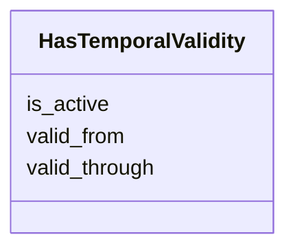

---
search:
  boost: 10.0
---

# Class: HasTemporalValidity 


_A mixin class that provides slots for modeling a temporal validity of information (not of an event)._

__


<div data-search-exclude markdown="1">


URI: [ops:HasTemporalValidity](https://ch.paf.link/schema/operations/HasTemporalValidity)





<!-- no inheritance hierarchy -->

## Class Properties

| Property | Value |
| --- | --- |
| Mixin | Yes |


## Slots

| Name | Cardinality and Range | Description | Inheritance |
| ---  | --- | --- | --- |
| [valid_from](valid_from.md) | 0..1 <br/> [Date](Date.md) | The date from which the information is valid | direct |
| [valid_through](valid_through.md) | 0..1 <br/> [Date](Date.md) | The date until which the information is valid, inclusive | direct |
| [is_active](is_active.md) | 0..1 <br/> [Boolean](Boolean.md) | Indicates whether the information is currently valid | direct |


## Mixin Usage

| mixed into | description |
| --- | --- |


## Identifier and Mapping Information


### Annotations

| property | value |
| --- | --- |
| description_de | Eine Mixin-Klasse, die Slots für die Modellierung einer zeitlichen Gültigkeit einer Information (nicht eines Events) zur Verfügung stellt.
 |


### Schema Source


* from schema: https://ch.paf.link/schema/operations


## Mappings

| Mapping Type | Mapped Value |
| ---  | ---  |
| self | ops:HasTemporalValidity |
| native | ops:HasTemporalValidity |


## LinkML Source

<!-- TODO: investigate https://stackoverflow.com/questions/37606292/how-to-create-tabbed-code-blocks-in-mkdocs-or-sphinx -->

### Direct

<details>
```yaml
name: HasTemporalValidity
annotations:
  description_de:
    tag: description_de
    value: 'Eine Mixin-Klasse, die Slots für die Modellierung einer zeitlichen Gültigkeit
      einer Information (nicht eines Events) zur Verfügung stellt.

      '
description: 'A mixin class that provides slots for modeling a temporal validity of
  information (not of an event).

  '
from_schema: https://ch.paf.link/schema/operations
mixin: true
slots:
- valid_from
- valid_through
- is_active

```
</details>

### Induced

<details>
```yaml
name: HasTemporalValidity
annotations:
  description_de:
    tag: description_de
    value: 'Eine Mixin-Klasse, die Slots für die Modellierung einer zeitlichen Gültigkeit
      einer Information (nicht eines Events) zur Verfügung stellt.

      '
description: 'A mixin class that provides slots for modeling a temporal validity of
  information (not of an event).

  '
from_schema: https://ch.paf.link/schema/operations
mixin: true
attributes:
  valid_from:
    name: valid_from
    annotations:
      description_de:
        tag: description_de
        value: 'Das Datum, ab dem die Information gültig ist.

          '
    description: 'The date from which the information is valid.

      '
    from_schema: https://ch.paf.link/schema/operations
    rank: 1000
    slot_uri: schema:validFrom
    owner: HasTemporalValidity
    domain_of:
    - HasTemporalValidity
    range: date
  valid_through:
    name: valid_through
    annotations:
      description_de:
        tag: description_de
        value: 'Das Datum, bis und mit dem die Information gültig ist.

          '
    description: 'The date until which the information is valid, inclusive.

      '
    from_schema: https://ch.paf.link/schema/operations
    rank: 1000
    slot_uri: schema:validThrough
    owner: HasTemporalValidity
    domain_of:
    - HasTemporalValidity
    range: date
  is_active:
    name: is_active
    annotations:
      description_de:
        tag: description_de
        value: 'Gibt an, ob die Information aktuell gültig ist. Kann nützlich sein,
          wenn diese Information explizit vorhanden ist.

          '
    description: 'Indicates whether the information is currently valid. Can be useful
      when this information is explicitly available.

      '
    from_schema: https://ch.paf.link/schema/operations
    rank: 1000
    slot_uri: mcm:isCurrent
    owner: HasTemporalValidity
    domain_of:
    - HasTemporalValidity
    range: boolean

```
</details></div>