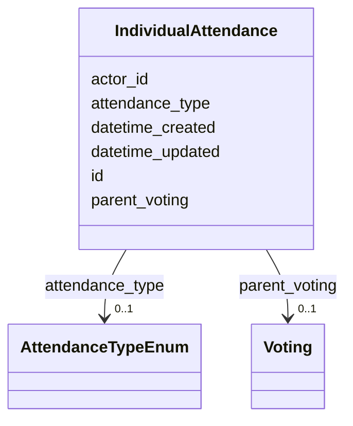

# Class: IndividualAttendance 


_[en] Individual attendance record for a specific person._

_[de] Einzelne Anwesenheitsfeststellung für eine bestimmte Person._

__


URI: [ops:IndividualAttendance](https://ch.paf.link/schema/operations/IndividualAttendance)





<!-- no inheritance hierarchy -->


## Slots

| Name | Cardinality and Range | Description | Inheritance |
| ---  | --- | --- | --- |
| [id](id.md) | 1 <br/> [String](String.md) |  | direct |
| [parent_voting](parent_voting.md) | 0..1 <br/> [Voting](Voting.md) | [en] The ID of the voting associated with the individual vote | direct |
| [actor_id](actor_id.md) | 0..1 <br/> [String](String.md) | [en] The political body organized by the term of office (e | direct |
| [attendance_type](attendance_type.md) | 0..1 <br/> [AttendanceTypeEnum](AttendanceTypeEnum.md) | Type of individual attendance | direct |
| [datetime_updated](datetime_updated.md) | 0..1 <br/> [Datetime](Datetime.md) | The last time this record was updated | direct |
| [datetime_created](datetime_created.md) | 0..1 <br/> [Datetime](Datetime.md) | The time this record was created | direct |


## Usages

| used by | used in | type | used |
| ---  | --- | --- | --- |
| [Container](Container.md) | [individual_attendances](individual_attendances.md) | range | [IndividualAttendance](IndividualAttendance.md) |


## Identifier and Mapping Information


### Schema Source


* from schema: https://ch.paf.link/schema/operations


## Mappings

| Mapping Type | Mapped Value |
| ---  | ---  |
| self | ops:IndividualAttendance |
| native | ops:IndividualAttendance |


## LinkML Source

<!-- TODO: investigate https://stackoverflow.com/questions/37606292/how-to-create-tabbed-code-blocks-in-mkdocs-or-sphinx -->

### Direct

<details>
```yaml
name: IndividualAttendance
description: '[en] Individual attendance record for a specific person.

  [de] Einzelne Anwesenheitsfeststellung für eine bestimmte Person.

  '
from_schema: https://ch.paf.link/schema/operations
slots:
- id
- parent_voting
- actor_id
- attendance_type
- datetime_updated
- datetime_created

```
</details>

### Induced

<details>
```yaml
name: IndividualAttendance
description: '[en] Individual attendance record for a specific person.

  [de] Einzelne Anwesenheitsfeststellung für eine bestimmte Person.

  '
from_schema: https://ch.paf.link/schema/operations
attributes:
  id:
    name: id
    from_schema: https://ch.paf.link/schema/operations
    rank: 1000
    slot_uri: dcterm:identifier
    identifier: true
    alias: id
    owner: IndividualAttendance
    domain_of:
    - Container
    - Legislature
    - Session
    - Meeting
    - AgendaItem
    - Voting
    - IndividualVote
    - Election
    - Attendance
    - IndividualAttendance
    - Speech
    - TextSegment
    - Motion
    - Media
    range: string
    required: true
  parent_voting:
    name: parent_voting
    description: '[en] The ID of the voting associated with the individual vote.

      [de] Die ID der Abstimmung, die mit der Einzelstimme verbunden ist.

      '
    from_schema: https://ch.paf.link/schema/operations
    rank: 1000
    slot_uri: ops:parentVoting
    alias: parent_voting
    owner: IndividualAttendance
    domain_of:
    - IndividualVote
    - IndividualAttendance
    range: Voting
  actor_id:
    name: actor_id
    description: '[en] The political body organized by the term of office (e.g., Regierungsrat,
      Nationalrat, Ständerat).

      [de] Das politische Organ, das durch die Amtsdauer organisiert wird (z.B. Regierungsrat,
      Nationalrat, Ständerat).

      '
    from_schema: https://ch.paf.link/schema/operations
    rank: 1000
    alias: actor_id
    owner: IndividualAttendance
    domain_of:
    - Legislature
    - Meeting
    - Voting
    - IndividualVote
    - Election
    - Attendance
    - IndividualAttendance
    - Speech
    range: string
  attendance_type:
    name: attendance_type
    description: Type of individual attendance
    from_schema: https://ch.paf.link/schema/operations
    rank: 1000
    alias: attendance_type
    owner: IndividualAttendance
    domain_of:
    - IndividualAttendance
    range: attendance_type_enum
  datetime_updated:
    name: datetime_updated
    description: The last time this record was updated
    from_schema: https://ch.paf.link/schema/operations
    rank: 1000
    alias: datetime_updated
    owner: IndividualAttendance
    domain_of:
    - Legislature
    - Session
    - Meeting
    - AgendaItem
    - Voting
    - IndividualVote
    - Election
    - Attendance
    - IndividualAttendance
    - Speech
    range: datetime
  datetime_created:
    name: datetime_created
    description: The time this record was created
    from_schema: https://ch.paf.link/schema/operations
    rank: 1000
    alias: datetime_created
    owner: IndividualAttendance
    domain_of:
    - Legislature
    - Session
    - Meeting
    - AgendaItem
    - Voting
    - IndividualVote
    - Election
    - Attendance
    - IndividualAttendance
    - Speech
    range: datetime

```
</details>