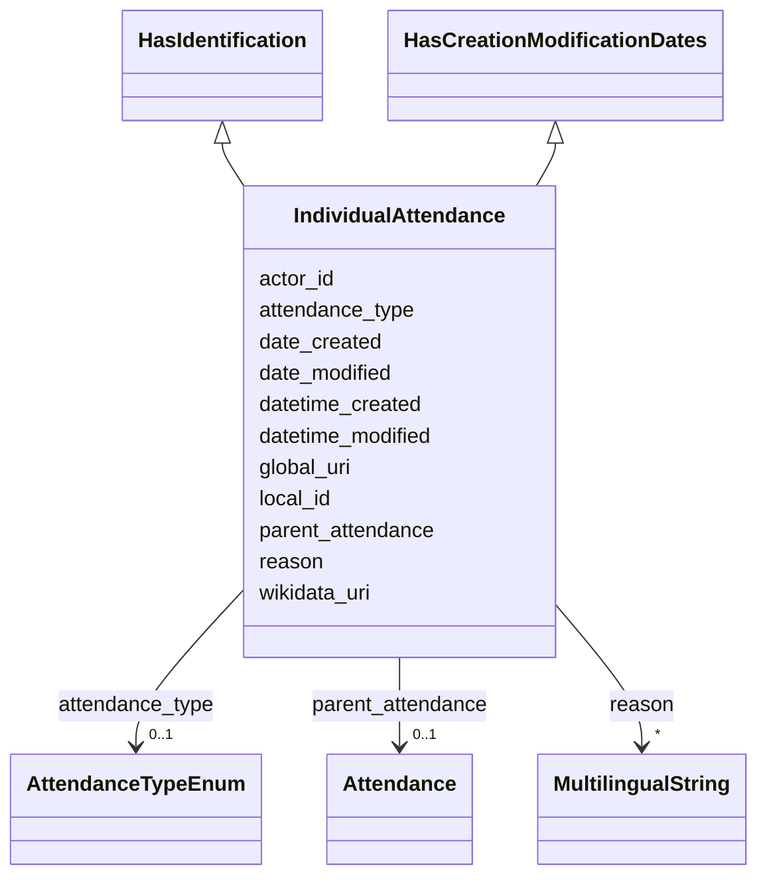

---
search:
  boost: 10.0
---

# Class: IndividualAttendance 


_[en] Individual attendance record for a specific person at a meeting (linked via the parent Attendance aggregate)._

_[de] Einzelne Anwesenheitsfeststellung einer Person an einer Sitzung (verknüpft über das übergeordnete Attendance-Aggregat)._

__


<div data-search-exclude markdown="1">


URI: [ops:IndividualAttendance](https://ch.paf.link/schema/operations/IndividualAttendance)



```mermaid
 classDiagram
    class IndividualAttendance
    click IndividualAttendance href "../IndividualAttendance/"
      HasIdentification <|-- IndividualAttendance
        click HasIdentification href "../HasIdentification/"
      HasCreationModificationDates <|-- IndividualAttendance
        click HasCreationModificationDates href "../HasCreationModificationDates/"
      
      IndividualAttendance : actor_id
        
      IndividualAttendance : attendance_type
        
          
    
        
        
        IndividualAttendance --> "0..1" AttendanceTypeEnum : attendance_type
        click AttendanceTypeEnum href "../AttendanceTypeEnum/"
    

        
      IndividualAttendance : date_created
        
      IndividualAttendance : date_modified
        
      IndividualAttendance : datetime_created
        
      IndividualAttendance : datetime_modified
        
      IndividualAttendance : global_uri
        
      IndividualAttendance : local_id
        
      IndividualAttendance : parent_attendance
        
          
    
        
        
        IndividualAttendance --> "0..1" Attendance : parent_attendance
        click Attendance href "../Attendance/"
    

        
      IndividualAttendance : reason
        
          
    
        
        
        IndividualAttendance --> "*" MultilingualString : reason
        click MultilingualString href "../MultilingualString/"
    

        
      IndividualAttendance : wikidata_uri
        
      
```


## Inheritance
* **IndividualAttendance** [ [HasIdentification](HasIdentification.md) [HasCreationModificationDates](HasCreationModificationDates.md)]


## Slots

| Name | Cardinality and Range | Description | Inheritance |
| ---  | --- | --- | --- |
| [parent_attendance](parent_attendance.md) | 0..1 <br/> [Attendance](Attendance.md) | [en] The Attendance aggregate this individual attendance record belongs to | direct |
| [actor_id](actor_id.md) | 0..1 <br/> [String](String.md) | [en] The political body organized by the term of office (e | direct |
| [attendance_type](attendance_type.md) | 0..1 <br/> [AttendanceTypeEnum](AttendanceTypeEnum.md) | Type of individual attendance | direct |
| [reason](reason.md) | * <br/> [MultilingualString](MultilingualString.md) | [en] Reason for absence or lateness (free-text, multilingual) | direct |
| [local_id](local_id.md) | 0..1 <br/> [String](String.md) | Local identifier | [HasIdentification](HasIdentification.md) |
| [global_uri](global_uri.md) | 1 <br/> [Uriorcurie](Uriorcurie.md) | A unique, globally valid URI for the entity | [HasIdentification](HasIdentification.md) |
| [wikidata_uri](wikidata_uri.md) | 0..1 <br/> [Uriorcurie](Uriorcurie.md) | A URI that refers to a Wikidata entity, e | [HasIdentification](HasIdentification.md) |
| [date_created](date_created.md) | 0..1 <br/> [Date](Date.md) | The date when an entity was created | [HasCreationModificationDates](HasCreationModificationDates.md) |
| [datetime_created](datetime_created.md) | 0..1 <br/> [Datetime](Datetime.md) | The date and time when an entity was created | [HasCreationModificationDates](HasCreationModificationDates.md) |
| [date_modified](date_modified.md) | 0..1 <br/> [Date](Date.md) | The date when an entity was last modified | [HasCreationModificationDates](HasCreationModificationDates.md) |
| [datetime_modified](datetime_modified.md) | 0..1 <br/> [Datetime](Datetime.md) | The date and time when an entity was last modified | [HasCreationModificationDates](HasCreationModificationDates.md) |


## Usages

| used by | used in | type | used |
| ---  | --- | --- | --- |
| [Container](Container.md) | [individual_attendances](individual_attendances.md) | range | [IndividualAttendance](IndividualAttendance.md) |


## Identifier and Mapping Information


### Schema Source


* from schema: https://ch.paf.link/schema/operations


## Mappings

| Mapping Type | Mapped Value |
| ---  | ---  |
| self | ops:IndividualAttendance |
| native | ops:IndividualAttendance |


## LinkML Source

<!-- TODO: investigate https://stackoverflow.com/questions/37606292/how-to-create-tabbed-code-blocks-in-mkdocs-or-sphinx -->

### Direct

<details>
```yaml
name: IndividualAttendance
description: '[en] Individual attendance record for a specific person at a meeting
  (linked via the parent Attendance aggregate).

  [de] Einzelne Anwesenheitsfeststellung einer Person an einer Sitzung (verknüpft
  über das übergeordnete Attendance-Aggregat).

  '
from_schema: https://ch.paf.link/schema/operations
mixins:
- HasIdentification
- HasCreationModificationDates
slots:
- parent_attendance
- actor_id
- attendance_type
- reason

```
</details>

### Induced

<details>
```yaml
name: IndividualAttendance
description: '[en] Individual attendance record for a specific person at a meeting
  (linked via the parent Attendance aggregate).

  [de] Einzelne Anwesenheitsfeststellung einer Person an einer Sitzung (verknüpft
  über das übergeordnete Attendance-Aggregat).

  '
from_schema: https://ch.paf.link/schema/operations
mixins:
- HasIdentification
- HasCreationModificationDates
attributes:
  parent_attendance:
    name: parent_attendance
    description: '[en] The Attendance aggregate this individual attendance record
      belongs to.

      [de] Das Attendance-Aggregat, zu dem dieser einzelne Anwesenheits-Eintrag gehört.

      '
    from_schema: https://ch.paf.link/schema/operations
    rank: 1000
    slot_uri: ops:parentAttendance
    owner: IndividualAttendance
    domain_of:
    - IndividualAttendance
    range: Attendance
  actor_id:
    name: actor_id
    description: '[en] The political body organized by the term of office (e.g., Regierungsrat,
      Nationalrat, Ständerat).

      [de] Das politische Organ, das durch die Amtsdauer organisiert wird (z.B. Regierungsrat,
      Nationalrat, Ständerat).

      '
    from_schema: https://ch.paf.link/schema/operations
    rank: 1000
    owner: IndividualAttendance
    domain_of:
    - Legislature
    - Meeting
    - Voting
    - IndividualVote
    - Election
    - Attendance
    - IndividualAttendance
    - Speech
    range: string
  attendance_type:
    name: attendance_type
    description: Type of individual attendance
    from_schema: https://ch.paf.link/schema/operations
    rank: 1000
    owner: IndividualAttendance
    domain_of:
    - IndividualAttendance
    range: AttendanceTypeEnum
  reason:
    name: reason
    description: '[en] Reason for absence or lateness (free-text, multilingual).

      [de] Grund für Abwesenheit oder Verspätung (Freitext, mehrsprachig).

      '
    from_schema: https://ch.paf.link/schema/operations
    rank: 1000
    owner: IndividualAttendance
    domain_of:
    - IndividualAttendance
    range: MultilingualString
    multivalued: true
    inlined: true
    inlined_as_list: true
  local_id:
    name: local_id
    annotations:
      description_de:
        tag: description_de
        value: 'Lokaler Identifikator. Bspw. eine UUID aus dem Ratsinformationssystem.

          '
    description: 'Local identifier. For example, a UUID from the council information
      system.

      '
    from_schema: https://ch.paf.link/schema/operations
    rank: 1000
    slot_uri: mcm:localId
    owner: IndividualAttendance
    domain_of:
    - HasIdentification
    range: string
  global_uri:
    name: global_uri
    annotations:
      description_de:
        tag: description_de
        value: 'Eine eindeutige, global gültige URI für die Entität.

          '
    description: 'A unique, globally valid URI for the entity.

      '
    from_schema: https://ch.paf.link/schema/operations
    rank: 1000
    slot_uri: mcm:globalURI
    identifier: true
    owner: IndividualAttendance
    domain_of:
    - HasIdentification
    range: uriorcurie
    required: true
  wikidata_uri:
    name: wikidata_uri
    annotations:
      description_de:
        tag: description_de
        value: 'Eine URI, die auf eine Wikidata-Entität verweist, z.B. https://www.wikidata.org/wiki/Q39
          für die Schweiz.

          '
    description: 'A URI that refers to a Wikidata entity, e.g. https://www.wikidata.org/wiki/Q39
      for Switzerland.

      '
    from_schema: https://ch.paf.link/schema/operations
    rank: 1000
    slot_uri: mcm:wikidataUri
    owner: IndividualAttendance
    domain_of:
    - HasIdentification
    range: uriorcurie
  date_created:
    name: date_created
    annotations:
      description_de:
        tag: description_de
        value: 'Das Datum, an dem eine Entität erstellt wurde.

          '
    description: 'The date when an entity was created.

      '
    from_schema: https://ch.paf.link/schema/operations
    rank: 1000
    slot_uri: mcm:dateCreated
    owner: IndividualAttendance
    domain_of:
    - HasCreationModificationDates
    range: date
  datetime_created:
    name: datetime_created
    annotations:
      description_de:
        tag: description_de
        value: 'Das Datum und die Uhrzeit, an dem eine Entität erstellt wurde.

          '
    description: 'The date and time when an entity was created.

      '
    from_schema: https://ch.paf.link/schema/operations
    rank: 1000
    slot_uri: mcm:datetimeCreated
    owner: IndividualAttendance
    domain_of:
    - HasCreationModificationDates
    range: datetime
  date_modified:
    name: date_modified
    annotations:
      description_de:
        tag: description_de
        value: 'Das Datum, an dem eine Entität zuletzt geändert wurde.

          '
    description: 'The date when an entity was last modified.

      '
    from_schema: https://ch.paf.link/schema/operations
    rank: 1000
    slot_uri: mcm:dateModified
    owner: IndividualAttendance
    domain_of:
    - HasCreationModificationDates
    range: date
  datetime_modified:
    name: datetime_modified
    annotations:
      description_de:
        tag: description_de
        value: 'Das Datum und die Uhrzeit, an dem eine Entität zuletzt geändert wurde.

          '
    description: 'The date and time when an entity was last modified.

      '
    from_schema: https://ch.paf.link/schema/operations
    rank: 1000
    slot_uri: mcm:datetimeModified
    owner: IndividualAttendance
    domain_of:
    - HasCreationModificationDates
    range: datetime

```
</details></div>