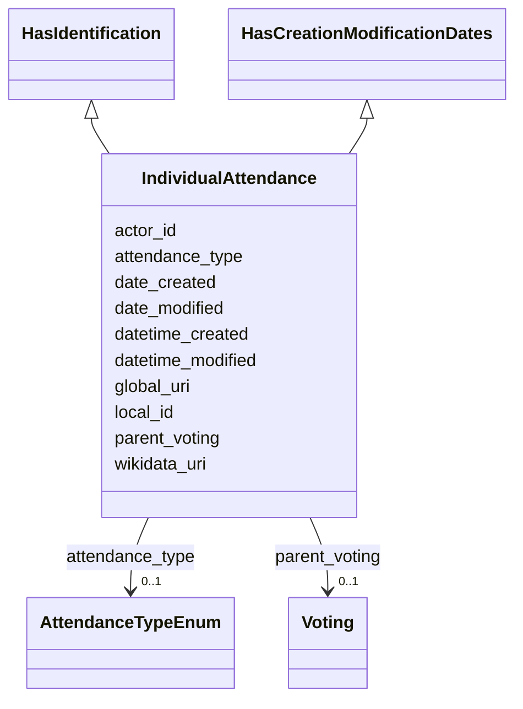

# Class: IndividualAttendance 


_[en] Individual attendance record for a specific person._

_[de] Einzelne Anwesenheitsfeststellung für eine bestimmte Person._

__


URI: [ops:IndividualAttendance](https://ch.paf.link/schema/operations/IndividualAttendance)



```mermaid
 classDiagram
    class IndividualAttendance
    click IndividualAttendance href "../IndividualAttendance/"
      HasIdentification <|-- IndividualAttendance
        click HasIdentification href "../HasIdentification/"
      HasCreationModificationDates <|-- IndividualAttendance
        click HasCreationModificationDates href "../HasCreationModificationDates/"
      
      IndividualAttendance : actor_id
        
      IndividualAttendance : attendance_type
        
          
    
        
        
        IndividualAttendance --> "0..1" AttendanceTypeEnum : attendance_type
        click AttendanceTypeEnum href "../AttendanceTypeEnum/"
    

        
      IndividualAttendance : date_created
        
      IndividualAttendance : date_modified
        
      IndividualAttendance : datetime_created
        
      IndividualAttendance : datetime_modified
        
      IndividualAttendance : global_uri
        
      IndividualAttendance : local_id
        
      IndividualAttendance : parent_voting
        
          
    
        
        
        IndividualAttendance --> "0..1" Voting : parent_voting
        click Voting href "../Voting/"
    

        
      IndividualAttendance : wikidata_uri
        
      
```


## Inheritance
* **IndividualAttendance** [ [HasIdentification](HasIdentification.md) [HasCreationModificationDates](HasCreationModificationDates.md)]


## Slots

| Name | Cardinality and Range | Description | Inheritance |
| ---  | --- | --- | --- |
| [parent_voting](parent_voting.md) | 0..1 <br/> [Voting](Voting.md) | [en] The ID of the voting associated with the individual vote | direct |
| [actor_id](actor_id.md) | 0..1 <br/> [String](String.md) | [en] The political body organized by the term of office (e | direct |
| [attendance_type](attendance_type.md) | 0..1 <br/> [AttendanceTypeEnum](AttendanceTypeEnum.md) | Type of individual attendance | direct |
| [local_id](local_id.md) | 0..1 <br/> [String](String.md) | [de] Lokaler Identifikator | [HasIdentification](HasIdentification.md) |
| [global_uri](global_uri.md) | 1 <br/> [Uriorcurie](Uriorcurie.md) | [de] Eine eindeutige, global gültige URI für die Entität | [HasIdentification](HasIdentification.md) |
| [wikidata_uri](wikidata_uri.md) | 0..1 <br/> [Uriorcurie](Uriorcurie.md) | [de] Eine URI, die auf eine Wikidata-Entität verweist, z | [HasIdentification](HasIdentification.md) |
| [date_created](date_created.md) | 0..1 <br/> [Date](Date.md) | [de] Das Datum, an dem eine Entität erstellt wurde | [HasCreationModificationDates](HasCreationModificationDates.md) |
| [datetime_created](datetime_created.md) | 0..1 <br/> [Datetime](Datetime.md) | [de] Das Datum und die Uhrzeit, an dem eine Entität erstellt wurde | [HasCreationModificationDates](HasCreationModificationDates.md) |
| [date_modified](date_modified.md) | 0..1 <br/> [Date](Date.md) | [de] Das Datum, an dem eine Entität zuletzt geändert wurde | [HasCreationModificationDates](HasCreationModificationDates.md) |
| [datetime_modified](datetime_modified.md) | 0..1 <br/> [Datetime](Datetime.md) | [de] Das Datum und die Uhrzeit, an dem eine Entität zuletzt geändert wurde | [HasCreationModificationDates](HasCreationModificationDates.md) |


## Usages

| used by | used in | type | used |
| ---  | --- | --- | --- |
| [Container](Container.md) | [individual_attendances](individual_attendances.md) | range | [IndividualAttendance](IndividualAttendance.md) |


## Identifier and Mapping Information


### Schema Source


* from schema: https://ch.paf.link/schema/operations


## Mappings

| Mapping Type | Mapped Value |
| ---  | ---  |
| self | ops:IndividualAttendance |
| native | ops:IndividualAttendance |


## LinkML Source

<!-- TODO: investigate https://stackoverflow.com/questions/37606292/how-to-create-tabbed-code-blocks-in-mkdocs-or-sphinx -->

### Direct

<details>
```yaml
name: IndividualAttendance
description: '[en] Individual attendance record for a specific person.

  [de] Einzelne Anwesenheitsfeststellung für eine bestimmte Person.

  '
from_schema: https://ch.paf.link/schema/operations
mixins:
- HasIdentification
- HasCreationModificationDates
slots:
- parent_voting
- actor_id
- attendance_type

```
</details>

### Induced

<details>
```yaml
name: IndividualAttendance
description: '[en] Individual attendance record for a specific person.

  [de] Einzelne Anwesenheitsfeststellung für eine bestimmte Person.

  '
from_schema: https://ch.paf.link/schema/operations
mixins:
- HasIdentification
- HasCreationModificationDates
attributes:
  parent_voting:
    name: parent_voting
    description: '[en] The ID of the voting associated with the individual vote.

      [de] Die ID der Abstimmung, die mit der Einzelstimme verbunden ist.

      '
    from_schema: https://ch.paf.link/schema/operations
    rank: 1000
    slot_uri: ops:parentVoting
    alias: parent_voting
    owner: IndividualAttendance
    domain_of:
    - IndividualVote
    - IndividualAttendance
    range: Voting
  actor_id:
    name: actor_id
    description: '[en] The political body organized by the term of office (e.g., Regierungsrat,
      Nationalrat, Ständerat).

      [de] Das politische Organ, das durch die Amtsdauer organisiert wird (z.B. Regierungsrat,
      Nationalrat, Ständerat).

      '
    from_schema: https://ch.paf.link/schema/operations
    rank: 1000
    alias: actor_id
    owner: IndividualAttendance
    domain_of:
    - Legislature
    - Meeting
    - Voting
    - IndividualVote
    - Election
    - Attendance
    - IndividualAttendance
    - Speech
    range: string
  attendance_type:
    name: attendance_type
    description: Type of individual attendance
    from_schema: https://ch.paf.link/schema/operations
    rank: 1000
    alias: attendance_type
    owner: IndividualAttendance
    domain_of:
    - IndividualAttendance
    range: attendance_type_enum
  local_id:
    name: local_id
    description: '[de] Lokaler Identifikator. Bspw. eine UUID aus dem Ratsinformationssystem.

      [en] Local identifier. For example, a UUID from the council information system.

      '
    from_schema: https://ch.paf.link/schema/operations
    rank: 1000
    slot_uri: mcm:localId
    alias: local_id
    owner: IndividualAttendance
    domain_of:
    - HasIdentification
    range: string
  global_uri:
    name: global_uri
    description: '[de] Eine eindeutige, global gültige URI für die Entität.

      [en] A unique, globally valid URI for the entity.

      '
    from_schema: https://ch.paf.link/schema/operations
    rank: 1000
    slot_uri: mcm:globalURI
    identifier: true
    alias: global_uri
    owner: IndividualAttendance
    domain_of:
    - HasIdentification
    range: uriorcurie
    required: true
  wikidata_uri:
    name: wikidata_uri
    description: '[de] Eine URI, die auf eine Wikidata-Entität verweist, z.B. https://www.wikidata.org/wiki/Q39
      für die Schweiz.

      [en] A URI that refers to a Wikidata entity, e.g. https://www.wikidata.org/wiki/Q39
      for Switzerland.

      '
    from_schema: https://ch.paf.link/schema/operations
    rank: 1000
    slot_uri: mcm:wikidataUri
    alias: wikidata_uri
    owner: IndividualAttendance
    domain_of:
    - HasIdentification
    range: uriorcurie
  date_created:
    name: date_created
    description: '[de] Das Datum, an dem eine Entität erstellt wurde.

      [en] The date when an entity was created.

      '
    from_schema: https://ch.paf.link/schema/operations
    rank: 1000
    slot_uri: mcm:dateCreated
    alias: date_created
    owner: IndividualAttendance
    domain_of:
    - HasCreationModificationDates
    range: date
  datetime_created:
    name: datetime_created
    description: '[de] Das Datum und die Uhrzeit, an dem eine Entität erstellt wurde.

      [en] The date and time when an entity was created.

      '
    from_schema: https://ch.paf.link/schema/operations
    rank: 1000
    slot_uri: mcm:datetimeCreated
    alias: datetime_created
    owner: IndividualAttendance
    domain_of:
    - HasCreationModificationDates
    range: datetime
  date_modified:
    name: date_modified
    description: '[de] Das Datum, an dem eine Entität zuletzt geändert wurde.

      [en] The date when an entity was last modified.

      '
    from_schema: https://ch.paf.link/schema/operations
    rank: 1000
    slot_uri: mcm:dateModified
    alias: date_modified
    owner: IndividualAttendance
    domain_of:
    - HasCreationModificationDates
    range: date
  datetime_modified:
    name: datetime_modified
    description: '[de] Das Datum und die Uhrzeit, an dem eine Entität zuletzt geändert
      wurde.

      [en] The date and time when an entity was last modified.

      '
    from_schema: https://ch.paf.link/schema/operations
    rank: 1000
    slot_uri: mcm:datetimeModified
    alias: datetime_modified
    owner: IndividualAttendance
    domain_of:
    - HasCreationModificationDates
    range: datetime

```
</details>