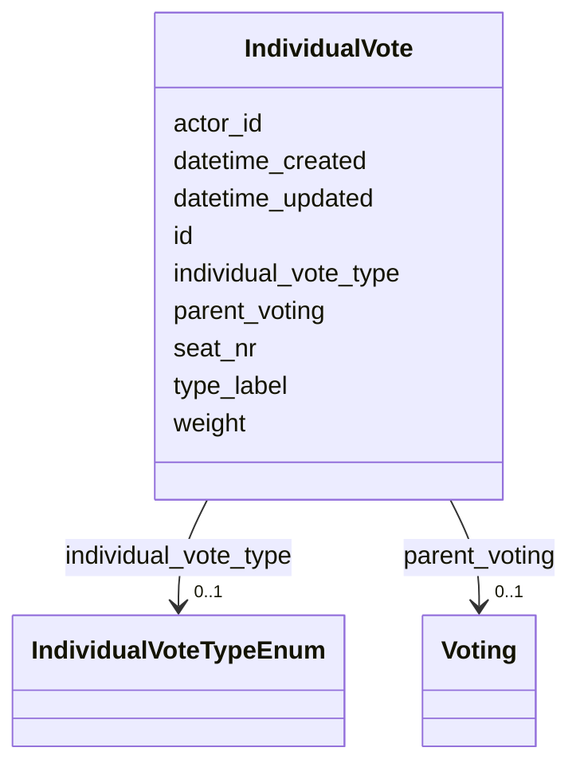

# Class: IndividualVote 


_[en] An individual vote cast by a member during a voting procedure._

_[de] Eine Einzelstimme eines Mitglieds während eines Abstimmungsverfahrens._

__


URI: [ops:IndividualVote](https://ch.paf.link/schema/operations/IndividualVote)





<!-- no inheritance hierarchy -->


## Slots

| Name | Cardinality and Range | Description | Inheritance |
| ---  | --- | --- | --- |
| [id](id.md) | 1 <br/> [String](String.md) |  | direct |
| [parent_voting](parent_voting.md) | 0..1 <br/> [Voting](Voting.md) | [en] The ID of the voting associated with the individual vote | direct |
| [actor_id](actor_id.md) | 0..1 <br/> [String](String.md) | [en] The political body organized by the term of office (e | direct |
| [seat_nr](seat_nr.md) | 0..1 <br/> [String](String.md) | [en] The seat number of the individual vote, if applicable | direct |
| [weight](weight.md) | 0..1 <br/> [Integer](Integer.md) | [en] The number of votes held by the individual, if applicable (e | direct |
| [individual_vote_type](individual_vote_type.md) | 0..1 <br/> [IndividualVoteTypeEnum](IndividualVoteTypeEnum.md) | [en] Type of vote cast (yes, no, abstention, absent, etc | direct |
| [type_label](type_label.md) | 0..1 <br/> [String](String.md) | [en] Custom type label when standard type values don't apply | direct |
| [datetime_updated](datetime_updated.md) | 0..1 <br/> [Datetime](Datetime.md) | The last time this record was updated | direct |
| [datetime_created](datetime_created.md) | 0..1 <br/> [Datetime](Datetime.md) | The time this record was created | direct |


## Usages

| used by | used in | type | used |
| ---  | --- | --- | --- |
| [Container](Container.md) | [individual_votes](individual_votes.md) | range | [IndividualVote](IndividualVote.md) |


## Identifier and Mapping Information


### Schema Source


* from schema: https://ch.paf.link/schema/operations


## Mappings

| Mapping Type | Mapped Value |
| ---  | ---  |
| self | ops:IndividualVote |
| native | ops:IndividualVote |


## LinkML Source

<!-- TODO: investigate https://stackoverflow.com/questions/37606292/how-to-create-tabbed-code-blocks-in-mkdocs-or-sphinx -->

### Direct

<details>
```yaml
name: IndividualVote
description: '[en] An individual vote cast by a member during a voting procedure.

  [de] Eine Einzelstimme eines Mitglieds während eines Abstimmungsverfahrens.

  '
from_schema: https://ch.paf.link/schema/operations
slots:
- id
- parent_voting
- actor_id
- seat_nr
- weight
- individual_vote_type
- type_label
- datetime_updated
- datetime_created

```
</details>

### Induced

<details>
```yaml
name: IndividualVote
description: '[en] An individual vote cast by a member during a voting procedure.

  [de] Eine Einzelstimme eines Mitglieds während eines Abstimmungsverfahrens.

  '
from_schema: https://ch.paf.link/schema/operations
attributes:
  id:
    name: id
    from_schema: https://ch.paf.link/schema/operations
    rank: 1000
    slot_uri: dcterm:identifier
    identifier: true
    alias: id
    owner: IndividualVote
    domain_of:
    - Container
    - Legislature
    - Session
    - Meeting
    - AgendaItem
    - Voting
    - IndividualVote
    - Election
    - Attendance
    - IndividualAttendance
    - Speech
    - TextSegment
    - Motion
    - Media
    range: string
    required: true
  parent_voting:
    name: parent_voting
    description: '[en] The ID of the voting associated with the individual vote.

      [de] Die ID der Abstimmung, die mit der Einzelstimme verbunden ist.

      '
    from_schema: https://ch.paf.link/schema/operations
    rank: 1000
    slot_uri: ops:parentVoting
    alias: parent_voting
    owner: IndividualVote
    domain_of:
    - IndividualVote
    - IndividualAttendance
    range: Voting
  actor_id:
    name: actor_id
    description: '[en] The political body organized by the term of office (e.g., Regierungsrat,
      Nationalrat, Ständerat).

      [de] Das politische Organ, das durch die Amtsdauer organisiert wird (z.B. Regierungsrat,
      Nationalrat, Ständerat).

      '
    from_schema: https://ch.paf.link/schema/operations
    rank: 1000
    alias: actor_id
    owner: IndividualVote
    domain_of:
    - Legislature
    - Meeting
    - Voting
    - IndividualVote
    - Election
    - Attendance
    - IndividualAttendance
    - Speech
    range: string
  seat_nr:
    name: seat_nr
    description: '[en] The seat number of the individual vote, if applicable.

      [de] Die Sitznummer der Einzelstimme, falls zutreffend.

      '
    from_schema: https://ch.paf.link/schema/operations
    rank: 1000
    alias: seat_nr
    owner: IndividualVote
    domain_of:
    - IndividualVote
    range: string
  weight:
    name: weight
    description: '[en] The number of votes held by the individual, if applicable (e.g.,
      in cases where a person has multiple votes).

      [de] Die Anzahl der Stimmen, die die Einzelperson hat, falls zutreffend (z.B.
      in Fällen, in denen eine Person mehrere Stimmen hat).

      '
    from_schema: https://ch.paf.link/schema/operations
    rank: 1000
    alias: weight
    owner: IndividualVote
    domain_of:
    - IndividualVote
    range: integer
  individual_vote_type:
    name: individual_vote_type
    description: '[en] Type of vote cast (yes, no, abstention, absent, etc.).

      [de] Art der abgegebenen Stimme (ja, nein, Enthaltung, abwesend, etc.).

      '
    from_schema: https://ch.paf.link/schema/operations
    rank: 1000
    alias: individual_vote_type
    owner: IndividualVote
    domain_of:
    - IndividualVote
    range: individual_vote_type_enum
  type_label:
    name: type_label
    description: '[en] Custom type label when standard type values don''t apply.

      [de] Benutzerdefinierte Typbezeichnung, wenn Standardtypwerte nicht zutreffen.

      '
    from_schema: https://ch.paf.link/schema/operations
    rank: 1000
    alias: type_label
    owner: IndividualVote
    domain_of:
    - Resolution
    - Voting
    - IndividualVote
    - Election
    range: string
  datetime_updated:
    name: datetime_updated
    description: The last time this record was updated
    from_schema: https://ch.paf.link/schema/operations
    rank: 1000
    alias: datetime_updated
    owner: IndividualVote
    domain_of:
    - Legislature
    - Session
    - Meeting
    - AgendaItem
    - Voting
    - IndividualVote
    - Election
    - Attendance
    - IndividualAttendance
    - Speech
    range: datetime
  datetime_created:
    name: datetime_created
    description: The time this record was created
    from_schema: https://ch.paf.link/schema/operations
    rank: 1000
    alias: datetime_created
    owner: IndividualVote
    domain_of:
    - Legislature
    - Session
    - Meeting
    - AgendaItem
    - Voting
    - IndividualVote
    - Election
    - Attendance
    - IndividualAttendance
    - Speech
    range: datetime

```
</details>