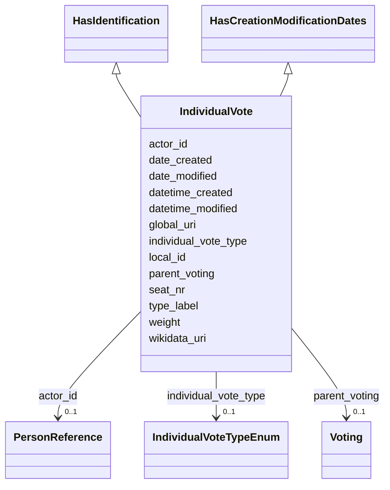

---
search:
  boost: 10.0
---

# Class: IndividualVote 


_[en] An individual vote cast by a member during a voting procedure._

_[de] Eine Einzelstimme eines Mitglieds während eines Abstimmungsverfahrens._

__


<div data-search-exclude markdown="1">


URI: [ops:IndividualVote](https://ch.paf.link/schema/operations/IndividualVote)



```mermaid
 classDiagram
    class IndividualVote
    click IndividualVote href "../IndividualVote/"
      HasIdentification <|-- IndividualVote
        click HasIdentification href "../HasIdentification/"
      HasCreationModificationDates <|-- IndividualVote
        click HasCreationModificationDates href "../HasCreationModificationDates/"
      
      IndividualVote : actor_id
        
          
    
        
        
        IndividualVote --> "0..1" PersonReference : actor_id
        click PersonReference href "../PersonReference/"
    

        
      IndividualVote : date_created
        
      IndividualVote : date_modified
        
      IndividualVote : datetime_created
        
      IndividualVote : datetime_modified
        
      IndividualVote : global_uri
        
      IndividualVote : individual_vote_type
        
          
    
        
        
        IndividualVote --> "0..1" IndividualVoteTypeEnum : individual_vote_type
        click IndividualVoteTypeEnum href "../IndividualVoteTypeEnum/"
    

        
      IndividualVote : local_id
        
      IndividualVote : parent_voting
        
          
    
        
        
        IndividualVote --> "0..1" Voting : parent_voting
        click Voting href "../Voting/"
    

        
      IndividualVote : seat_nr
        
      IndividualVote : type_label
        
      IndividualVote : weight
        
      IndividualVote : wikidata_uri
        
      
```


## Inheritance
* **IndividualVote** [ [HasIdentification](HasIdentification.md) [HasCreationModificationDates](HasCreationModificationDates.md)]


## Slots

| Name | Cardinality and Range | Description | Inheritance |
| ---  | --- | --- | --- |
| [parent_voting](parent_voting.md) | 0..1 <br/> [Voting](Voting.md) | [en] The ID of the voting associated with the individual vote | direct |
| [actor_id](actor_id.md) | 0..1 <br/> [PersonReference](PersonReference.md) | [en] Reference to the acting person (lightweight snapshot at time of linking) | direct |
| [seat_nr](seat_nr.md) | 0..1 <br/> [String](String.md) | [en] The seat number of the individual vote, if applicable | direct |
| [weight](weight.md) | 0..1 <br/> [Integer](Integer.md) | [en] The number of votes held by the individual, if applicable (e | direct |
| [individual_vote_type](individual_vote_type.md) | 0..1 <br/> [IndividualVoteTypeEnum](IndividualVoteTypeEnum.md) | [en] Type of vote cast (yes, no, abstention, no vote, etc | direct |
| [type_label](type_label.md) | 0..1 <br/> [String](String.md) | [en] Custom type label when standard type values don't apply | direct |
| [local_id](local_id.md) | 0..1 <br/> [String](String.md) | Local identifier | [HasIdentification](HasIdentification.md) |
| [global_uri](global_uri.md) | 1 <br/> [Uriorcurie](Uriorcurie.md) | A unique, globally valid URI for the entity | [HasIdentification](HasIdentification.md) |
| [wikidata_uri](wikidata_uri.md) | 0..1 <br/> [Uriorcurie](Uriorcurie.md) | A URI that refers to a Wikidata entity, e | [HasIdentification](HasIdentification.md) |
| [date_created](date_created.md) | 0..1 <br/> [Date](Date.md) | The date when an entity was created | [HasCreationModificationDates](HasCreationModificationDates.md) |
| [datetime_created](datetime_created.md) | 0..1 <br/> [Datetime](Datetime.md) | The date and time when an entity was created | [HasCreationModificationDates](HasCreationModificationDates.md) |
| [date_modified](date_modified.md) | 0..1 <br/> [Date](Date.md) | The date when an entity was last modified | [HasCreationModificationDates](HasCreationModificationDates.md) |
| [datetime_modified](datetime_modified.md) | 0..1 <br/> [Datetime](Datetime.md) | The date and time when an entity was last modified | [HasCreationModificationDates](HasCreationModificationDates.md) |


## Usages

| used by | used in | type | used |
| ---  | --- | --- | --- |
| [Container](Container.md) | [individual_votes](individual_votes.md) | range | [IndividualVote](IndividualVote.md) |


## Identifier and Mapping Information


### Schema Source


* from schema: https://ch.paf.link/schema/operations


## Mappings

| Mapping Type | Mapped Value |
| ---  | ---  |
| self | ops:IndividualVote |
| native | ops:IndividualVote |


## LinkML Source

<!-- TODO: investigate https://stackoverflow.com/questions/37606292/how-to-create-tabbed-code-blocks-in-mkdocs-or-sphinx -->

### Direct

<details>
```yaml
name: IndividualVote
description: '[en] An individual vote cast by a member during a voting procedure.

  [de] Eine Einzelstimme eines Mitglieds während eines Abstimmungsverfahrens.

  '
from_schema: https://ch.paf.link/schema/operations
mixins:
- HasIdentification
- HasCreationModificationDates
slots:
- parent_voting
- actor_id
- seat_nr
- weight
- individual_vote_type
- type_label

```
</details>

### Induced

<details>
```yaml
name: IndividualVote
description: '[en] An individual vote cast by a member during a voting procedure.

  [de] Eine Einzelstimme eines Mitglieds während eines Abstimmungsverfahrens.

  '
from_schema: https://ch.paf.link/schema/operations
mixins:
- HasIdentification
- HasCreationModificationDates
attributes:
  parent_voting:
    name: parent_voting
    description: '[en] The ID of the voting associated with the individual vote.

      [de] Die ID der Abstimmung, die mit der Einzelstimme verbunden ist.

      '
    from_schema: https://ch.paf.link/schema/operations
    rank: 1000
    slot_uri: ops:parentVoting
    owner: IndividualVote
    domain_of:
    - IndividualVote
    range: Voting
  actor_id:
    name: actor_id
    description: '[en] Reference to the acting person (lightweight snapshot at time
      of linking).

      [de] Referenz auf die handelnde Person (leichtgewichtiger Snapshot zum Zeitpunkt
      der Verknüpfung).

      '
    from_schema: https://ch.paf.link/schema/operations
    rank: 1000
    owner: IndividualVote
    domain_of:
    - Legislature
    - Meeting
    - Voting
    - IndividualVote
    - Election
    - Attendance
    - IndividualAttendance
    - Speech
    range: PersonReference
    inlined: true
  seat_nr:
    name: seat_nr
    description: '[en] The seat number of the individual vote, if applicable.

      [de] Die Sitznummer der Einzelstimme, falls zutreffend.

      '
    from_schema: https://ch.paf.link/schema/operations
    rank: 1000
    owner: IndividualVote
    domain_of:
    - IndividualVote
    range: string
  weight:
    name: weight
    description: '[en] The number of votes held by the individual, if applicable (e.g.,
      in cases where a person has multiple votes).

      [de] Die Anzahl der Stimmen, die die Einzelperson hat, falls zutreffend (z.B.
      in Fällen, in denen eine Person mehrere Stimmen hat).

      '
    from_schema: https://ch.paf.link/schema/operations
    rank: 1000
    owner: IndividualVote
    domain_of:
    - IndividualVote
    range: integer
  individual_vote_type:
    name: individual_vote_type
    description: '[en] Type of vote cast (yes, no, abstention, no vote, etc.).

      [de] Art der abgegebenen Stimme (Ja, Nein, Enthaltung, nicht abgestimmt, etc.).

      '
    from_schema: https://ch.paf.link/schema/operations
    rank: 1000
    owner: IndividualVote
    domain_of:
    - IndividualVote
    range: IndividualVoteTypeEnum
  type_label:
    name: type_label
    description: '[en] Custom type label when standard type values don''t apply.

      [de] Benutzerdefinierte Typbezeichnung, wenn Standardtypwerte nicht zutreffen.

      '
    from_schema: https://ch.paf.link/schema/operations
    rank: 1000
    owner: IndividualVote
    domain_of:
    - Resolution
    - Voting
    - IndividualVote
    - Election
    range: string
  local_id:
    name: local_id
    annotations:
      description_de:
        tag: description_de
        value: 'Lokaler Identifikator. Bspw. eine UUID aus dem Ratsinformationssystem.

          '
    description: 'Local identifier. For example, a UUID from the council information
      system.

      '
    from_schema: https://ch.paf.link/schema/operations
    rank: 1000
    slot_uri: mcm:localId
    owner: IndividualVote
    domain_of:
    - HasIdentification
    range: string
  global_uri:
    name: global_uri
    annotations:
      description_de:
        tag: description_de
        value: 'Eine eindeutige, global gültige URI für die Entität.

          '
    description: 'A unique, globally valid URI for the entity.

      '
    from_schema: https://ch.paf.link/schema/operations
    rank: 1000
    slot_uri: mcm:globalURI
    identifier: true
    owner: IndividualVote
    domain_of:
    - HasIdentification
    range: uriorcurie
    required: true
  wikidata_uri:
    name: wikidata_uri
    annotations:
      description_de:
        tag: description_de
        value: 'Eine URI, die auf eine Wikidata-Entität verweist, z.B. https://www.wikidata.org/wiki/Q39
          für die Schweiz.

          '
    description: 'A URI that refers to a Wikidata entity, e.g. https://www.wikidata.org/wiki/Q39
      for Switzerland.

      '
    from_schema: https://ch.paf.link/schema/operations
    rank: 1000
    slot_uri: mcm:wikidataUri
    owner: IndividualVote
    domain_of:
    - HasIdentification
    range: uriorcurie
  date_created:
    name: date_created
    annotations:
      description_de:
        tag: description_de
        value: 'Das Datum, an dem eine Entität erstellt wurde.

          '
    description: 'The date when an entity was created.

      '
    from_schema: https://ch.paf.link/schema/operations
    rank: 1000
    slot_uri: mcm:dateCreated
    owner: IndividualVote
    domain_of:
    - HasCreationModificationDates
    range: date
  datetime_created:
    name: datetime_created
    annotations:
      description_de:
        tag: description_de
        value: 'Das Datum und die Uhrzeit, an dem eine Entität erstellt wurde.

          '
    description: 'The date and time when an entity was created.

      '
    from_schema: https://ch.paf.link/schema/operations
    rank: 1000
    slot_uri: mcm:datetimeCreated
    owner: IndividualVote
    domain_of:
    - HasCreationModificationDates
    range: datetime
  date_modified:
    name: date_modified
    annotations:
      description_de:
        tag: description_de
        value: 'Das Datum, an dem eine Entität zuletzt geändert wurde.

          '
    description: 'The date when an entity was last modified.

      '
    from_schema: https://ch.paf.link/schema/operations
    rank: 1000
    slot_uri: mcm:dateModified
    owner: IndividualVote
    domain_of:
    - HasCreationModificationDates
    range: date
  datetime_modified:
    name: datetime_modified
    annotations:
      description_de:
        tag: description_de
        value: 'Das Datum und die Uhrzeit, an dem eine Entität zuletzt geändert wurde.

          '
    description: 'The date and time when an entity was last modified.

      '
    from_schema: https://ch.paf.link/schema/operations
    rank: 1000
    slot_uri: mcm:datetimeModified
    owner: IndividualVote
    domain_of:
    - HasCreationModificationDates
    range: datetime

```
</details></div>