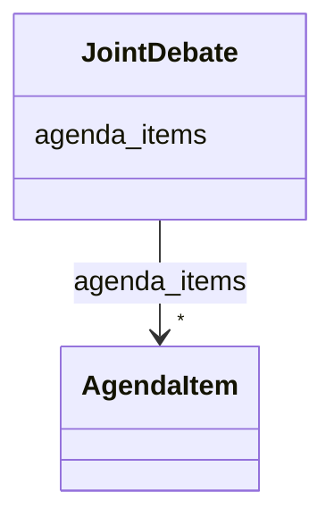

# Class: JointDebate 


_[en] Agenda Items which are debated together._

_[de] Traktanden die gemeinsam behandelt werden._

__


URI: [ops:JointDebate](https://ch.paf.link/schema/operations/JointDebate)





<!-- no inheritance hierarchy -->


## Slots

| Name | Cardinality and Range | Description | Inheritance |
| ---  | --- | --- | --- |
| [agenda_items](agenda_items.md) | * <br/> [AgendaItem](AgendaItem.md) |  | direct |


## Identifier and Mapping Information


### Schema Source


* from schema: https://ch.paf.link/schema/operations


## Mappings

| Mapping Type | Mapped Value |
| ---  | ---  |
| self | ops:JointDebate |
| native | ops:JointDebate |


## LinkML Source

<!-- TODO: investigate https://stackoverflow.com/questions/37606292/how-to-create-tabbed-code-blocks-in-mkdocs-or-sphinx -->

### Direct

<details>
```yaml
name: JointDebate
description: '[en] Agenda Items which are debated together.

  [de] Traktanden die gemeinsam behandelt werden.

  '
from_schema: https://ch.paf.link/schema/operations
slots:
- agenda_items

```
</details>

### Induced

<details>
```yaml
name: JointDebate
description: '[en] Agenda Items which are debated together.

  [de] Traktanden die gemeinsam behandelt werden.

  '
from_schema: https://ch.paf.link/schema/operations
attributes:
  agenda_items:
    name: agenda_items
    from_schema: https://ch.paf.link/schema/operations
    rank: 1000
    slot_uri: ops:agendaItem
    alias: agenda_items
    owner: JointDebate
    domain_of:
    - Container
    - JointDebate
    range: AgendaItem
    multivalued: true
    inlined: true
    inlined_as_list: true

```
</details>