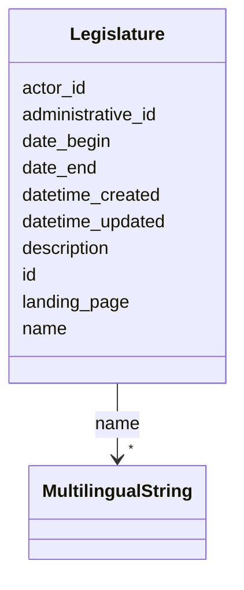

# Class: Legislature 


_[en] Term of office of a parliament as a legislative assembly. Usually lasts four years._

_[de] Amtsdauer eines Parlaments als gesetzgebender Versammlung. Dauert in der Regel vier Jahre._

__


URI: [ops:Legislature](https://ch.paf.link/schema/operations/Legislature)





<!-- no inheritance hierarchy -->


## Slots

| Name | Cardinality and Range | Description | Inheritance |
| ---  | --- | --- | --- |
| [id](id.md) | 1 <br/> [String](String.md) |  | direct |
| [administrative_id](administrative_id.md) | 0..1 <br/> [String](String.md) | [en] Administrative ID of the legislative body, such as a municipality, canto... | direct |
| [name](name.md) | * <br/> [MultilingualString](MultilingualString.md) |  | direct |
| [description](description.md) | 0..1 <br/> [String](String.md) |  | direct |
| [landing_page](landing_page.md) | 0..1 <br/> [String](String.md) | [en] URL providing further information | direct |
| [actor_id](actor_id.md) | 0..1 <br/> [String](String.md) | [en] The political body organized by the term of office (e | direct |
| [date_begin](date_begin.md) | 0..1 <br/> [Date](Date.md) |  | direct |
| [date_end](date_end.md) | 0..1 <br/> [Date](Date.md) |  | direct |
| [datetime_updated](datetime_updated.md) | 0..1 <br/> [Datetime](Datetime.md) | The last time this record was updated | direct |
| [datetime_created](datetime_created.md) | 0..1 <br/> [Datetime](Datetime.md) | The time this record was created | direct |


## Usages

| used by | used in | type | used |
| ---  | --- | --- | --- |
| [Container](Container.md) | [legislatures](legislatures.md) | range | [Legislature](Legislature.md) |


## Identifier and Mapping Information


### Schema Source


* from schema: https://ch.paf.link/schema/operations


## Mappings

| Mapping Type | Mapped Value |
| ---  | ---  |
| self | ops:Legislature |
| native | ops:Legislature |


## LinkML Source

<!-- TODO: investigate https://stackoverflow.com/questions/37606292/how-to-create-tabbed-code-blocks-in-mkdocs-or-sphinx -->

### Direct

<details>
```yaml
name: Legislature
description: '[en] Term of office of a parliament as a legislative assembly. Usually
  lasts four years.

  [de] Amtsdauer eines Parlaments als gesetzgebender Versammlung. Dauert in der Regel
  vier Jahre.

  '
from_schema: https://ch.paf.link/schema/operations
slots:
- id
- administrative_id
- name
- description
- landing_page
- actor_id
- date_begin
- date_end
- datetime_updated
- datetime_created

```
</details>

### Induced

<details>
```yaml
name: Legislature
description: '[en] Term of office of a parliament as a legislative assembly. Usually
  lasts four years.

  [de] Amtsdauer eines Parlaments als gesetzgebender Versammlung. Dauert in der Regel
  vier Jahre.

  '
from_schema: https://ch.paf.link/schema/operations
attributes:
  id:
    name: id
    from_schema: https://ch.paf.link/schema/operations
    rank: 1000
    slot_uri: dcterm:identifier
    identifier: true
    alias: id
    owner: Legislature
    domain_of:
    - Container
    - Legislature
    - Session
    - Meeting
    - AgendaItem
    - Voting
    - IndividualVote
    - Election
    - Attendance
    - IndividualAttendance
    - Speech
    - TextSegment
    - Motion
    - Media
    range: string
    required: true
  administrative_id:
    name: administrative_id
    description: '[en] Administrative ID of the legislative body, such as a municipality,
      canton, or country.

      [de] Verwaltungs-ID des gesetzgebenden Körpers, wie z.B. Gemeinde, Kanton oder
      Land.

      '
    from_schema: https://ch.paf.link/schema/operations
    rank: 1000
    alias: administrative_id
    owner: Legislature
    domain_of:
    - Legislature
    - Meeting
    range: string
  name:
    name: name
    from_schema: https://ch.paf.link/schema/operations
    rank: 1000
    alias: name
    owner: Legislature
    domain_of:
    - Legislature
    - Session
    - Meeting
    range: MultilingualString
    multivalued: true
    inlined: true
    inlined_as_list: true
  description:
    name: description
    from_schema: https://ch.paf.link/schema/operations
    rank: 1000
    alias: description
    owner: Legislature
    domain_of:
    - Legislature
    - Meeting
    - Motion
    range: string
  landing_page:
    name: landing_page
    description: '[en] URL providing further information.

      [de] URL mit weiteren Informationen.

      '
    from_schema: https://ch.paf.link/schema/operations
    rank: 1000
    slot_uri: ops:landingPage
    alias: landing_page
    owner: Legislature
    domain_of:
    - Legislature
    - Meeting
    - AgendaItem
    - Voting
    - Election
    - Speech
    range: string
  actor_id:
    name: actor_id
    description: '[en] The political body organized by the term of office (e.g., Regierungsrat,
      Nationalrat, Ständerat).

      [de] Das politische Organ, das durch die Amtsdauer organisiert wird (z.B. Regierungsrat,
      Nationalrat, Ständerat).

      '
    from_schema: https://ch.paf.link/schema/operations
    rank: 1000
    alias: actor_id
    owner: Legislature
    domain_of:
    - Legislature
    - Meeting
    - Voting
    - IndividualVote
    - Election
    - Attendance
    - IndividualAttendance
    - Speech
    range: string
  date_begin:
    name: date_begin
    from_schema: https://ch.paf.link/schema/operations
    rank: 1000
    alias: date_begin
    owner: Legislature
    domain_of:
    - Legislature
    range: date
  date_end:
    name: date_end
    from_schema: https://ch.paf.link/schema/operations
    rank: 1000
    alias: date_end
    owner: Legislature
    domain_of:
    - Legislature
    range: date
  datetime_updated:
    name: datetime_updated
    description: The last time this record was updated
    from_schema: https://ch.paf.link/schema/operations
    rank: 1000
    alias: datetime_updated
    owner: Legislature
    domain_of:
    - Legislature
    - Session
    - Meeting
    - AgendaItem
    - Voting
    - IndividualVote
    - Election
    - Attendance
    - IndividualAttendance
    - Speech
    range: datetime
  datetime_created:
    name: datetime_created
    description: The time this record was created
    from_schema: https://ch.paf.link/schema/operations
    rank: 1000
    alias: datetime_created
    owner: Legislature
    domain_of:
    - Legislature
    - Session
    - Meeting
    - AgendaItem
    - Voting
    - IndividualVote
    - Election
    - Attendance
    - IndividualAttendance
    - Speech
    range: datetime

```
</details>