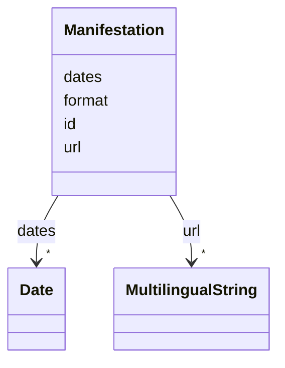

# Class: Manifestation 


URI: [ops:Manifestation](https://ch.paf.link/schema/operations/Manifestation)





<!-- no inheritance hierarchy -->

## Slots

| Name | Cardinality and Range | Description | Inheritance |
| ---  | --- | --- | --- |
| [id](id.md) | 1 <br/> [String](String.md) |  | direct |
| [dates](dates.md) | * <br/> [Date](Date.md) |  | direct |
| [format](format.md) | 0..1 <br/> [String](String.md) | [en] The file format of the manifestation (e | direct |
| [url](url.md) | * <br/> [MultilingualString](MultilingualString.md) |  | direct |


## Usages

| used by | used in | type | used |
| ---  | --- | --- | --- |
| [Expression](Expression.md) | [manifestations](manifestations.md) | range | [Manifestation](Manifestation.md) |


## Identifier and Mapping Information


### Schema Source


* from schema: https://ch.paf.link/schema/operations


## Mappings

| Mapping Type | Mapped Value |
| ---  | ---  |
| self | ops:Manifestation |
| native | ops:Manifestation |


## LinkML Source

<!-- TODO: investigate https://stackoverflow.com/questions/37606292/how-to-create-tabbed-code-blocks-in-mkdocs-or-sphinx -->

### Direct

<details>
```yaml
name: Manifestation
from_schema: https://ch.paf.link/schema/operations
slots:
- id
- dates
- format
- url

```
</details>

### Induced

<details>
```yaml
name: Manifestation
from_schema: https://ch.paf.link/schema/operations
attributes:
  id:
    name: id
    from_schema: https://ch.paf.link/schema/operations
    rank: 1000
    identifier: true
    alias: id
    owner: Manifestation
    domain_of:
    - Work
    - Expression
    - Manifestation
    range: string
    required: true
  dates:
    name: dates
    from_schema: https://ch.paf.link/schema/operations
    rank: 1000
    slot_uri: meta:dates
    alias: dates
    owner: Manifestation
    domain_of:
    - Expression
    - Manifestation
    range: Date
    multivalued: true
    inlined: true
    inlined_as_list: true
  format:
    name: format
    description: '[en] The file format of the manifestation (e.g., pdf, html).

      [de] Das Dateiformat der Manifestation (z.B. pdf, html).

      '
    from_schema: https://ch.paf.link/schema/operations
    rank: 1000
    slot_uri: meta:format
    alias: format
    owner: Manifestation
    domain_of:
    - Manifestation
    range: string
  url:
    name: url
    from_schema: https://ch.paf.link/schema/operations
    rank: 1000
    alias: url
    owner: Manifestation
    domain_of:
    - Session
    - Meeting
    - AgendaItem
    - Media
    - Manifestation
    range: MultilingualString
    multivalued: true
    inlined: true
    inlined_as_list: true

```
</details>