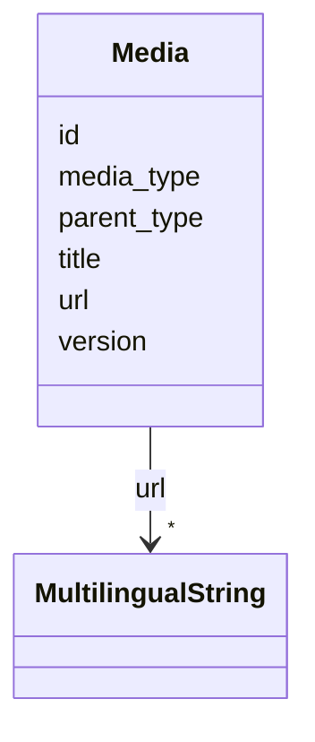

# Class: Media 


_[en] Media files or documents (including protocols in PDF/HTML/WORD or links to audio/video)._

_[de] Mediendateien oder Dokumente (einschließlich Protokolle in PDF/HTML/WORD oder Links zu Audio/Video)._

__


URI: [ops:Media](https://ch.paf.link/schema/operations/Media)





<!-- no inheritance hierarchy -->


## Slots

| Name | Cardinality and Range | Description | Inheritance |
| ---  | --- | --- | --- |
| [id](id.md) | 1 <br/> [String](String.md) |  | direct |
| [title](title.md) | 0..1 <br/> [String](String.md) |  | direct |
| [media_type](media_type.md) | 0..1 <br/> [String](String.md) | Type of media (audio, video, document) | direct |
| [url](url.md) | * <br/> [MultilingualString](MultilingualString.md) |  | direct |
| [version](version.md) | 0..1 <br/> [String](String.md) | Version number or identifier | direct |
| [parent_type](parent_type.md) | 0..1 <br/> [String](String.md) | Type of parent object (meeting, agenda, speech, affair) | direct |


## Identifier and Mapping Information


### Schema Source


* from schema: https://ch.paf.link/schema/operations


## Mappings

| Mapping Type | Mapped Value |
| ---  | ---  |
| self | ops:Media |
| native | ops:Media |


## LinkML Source

<!-- TODO: investigate https://stackoverflow.com/questions/37606292/how-to-create-tabbed-code-blocks-in-mkdocs-or-sphinx -->

### Direct

<details>
```yaml
name: Media
description: '[en] Media files or documents (including protocols in PDF/HTML/WORD
  or links to audio/video).

  [de] Mediendateien oder Dokumente (einschließlich Protokolle in PDF/HTML/WORD oder
  Links zu Audio/Video).

  '
from_schema: https://ch.paf.link/schema/operations
slots:
- id
- title
- media_type
- url
- version
- parent_type

```
</details>

### Induced

<details>
```yaml
name: Media
description: '[en] Media files or documents (including protocols in PDF/HTML/WORD
  or links to audio/video).

  [de] Mediendateien oder Dokumente (einschließlich Protokolle in PDF/HTML/WORD oder
  Links zu Audio/Video).

  '
from_schema: https://ch.paf.link/schema/operations
attributes:
  id:
    name: id
    from_schema: https://ch.paf.link/schema/operations
    rank: 1000
    slot_uri: dcterm:identifier
    identifier: true
    alias: id
    owner: Media
    domain_of:
    - Container
    - Legislature
    - Session
    - Meeting
    - AgendaItem
    - Voting
    - IndividualVote
    - Election
    - Attendance
    - IndividualAttendance
    - Speech
    - TextSegment
    - Motion
    - Media
    range: string
    required: true
  title:
    name: title
    from_schema: https://ch.paf.link/schema/operations
    rank: 1000
    alias: title
    owner: Media
    domain_of:
    - Election
    - Motion
    - Media
    range: string
  media_type:
    name: media_type
    description: Type of media (audio, video, document)
    from_schema: https://ch.paf.link/schema/operations
    rank: 1000
    alias: media_type
    owner: Media
    domain_of:
    - Speech
    - Media
    range: string
  url:
    name: url
    from_schema: https://ch.paf.link/schema/operations
    rank: 1000
    alias: url
    owner: Media
    domain_of:
    - Session
    - Meeting
    - Media
    range: MultilingualString
    multivalued: true
    inlined: true
    inlined_as_list: true
  version:
    name: version
    description: Version number or identifier
    from_schema: https://ch.paf.link/schema/operations
    rank: 1000
    alias: version
    owner: Media
    domain_of:
    - Media
    range: string
  parent_type:
    name: parent_type
    description: Type of parent object (meeting, agenda, speech, affair)
    from_schema: https://ch.paf.link/schema/operations
    rank: 1000
    alias: parent_type
    owner: Media
    domain_of:
    - Media
    range: string

```
</details>