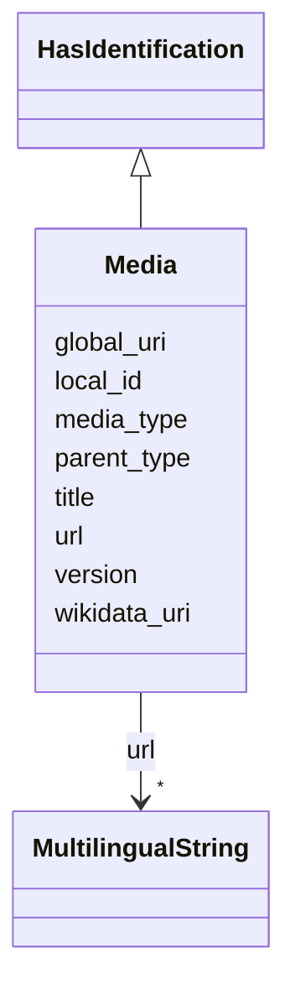

# Class: Media 


_[en] Media files or documents (including protocols in PDF/HTML/WORD or links to audio/video)._

_[de] Mediendateien oder Dokumente (einschließlich Protokolle in PDF/HTML/WORD oder Links zu Audio/Video)._

__


URI: [ops:Media](https://ch.paf.link/schema/operations/Media)



```mermaid
 classDiagram
    class Media
    click Media href "../Media/"
      HasIdentification <|-- Media
        click HasIdentification href "../HasIdentification/"
      
      Media : global_uri
        
      Media : local_id
        
      Media : media_type
        
      Media : parent_type
        
      Media : title
        
      Media : url
        
          
    
        
        
        Media --> "*" MultilingualString : url
        click MultilingualString href "../MultilingualString/"
    

        
      Media : version
        
      Media : wikidata_uri
        
      
```


## Inheritance
* **Media** [ [HasIdentification](HasIdentification.md)]


## Slots

| Name | Cardinality and Range | Description | Inheritance |
| ---  | --- | --- | --- |
| [title](title.md) | 0..1 <br/> [String](String.md) |  | direct |
| [media_type](media_type.md) | 0..1 <br/> [String](String.md) | Type of media (audio, video, document) | direct |
| [url](url.md) | * <br/> [MultilingualString](MultilingualString.md) |  | direct |
| [version](version.md) | 0..1 <br/> [String](String.md) | Version number or identifier | direct |
| [parent_type](parent_type.md) | 0..1 <br/> [String](String.md) | Type of parent object (meeting, agenda, speech, affair) | direct |
| [local_id](local_id.md) | 0..1 <br/> [String](String.md) | [de] Lokaler Identifikator | [HasIdentification](HasIdentification.md) |
| [global_uri](global_uri.md) | 1 <br/> [Uriorcurie](Uriorcurie.md) | [de] Eine eindeutige, global gültige URI für die Entität | [HasIdentification](HasIdentification.md) |
| [wikidata_uri](wikidata_uri.md) | 0..1 <br/> [Uriorcurie](Uriorcurie.md) | [de] Eine URI, die auf eine Wikidata-Entität verweist, z | [HasIdentification](HasIdentification.md) |


## Identifier and Mapping Information


### Schema Source


* from schema: https://ch.paf.link/schema/operations


## Mappings

| Mapping Type | Mapped Value |
| ---  | ---  |
| self | ops:Media |
| native | ops:Media |


## LinkML Source

<!-- TODO: investigate https://stackoverflow.com/questions/37606292/how-to-create-tabbed-code-blocks-in-mkdocs-or-sphinx -->

### Direct

<details>
```yaml
name: Media
description: '[en] Media files or documents (including protocols in PDF/HTML/WORD
  or links to audio/video).

  [de] Mediendateien oder Dokumente (einschließlich Protokolle in PDF/HTML/WORD oder
  Links zu Audio/Video).

  '
from_schema: https://ch.paf.link/schema/operations
mixins:
- HasIdentification
slots:
- title
- media_type
- url
- version
- parent_type

```
</details>

### Induced

<details>
```yaml
name: Media
description: '[en] Media files or documents (including protocols in PDF/HTML/WORD
  or links to audio/video).

  [de] Mediendateien oder Dokumente (einschließlich Protokolle in PDF/HTML/WORD oder
  Links zu Audio/Video).

  '
from_schema: https://ch.paf.link/schema/operations
mixins:
- HasIdentification
attributes:
  title:
    name: title
    from_schema: https://ch.paf.link/schema/operations
    rank: 1000
    alias: title
    owner: Media
    domain_of:
    - Election
    - Motion
    - Media
    range: string
  media_type:
    name: media_type
    description: Type of media (audio, video, document)
    from_schema: https://ch.paf.link/schema/operations
    rank: 1000
    alias: media_type
    owner: Media
    domain_of:
    - Speech
    - Media
    range: string
  url:
    name: url
    from_schema: https://ch.paf.link/schema/operations
    rank: 1000
    alias: url
    owner: Media
    domain_of:
    - Session
    - Meeting
    - AgendaItem
    - Media
    range: MultilingualString
    multivalued: true
    inlined: true
    inlined_as_list: true
  version:
    name: version
    description: Version number or identifier
    from_schema: https://ch.paf.link/schema/operations
    rank: 1000
    alias: version
    owner: Media
    domain_of:
    - Media
    range: string
  parent_type:
    name: parent_type
    description: Type of parent object (meeting, agenda, speech, affair)
    from_schema: https://ch.paf.link/schema/operations
    rank: 1000
    alias: parent_type
    owner: Media
    domain_of:
    - Media
    range: string
  local_id:
    name: local_id
    description: '[de] Lokaler Identifikator. Bspw. eine UUID aus dem Ratsinformationssystem.

      [en] Local identifier. For example, a UUID from the council information system.

      '
    from_schema: https://ch.paf.link/schema/operations
    rank: 1000
    slot_uri: mcm:localId
    alias: local_id
    owner: Media
    domain_of:
    - HasIdentification
    range: string
  global_uri:
    name: global_uri
    description: '[de] Eine eindeutige, global gültige URI für die Entität.

      [en] A unique, globally valid URI for the entity.

      '
    from_schema: https://ch.paf.link/schema/operations
    rank: 1000
    slot_uri: mcm:globalURI
    identifier: true
    alias: global_uri
    owner: Media
    domain_of:
    - HasIdentification
    range: uriorcurie
    required: true
  wikidata_uri:
    name: wikidata_uri
    description: '[de] Eine URI, die auf eine Wikidata-Entität verweist, z.B. https://www.wikidata.org/wiki/Q39
      für die Schweiz.

      [en] A URI that refers to a Wikidata entity, e.g. https://www.wikidata.org/wiki/Q39
      for Switzerland.

      '
    from_schema: https://ch.paf.link/schema/operations
    rank: 1000
    slot_uri: mcm:wikidataUri
    alias: wikidata_uri
    owner: Media
    domain_of:
    - HasIdentification
    range: uriorcurie

```
</details>