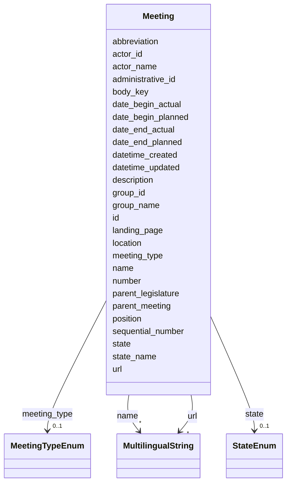

# Class: Meeting 


_[en] A general meeting class used for Sessions, Comittee Meetings, individual session Sittings and other various Meetings._

_[de] Eine allgemeine Sitzungsklasse, die für Sessionen, Kommissionssitzungen, Sessionssitzung und andere verschiedene Versammlungen verwendet wird._

__


URI: [ops:Meeting](https://ch.paf.link/schema/operations/Meeting)





<!-- no inheritance hierarchy -->


## Slots

| Name | Cardinality and Range | Description | Inheritance |
| ---  | --- | --- | --- |
| [id](id.md) | 1 <br/> [String](String.md) |  | direct |
| [body_key](body_key.md) | 0..1 <br/> [String](String.md) | [en] Key identifying the political body or jurisdiction (e | direct |
| [meeting_type](meeting_type.md) | 0..1 <br/> [MeetingTypeEnum](MeetingTypeEnum.md) | Type of the meeting, e | direct |
| [administrative_id](administrative_id.md) | 0..1 <br/> [String](String.md) | [en] Administrative ID of the legislative body, such as a municipality, canto... | direct |
| [name](name.md) | * <br/> [MultilingualString](MultilingualString.md) |  | direct |
| [url](url.md) | * <br/> [MultilingualString](MultilingualString.md) |  | direct |
| [group_name](group_name.md) | 0..1 <br/> [String](String.md) | Name of the group or body | direct |
| [group_id](group_id.md) | 0..1 <br/> [String](String.md) | Identifier of the group or body | direct |
| [number](number.md) | 0..1 <br/> [String](String.md) |  | direct |
| [landing_page](landing_page.md) | 0..1 <br/> [String](String.md) | [en] URL providing further information | direct |
| [sequential_number](sequential_number.md) | 0..1 <br/> [Integer](Integer.md) | [en] Sequential number of the meeting, used for ordering | direct |
| [position](position.md) | 0..1 <br/> [String](String.md) |  | direct |
| [abbreviation](abbreviation.md) | 0..1 <br/> [String](String.md) |  | direct |
| [actor_name](actor_name.md) | 0..1 <br/> [String](String.md) | [en] Name of the political body (e | direct |
| [actor_id](actor_id.md) | 0..1 <br/> [String](String.md) | [en] The political body organized by the term of office (e | direct |
| [date_begin_planned](date_begin_planned.md) | 0..1 <br/> [Date](Date.md) | [en] Planned start date of the meeting or session | direct |
| [date_end_planned](date_end_planned.md) | 0..1 <br/> [Date](Date.md) | [en] Planned end date of the meeting or session | direct |
| [date_begin_actual](date_begin_actual.md) | 0..1 <br/> [Date](Date.md) |  | direct |
| [date_end_actual](date_end_actual.md) | 0..1 <br/> [Date](Date.md) | [en] Actual end date of the meeting or session | direct |
| [state](state.md) | 0..1 <br/> [StateEnum](StateEnum.md) |  | direct |
| [state_name](state_name.md) | 0..1 <br/> [String](String.md) | [en] Custom state description for the meeting | direct |
| [description](description.md) | 0..1 <br/> [String](String.md) |  | direct |
| [location](location.md) | 0..1 <br/> [String](String.md) |  | direct |
| [parent_meeting](parent_meeting.md) | 0..1 <br/> [String](String.md) | [en] The linked meeting ID that groups the current meeting | direct |
| [parent_legislature](parent_legislature.md) | 0..1 <br/> [String](String.md) | [en] The legislative body in which the meeting is based | direct |
| [datetime_updated](datetime_updated.md) | 0..1 <br/> [Datetime](Datetime.md) | The last time this record was updated | direct |
| [datetime_created](datetime_created.md) | 0..1 <br/> [Datetime](Datetime.md) | The time this record was created | direct |


## Usages

| used by | used in | type | used |
| ---  | --- | --- | --- |
| [Container](Container.md) | [meetings](meetings.md) | range | [Meeting](Meeting.md) |
| [Session](Session.md) | [meetings](meetings.md) | range | [Meeting](Meeting.md) |


## Identifier and Mapping Information


### Schema Source


* from schema: https://ch.paf.link/schema/operations


## Mappings

| Mapping Type | Mapped Value |
| ---  | ---  |
| self | ops:Meeting |
| native | ops:Meeting |


## LinkML Source

<!-- TODO: investigate https://stackoverflow.com/questions/37606292/how-to-create-tabbed-code-blocks-in-mkdocs-or-sphinx -->

### Direct

<details>
```yaml
name: Meeting
description: '[en] A general meeting class used for Sessions, Comittee Meetings, individual
  session Sittings and other various Meetings.

  [de] Eine allgemeine Sitzungsklasse, die für Sessionen, Kommissionssitzungen, Sessionssitzung
  und andere verschiedene Versammlungen verwendet wird.

  '
from_schema: https://ch.paf.link/schema/operations
slots:
- id
- body_key
- meeting_type
- administrative_id
- name
- url
- group_name
- group_id
- number
- landing_page
- sequential_number
- position
- abbreviation
- actor_name
- actor_id
- date_begin_planned
- date_end_planned
- date_begin_actual
- date_end_actual
- state
- state_name
- description
- location
- parent_meeting
- parent_legislature
- datetime_updated
- datetime_created

```
</details>

### Induced

<details>
```yaml
name: Meeting
description: '[en] A general meeting class used for Sessions, Comittee Meetings, individual
  session Sittings and other various Meetings.

  [de] Eine allgemeine Sitzungsklasse, die für Sessionen, Kommissionssitzungen, Sessionssitzung
  und andere verschiedene Versammlungen verwendet wird.

  '
from_schema: https://ch.paf.link/schema/operations
attributes:
  id:
    name: id
    from_schema: https://ch.paf.link/schema/operations
    rank: 1000
    slot_uri: dcterm:identifier
    identifier: true
    alias: id
    owner: Meeting
    domain_of:
    - Container
    - Legislature
    - Session
    - Meeting
    - AgendaItem
    - Voting
    - IndividualVote
    - Election
    - Attendance
    - IndividualAttendance
    - Speech
    - TextSegment
    - Motion
    - Media
    range: string
    required: true
  body_key:
    name: body_key
    description: '[en] Key identifying the political body or jurisdiction (e.g., BE
      for Bern, CHE for Switzerland).

      [de] Schlüssel zur Identifizierung des politischen Organs oder der Gerichtsbarkeit
      (z.B. BE für Bern, CHE für Schweiz).

      '
    from_schema: https://ch.paf.link/schema/operations
    rank: 1000
    alias: body_key
    owner: Meeting
    domain_of:
    - Session
    - Meeting
    range: string
  meeting_type:
    name: meeting_type
    description: Type of the meeting, e.g. session, committee, sitting, various
    from_schema: https://ch.paf.link/schema/operations
    rank: 1000
    slot_uri: ops:meetingType
    alias: meeting_type
    owner: Meeting
    domain_of:
    - Meeting
    range: meeting_type_enum
  administrative_id:
    name: administrative_id
    description: '[en] Administrative ID of the legislative body, such as a municipality,
      canton, or country.

      [de] Verwaltungs-ID des gesetzgebenden Körpers, wie z.B. Gemeinde, Kanton oder
      Land.

      '
    from_schema: https://ch.paf.link/schema/operations
    rank: 1000
    alias: administrative_id
    owner: Meeting
    domain_of:
    - Legislature
    - Meeting
    range: string
  name:
    name: name
    from_schema: https://ch.paf.link/schema/operations
    rank: 1000
    alias: name
    owner: Meeting
    domain_of:
    - Legislature
    - Session
    - Meeting
    range: MultilingualString
    multivalued: true
    inlined: true
    inlined_as_list: true
  url:
    name: url
    from_schema: https://ch.paf.link/schema/operations
    rank: 1000
    alias: url
    owner: Meeting
    domain_of:
    - Session
    - Meeting
    - Media
    range: MultilingualString
    multivalued: true
    inlined: true
    inlined_as_list: true
  group_name:
    name: group_name
    description: Name of the group or body
    from_schema: https://ch.paf.link/schema/operations
    rank: 1000
    alias: group_name
    owner: Meeting
    domain_of:
    - Meeting
    range: string
  group_id:
    name: group_id
    description: Identifier of the group or body
    from_schema: https://ch.paf.link/schema/operations
    rank: 1000
    alias: group_id
    owner: Meeting
    domain_of:
    - Meeting
    range: string
  number:
    name: number
    from_schema: https://ch.paf.link/schema/operations
    rank: 1000
    alias: number
    owner: Meeting
    domain_of:
    - Meeting
    range: string
  landing_page:
    name: landing_page
    description: '[en] URL providing further information.

      [de] URL mit weiteren Informationen.

      '
    from_schema: https://ch.paf.link/schema/operations
    rank: 1000
    slot_uri: ops:landingPage
    alias: landing_page
    owner: Meeting
    domain_of:
    - Legislature
    - Meeting
    - AgendaItem
    - Voting
    - Election
    - Speech
    range: string
  sequential_number:
    name: sequential_number
    description: '[en] Sequential number of the meeting, used for ordering.

      [de] Laufende Nummer der Sitzung, die zur Sortierung verwendet wird.

      '
    from_schema: https://ch.paf.link/schema/operations
    rank: 1000
    alias: sequential_number
    owner: Meeting
    domain_of:
    - Meeting
    range: integer
  position:
    name: position
    from_schema: https://ch.paf.link/schema/operations
    rank: 1000
    alias: position
    owner: Meeting
    domain_of:
    - Meeting
    range: string
  abbreviation:
    name: abbreviation
    from_schema: https://ch.paf.link/schema/operations
    rank: 1000
    alias: abbreviation
    owner: Meeting
    domain_of:
    - Meeting
    range: string
  actor_name:
    name: actor_name
    description: '[en] Name of the political body (e.g., Nationalrat).

      [de] Name des politischen Organs (z.B. Nationalrat).

      '
    from_schema: https://ch.paf.link/schema/operations
    rank: 1000
    alias: actor_name
    owner: Meeting
    domain_of:
    - Meeting
    range: string
  actor_id:
    name: actor_id
    description: '[en] The political body organized by the term of office (e.g., Regierungsrat,
      Nationalrat, Ständerat).

      [de] Das politische Organ, das durch die Amtsdauer organisiert wird (z.B. Regierungsrat,
      Nationalrat, Ständerat).

      '
    from_schema: https://ch.paf.link/schema/operations
    rank: 1000
    alias: actor_id
    owner: Meeting
    domain_of:
    - Legislature
    - Meeting
    - Voting
    - IndividualVote
    - Election
    - Attendance
    - IndividualAttendance
    - Speech
    range: string
  date_begin_planned:
    name: date_begin_planned
    description: '[en] Planned start date of the meeting or session.

      [de] Geplantes Startdatum der Sitzung oder Session.

      '
    from_schema: https://ch.paf.link/schema/operations
    rank: 1000
    alias: date_begin_planned
    owner: Meeting
    domain_of:
    - Session
    - Meeting
    range: date
  date_end_planned:
    name: date_end_planned
    description: '[en] Planned end date of the meeting or session.

      [de] Geplantes Enddatum der Sitzung oder Session.

      '
    from_schema: https://ch.paf.link/schema/operations
    rank: 1000
    alias: date_end_planned
    owner: Meeting
    domain_of:
    - Session
    - Meeting
    range: date
  date_begin_actual:
    name: date_begin_actual
    from_schema: https://ch.paf.link/schema/operations
    rank: 1000
    alias: date_begin_actual
    owner: Meeting
    domain_of:
    - Meeting
    range: date
  date_end_actual:
    name: date_end_actual
    description: '[en] Actual end date of the meeting or session.

      [de] Tatsächliches Enddatum der Sitzung oder Session.

      '
    from_schema: https://ch.paf.link/schema/operations
    rank: 1000
    alias: date_end_actual
    owner: Meeting
    domain_of:
    - Meeting
    range: date
  state:
    name: state
    from_schema: https://ch.paf.link/schema/operations
    rank: 1000
    alias: state
    owner: Meeting
    domain_of:
    - Meeting
    range: state_enum
  state_name:
    name: state_name
    description: '[en] Custom state description for the meeting.

      [de] Benutzerdefinierte Zustandsbeschreibung für die Sitzung.

      '
    from_schema: https://ch.paf.link/schema/operations
    rank: 1000
    alias: state_name
    owner: Meeting
    domain_of:
    - Meeting
    - AgendaItem
    range: string
  description:
    name: description
    from_schema: https://ch.paf.link/schema/operations
    rank: 1000
    alias: description
    owner: Meeting
    domain_of:
    - Legislature
    - Meeting
    - Motion
    range: string
  location:
    name: location
    from_schema: https://ch.paf.link/schema/operations
    rank: 1000
    alias: location
    owner: Meeting
    domain_of:
    - Meeting
    range: string
  parent_meeting:
    name: parent_meeting
    description: '[en] The linked meeting ID that groups the current meeting.

      [de] Die verknüpfte Sitzungs-ID, die die aktuelle Sitzung gruppiert.

      '
    from_schema: https://ch.paf.link/schema/operations
    rank: 1000
    alias: parent_meeting
    owner: Meeting
    domain_of:
    - Meeting
    - AgendaItem
    - Voting
    - Election
    range: string
  parent_legislature:
    name: parent_legislature
    description: '[en] The legislative body in which the meeting is based.

      [de] Der gesetzgebende Körper, auf dem die Sitzung basiert.

      '
    from_schema: https://ch.paf.link/schema/operations
    rank: 1000
    alias: parent_legislature
    owner: Meeting
    domain_of:
    - Session
    - Meeting
    range: string
  datetime_updated:
    name: datetime_updated
    description: The last time this record was updated
    from_schema: https://ch.paf.link/schema/operations
    rank: 1000
    alias: datetime_updated
    owner: Meeting
    domain_of:
    - Legislature
    - Session
    - Meeting
    - AgendaItem
    - Voting
    - IndividualVote
    - Election
    - Attendance
    - IndividualAttendance
    - Speech
    range: datetime
  datetime_created:
    name: datetime_created
    description: The time this record was created
    from_schema: https://ch.paf.link/schema/operations
    rank: 1000
    alias: datetime_created
    owner: Meeting
    domain_of:
    - Legislature
    - Session
    - Meeting
    - AgendaItem
    - Voting
    - IndividualVote
    - Election
    - Attendance
    - IndividualAttendance
    - Speech
    range: datetime

```
</details>