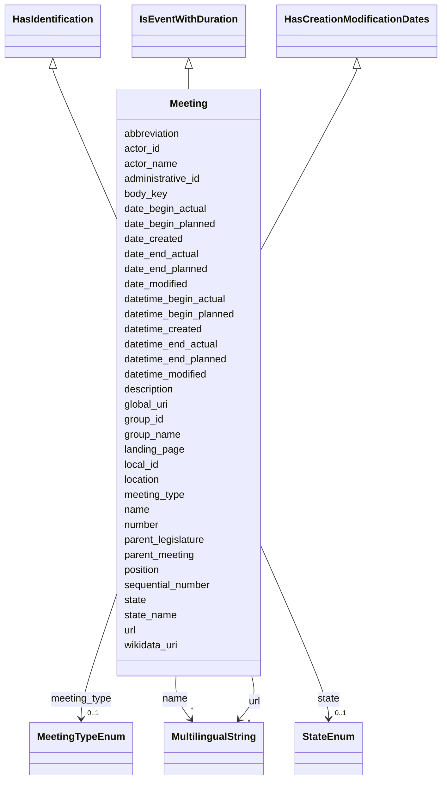

# Class: Meeting 


_[en] A general meeting class used for Sessions, Comittee Meetings, individual session Sittings and other various Meetings._

_[de] Eine allgemeine Sitzungsklasse, die für Sessionen, Kommissionssitzungen, Sessionssitzung und andere verschiedene Versammlungen verwendet wird._

__


URI: [ops:Meeting](https://ch.paf.link/schema/operations/Meeting)



```mermaid
 classDiagram
    class Meeting
    click Meeting href "../Meeting/"
      HasIdentification <|-- Meeting
        click HasIdentification href "../HasIdentification/"
      IsEventWithDuration <|-- Meeting
        click IsEventWithDuration href "../IsEventWithDuration/"
      HasCreationModificationDates <|-- Meeting
        click HasCreationModificationDates href "../HasCreationModificationDates/"
      
      Meeting : abbreviation
        
      Meeting : actor_id
        
      Meeting : actor_name
        
      Meeting : administrative_id
        
      Meeting : body_key
        
      Meeting : date_begin_actual
        
      Meeting : date_begin_planned
        
      Meeting : date_created
        
      Meeting : date_end_actual
        
      Meeting : date_end_planned
        
      Meeting : date_modified
        
      Meeting : datetime_begin_actual
        
      Meeting : datetime_begin_planned
        
      Meeting : datetime_created
        
      Meeting : datetime_end_actual
        
      Meeting : datetime_end_planned
        
      Meeting : datetime_modified
        
      Meeting : description
        
      Meeting : global_uri
        
      Meeting : group_id
        
      Meeting : group_name
        
      Meeting : landing_page
        
      Meeting : local_id
        
      Meeting : location
        
      Meeting : meeting_type
        
          
    
        
        
        Meeting --> "0..1" MeetingTypeEnum : meeting_type
        click MeetingTypeEnum href "../MeetingTypeEnum/"
    

        
      Meeting : name
        
          
    
        
        
        Meeting --> "*" MultilingualString : name
        click MultilingualString href "../MultilingualString/"
    

        
      Meeting : number
        
      Meeting : parent_legislature
        
      Meeting : parent_meeting
        
      Meeting : position
        
      Meeting : sequential_number
        
      Meeting : state
        
          
    
        
        
        Meeting --> "0..1" StateEnum : state
        click StateEnum href "../StateEnum/"
    

        
      Meeting : state_name
        
      Meeting : url
        
          
    
        
        
        Meeting --> "*" MultilingualString : url
        click MultilingualString href "../MultilingualString/"
    

        
      Meeting : wikidata_uri
        
      
```


## Inheritance
* **Meeting** [ [HasIdentification](HasIdentification.md) [IsEventWithDuration](IsEventWithDuration.md) [HasCreationModificationDates](HasCreationModificationDates.md)]


## Slots

| Name | Cardinality and Range | Description | Inheritance |
| ---  | --- | --- | --- |
| [body_key](body_key.md) | 0..1 <br/> [String](String.md) | [en] Key identifying the political body or jurisdiction (e | direct |
| [meeting_type](meeting_type.md) | 0..1 <br/> [MeetingTypeEnum](MeetingTypeEnum.md) | Type of the meeting, e | direct |
| [administrative_id](administrative_id.md) | 0..1 <br/> [String](String.md) | [en] Administrative ID of the legislative body, such as a municipality, canto... | direct |
| [name](name.md) | * <br/> [MultilingualString](MultilingualString.md) |  | direct |
| [url](url.md) | * <br/> [MultilingualString](MultilingualString.md) |  | direct |
| [group_name](group_name.md) | 0..1 <br/> [String](String.md) | Name of the group or body | direct |
| [group_id](group_id.md) | 0..1 <br/> [String](String.md) | Identifier of the group or body | direct |
| [number](number.md) | 0..1 <br/> [String](String.md) |  | direct |
| [landing_page](landing_page.md) | 0..1 <br/> [String](String.md) | [en] URL providing further information | direct |
| [sequential_number](sequential_number.md) | 0..1 <br/> [Integer](Integer.md) | [en] Sequential number of the meeting, used for ordering | direct |
| [position](position.md) | 0..1 <br/> [String](String.md) |  | direct |
| [abbreviation](abbreviation.md) | 0..1 <br/> [String](String.md) |  | direct |
| [actor_name](actor_name.md) | 0..1 <br/> [String](String.md) | [en] Name of the political body (e | direct |
| [actor_id](actor_id.md) | 0..1 <br/> [String](String.md) | [en] The political body organized by the term of office (e | direct |
| [state](state.md) | 0..1 <br/> [StateEnum](StateEnum.md) |  | direct |
| [state_name](state_name.md) | 0..1 <br/> [String](String.md) | [en] Custom state description for the meeting | direct |
| [description](description.md) | 0..1 <br/> [String](String.md) |  | direct |
| [location](location.md) | 0..1 <br/> [String](String.md) |  | direct |
| [parent_meeting](parent_meeting.md) | 0..1 <br/> [String](String.md) | [en] The linked meeting ID that groups the current meeting | direct |
| [parent_legislature](parent_legislature.md) | 0..1 <br/> [String](String.md) | [en] The legislative body in which the meeting is based | direct |
| [local_id](local_id.md) | 0..1 <br/> [String](String.md) | [de] Lokaler Identifikator | [HasIdentification](HasIdentification.md) |
| [global_uri](global_uri.md) | 1 <br/> [Uriorcurie](Uriorcurie.md) | [de] Eine eindeutige, global gültige URI für die Entität | [HasIdentification](HasIdentification.md) |
| [wikidata_uri](wikidata_uri.md) | 0..1 <br/> [Uriorcurie](Uriorcurie.md) | [de] Eine URI, die auf eine Wikidata-Entität verweist, z | [HasIdentification](HasIdentification.md) |
| [date_begin_actual](date_begin_actual.md) | 0..1 <br/> [Date](Date.md) | [de] Das tatsächliche Startdatum eines Ereignisses oder Vorkommens mit Zeitda... | [IsEventWithDuration](IsEventWithDuration.md) |
| [datetime_begin_actual](datetime_begin_actual.md) | 0..1 <br/> [Datetime](Datetime.md) | [de] Das tatsächliche Startdatum und die Uhrzeit eines Ereignisses oder Vorko... | [IsEventWithDuration](IsEventWithDuration.md) |
| [date_begin_planned](date_begin_planned.md) | 0..1 <br/> [Date](Date.md) | [de] Das geplante Startdatum eines Ereignisses oder Vorkommens mit Zeitdauer | [IsEventWithDuration](IsEventWithDuration.md) |
| [datetime_begin_planned](datetime_begin_planned.md) | 0..1 <br/> [Datetime](Datetime.md) | [de] Das geplante Startdatum und die Uhrzeit eines Ereignisses oder Vorkommen... | [IsEventWithDuration](IsEventWithDuration.md) |
| [date_end_actual](date_end_actual.md) | 0..1 <br/> [Date](Date.md) | [de] Das tatsächliche Enddatum eines Ereignisses oder Vorkommens mit Zeitdaue... | [IsEventWithDuration](IsEventWithDuration.md) |
| [datetime_end_actual](datetime_end_actual.md) | 0..1 <br/> [Datetime](Datetime.md) | [de] Das tatsächliche Enddatum und die Uhrzeit eines Ereignisses oder Vorkomm... | [IsEventWithDuration](IsEventWithDuration.md) |
| [date_end_planned](date_end_planned.md) | 0..1 <br/> [Date](Date.md) | [de] Das geplante Enddatum eines Ereignisses oder Vorkommens mit Zeitdauer | [IsEventWithDuration](IsEventWithDuration.md) |
| [datetime_end_planned](datetime_end_planned.md) | 0..1 <br/> [Datetime](Datetime.md) | [de] Das geplante Enddatum und die Uhrzeit eines Ereignisses oder Vorkommens ... | [IsEventWithDuration](IsEventWithDuration.md) |
| [date_created](date_created.md) | 0..1 <br/> [Date](Date.md) | [de] Das Datum, an dem eine Entität erstellt wurde | [HasCreationModificationDates](HasCreationModificationDates.md) |
| [datetime_created](datetime_created.md) | 0..1 <br/> [Datetime](Datetime.md) | [de] Das Datum und die Uhrzeit, an dem eine Entität erstellt wurde | [HasCreationModificationDates](HasCreationModificationDates.md) |
| [date_modified](date_modified.md) | 0..1 <br/> [Date](Date.md) | [de] Das Datum, an dem eine Entität zuletzt geändert wurde | [HasCreationModificationDates](HasCreationModificationDates.md) |
| [datetime_modified](datetime_modified.md) | 0..1 <br/> [Datetime](Datetime.md) | [de] Das Datum und die Uhrzeit, an dem eine Entität zuletzt geändert wurde | [HasCreationModificationDates](HasCreationModificationDates.md) |


## Usages

| used by | used in | type | used |
| ---  | --- | --- | --- |
| [Container](Container.md) | [meetings](meetings.md) | range | [Meeting](Meeting.md) |
| [Session](Session.md) | [meetings](meetings.md) | range | [Meeting](Meeting.md) |


## Identifier and Mapping Information


### Schema Source


* from schema: https://ch.paf.link/schema/operations


## Mappings

| Mapping Type | Mapped Value |
| ---  | ---  |
| self | ops:Meeting |
| native | ops:Meeting |


## LinkML Source

<!-- TODO: investigate https://stackoverflow.com/questions/37606292/how-to-create-tabbed-code-blocks-in-mkdocs-or-sphinx -->

### Direct

<details>
```yaml
name: Meeting
description: '[en] A general meeting class used for Sessions, Comittee Meetings, individual
  session Sittings and other various Meetings.

  [de] Eine allgemeine Sitzungsklasse, die für Sessionen, Kommissionssitzungen, Sessionssitzung
  und andere verschiedene Versammlungen verwendet wird.

  '
from_schema: https://ch.paf.link/schema/operations
mixins:
- HasIdentification
- IsEventWithDuration
- HasCreationModificationDates
slots:
- body_key
- meeting_type
- administrative_id
- name
- url
- group_name
- group_id
- number
- landing_page
- sequential_number
- position
- abbreviation
- actor_name
- actor_id
- state
- state_name
- description
- location
- parent_meeting
- parent_legislature

```
</details>

### Induced

<details>
```yaml
name: Meeting
description: '[en] A general meeting class used for Sessions, Comittee Meetings, individual
  session Sittings and other various Meetings.

  [de] Eine allgemeine Sitzungsklasse, die für Sessionen, Kommissionssitzungen, Sessionssitzung
  und andere verschiedene Versammlungen verwendet wird.

  '
from_schema: https://ch.paf.link/schema/operations
mixins:
- HasIdentification
- IsEventWithDuration
- HasCreationModificationDates
attributes:
  body_key:
    name: body_key
    description: '[en] Key identifying the political body or jurisdiction (e.g., BE
      for Bern, CHE for Switzerland).

      [de] Schlüssel zur Identifizierung des politischen Organs oder der Gerichtsbarkeit
      (z.B. BE für Bern, CHE für Schweiz).

      '
    from_schema: https://ch.paf.link/schema/operations
    rank: 1000
    alias: body_key
    owner: Meeting
    domain_of:
    - Session
    - Meeting
    range: string
  meeting_type:
    name: meeting_type
    description: Type of the meeting, e.g. session, committee, sitting, various
    from_schema: https://ch.paf.link/schema/operations
    rank: 1000
    slot_uri: ops:meetingType
    alias: meeting_type
    owner: Meeting
    domain_of:
    - Meeting
    range: meeting_type_enum
  administrative_id:
    name: administrative_id
    description: '[en] Administrative ID of the legislative body, such as a municipality,
      canton, or country.

      [de] Verwaltungs-ID des gesetzgebenden Körpers, wie z.B. Gemeinde, Kanton oder
      Land.

      '
    from_schema: https://ch.paf.link/schema/operations
    rank: 1000
    alias: administrative_id
    owner: Meeting
    domain_of:
    - Legislature
    - Meeting
    range: string
  name:
    name: name
    from_schema: https://ch.paf.link/schema/operations
    rank: 1000
    alias: name
    owner: Meeting
    domain_of:
    - Legislature
    - Session
    - Meeting
    range: MultilingualString
    multivalued: true
    inlined: true
    inlined_as_list: true
  url:
    name: url
    from_schema: https://ch.paf.link/schema/operations
    rank: 1000
    alias: url
    owner: Meeting
    domain_of:
    - Session
    - Meeting
    - AgendaItem
    - Media
    range: MultilingualString
    multivalued: true
    inlined: true
    inlined_as_list: true
  group_name:
    name: group_name
    description: Name of the group or body
    from_schema: https://ch.paf.link/schema/operations
    rank: 1000
    alias: group_name
    owner: Meeting
    domain_of:
    - Meeting
    range: string
  group_id:
    name: group_id
    description: Identifier of the group or body
    from_schema: https://ch.paf.link/schema/operations
    rank: 1000
    alias: group_id
    owner: Meeting
    domain_of:
    - Meeting
    range: string
  number:
    name: number
    from_schema: https://ch.paf.link/schema/operations
    rank: 1000
    alias: number
    owner: Meeting
    domain_of:
    - Meeting
    range: string
  landing_page:
    name: landing_page
    description: '[en] URL providing further information.

      [de] URL mit weiteren Informationen.

      '
    from_schema: https://ch.paf.link/schema/operations
    rank: 1000
    slot_uri: ops:landingPage
    alias: landing_page
    owner: Meeting
    domain_of:
    - Legislature
    - Meeting
    - AgendaItem
    - Voting
    - Election
    - Speech
    range: string
  sequential_number:
    name: sequential_number
    description: '[en] Sequential number of the meeting, used for ordering.

      [de] Laufende Nummer der Sitzung, die zur Sortierung verwendet wird.

      '
    from_schema: https://ch.paf.link/schema/operations
    rank: 1000
    alias: sequential_number
    owner: Meeting
    domain_of:
    - Meeting
    range: integer
  position:
    name: position
    from_schema: https://ch.paf.link/schema/operations
    rank: 1000
    alias: position
    owner: Meeting
    domain_of:
    - Meeting
    range: string
  abbreviation:
    name: abbreviation
    from_schema: https://ch.paf.link/schema/operations
    rank: 1000
    alias: abbreviation
    owner: Meeting
    domain_of:
    - Meeting
    range: string
  actor_name:
    name: actor_name
    description: '[en] Name of the political body (e.g., Nationalrat).

      [de] Name des politischen Organs (z.B. Nationalrat).

      '
    from_schema: https://ch.paf.link/schema/operations
    rank: 1000
    alias: actor_name
    owner: Meeting
    domain_of:
    - Meeting
    range: string
  actor_id:
    name: actor_id
    description: '[en] The political body organized by the term of office (e.g., Regierungsrat,
      Nationalrat, Ständerat).

      [de] Das politische Organ, das durch die Amtsdauer organisiert wird (z.B. Regierungsrat,
      Nationalrat, Ständerat).

      '
    from_schema: https://ch.paf.link/schema/operations
    rank: 1000
    alias: actor_id
    owner: Meeting
    domain_of:
    - Legislature
    - Meeting
    - Voting
    - IndividualVote
    - Election
    - Attendance
    - IndividualAttendance
    - Speech
    range: string
  state:
    name: state
    from_schema: https://ch.paf.link/schema/operations
    rank: 1000
    alias: state
    owner: Meeting
    domain_of:
    - Meeting
    range: state_enum
  state_name:
    name: state_name
    description: '[en] Custom state description for the meeting.

      [de] Benutzerdefinierte Zustandsbeschreibung für die Sitzung.

      '
    from_schema: https://ch.paf.link/schema/operations
    rank: 1000
    alias: state_name
    owner: Meeting
    domain_of:
    - Meeting
    - AgendaItem
    range: string
  description:
    name: description
    from_schema: https://ch.paf.link/schema/operations
    rank: 1000
    alias: description
    owner: Meeting
    domain_of:
    - Legislature
    - Meeting
    - Motion
    range: string
  location:
    name: location
    from_schema: https://ch.paf.link/schema/operations
    rank: 1000
    alias: location
    owner: Meeting
    domain_of:
    - Meeting
    range: string
  parent_meeting:
    name: parent_meeting
    description: '[en] The linked meeting ID that groups the current meeting.

      [de] Die verknüpfte Sitzungs-ID, die die aktuelle Sitzung gruppiert.

      '
    from_schema: https://ch.paf.link/schema/operations
    rank: 1000
    alias: parent_meeting
    owner: Meeting
    domain_of:
    - Meeting
    - AgendaItem
    - Voting
    - Election
    range: string
  parent_legislature:
    name: parent_legislature
    description: '[en] The legislative body in which the meeting is based.

      [de] Der gesetzgebende Körper, auf dem die Sitzung basiert.

      '
    from_schema: https://ch.paf.link/schema/operations
    rank: 1000
    alias: parent_legislature
    owner: Meeting
    domain_of:
    - Session
    - Meeting
    range: string
  local_id:
    name: local_id
    description: '[de] Lokaler Identifikator. Bspw. eine UUID aus dem Ratsinformationssystem.

      [en] Local identifier. For example, a UUID from the council information system.

      '
    from_schema: https://ch.paf.link/schema/operations
    rank: 1000
    slot_uri: mcm:localId
    alias: local_id
    owner: Meeting
    domain_of:
    - HasIdentification
    range: string
  global_uri:
    name: global_uri
    description: '[de] Eine eindeutige, global gültige URI für die Entität.

      [en] A unique, globally valid URI for the entity.

      '
    from_schema: https://ch.paf.link/schema/operations
    rank: 1000
    slot_uri: mcm:globalURI
    identifier: true
    alias: global_uri
    owner: Meeting
    domain_of:
    - HasIdentification
    range: uriorcurie
    required: true
  wikidata_uri:
    name: wikidata_uri
    description: '[de] Eine URI, die auf eine Wikidata-Entität verweist, z.B. https://www.wikidata.org/wiki/Q39
      für die Schweiz.

      [en] A URI that refers to a Wikidata entity, e.g. https://www.wikidata.org/wiki/Q39
      for Switzerland.

      '
    from_schema: https://ch.paf.link/schema/operations
    rank: 1000
    slot_uri: mcm:wikidataUri
    alias: wikidata_uri
    owner: Meeting
    domain_of:
    - HasIdentification
    range: uriorcurie
  date_begin_actual:
    name: date_begin_actual
    description: '[de] Das tatsächliche Startdatum eines Ereignisses oder Vorkommens
      mit Zeitdauer.

      [en] The actual start date of an event or occurrence with time duration.

      '
    from_schema: https://ch.paf.link/schema/operations
    rank: 1000
    slot_uri: mcm:dateBeginActual
    alias: date_begin_actual
    owner: Meeting
    domain_of:
    - IsEventWithDuration
    range: date
  datetime_begin_actual:
    name: datetime_begin_actual
    description: '[de] Das tatsächliche Startdatum und die Uhrzeit eines Ereignisses
      oder Vorkommens mit Zeitdauer.

      [en] The actual start date and time of an event or occurrence with time duration.

      '
    from_schema: https://ch.paf.link/schema/operations
    rank: 1000
    slot_uri: mcm:datetimeBeginActual
    alias: datetime_begin_actual
    owner: Meeting
    domain_of:
    - IsEventWithDuration
    range: datetime
  date_begin_planned:
    name: date_begin_planned
    description: '[de] Das geplante Startdatum eines Ereignisses oder Vorkommens mit
      Zeitdauer.

      [en] The planned start date of an event or occurrence with time duration.

      '
    from_schema: https://ch.paf.link/schema/operations
    rank: 1000
    slot_uri: mcm:dateBeginPlanned
    alias: date_begin_planned
    owner: Meeting
    domain_of:
    - IsEventWithDuration
    range: date
  datetime_begin_planned:
    name: datetime_begin_planned
    description: '[de] Das geplante Startdatum und die Uhrzeit eines Ereignisses oder
      Vorkommens mit Zeitdauer.

      [en] The planned start date and time of an event or occurrence with time duration.

      '
    from_schema: https://ch.paf.link/schema/operations
    rank: 1000
    slot_uri: mcm:datetimeBeginPlanned
    alias: datetime_begin_planned
    owner: Meeting
    domain_of:
    - IsEventWithDuration
    range: datetime
  date_end_actual:
    name: date_end_actual
    description: '[de] Das tatsächliche Enddatum eines Ereignisses oder Vorkommens
      mit Zeitdauer.

      [en] The actual end date of an event or occurrence with time duration.

      '
    from_schema: https://ch.paf.link/schema/operations
    rank: 1000
    slot_uri: mcm:dateEndActual
    alias: date_end_actual
    owner: Meeting
    domain_of:
    - IsEventWithDuration
    range: date
  datetime_end_actual:
    name: datetime_end_actual
    description: '[de] Das tatsächliche Enddatum und die Uhrzeit eines Ereignisses
      oder Vorkommens mit Zeitdauer.

      [en] The actual end date and time of an event or occurrence with time duration.

      '
    from_schema: https://ch.paf.link/schema/operations
    rank: 1000
    slot_uri: mcm:datetimeEndActual
    alias: datetime_end_actual
    owner: Meeting
    domain_of:
    - IsEventWithDuration
    range: datetime
  date_end_planned:
    name: date_end_planned
    description: '[de] Das geplante Enddatum eines Ereignisses oder Vorkommens mit
      Zeitdauer.

      [en] The planned end date of an event or occurrence with time duration.

      '
    from_schema: https://ch.paf.link/schema/operations
    rank: 1000
    slot_uri: mcm:dateEndPlanned
    alias: date_end_planned
    owner: Meeting
    domain_of:
    - IsEventWithDuration
    range: date
  datetime_end_planned:
    name: datetime_end_planned
    description: '[de] Das geplante Enddatum und die Uhrzeit eines Ereignisses oder
      Vorkommens mit Zeitdauer.

      [en] The planned end date and time of an event or occurrence with time duration.

      '
    from_schema: https://ch.paf.link/schema/operations
    rank: 1000
    slot_uri: mcm:datetimeEndPlanned
    alias: datetime_end_planned
    owner: Meeting
    domain_of:
    - IsEventWithDuration
    range: datetime
  date_created:
    name: date_created
    description: '[de] Das Datum, an dem eine Entität erstellt wurde.

      [en] The date when an entity was created.

      '
    from_schema: https://ch.paf.link/schema/operations
    rank: 1000
    slot_uri: mcm:dateCreated
    alias: date_created
    owner: Meeting
    domain_of:
    - HasCreationModificationDates
    range: date
  datetime_created:
    name: datetime_created
    description: '[de] Das Datum und die Uhrzeit, an dem eine Entität erstellt wurde.

      [en] The date and time when an entity was created.

      '
    from_schema: https://ch.paf.link/schema/operations
    rank: 1000
    slot_uri: mcm:datetimeCreated
    alias: datetime_created
    owner: Meeting
    domain_of:
    - HasCreationModificationDates
    range: datetime
  date_modified:
    name: date_modified
    description: '[de] Das Datum, an dem eine Entität zuletzt geändert wurde.

      [en] The date when an entity was last modified.

      '
    from_schema: https://ch.paf.link/schema/operations
    rank: 1000
    slot_uri: mcm:dateModified
    alias: date_modified
    owner: Meeting
    domain_of:
    - HasCreationModificationDates
    range: date
  datetime_modified:
    name: datetime_modified
    description: '[de] Das Datum und die Uhrzeit, an dem eine Entität zuletzt geändert
      wurde.

      [en] The date and time when an entity was last modified.

      '
    from_schema: https://ch.paf.link/schema/operations
    rank: 1000
    slot_uri: mcm:datetimeModified
    alias: datetime_modified
    owner: Meeting
    domain_of:
    - HasCreationModificationDates
    range: datetime

```
</details>