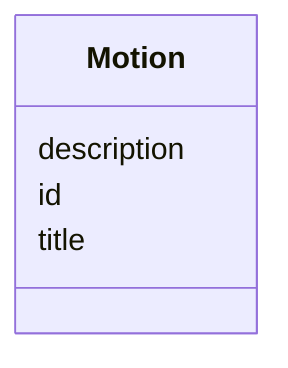

# Class: Motion 


_[en] A formal proposal or motion submitted during proceedings._

_[de] Ein formeller Antrag, der während der Verhandlungen eingereicht wird._

__


URI: [ops:Motion](https://ch.paf.link/schema/operations/Motion)





<!-- no inheritance hierarchy -->


## Slots

| Name | Cardinality and Range | Description | Inheritance |
| ---  | --- | --- | --- |
| [id](id.md) | 1 <br/> [String](String.md) |  | direct |
| [title](title.md) | 0..1 <br/> [String](String.md) |  | direct |
| [description](description.md) | 0..1 <br/> [String](String.md) |  | direct |


## Identifier and Mapping Information


### Schema Source


* from schema: https://ch.paf.link/schema/operations


## Mappings

| Mapping Type | Mapped Value |
| ---  | ---  |
| self | ops:Motion |
| native | ops:Motion |


## LinkML Source

<!-- TODO: investigate https://stackoverflow.com/questions/37606292/how-to-create-tabbed-code-blocks-in-mkdocs-or-sphinx -->

### Direct

<details>
```yaml
name: Motion
description: '[en] A formal proposal or motion submitted during proceedings.

  [de] Ein formeller Antrag, der während der Verhandlungen eingereicht wird.

  '
from_schema: https://ch.paf.link/schema/operations
slots:
- id
- title
- description

```
</details>

### Induced

<details>
```yaml
name: Motion
description: '[en] A formal proposal or motion submitted during proceedings.

  [de] Ein formeller Antrag, der während der Verhandlungen eingereicht wird.

  '
from_schema: https://ch.paf.link/schema/operations
attributes:
  id:
    name: id
    from_schema: https://ch.paf.link/schema/operations
    rank: 1000
    slot_uri: dcterm:identifier
    identifier: true
    alias: id
    owner: Motion
    domain_of:
    - Container
    - Legislature
    - Session
    - Meeting
    - AgendaItem
    - Voting
    - IndividualVote
    - Election
    - Attendance
    - IndividualAttendance
    - Speech
    - TextSegment
    - Motion
    - Media
    range: string
    required: true
  title:
    name: title
    from_schema: https://ch.paf.link/schema/operations
    rank: 1000
    alias: title
    owner: Motion
    domain_of:
    - Election
    - Motion
    - Media
    range: string
  description:
    name: description
    from_schema: https://ch.paf.link/schema/operations
    rank: 1000
    alias: description
    owner: Motion
    domain_of:
    - Legislature
    - Meeting
    - Motion
    range: string

```
</details>