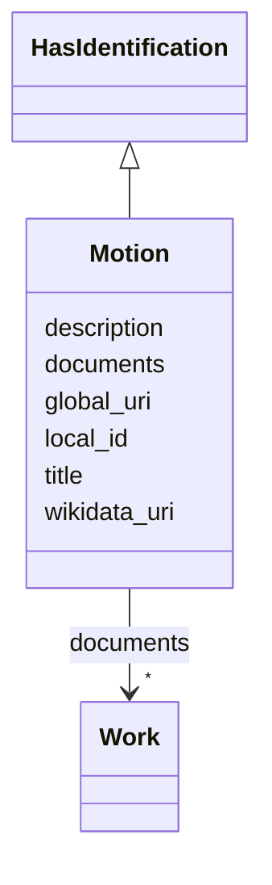

---
search:
  boost: 10.0
---

# Class: Motion 


_[en] A formal proposal or motion submitted during proceedings._

_[de] Ein formeller Antrag, der während der Verhandlungen eingereicht wird._

__


<div data-search-exclude markdown="1">


URI: [ops:Motion](https://ch.paf.link/schema/operations/Motion)



```mermaid
 classDiagram
    class Motion
    click Motion href "../Motion/"
      HasIdentification <|-- Motion
        click HasIdentification href "../HasIdentification/"
      
      Motion : description
        
      Motion : documents
        
          
    
        
        
        Motion --> "*" Work : documents
        click Work href "../Work/"
    

        
      Motion : global_uri
        
      Motion : local_id
        
      Motion : title
        
      Motion : wikidata_uri
        
      
```


## Inheritance
* **Motion** [ [HasIdentification](HasIdentification.md)]


## Slots

| Name | Cardinality and Range | Description | Inheritance |
| ---  | --- | --- | --- |
| [title](title.md) | 0..1 <br/> [String](String.md) |  | direct |
| [description](description.md) | 0..1 <br/> [String](String.md) |  | direct |
| [documents](documents.md) | * <br/> [Work](Work.md) | [de] Liste von Dokumenten (FRBR Works), die mit der Entität verknüpft sind | direct |
| [local_id](local_id.md) | 0..1 <br/> [String](String.md) | [de] Lokaler Identifikator | [HasIdentification](HasIdentification.md) |
| [global_uri](global_uri.md) | 1 <br/> [Uriorcurie](Uriorcurie.md) | [de] Eine eindeutige, global gültige URI für die Entität | [HasIdentification](HasIdentification.md) |
| [wikidata_uri](wikidata_uri.md) | 0..1 <br/> [Uriorcurie](Uriorcurie.md) | [de] Eine URI, die auf eine Wikidata-Entität verweist, z | [HasIdentification](HasIdentification.md) |


## Identifier and Mapping Information


### Schema Source


* from schema: https://ch.paf.link/schema/operations


## Mappings

| Mapping Type | Mapped Value |
| ---  | ---  |
| self | ops:Motion |
| native | ops:Motion |


## LinkML Source

<!-- TODO: investigate https://stackoverflow.com/questions/37606292/how-to-create-tabbed-code-blocks-in-mkdocs-or-sphinx -->

### Direct

<details>
```yaml
name: Motion
description: '[en] A formal proposal or motion submitted during proceedings.

  [de] Ein formeller Antrag, der während der Verhandlungen eingereicht wird.

  '
from_schema: https://ch.paf.link/schema/operations
mixins:
- HasIdentification
slots:
- title
- description
- documents

```
</details>

### Induced

<details>
```yaml
name: Motion
description: '[en] A formal proposal or motion submitted during proceedings.

  [de] Ein formeller Antrag, der während der Verhandlungen eingereicht wird.

  '
from_schema: https://ch.paf.link/schema/operations
mixins:
- HasIdentification
attributes:
  title:
    name: title
    from_schema: https://ch.paf.link/schema/operations
    rank: 1000
    owner: Motion
    domain_of:
    - Election
    - Motion
    - Media
    - Expression
    range: string
  description:
    name: description
    from_schema: https://ch.paf.link/schema/operations
    rank: 1000
    owner: Motion
    domain_of:
    - Legislature
    - Meeting
    - Motion
    - Expression
    range: string
  documents:
    name: documents
    description: '[de] Liste von Dokumenten (FRBR Works), die mit der Entität verknüpft
      sind.

      [en] List of documents (FRBR Works) linked to the entity.

      '
    from_schema: https://ch.paf.link/schema/operations
    rank: 1000
    slot_uri: meta:documents
    owner: Motion
    domain_of:
    - Legislature
    - Session
    - Meeting
    - AgendaItem
    - Resolution
    - Voting
    - Election
    - Speech
    - Motion
    range: Work
    multivalued: true
    inlined: true
    inlined_as_list: true
  local_id:
    name: local_id
    description: '[de] Lokaler Identifikator. Bspw. eine UUID aus dem Ratsinformationssystem.

      [en] Local identifier. For example, a UUID from the council information system.

      '
    from_schema: https://ch.paf.link/schema/operations
    rank: 1000
    slot_uri: mcm:localId
    owner: Motion
    domain_of:
    - HasIdentification
    range: string
  global_uri:
    name: global_uri
    description: '[de] Eine eindeutige, global gültige URI für die Entität.

      [en] A unique, globally valid URI for the entity.

      '
    from_schema: https://ch.paf.link/schema/operations
    rank: 1000
    slot_uri: mcm:globalURI
    identifier: true
    owner: Motion
    domain_of:
    - HasIdentification
    range: uriorcurie
    required: true
  wikidata_uri:
    name: wikidata_uri
    description: '[de] Eine URI, die auf eine Wikidata-Entität verweist, z.B. https://www.wikidata.org/wiki/Q39
      für die Schweiz.

      [en] A URI that refers to a Wikidata entity, e.g. https://www.wikidata.org/wiki/Q39
      for Switzerland.

      '
    from_schema: https://ch.paf.link/schema/operations
    rank: 1000
    slot_uri: mcm:wikidataUri
    owner: Motion
    domain_of:
    - HasIdentification
    range: uriorcurie

```
</details></div>