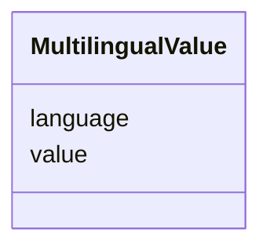

# Class: MultilingualValue 


_[de] Ein mehrsprachiger String mit Angabe der Sprache._

_[en] A multilingual string with language specification._

__


URI: [ops:MultilingualValue](https://ch.paf.link/schema/operations/MultilingualValue)





<!-- no inheritance hierarchy -->

## Slots

| Name | Cardinality and Range | Description | Inheritance |
| ---  | --- | --- | --- |
| [value](value.md) | 0..1 <br/> [String](String.md) | [de] Der eigentliche Wert einer Information neben weiteren attributen wie Typ... | direct |
| [language](language.md) | 0..1 <br/> [String](String.md) | [de] Sprachcode im ISO 639-1 Format | direct |


## Identifier and Mapping Information


### Schema Source


* from schema: https://ch.paf.link/schema/operations


## Mappings

| Mapping Type | Mapped Value |
| ---  | ---  |
| self | ops:MultilingualValue |
| native | ops:MultilingualValue |


## LinkML Source

<!-- TODO: investigate https://stackoverflow.com/questions/37606292/how-to-create-tabbed-code-blocks-in-mkdocs-or-sphinx -->

### Direct

<details>
```yaml
name: MultilingualValue
description: '[de] Ein mehrsprachiger String mit Angabe der Sprache.

  [en] A multilingual string with language specification.

  '
from_schema: https://ch.paf.link/schema/operations
slots:
- value
- language

```
</details>

### Induced

<details>
```yaml
name: MultilingualValue
description: '[de] Ein mehrsprachiger String mit Angabe der Sprache.

  [en] A multilingual string with language specification.

  '
from_schema: https://ch.paf.link/schema/operations
attributes:
  value:
    name: value
    description: '[de] Der eigentliche Wert einer Information neben weiteren attributen
      wie Typ, Sprache, etc.

      [en] The value of an information besides other attributes such as type, language,
      etc.

      '
    from_schema: https://ch.paf.link/schema/operations
    rank: 1000
    slot_uri: mcm:value
    alias: value
    owner: MultilingualValue
    domain_of:
    - MultilingualValue
    range: string
  language:
    name: language
    description: '[de] Sprachcode im ISO 639-1 Format.

      [en] Language code in ISO 639-1 format.

      '
    from_schema: https://ch.paf.link/schema/operations
    rank: 1000
    slot_uri: mcm:language
    alias: language
    owner: MultilingualValue
    domain_of:
    - Speech
    - MultilingualString
    - MultilingualValue
    range: string
    pattern: ^[a-z]{2}$

```
</details>