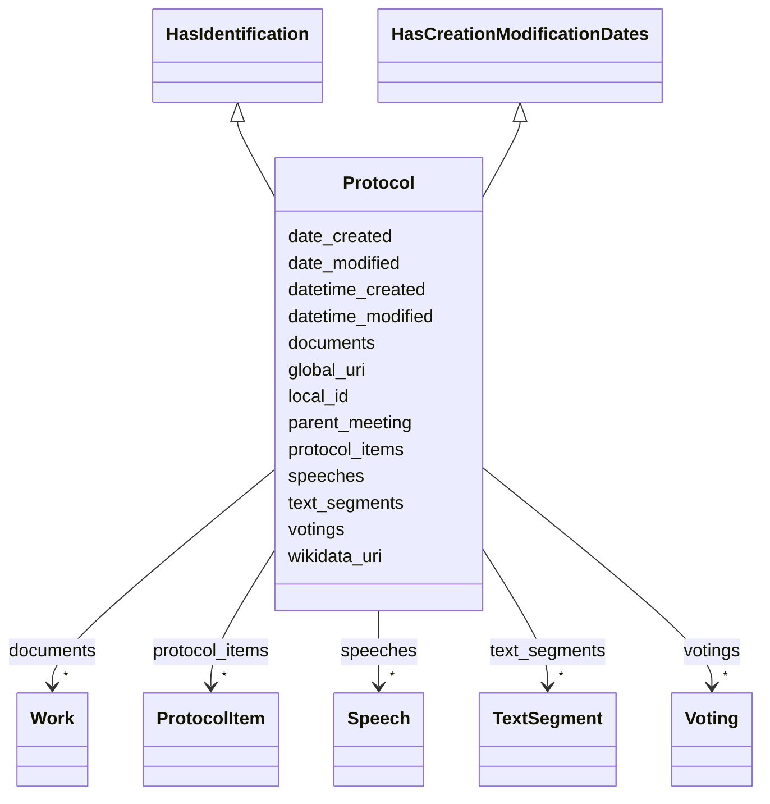

---
search:
  boost: 10.0
---

# Class: Protocol 


_[en] The minutes of a meeting, recorded after the meeting. A wrapper container_

_     bundling the actually handled agenda items (protocol_items), votings,_

_     speeches, verbatim text segments and linked documents._

_[de] Das nach der Sitzung erstellte Protokoll. Ein Wrapper-Container, der die_

_     tatsächlich behandelten Traktanden (protocol_items), Abstimmungen, Wortmeldungen,_

_     Wortlaut-Textsegmente und verknüpfte Dokumente bündelt._

__


<div data-search-exclude markdown="1">


URI: [ops:Protocol](https://ch.paf.link/schema/operations/Protocol)





## Inheritance
* **Protocol** [ [HasIdentification](HasIdentification.md) [HasCreationModificationDates](HasCreationModificationDates.md)]


## Slots

| Name | Cardinality and Range | Description | Inheritance |
| ---  | --- | --- | --- |
| [parent_meeting](parent_meeting.md) | 0..1 <br/> [String](String.md) | [en] The linked meeting ID that groups the current meeting | direct |
| [protocol_items](protocol_items.md) | * <br/> [ProtocolItem](ProtocolItem.md) | [en] Agenda items as actually recorded in the protocol | direct |
| [votings](votings.md) | * <br/> [Voting](Voting.md) | Collection of voting records | direct |
| [speeches](speeches.md) | * <br/> [Speech](Speech.md) | Collection of speech records | direct |
| [text_segments](text_segments.md) | * <br/> [TextSegment](TextSegment.md) | Collection of text segments (e | direct |
| [documents](documents.md) | * <br/> [Work](Work.md) | [de] Liste von Dokumenten (FRBR Works), die mit der Entität verknüpft sind | direct |
| [local_id](local_id.md) | 0..1 <br/> [String](String.md) | Local identifier | [HasIdentification](HasIdentification.md) |
| [global_uri](global_uri.md) | 1 <br/> [Uriorcurie](Uriorcurie.md) | A unique, globally valid URI for the entity | [HasIdentification](HasIdentification.md) |
| [wikidata_uri](wikidata_uri.md) | 0..1 <br/> [Uriorcurie](Uriorcurie.md) | A URI that refers to a Wikidata entity, e | [HasIdentification](HasIdentification.md) |
| [date_created](date_created.md) | 0..1 <br/> [Date](Date.md) | The date when an entity was created | [HasCreationModificationDates](HasCreationModificationDates.md) |
| [datetime_created](datetime_created.md) | 0..1 <br/> [Datetime](Datetime.md) | The date and time when an entity was created | [HasCreationModificationDates](HasCreationModificationDates.md) |
| [date_modified](date_modified.md) | 0..1 <br/> [Date](Date.md) | The date when an entity was last modified | [HasCreationModificationDates](HasCreationModificationDates.md) |
| [datetime_modified](datetime_modified.md) | 0..1 <br/> [Datetime](Datetime.md) | The date and time when an entity was last modified | [HasCreationModificationDates](HasCreationModificationDates.md) |


## Usages

| used by | used in | type | used |
| ---  | --- | --- | --- |
| [Container](Container.md) | [protocols](protocols.md) | range | [Protocol](Protocol.md) |
| [Meeting](Meeting.md) | [protocol](protocol.md) | range | [Protocol](Protocol.md) |


## Identifier and Mapping Information


### Schema Source


* from schema: https://ch.paf.link/schema/operations


## Mappings

| Mapping Type | Mapped Value |
| ---  | ---  |
| self | ops:Protocol |
| native | ops:Protocol |


## LinkML Source

<!-- TODO: investigate https://stackoverflow.com/questions/37606292/how-to-create-tabbed-code-blocks-in-mkdocs-or-sphinx -->

### Direct

<details>
```yaml
name: Protocol
description: "[en] The minutes of a meeting, recorded after the meeting. A wrapper\
  \ container\n     bundling the actually handled agenda items (protocol_items), votings,\n\
  \     speeches, verbatim text segments and linked documents.\n[de] Das nach der\
  \ Sitzung erstellte Protokoll. Ein Wrapper-Container, der die\n     tatsächlich\
  \ behandelten Traktanden (protocol_items), Abstimmungen, Wortmeldungen,\n     Wortlaut-Textsegmente\
  \ und verknüpfte Dokumente bündelt.\n"
from_schema: https://ch.paf.link/schema/operations
mixins:
- HasIdentification
- HasCreationModificationDates
slots:
- parent_meeting
- protocol_items
- votings
- speeches
- text_segments
- documents

```
</details>

### Induced

<details>
```yaml
name: Protocol
description: "[en] The minutes of a meeting, recorded after the meeting. A wrapper\
  \ container\n     bundling the actually handled agenda items (protocol_items), votings,\n\
  \     speeches, verbatim text segments and linked documents.\n[de] Das nach der\
  \ Sitzung erstellte Protokoll. Ein Wrapper-Container, der die\n     tatsächlich\
  \ behandelten Traktanden (protocol_items), Abstimmungen, Wortmeldungen,\n     Wortlaut-Textsegmente\
  \ und verknüpfte Dokumente bündelt.\n"
from_schema: https://ch.paf.link/schema/operations
mixins:
- HasIdentification
- HasCreationModificationDates
attributes:
  parent_meeting:
    name: parent_meeting
    description: '[en] The linked meeting ID that groups the current meeting.

      [de] Die verknüpfte Sitzungs-ID, die die aktuelle Sitzung gruppiert.

      '
    from_schema: https://ch.paf.link/schema/operations
    rank: 1000
    owner: Protocol
    domain_of:
    - Meeting
    - AgendaItem
    - Protocol
    - Voting
    - Election
    - Attendance
    range: string
  protocol_items:
    name: protocol_items
    description: '[en] Agenda items as actually recorded in the protocol.

      [de] Traktanden, wie sie im Protokoll tatsächlich festgehalten wurden.

      '
    from_schema: https://ch.paf.link/schema/operations
    rank: 1000
    slot_uri: ops:protocolItem
    owner: Protocol
    domain_of:
    - Protocol
    range: ProtocolItem
    multivalued: true
    inlined: true
    inlined_as_list: true
  votings:
    name: votings
    description: Collection of voting records
    from_schema: https://ch.paf.link/schema/operations
    rank: 1000
    slot_uri: ops:voting
    owner: Protocol
    domain_of:
    - Container
    - Protocol
    range: Voting
    multivalued: true
    inlined: true
    inlined_as_list: true
  speeches:
    name: speeches
    description: Collection of speech records
    from_schema: https://ch.paf.link/schema/operations
    rank: 1000
    slot_uri: ops:speech
    owner: Protocol
    domain_of:
    - Container
    - Protocol
    range: Speech
    multivalued: true
    inlined: true
    inlined_as_list: true
  text_segments:
    name: text_segments
    description: Collection of text segments (e.g. verbatim protocol)
    from_schema: https://ch.paf.link/schema/operations
    rank: 1000
    slot_uri: ops:textSegment
    owner: Protocol
    domain_of:
    - Protocol
    range: TextSegment
    multivalued: true
    inlined: true
    inlined_as_list: true
  documents:
    name: documents
    description: '[de] Liste von Dokumenten (FRBR Works), die mit der Entität verknüpft
      sind.

      [en] List of documents (FRBR Works) linked to the entity.

      '
    from_schema: https://ch.paf.link/schema/operations
    rank: 1000
    slot_uri: meta:documents
    owner: Protocol
    domain_of:
    - Legislature
    - Session
    - Meeting
    - AgendaItem
    - Protocol
    - Resolution
    - Voting
    - Election
    - Speech
    - Motion
    range: Work
    multivalued: true
    inlined: true
    inlined_as_list: true
  local_id:
    name: local_id
    annotations:
      description_de:
        tag: description_de
        value: 'Lokaler Identifikator. Bspw. eine UUID aus dem Ratsinformationssystem.

          '
    description: 'Local identifier. For example, a UUID from the council information
      system.

      '
    from_schema: https://ch.paf.link/schema/operations
    rank: 1000
    slot_uri: mcm:localId
    owner: Protocol
    domain_of:
    - HasIdentification
    range: string
  global_uri:
    name: global_uri
    annotations:
      description_de:
        tag: description_de
        value: 'Eine eindeutige, global gültige URI für die Entität.

          '
    description: 'A unique, globally valid URI for the entity.

      '
    from_schema: https://ch.paf.link/schema/operations
    rank: 1000
    slot_uri: mcm:globalURI
    identifier: true
    owner: Protocol
    domain_of:
    - HasIdentification
    range: uriorcurie
    required: true
  wikidata_uri:
    name: wikidata_uri
    annotations:
      description_de:
        tag: description_de
        value: 'Eine URI, die auf eine Wikidata-Entität verweist, z.B. https://www.wikidata.org/wiki/Q39
          für die Schweiz.

          '
    description: 'A URI that refers to a Wikidata entity, e.g. https://www.wikidata.org/wiki/Q39
      for Switzerland.

      '
    from_schema: https://ch.paf.link/schema/operations
    rank: 1000
    slot_uri: mcm:wikidataUri
    owner: Protocol
    domain_of:
    - HasIdentification
    range: uriorcurie
  date_created:
    name: date_created
    annotations:
      description_de:
        tag: description_de
        value: 'Das Datum, an dem eine Entität erstellt wurde.

          '
    description: 'The date when an entity was created.

      '
    from_schema: https://ch.paf.link/schema/operations
    rank: 1000
    slot_uri: mcm:dateCreated
    owner: Protocol
    domain_of:
    - HasCreationModificationDates
    range: date
  datetime_created:
    name: datetime_created
    annotations:
      description_de:
        tag: description_de
        value: 'Das Datum und die Uhrzeit, an dem eine Entität erstellt wurde.

          '
    description: 'The date and time when an entity was created.

      '
    from_schema: https://ch.paf.link/schema/operations
    rank: 1000
    slot_uri: mcm:datetimeCreated
    owner: Protocol
    domain_of:
    - HasCreationModificationDates
    range: datetime
  date_modified:
    name: date_modified
    annotations:
      description_de:
        tag: description_de
        value: 'Das Datum, an dem eine Entität zuletzt geändert wurde.

          '
    description: 'The date when an entity was last modified.

      '
    from_schema: https://ch.paf.link/schema/operations
    rank: 1000
    slot_uri: mcm:dateModified
    owner: Protocol
    domain_of:
    - HasCreationModificationDates
    range: date
  datetime_modified:
    name: datetime_modified
    annotations:
      description_de:
        tag: description_de
        value: 'Das Datum und die Uhrzeit, an dem eine Entität zuletzt geändert wurde.

          '
    description: 'The date and time when an entity was last modified.

      '
    from_schema: https://ch.paf.link/schema/operations
    rank: 1000
    slot_uri: mcm:datetimeModified
    owner: Protocol
    domain_of:
    - HasCreationModificationDates
    range: datetime

```
</details></div>