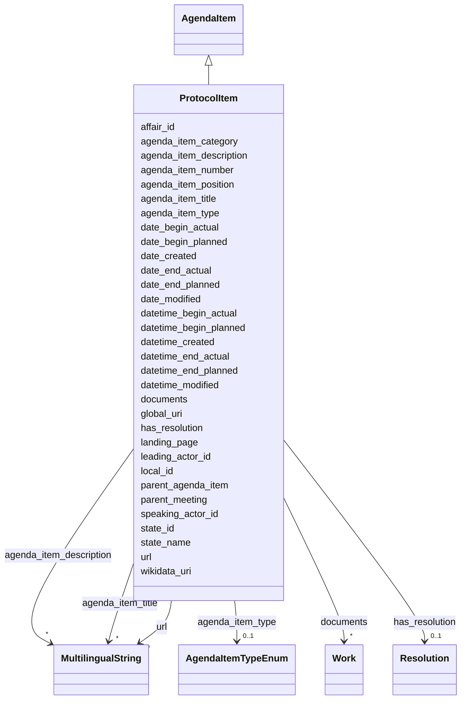

---
search:
  boost: 10.0
---

# Class: ProtocolItem 


_[en] An agenda item as actually recorded in the protocol._

_[de] Ein Traktandum, wie es im Protokoll tatsächlich festgehalten wurde._

__


<div data-search-exclude markdown="1">


URI: [ops:ProtocolItem](https://ch.paf.link/schema/operations/ProtocolItem)





## Inheritance
* [AgendaItem](AgendaItem.md) [ [HasIdentification](HasIdentification.md) [IsEventWithDuration](IsEventWithDuration.md) [HasCreationModificationDates](HasCreationModificationDates.md)]
    * **ProtocolItem**


## Slots

| Name | Cardinality and Range | Description | Inheritance |
| ---  | --- | --- | --- |
| [parent_meeting](parent_meeting.md) | 0..1 <br/> [String](String.md) | [en] The linked meeting ID that groups the current meeting | [AgendaItem](AgendaItem.md) |
| [agenda_item_type](agenda_item_type.md) | 0..1 <br/> [AgendaItemTypeEnum](AgendaItemTypeEnum.md) | [en] Type of agenda item, distinguishing individual items from groups | [AgendaItem](AgendaItem.md) |
| [agenda_item_number](agenda_item_number.md) | 0..1 <br/> [String](String.md) | [en] Sequential number of the agenda item (string type to support roman numer... | [AgendaItem](AgendaItem.md) |
| [agenda_item_position](agenda_item_position.md) | 0..1 <br/> [Integer](Integer.md) | [en] Integer position of the agenda item in the meeting sequence | [AgendaItem](AgendaItem.md) |
| [leading_actor_id](leading_actor_id.md) | 0..1 <br/> [String](String.md) | [en] The leading department for the agenda item | [AgendaItem](AgendaItem.md) |
| [speaking_actor_id](speaking_actor_id.md) | 0..1 <br/> [String](String.md) | [en] The speaker or head of the department for the agenda item | [AgendaItem](AgendaItem.md) |
| [agenda_item_title](agenda_item_title.md) | * <br/> [MultilingualString](MultilingualString.md) | [en] Title of the agenda item | [AgendaItem](AgendaItem.md) |
| [affair_id](affair_id.md) | 0..1 <br/> [String](String.md) | [en] The connection to the affairs (business items) of the agenda item | [AgendaItem](AgendaItem.md) |
| [agenda_item_description](agenda_item_description.md) | * <br/> [MultilingualString](MultilingualString.md) | [en] Subtitle or detailed description of the agenda item | [AgendaItem](AgendaItem.md) |
| [state_id](state_id.md) | 0..1 <br/> [String](String.md) | State identifier (reference to state enum or custom state) | [AgendaItem](AgendaItem.md) |
| [state_name](state_name.md) | 0..1 <br/> [String](String.md) | [en] Custom state description for the meeting | [AgendaItem](AgendaItem.md) |
| [landing_page](landing_page.md) | 0..1 <br/> [String](String.md) | [en] URL providing further information | [AgendaItem](AgendaItem.md) |
| [url](url.md) | * <br/> [MultilingualString](MultilingualString.md) |  | [AgendaItem](AgendaItem.md) |
| [agenda_item_category](agenda_item_category.md) | 0..1 <br/> [String](String.md) | [en] Category for grouped agenda items (e | [AgendaItem](AgendaItem.md) |
| [parent_agenda_item](parent_agenda_item.md) | 0..1 <br/> [String](String.md) | [en] If needed, this slot builds a hierarchy of agenda items | [AgendaItem](AgendaItem.md) |
| [has_resolution](has_resolution.md) | 0..1 <br/> [Resolution](Resolution.md) | [en] The resolutionor decision taken on this agenda item | [AgendaItem](AgendaItem.md) |
| [documents](documents.md) | * <br/> [Work](Work.md) | [de] Liste von Dokumenten (FRBR Works), die mit der Entität verknüpft sind | [AgendaItem](AgendaItem.md) |
| [local_id](local_id.md) | 0..1 <br/> [String](String.md) | Local identifier | [HasIdentification](HasIdentification.md) |
| [global_uri](global_uri.md) | 1 <br/> [Uriorcurie](Uriorcurie.md) | A unique, globally valid URI for the entity | [HasIdentification](HasIdentification.md) |
| [wikidata_uri](wikidata_uri.md) | 0..1 <br/> [Uriorcurie](Uriorcurie.md) | A URI that refers to a Wikidata entity, e | [HasIdentification](HasIdentification.md) |
| [date_begin_actual](date_begin_actual.md) | 0..1 <br/> [Date](Date.md) | The actual start date of an event or occurrence with time duration | [IsEventWithDuration](IsEventWithDuration.md) |
| [datetime_begin_actual](datetime_begin_actual.md) | 0..1 <br/> [Datetime](Datetime.md) | The actual start date and time of an event or occurrence with time duration | [IsEventWithDuration](IsEventWithDuration.md) |
| [date_begin_planned](date_begin_planned.md) | 0..1 <br/> [Date](Date.md) | The planned start date of an event or occurrence with time duration | [IsEventWithDuration](IsEventWithDuration.md) |
| [datetime_begin_planned](datetime_begin_planned.md) | 0..1 <br/> [Datetime](Datetime.md) | The planned start date and time of an event or occurrence with time duration | [IsEventWithDuration](IsEventWithDuration.md) |
| [date_end_actual](date_end_actual.md) | 0..1 <br/> [Date](Date.md) | The actual end date of an event or occurrence with time duration | [IsEventWithDuration](IsEventWithDuration.md) |
| [datetime_end_actual](datetime_end_actual.md) | 0..1 <br/> [Datetime](Datetime.md) | The actual end date and time of an event or occurrence with time duration | [IsEventWithDuration](IsEventWithDuration.md) |
| [date_end_planned](date_end_planned.md) | 0..1 <br/> [Date](Date.md) | The planned end date of an event or occurrence with time duration | [IsEventWithDuration](IsEventWithDuration.md) |
| [datetime_end_planned](datetime_end_planned.md) | 0..1 <br/> [Datetime](Datetime.md) | The planned end date and time of an event or occurrence with time duration | [IsEventWithDuration](IsEventWithDuration.md) |
| [date_created](date_created.md) | 0..1 <br/> [Date](Date.md) | The date when an entity was created | [HasCreationModificationDates](HasCreationModificationDates.md) |
| [datetime_created](datetime_created.md) | 0..1 <br/> [Datetime](Datetime.md) | The date and time when an entity was created | [HasCreationModificationDates](HasCreationModificationDates.md) |
| [date_modified](date_modified.md) | 0..1 <br/> [Date](Date.md) | The date when an entity was last modified | [HasCreationModificationDates](HasCreationModificationDates.md) |
| [datetime_modified](datetime_modified.md) | 0..1 <br/> [Datetime](Datetime.md) | The date and time when an entity was last modified | [HasCreationModificationDates](HasCreationModificationDates.md) |


## Usages

| used by | used in | type | used |
| ---  | --- | --- | --- |
| [Protocol](Protocol.md) | [protocol_items](protocol_items.md) | range | [ProtocolItem](ProtocolItem.md) |


## Identifier and Mapping Information


### Schema Source


* from schema: https://ch.paf.link/schema/operations


## Mappings

| Mapping Type | Mapped Value |
| ---  | ---  |
| self | ops:ProtocolItem |
| native | ops:ProtocolItem |


## LinkML Source

<!-- TODO: investigate https://stackoverflow.com/questions/37606292/how-to-create-tabbed-code-blocks-in-mkdocs-or-sphinx -->

### Direct

<details>
```yaml
name: ProtocolItem
description: '[en] An agenda item as actually recorded in the protocol.

  [de] Ein Traktandum, wie es im Protokoll tatsächlich festgehalten wurde.

  '
from_schema: https://ch.paf.link/schema/operations
is_a: AgendaItem

```
</details>

### Induced

<details>
```yaml
name: ProtocolItem
description: '[en] An agenda item as actually recorded in the protocol.

  [de] Ein Traktandum, wie es im Protokoll tatsächlich festgehalten wurde.

  '
from_schema: https://ch.paf.link/schema/operations
is_a: AgendaItem
attributes:
  parent_meeting:
    name: parent_meeting
    description: '[en] The linked meeting ID that groups the current meeting.

      [de] Die verknüpfte Sitzungs-ID, die die aktuelle Sitzung gruppiert.

      '
    from_schema: https://ch.paf.link/schema/operations
    rank: 1000
    owner: ProtocolItem
    domain_of:
    - Meeting
    - AgendaItem
    - Protocol
    - Voting
    - Election
    - Attendance
    range: string
  agenda_item_type:
    name: agenda_item_type
    description: '[en] Type of agenda item, distinguishing individual items from groups.

      [de] Art des Traktandums, unterscheidet Einzeltraktanden von Traktandengruppen.

      '
    from_schema: https://ch.paf.link/schema/operations
    rank: 1000
    owner: ProtocolItem
    domain_of:
    - AgendaItem
    range: AgendaItemTypeEnum
  agenda_item_number:
    name: agenda_item_number
    description: '[en] Sequential number of the agenda item (string type to support
      roman numerals).

      [de] Laufnummer des Traktandums (String-Typ zur Unterstützung römischer Ziffern).

      '
    from_schema: https://ch.paf.link/schema/operations
    rank: 1000
    owner: ProtocolItem
    domain_of:
    - AgendaItem
    range: string
  agenda_item_position:
    name: agenda_item_position
    description: '[en] Integer position of the agenda item in the meeting sequence.

      [de] Ganzzahlige Position des Traktandums in der Sitzungsreihenfolge.

      '
    from_schema: https://ch.paf.link/schema/operations
    rank: 1000
    owner: ProtocolItem
    domain_of:
    - AgendaItem
    range: integer
  leading_actor_id:
    name: leading_actor_id
    description: '[en] The leading department for the agenda item.

      [de] Das federführende Departement für den Tagesordnungspunkt.

      '
    from_schema: https://ch.paf.link/schema/operations
    rank: 1000
    owner: ProtocolItem
    domain_of:
    - AgendaItem
    range: string
  speaking_actor_id:
    name: speaking_actor_id
    description: '[en] The speaker or head of the department for the agenda item.

      [de] Der Sprecher oder Departementsvorsteher für den Tagesordnungspunkt.

      '
    from_schema: https://ch.paf.link/schema/operations
    rank: 1000
    owner: ProtocolItem
    domain_of:
    - AgendaItem
    range: string
  agenda_item_title:
    name: agenda_item_title
    description: '[en] Title of the agenda item.

      [de] Titel des Traktandums.

      '
    from_schema: https://ch.paf.link/schema/operations
    rank: 1000
    owner: ProtocolItem
    domain_of:
    - AgendaItem
    range: MultilingualString
    multivalued: true
    inlined: true
    inlined_as_list: true
  affair_id:
    name: affair_id
    description: '[en] The connection to the affairs (business items) of the agenda
      item.

      [de] Die Verbindung zu den Geschäften (Geschäftsgegenständen) des Tagesordnungspunkts.

      '
    from_schema: https://ch.paf.link/schema/operations
    rank: 1000
    owner: ProtocolItem
    domain_of:
    - AgendaItem
    - Voting
    - Election
    range: string
  agenda_item_description:
    name: agenda_item_description
    description: '[en] Subtitle or detailed description of the agenda item.

      [de] Untertitel oder ausführliche Beschreibung des Traktandums.

      '
    from_schema: https://ch.paf.link/schema/operations
    rank: 1000
    owner: ProtocolItem
    domain_of:
    - AgendaItem
    range: MultilingualString
    multivalued: true
    inlined: true
    inlined_as_list: true
  state_id:
    name: state_id
    description: State identifier (reference to state enum or custom state)
    from_schema: https://ch.paf.link/schema/operations
    rank: 1000
    owner: ProtocolItem
    domain_of:
    - AgendaItem
    range: string
  state_name:
    name: state_name
    description: '[en] Custom state description for the meeting.

      [de] Benutzerdefinierte Zustandsbeschreibung für die Sitzung.

      '
    from_schema: https://ch.paf.link/schema/operations
    rank: 1000
    owner: ProtocolItem
    domain_of:
    - Meeting
    - AgendaItem
    range: string
  landing_page:
    name: landing_page
    description: '[en] URL providing further information.

      [de] URL mit weiteren Informationen.

      '
    from_schema: https://ch.paf.link/schema/operations
    rank: 1000
    slot_uri: ops:landingPage
    owner: ProtocolItem
    domain_of:
    - Legislature
    - Meeting
    - AgendaItem
    - Voting
    - Election
    - Speech
    range: string
  url:
    name: url
    from_schema: https://ch.paf.link/schema/operations
    rank: 1000
    owner: ProtocolItem
    domain_of:
    - Session
    - Meeting
    - AgendaItem
    - Media
    - Manifestation
    range: MultilingualString
    multivalued: true
    inlined: true
    inlined_as_list: true
  agenda_item_category:
    name: agenda_item_category
    description: '[en] Category for grouped agenda items (e.g., introduction, by department,
      technical agenda items).

      [de] Kategorie für gruppierte Traktanden (z.B. Einführung, nach Departement,
      technische Traktanden).

      '
    from_schema: https://ch.paf.link/schema/operations
    rank: 1000
    owner: ProtocolItem
    domain_of:
    - AgendaItem
    range: string
  parent_agenda_item:
    name: parent_agenda_item
    description: '[en] If needed, this slot builds a hierarchy of agenda items.

      [de] Wenn erforderlich, baut dieser Slot eine Hierarchie von Tagesordnungspunkten
      auf.

      '
    from_schema: https://ch.paf.link/schema/operations
    rank: 1000
    owner: ProtocolItem
    domain_of:
    - AgendaItem
    - Voting
    - Election
    range: string
  has_resolution:
    name: has_resolution
    description: '[en] The resolutionor decision taken on this agenda item.

      [de] Die Resolution oder Entscheidung zu diesem Traktandum.

      '
    from_schema: https://ch.paf.link/schema/operations
    rank: 1000
    owner: ProtocolItem
    domain_of:
    - AgendaItem
    range: Resolution
  documents:
    name: documents
    description: '[de] Liste von Dokumenten (FRBR Works), die mit der Entität verknüpft
      sind.

      [en] List of documents (FRBR Works) linked to the entity.

      '
    from_schema: https://ch.paf.link/schema/operations
    rank: 1000
    slot_uri: meta:documents
    owner: ProtocolItem
    domain_of:
    - Legislature
    - Session
    - Meeting
    - AgendaItem
    - Protocol
    - Resolution
    - Voting
    - Election
    - Speech
    - Motion
    range: Work
    multivalued: true
    inlined: true
    inlined_as_list: true
  local_id:
    name: local_id
    annotations:
      description_de:
        tag: description_de
        value: 'Lokaler Identifikator. Bspw. eine UUID aus dem Ratsinformationssystem.

          '
    description: 'Local identifier. For example, a UUID from the council information
      system.

      '
    from_schema: https://ch.paf.link/schema/operations
    rank: 1000
    slot_uri: mcm:localId
    owner: ProtocolItem
    domain_of:
    - HasIdentification
    range: string
  global_uri:
    name: global_uri
    annotations:
      description_de:
        tag: description_de
        value: 'Eine eindeutige, global gültige URI für die Entität.

          '
    description: 'A unique, globally valid URI for the entity.

      '
    from_schema: https://ch.paf.link/schema/operations
    rank: 1000
    slot_uri: mcm:globalURI
    identifier: true
    owner: ProtocolItem
    domain_of:
    - HasIdentification
    range: uriorcurie
    required: true
  wikidata_uri:
    name: wikidata_uri
    annotations:
      description_de:
        tag: description_de
        value: 'Eine URI, die auf eine Wikidata-Entität verweist, z.B. https://www.wikidata.org/wiki/Q39
          für die Schweiz.

          '
    description: 'A URI that refers to a Wikidata entity, e.g. https://www.wikidata.org/wiki/Q39
      for Switzerland.

      '
    from_schema: https://ch.paf.link/schema/operations
    rank: 1000
    slot_uri: mcm:wikidataUri
    owner: ProtocolItem
    domain_of:
    - HasIdentification
    range: uriorcurie
  date_begin_actual:
    name: date_begin_actual
    annotations:
      description_de:
        tag: description_de
        value: 'Das tatsächliche Startdatum eines Ereignisses oder Vorkommnissen mit
          Zeitdauer.

          '
    description: 'The actual start date of an event or occurrence with time duration.

      '
    from_schema: https://ch.paf.link/schema/operations
    rank: 1000
    slot_uri: mcm:dateBeginActual
    owner: ProtocolItem
    domain_of:
    - IsEventWithDuration
    range: date
  datetime_begin_actual:
    name: datetime_begin_actual
    annotations:
      description_de:
        tag: description_de
        value: 'Das tatsächliche Startdatum und die Uhrzeit eines Ereignisses oder
          Vorkommnissen mit Zeitdauer.

          '
    description: 'The actual start date and time of an event or occurrence with time
      duration.

      '
    from_schema: https://ch.paf.link/schema/operations
    rank: 1000
    slot_uri: mcm:datetimeBeginActual
    owner: ProtocolItem
    domain_of:
    - IsEventWithDuration
    range: datetime
  date_begin_planned:
    name: date_begin_planned
    annotations:
      description_de:
        tag: description_de
        value: 'Das geplante Startdatum eines Ereignisses oder Vorkommnissen mit Zeitdauer.

          '
    description: 'The planned start date of an event or occurrence with time duration.

      '
    from_schema: https://ch.paf.link/schema/operations
    rank: 1000
    slot_uri: mcm:dateBeginPlanned
    owner: ProtocolItem
    domain_of:
    - IsEventWithDuration
    range: date
  datetime_begin_planned:
    name: datetime_begin_planned
    annotations:
      description_de:
        tag: description_de
        value: 'Das geplante Startdatum und die Uhrzeit eines Ereignisses oder Vorkommnissen
          mit Zeitdauer.

          '
    description: 'The planned start date and time of an event or occurrence with time
      duration.

      '
    from_schema: https://ch.paf.link/schema/operations
    rank: 1000
    slot_uri: mcm:datetimeBeginPlanned
    owner: ProtocolItem
    domain_of:
    - IsEventWithDuration
    range: datetime
  date_end_actual:
    name: date_end_actual
    annotations:
      description_de:
        tag: description_de
        value: 'Das tatsächliche Enddatum eines Ereignisses oder Vorkommnissen mit
          Zeitdauer.

          '
    description: 'The actual end date of an event or occurrence with time duration.

      '
    from_schema: https://ch.paf.link/schema/operations
    rank: 1000
    slot_uri: mcm:dateEndActual
    owner: ProtocolItem
    domain_of:
    - IsEventWithDuration
    range: date
  datetime_end_actual:
    name: datetime_end_actual
    annotations:
      description_de:
        tag: description_de
        value: 'Das tatsächliche Enddatum und die Uhrzeit eines Ereignisses oder Vorkommnissen
          mit Zeitdauer.

          '
    description: 'The actual end date and time of an event or occurrence with time
      duration.

      '
    from_schema: https://ch.paf.link/schema/operations
    rank: 1000
    slot_uri: mcm:datetimeEndActual
    owner: ProtocolItem
    domain_of:
    - IsEventWithDuration
    range: datetime
  date_end_planned:
    name: date_end_planned
    annotations:
      description_de:
        tag: description_de
        value: 'Das geplante Enddatum eines Ereignisses oder Vorkommnissen mit Zeitdauer.

          '
    description: 'The planned end date of an event or occurrence with time duration.

      '
    from_schema: https://ch.paf.link/schema/operations
    rank: 1000
    slot_uri: mcm:dateEndPlanned
    owner: ProtocolItem
    domain_of:
    - IsEventWithDuration
    range: date
  datetime_end_planned:
    name: datetime_end_planned
    annotations:
      description_de:
        tag: description_de
        value: 'Das geplante Enddatum und die Uhrzeit eines Ereignisses oder Vorkommnissen
          mit Zeitdauer.

          '
    description: 'The planned end date and time of an event or occurrence with time
      duration.

      '
    from_schema: https://ch.paf.link/schema/operations
    rank: 1000
    slot_uri: mcm:datetimeEndPlanned
    owner: ProtocolItem
    domain_of:
    - IsEventWithDuration
    range: datetime
  date_created:
    name: date_created
    annotations:
      description_de:
        tag: description_de
        value: 'Das Datum, an dem eine Entität erstellt wurde.

          '
    description: 'The date when an entity was created.

      '
    from_schema: https://ch.paf.link/schema/operations
    rank: 1000
    slot_uri: mcm:dateCreated
    owner: ProtocolItem
    domain_of:
    - HasCreationModificationDates
    range: date
  datetime_created:
    name: datetime_created
    annotations:
      description_de:
        tag: description_de
        value: 'Das Datum und die Uhrzeit, an dem eine Entität erstellt wurde.

          '
    description: 'The date and time when an entity was created.

      '
    from_schema: https://ch.paf.link/schema/operations
    rank: 1000
    slot_uri: mcm:datetimeCreated
    owner: ProtocolItem
    domain_of:
    - HasCreationModificationDates
    range: datetime
  date_modified:
    name: date_modified
    annotations:
      description_de:
        tag: description_de
        value: 'Das Datum, an dem eine Entität zuletzt geändert wurde.

          '
    description: 'The date when an entity was last modified.

      '
    from_schema: https://ch.paf.link/schema/operations
    rank: 1000
    slot_uri: mcm:dateModified
    owner: ProtocolItem
    domain_of:
    - HasCreationModificationDates
    range: date
  datetime_modified:
    name: datetime_modified
    annotations:
      description_de:
        tag: description_de
        value: 'Das Datum und die Uhrzeit, an dem eine Entität zuletzt geändert wurde.

          '
    description: 'The date and time when an entity was last modified.

      '
    from_schema: https://ch.paf.link/schema/operations
    rank: 1000
    slot_uri: mcm:datetimeModified
    owner: ProtocolItem
    domain_of:
    - HasCreationModificationDates
    range: datetime

```
</details></div>