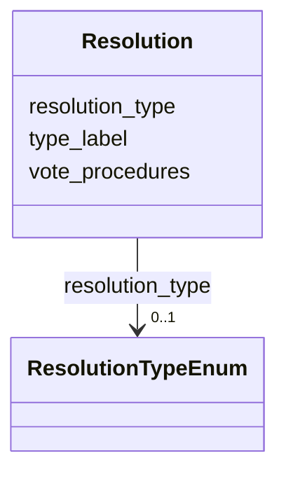

# Class: Resolution 


_[en] A resolutionor decision taken on an agenda item, including voting procedures._

_[de] Eine Resolution oder Entscheidung zu einem Traktandum, einschließlich Abstimmungsverfahren._

__


URI: [ops:Resolution](https://ch.paf.link/schema/operations/Resolution)





<!-- no inheritance hierarchy -->


## Slots

| Name | Cardinality and Range | Description | Inheritance |
| ---  | --- | --- | --- |
| [resolution_type](resolution_type.md) | 0..1 <br/> [ResolutionTypeEnum](ResolutionTypeEnum.md) | [en] Type of resolutiontaken on the agenda item | direct |
| [type_label](type_label.md) | 0..1 <br/> [String](String.md) | [en] Custom type label when standard type values don't apply | direct |
| [vote_procedures](vote_procedures.md) | * <br/> [String](String.md) | [en] Procedures for voting, such as secret ballot or open vote | direct |


## Usages

| used by | used in | type | used |
| ---  | --- | --- | --- |
| [Container](Container.md) | [resolutions](resolutions.md) | range | [Resolution](Resolution.md) |
| [AgendaItem](AgendaItem.md) | [resolution](resolution.md) | range | [Resolution](Resolution.md) |


## Identifier and Mapping Information


### Schema Source


* from schema: https://ch.paf.link/schema/operations


## Mappings

| Mapping Type | Mapped Value |
| ---  | ---  |
| self | ops:Resolution |
| native | ops:Resolution |


## LinkML Source

<!-- TODO: investigate https://stackoverflow.com/questions/37606292/how-to-create-tabbed-code-blocks-in-mkdocs-or-sphinx -->

### Direct

<details>
```yaml
name: Resolution
description: '[en] A resolutionor decision taken on an agenda item, including voting
  procedures.

  [de] Eine Resolution oder Entscheidung zu einem Traktandum, einschließlich Abstimmungsverfahren.

  '
from_schema: https://ch.paf.link/schema/operations
slots:
- resolution_type
- type_label
- vote_procedures

```
</details>

### Induced

<details>
```yaml
name: Resolution
description: '[en] A resolutionor decision taken on an agenda item, including voting
  procedures.

  [de] Eine Resolution oder Entscheidung zu einem Traktandum, einschließlich Abstimmungsverfahren.

  '
from_schema: https://ch.paf.link/schema/operations
attributes:
  resolution_type:
    name: resolution_type
    description: '[en] Type of resolutiontaken on the agenda item.

      [de] Art der Resolution zum Traktandum.

      '
    from_schema: https://ch.paf.link/schema/operations
    rank: 1000
    alias: resolution_type
    owner: Resolution
    domain_of:
    - Resolution
    range: resolution_type_enum
  type_label:
    name: type_label
    description: '[en] Custom type label when standard type values don''t apply.

      [de] Benutzerdefinierte Typbezeichnung, wenn Standardtypwerte nicht zutreffen.

      '
    from_schema: https://ch.paf.link/schema/operations
    rank: 1000
    alias: type_label
    owner: Resolution
    domain_of:
    - Resolution
    - Voting
    - IndividualVote
    - Election
    range: string
  vote_procedures:
    name: vote_procedures
    description: '[en] Procedures for voting, such as secret ballot or open vote.

      [de] Verfahren für die Abstimmung, wie geheime Abstimmung oder offene Abstimmung.

      '
    from_schema: https://ch.paf.link/schema/operations
    rank: 1000
    alias: vote_procedures
    owner: Resolution
    domain_of:
    - Resolution
    range: string
    multivalued: true
    inlined: true
    inlined_as_list: true

```
</details>