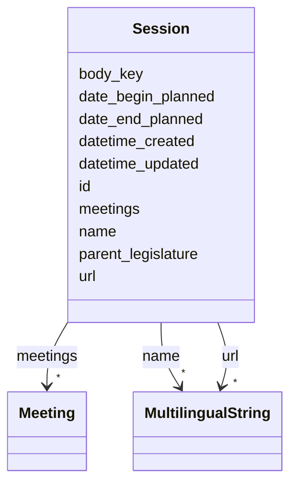

# Class: Session 


_[en] A parliamentary session that groups multiple meetings and spans a specific time period._

_[de] Eine Parlamentssession, die mehrere Sitzungen gruppiert und sich über einen bestimmten Zeitraum erstreckt._

__


URI: [ops:Session](https://ch.paf.link/schema/operations/Session)





<!-- no inheritance hierarchy -->


## Slots

| Name | Cardinality and Range | Description | Inheritance |
| ---  | --- | --- | --- |
| [id](id.md) | 1 <br/> [String](String.md) |  | direct |
| [body_key](body_key.md) | 0..1 <br/> [String](String.md) | [en] Key identifying the political body or jurisdiction (e | direct |
| [name](name.md) | * <br/> [MultilingualString](MultilingualString.md) |  | direct |
| [url](url.md) | * <br/> [MultilingualString](MultilingualString.md) |  | direct |
| [date_begin_planned](date_begin_planned.md) | 0..1 <br/> [Date](Date.md) | [en] Planned start date of the meeting or session | direct |
| [date_end_planned](date_end_planned.md) | 0..1 <br/> [Date](Date.md) | [en] Planned end date of the meeting or session | direct |
| [parent_legislature](parent_legislature.md) | 0..1 <br/> [String](String.md) | [en] The legislative body in which the meeting is based | direct |
| [meetings](meetings.md) | * <br/> [Meeting](Meeting.md) |  | direct |
| [datetime_updated](datetime_updated.md) | 0..1 <br/> [Datetime](Datetime.md) | The last time this record was updated | direct |
| [datetime_created](datetime_created.md) | 0..1 <br/> [Datetime](Datetime.md) | The time this record was created | direct |


## Usages

| used by | used in | type | used |
| ---  | --- | --- | --- |
| [Container](Container.md) | [sessions](sessions.md) | range | [Session](Session.md) |


## Identifier and Mapping Information


### Schema Source


* from schema: https://ch.paf.link/schema/operations


## Mappings

| Mapping Type | Mapped Value |
| ---  | ---  |
| self | ops:Session |
| native | ops:Session |


## LinkML Source

<!-- TODO: investigate https://stackoverflow.com/questions/37606292/how-to-create-tabbed-code-blocks-in-mkdocs-or-sphinx -->

### Direct

<details>
```yaml
name: Session
description: '[en] A parliamentary session that groups multiple meetings and spans
  a specific time period.

  [de] Eine Parlamentssession, die mehrere Sitzungen gruppiert und sich über einen
  bestimmten Zeitraum erstreckt.

  '
from_schema: https://ch.paf.link/schema/operations
slots:
- id
- body_key
- name
- url
- date_begin_planned
- date_end_planned
- parent_legislature
- meetings
- datetime_updated
- datetime_created

```
</details>

### Induced

<details>
```yaml
name: Session
description: '[en] A parliamentary session that groups multiple meetings and spans
  a specific time period.

  [de] Eine Parlamentssession, die mehrere Sitzungen gruppiert und sich über einen
  bestimmten Zeitraum erstreckt.

  '
from_schema: https://ch.paf.link/schema/operations
attributes:
  id:
    name: id
    from_schema: https://ch.paf.link/schema/operations
    rank: 1000
    slot_uri: dcterm:identifier
    identifier: true
    alias: id
    owner: Session
    domain_of:
    - Container
    - Legislature
    - Session
    - Meeting
    - AgendaItem
    - Voting
    - IndividualVote
    - Election
    - Attendance
    - IndividualAttendance
    - Speech
    - TextSegment
    - Motion
    - Media
    range: string
    required: true
  body_key:
    name: body_key
    description: '[en] Key identifying the political body or jurisdiction (e.g., BE
      for Bern, CHE for Switzerland).

      [de] Schlüssel zur Identifizierung des politischen Organs oder der Gerichtsbarkeit
      (z.B. BE für Bern, CHE für Schweiz).

      '
    from_schema: https://ch.paf.link/schema/operations
    rank: 1000
    alias: body_key
    owner: Session
    domain_of:
    - Session
    - Meeting
    range: string
  name:
    name: name
    from_schema: https://ch.paf.link/schema/operations
    rank: 1000
    alias: name
    owner: Session
    domain_of:
    - Legislature
    - Session
    - Meeting
    range: MultilingualString
    multivalued: true
    inlined: true
    inlined_as_list: true
  url:
    name: url
    from_schema: https://ch.paf.link/schema/operations
    rank: 1000
    alias: url
    owner: Session
    domain_of:
    - Session
    - Meeting
    - Media
    range: MultilingualString
    multivalued: true
    inlined: true
    inlined_as_list: true
  date_begin_planned:
    name: date_begin_planned
    description: '[en] Planned start date of the meeting or session.

      [de] Geplantes Startdatum der Sitzung oder Session.

      '
    from_schema: https://ch.paf.link/schema/operations
    rank: 1000
    alias: date_begin_planned
    owner: Session
    domain_of:
    - Session
    - Meeting
    range: date
  date_end_planned:
    name: date_end_planned
    description: '[en] Planned end date of the meeting or session.

      [de] Geplantes Enddatum der Sitzung oder Session.

      '
    from_schema: https://ch.paf.link/schema/operations
    rank: 1000
    alias: date_end_planned
    owner: Session
    domain_of:
    - Session
    - Meeting
    range: date
  parent_legislature:
    name: parent_legislature
    description: '[en] The legislative body in which the meeting is based.

      [de] Der gesetzgebende Körper, auf dem die Sitzung basiert.

      '
    from_schema: https://ch.paf.link/schema/operations
    rank: 1000
    alias: parent_legislature
    owner: Session
    domain_of:
    - Session
    - Meeting
    range: string
  meetings:
    name: meetings
    from_schema: https://ch.paf.link/schema/operations
    rank: 1000
    slot_uri: ops:meeting
    alias: meetings
    owner: Session
    domain_of:
    - Container
    - Session
    range: Meeting
    multivalued: true
    inlined: true
    inlined_as_list: true
  datetime_updated:
    name: datetime_updated
    description: The last time this record was updated
    from_schema: https://ch.paf.link/schema/operations
    rank: 1000
    alias: datetime_updated
    owner: Session
    domain_of:
    - Legislature
    - Session
    - Meeting
    - AgendaItem
    - Voting
    - IndividualVote
    - Election
    - Attendance
    - IndividualAttendance
    - Speech
    range: datetime
  datetime_created:
    name: datetime_created
    description: The time this record was created
    from_schema: https://ch.paf.link/schema/operations
    rank: 1000
    alias: datetime_created
    owner: Session
    domain_of:
    - Legislature
    - Session
    - Meeting
    - AgendaItem
    - Voting
    - IndividualVote
    - Election
    - Attendance
    - IndividualAttendance
    - Speech
    range: datetime

```
</details>