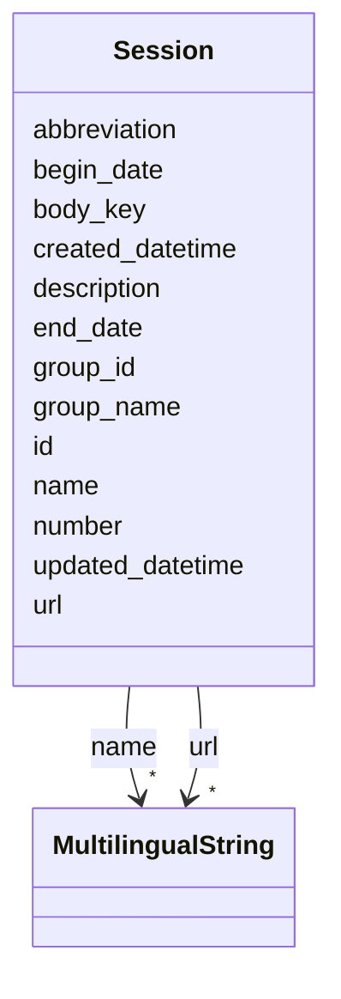

# Class: Session 


URI: [ops:Session](https://ch.paf.link/schema/operations/Session)





<!-- no inheritance hierarchy -->


## Slots

| Name | Cardinality and Range | Description | Inheritance |
| ---  | --- | --- | --- |
| [id](id.md) | 1 <br/> [String](String.md) |  | direct |
| [body_key](body_key.md) | 0..1 <br/> [String](String.md) |  | direct |
| [name](name.md) | * <br/> [MultilingualString](MultilingualString.md) |  | direct |
| [url](url.md) | * <br/> [MultilingualString](MultilingualString.md) |  | direct |
| [description](description.md) | 0..1 <br/> [String](String.md) |  | direct |
| [group_name](group_name.md) | 0..1 <br/> [String](String.md) |  | direct |
| [group_id](group_id.md) | 0..1 <br/> [String](String.md) |  | direct |
| [number](number.md) | 0..1 <br/> [String](String.md) |  | direct |
| [abbreviation](abbreviation.md) | 0..1 <br/> [String](String.md) |  | direct |
| [begin_date](begin_date.md) | 0..1 <br/> [Date](Date.md) |  | direct |
| [end_date](end_date.md) | 0..1 <br/> [Date](Date.md) |  | direct |
| [updated_datetime](updated_datetime.md) | 0..1 <br/> [Datetime](Datetime.md) | The last time this record was updated | direct |
| [created_datetime](created_datetime.md) | 0..1 <br/> [Datetime](Datetime.md) | The time this record was created | direct |


## Usages

| used by | used in | type | used |
| ---  | --- | --- | --- |
| [Container](Container.md) | [sessions](sessions.md) | range | [Session](Session.md) |


## Identifier and Mapping Information


### Schema Source


* from schema: https://ch.paf.link/schema/operations


## Mappings

| Mapping Type | Mapped Value |
| ---  | ---  |
| self | ops:Session |
| native | ops:Session |


## LinkML Source

<!-- TODO: investigate https://stackoverflow.com/questions/37606292/how-to-create-tabbed-code-blocks-in-mkdocs-or-sphinx -->

### Direct

<details>
```yaml
name: Session
from_schema: https://ch.paf.link/schema/operations
slots:
- id
- body_key
- name
- url
- description
- group_name
- group_id
- number
- abbreviation
- begin_date
- end_date
- updated_datetime
- created_datetime

```
</details>

### Induced

<details>
```yaml
name: Session
from_schema: https://ch.paf.link/schema/operations
attributes:
  id:
    name: id
    from_schema: https://ch.paf.link/schema/operations
    rank: 1000
    slot_uri: dcterm:identifier
    identifier: true
    alias: id
    owner: Session
    domain_of:
    - Container
    - Legislature
    - Session
    - Meeting
    - MeetingItem
    range: string
    required: true
  body_key:
    name: body_key
    from_schema: https://ch.paf.link/schema/operations
    rank: 1000
    alias: body_key
    owner: Session
    domain_of:
    - Legislature
    - Session
    - Meeting
    range: string
  name:
    name: name
    from_schema: https://ch.paf.link/schema/operations
    rank: 1000
    alias: name
    owner: Session
    domain_of:
    - Legislature
    - Session
    - Meeting
    range: MultilingualString
    multivalued: true
    inlined: true
    inlined_as_list: true
  url:
    name: url
    from_schema: https://ch.paf.link/schema/operations
    rank: 1000
    alias: url
    owner: Session
    domain_of:
    - Legislature
    - Session
    - Meeting
    - MeetingItem
    range: MultilingualString
    multivalued: true
    inlined: true
    inlined_as_list: true
  description:
    name: description
    from_schema: https://ch.paf.link/schema/operations
    rank: 1000
    alias: description
    owner: Session
    domain_of:
    - Legislature
    - Session
    - Meeting
    - MeetingItem
    range: string
  group_name:
    name: group_name
    from_schema: https://ch.paf.link/schema/operations
    rank: 1000
    alias: group_name
    owner: Session
    domain_of:
    - Legislature
    - Session
    - Meeting
    range: string
  group_id:
    name: group_id
    from_schema: https://ch.paf.link/schema/operations
    rank: 1000
    alias: group_id
    owner: Session
    domain_of:
    - Legislature
    - Session
    - Meeting
    range: string
  number:
    name: number
    from_schema: https://ch.paf.link/schema/operations
    rank: 1000
    alias: number
    owner: Session
    domain_of:
    - Session
    - Meeting
    - MeetingItem
    range: string
  abbreviation:
    name: abbreviation
    from_schema: https://ch.paf.link/schema/operations
    rank: 1000
    alias: abbreviation
    owner: Session
    domain_of:
    - Session
    - Meeting
    range: string
  begin_date:
    name: begin_date
    from_schema: https://ch.paf.link/schema/operations
    rank: 1000
    alias: begin_date
    owner: Session
    domain_of:
    - Legislature
    - Session
    - Meeting
    range: date
  end_date:
    name: end_date
    from_schema: https://ch.paf.link/schema/operations
    rank: 1000
    alias: end_date
    owner: Session
    domain_of:
    - Legislature
    - Session
    - Meeting
    range: date
  updated_datetime:
    name: updated_datetime
    description: The last time this record was updated
    from_schema: https://ch.paf.link/schema/operations
    rank: 1000
    alias: updated_datetime
    owner: Session
    domain_of:
    - Legislature
    - Session
    - Meeting
    - MeetingItem
    range: datetime
  created_datetime:
    name: created_datetime
    description: The time this record was created
    from_schema: https://ch.paf.link/schema/operations
    rank: 1000
    alias: created_datetime
    owner: Session
    domain_of:
    - Legislature
    - Session
    - Meeting
    - MeetingItem
    range: datetime

```
</details>