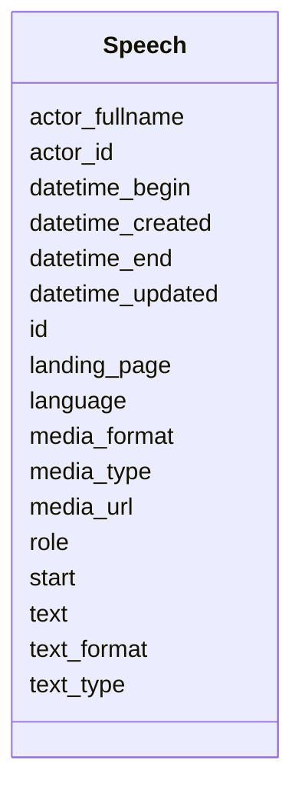

# Class: Speech 


_[en] A speech or statement made during a meeting (also called Votum or speaker segment)._

_[de] Eine Wortmeldung während einer Sitzung (auch Votum oder Redebeitrag genannt)._

__


URI: [ops:Speech](https://ch.paf.link/schema/operations/Speech)





<!-- no inheritance hierarchy -->


## Slots

| Name | Cardinality and Range | Description | Inheritance |
| ---  | --- | --- | --- |
| [id](id.md) | 1 <br/> [String](String.md) |  | direct |
| [language](language.md) | 1 <br/> [String](String.md) | Language code in ISO 639-1 format | direct |
| [start](start.md) | 0..1 <br/> [String](String.md) | Start indicator or position | direct |
| [datetime_begin](datetime_begin.md) | 0..1 <br/> [Datetime](Datetime.md) | [en] The date and time when the meeting or voting begins | direct |
| [datetime_end](datetime_end.md) | 0..1 <br/> [Datetime](Datetime.md) | [en] The date and time when the meeting or voting ends | direct |
| [actor_fullname](actor_fullname.md) | 0..1 <br/> [String](String.md) | Full name of the actor/person | direct |
| [actor_id](actor_id.md) | 0..1 <br/> [String](String.md) | [en] The political body organized by the term of office (e | direct |
| [role](role.md) | 0..1 <br/> [String](String.md) | Role of the person (e | direct |
| [text](text.md) | 1 <br/> [String](String.md) |  | direct |
| [text_format](text_format.md) | 0..1 <br/> [String](String.md) | [en] Format of text (text, html, html_with_timestamps) | direct |
| [text_type](text_type.md) | 0..1 <br/> [String](String.md) | [en] Type of text (raw draft, edited version) | direct |
| [landing_page](landing_page.md) | 0..1 <br/> [String](String.md) | [en] URL providing further information | direct |
| [media_url](media_url.md) | 0..1 <br/> [String](String.md) | URL to media file (audio/video) | direct |
| [media_type](media_type.md) | 0..1 <br/> [String](String.md) | Type of media (audio, video, document) | direct |
| [media_format](media_format.md) | 0..1 <br/> [String](String.md) | MIME type of the media file | direct |
| [datetime_updated](datetime_updated.md) | 0..1 <br/> [Datetime](Datetime.md) | The last time this record was updated | direct |
| [datetime_created](datetime_created.md) | 0..1 <br/> [Datetime](Datetime.md) | The time this record was created | direct |


## Usages

| used by | used in | type | used |
| ---  | --- | --- | --- |
| [Container](Container.md) | [speeches](speeches.md) | range | [Speech](Speech.md) |


## Identifier and Mapping Information


### Schema Source


* from schema: https://ch.paf.link/schema/operations


## Mappings

| Mapping Type | Mapped Value |
| ---  | ---  |
| self | ops:Speech |
| native | ops:Speech |


## LinkML Source

<!-- TODO: investigate https://stackoverflow.com/questions/37606292/how-to-create-tabbed-code-blocks-in-mkdocs-or-sphinx -->

### Direct

<details>
```yaml
name: Speech
description: '[en] A speech or statement made during a meeting (also called Votum
  or speaker segment).

  [de] Eine Wortmeldung während einer Sitzung (auch Votum oder Redebeitrag genannt).

  '
from_schema: https://ch.paf.link/schema/operations
slots:
- id
- language
- start
- datetime_begin
- datetime_end
- actor_fullname
- actor_id
- role
- text
- text_format
- text_type
- landing_page
- media_url
- media_type
- media_format
- datetime_updated
- datetime_created

```
</details>

### Induced

<details>
```yaml
name: Speech
description: '[en] A speech or statement made during a meeting (also called Votum
  or speaker segment).

  [de] Eine Wortmeldung während einer Sitzung (auch Votum oder Redebeitrag genannt).

  '
from_schema: https://ch.paf.link/schema/operations
attributes:
  id:
    name: id
    from_schema: https://ch.paf.link/schema/operations
    rank: 1000
    slot_uri: dcterm:identifier
    identifier: true
    alias: id
    owner: Speech
    domain_of:
    - Container
    - Legislature
    - Session
    - Meeting
    - AgendaItem
    - Voting
    - IndividualVote
    - Election
    - Attendance
    - IndividualAttendance
    - Speech
    - TextSegment
    - Motion
    - Media
    range: string
    required: true
  language:
    name: language
    description: Language code in ISO 639-1 format
    from_schema: https://ch.paf.link/schema/operations
    rank: 1000
    alias: language
    owner: Speech
    domain_of:
    - Speech
    - MultilingualString
    range: string
    required: true
    pattern: ^[a-z]{2}$
  start:
    name: start
    description: Start indicator or position
    from_schema: https://ch.paf.link/schema/operations
    rank: 1000
    alias: start
    owner: Speech
    domain_of:
    - Speech
    range: string
  datetime_begin:
    name: datetime_begin
    description: '[en] The date and time when the meeting or voting begins.

      [de] Das Datum und die Uhrzeit, zu der die Sitzung oder Abstimmung beginnt.

      '
    from_schema: https://ch.paf.link/schema/operations
    rank: 1000
    alias: datetime_begin
    owner: Speech
    domain_of:
    - Voting
    - Election
    - Attendance
    - Speech
    range: datetime
  datetime_end:
    name: datetime_end
    description: '[en] The date and time when the meeting or voting ends.

      [de] Das Datum und die Uhrzeit, zu der die Sitzung oder Abstimmung endet.

      '
    from_schema: https://ch.paf.link/schema/operations
    rank: 1000
    alias: datetime_end
    owner: Speech
    domain_of:
    - Voting
    - Election
    - Speech
    range: datetime
  actor_fullname:
    name: actor_fullname
    description: Full name of the actor/person
    from_schema: https://ch.paf.link/schema/operations
    rank: 1000
    alias: actor_fullname
    owner: Speech
    domain_of:
    - Speech
    range: string
  actor_id:
    name: actor_id
    description: '[en] The political body organized by the term of office (e.g., Regierungsrat,
      Nationalrat, Ständerat).

      [de] Das politische Organ, das durch die Amtsdauer organisiert wird (z.B. Regierungsrat,
      Nationalrat, Ständerat).

      '
    from_schema: https://ch.paf.link/schema/operations
    rank: 1000
    alias: actor_id
    owner: Speech
    domain_of:
    - Legislature
    - Meeting
    - Voting
    - IndividualVote
    - Election
    - Attendance
    - IndividualAttendance
    - Speech
    range: string
  role:
    name: role
    description: Role of the person (e.g., commission speaker)
    from_schema: https://ch.paf.link/schema/operations
    rank: 1000
    alias: role
    owner: Speech
    domain_of:
    - Speech
    range: string
  text:
    name: text
    from_schema: https://ch.paf.link/schema/operations
    rank: 1000
    alias: text
    owner: Speech
    domain_of:
    - Speech
    - TextSegment
    - MultilingualString
    range: string
    required: true
  text_format:
    name: text_format
    description: '[en] Format of text (text, html, html_with_timestamps)

      [de] Format des Textes (text, html, html_with_timestamps)

      '
    from_schema: https://ch.paf.link/schema/operations
    rank: 1000
    alias: text_format
    owner: Speech
    domain_of:
    - Speech
    range: string
  text_type:
    name: text_type
    description: '[en] Type of text (raw draft, edited version)

      [de] Typ des Textes (Rohfassung, bearbeitete Fassung)

      '
    from_schema: https://ch.paf.link/schema/operations
    rank: 1000
    alias: text_type
    owner: Speech
    domain_of:
    - Speech
    range: string
  landing_page:
    name: landing_page
    description: '[en] URL providing further information.

      [de] URL mit weiteren Informationen.

      '
    from_schema: https://ch.paf.link/schema/operations
    rank: 1000
    slot_uri: ops:landingPage
    alias: landing_page
    owner: Speech
    domain_of:
    - Legislature
    - Meeting
    - AgendaItem
    - Voting
    - Election
    - Speech
    range: string
  media_url:
    name: media_url
    description: URL to media file (audio/video)
    from_schema: https://ch.paf.link/schema/operations
    rank: 1000
    alias: media_url
    owner: Speech
    domain_of:
    - Speech
    range: string
  media_type:
    name: media_type
    description: Type of media (audio, video, document)
    from_schema: https://ch.paf.link/schema/operations
    rank: 1000
    alias: media_type
    owner: Speech
    domain_of:
    - Speech
    - Media
    range: string
  media_format:
    name: media_format
    description: MIME type of the media file
    from_schema: https://ch.paf.link/schema/operations
    rank: 1000
    alias: media_format
    owner: Speech
    domain_of:
    - Speech
    range: string
  datetime_updated:
    name: datetime_updated
    description: The last time this record was updated
    from_schema: https://ch.paf.link/schema/operations
    rank: 1000
    alias: datetime_updated
    owner: Speech
    domain_of:
    - Legislature
    - Session
    - Meeting
    - AgendaItem
    - Voting
    - IndividualVote
    - Election
    - Attendance
    - IndividualAttendance
    - Speech
    range: datetime
  datetime_created:
    name: datetime_created
    description: The time this record was created
    from_schema: https://ch.paf.link/schema/operations
    rank: 1000
    alias: datetime_created
    owner: Speech
    domain_of:
    - Legislature
    - Session
    - Meeting
    - AgendaItem
    - Voting
    - IndividualVote
    - Election
    - Attendance
    - IndividualAttendance
    - Speech
    range: datetime

```
</details>