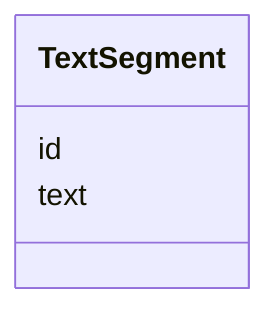

# Class: TextSegment 


_[en] A text segment such as cross-references or subtitles in meeting protocols._

_[de] Ein Textsegment wie Querverweise oder Zwischentitel in Sitzungsprotokollen._

__


URI: [ops:TextSegment](https://ch.paf.link/schema/operations/TextSegment)





<!-- no inheritance hierarchy -->


## Slots

| Name | Cardinality and Range | Description | Inheritance |
| ---  | --- | --- | --- |
| [id](id.md) | 1 <br/> [String](String.md) |  | direct |
| [text](text.md) | 1 <br/> [String](String.md) |  | direct |


## Identifier and Mapping Information


### Schema Source


* from schema: https://ch.paf.link/schema/operations


## Mappings

| Mapping Type | Mapped Value |
| ---  | ---  |
| self | ops:TextSegment |
| native | ops:TextSegment |


## LinkML Source

<!-- TODO: investigate https://stackoverflow.com/questions/37606292/how-to-create-tabbed-code-blocks-in-mkdocs-or-sphinx -->

### Direct

<details>
```yaml
name: TextSegment
description: '[en] A text segment such as cross-references or subtitles in meeting
  protocols.

  [de] Ein Textsegment wie Querverweise oder Zwischentitel in Sitzungsprotokollen.

  '
from_schema: https://ch.paf.link/schema/operations
slots:
- id
- text

```
</details>

### Induced

<details>
```yaml
name: TextSegment
description: '[en] A text segment such as cross-references or subtitles in meeting
  protocols.

  [de] Ein Textsegment wie Querverweise oder Zwischentitel in Sitzungsprotokollen.

  '
from_schema: https://ch.paf.link/schema/operations
attributes:
  id:
    name: id
    from_schema: https://ch.paf.link/schema/operations
    rank: 1000
    slot_uri: dcterm:identifier
    identifier: true
    alias: id
    owner: TextSegment
    domain_of:
    - Container
    - Legislature
    - Session
    - Meeting
    - AgendaItem
    - Voting
    - IndividualVote
    - Election
    - Attendance
    - IndividualAttendance
    - Speech
    - TextSegment
    - Motion
    - Media
    range: string
    required: true
  text:
    name: text
    from_schema: https://ch.paf.link/schema/operations
    rank: 1000
    alias: text
    owner: TextSegment
    domain_of:
    - Speech
    - TextSegment
    - MultilingualString
    range: string
    required: true

```
</details>