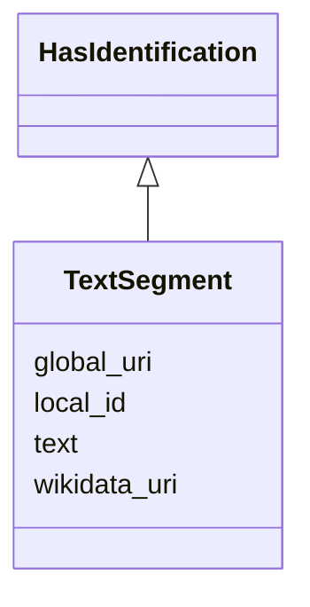

# Class: TextSegment 


_[en] A text segment such as cross-references or subtitles in meeting protocols._

_[de] Ein Textsegment wie Querverweise oder Zwischentitel in Sitzungsprotokollen._

__


URI: [ops:TextSegment](https://ch.paf.link/schema/operations/TextSegment)



```mermaid
 classDiagram
    class TextSegment
    click TextSegment href "../TextSegment/"
      HasIdentification <|-- TextSegment
        click HasIdentification href "../HasIdentification/"
      
      TextSegment : global_uri
        
      TextSegment : local_id
        
      TextSegment : text
        
      TextSegment : wikidata_uri
        
      
```


## Inheritance
* **TextSegment** [ [HasIdentification](HasIdentification.md)]


## Slots

| Name | Cardinality and Range | Description | Inheritance |
| ---  | --- | --- | --- |
| [text](text.md) | 1 <br/> [String](String.md) |  | direct |
| [local_id](local_id.md) | 0..1 <br/> [String](String.md) | [de] Lokaler Identifikator | [HasIdentification](HasIdentification.md) |
| [global_uri](global_uri.md) | 1 <br/> [Uriorcurie](Uriorcurie.md) | [de] Eine eindeutige, global gültige URI für die Entität | [HasIdentification](HasIdentification.md) |
| [wikidata_uri](wikidata_uri.md) | 0..1 <br/> [Uriorcurie](Uriorcurie.md) | [de] Eine URI, die auf eine Wikidata-Entität verweist, z | [HasIdentification](HasIdentification.md) |


## Identifier and Mapping Information


### Schema Source


* from schema: https://ch.paf.link/schema/operations


## Mappings

| Mapping Type | Mapped Value |
| ---  | ---  |
| self | ops:TextSegment |
| native | ops:TextSegment |


## LinkML Source

<!-- TODO: investigate https://stackoverflow.com/questions/37606292/how-to-create-tabbed-code-blocks-in-mkdocs-or-sphinx -->

### Direct

<details>
```yaml
name: TextSegment
description: '[en] A text segment such as cross-references or subtitles in meeting
  protocols.

  [de] Ein Textsegment wie Querverweise oder Zwischentitel in Sitzungsprotokollen.

  '
from_schema: https://ch.paf.link/schema/operations
mixins:
- HasIdentification
slots:
- text

```
</details>

### Induced

<details>
```yaml
name: TextSegment
description: '[en] A text segment such as cross-references or subtitles in meeting
  protocols.

  [de] Ein Textsegment wie Querverweise oder Zwischentitel in Sitzungsprotokollen.

  '
from_schema: https://ch.paf.link/schema/operations
mixins:
- HasIdentification
attributes:
  text:
    name: text
    from_schema: https://ch.paf.link/schema/operations
    rank: 1000
    alias: text
    owner: TextSegment
    domain_of:
    - Speech
    - TextSegment
    - MultilingualString
    range: string
    required: true
  local_id:
    name: local_id
    description: '[de] Lokaler Identifikator. Bspw. eine UUID aus dem Ratsinformationssystem.

      [en] Local identifier. For example, a UUID from the council information system.

      '
    from_schema: https://ch.paf.link/schema/operations
    rank: 1000
    slot_uri: mcm:localId
    alias: local_id
    owner: TextSegment
    domain_of:
    - HasIdentification
    range: string
  global_uri:
    name: global_uri
    description: '[de] Eine eindeutige, global gültige URI für die Entität.

      [en] A unique, globally valid URI for the entity.

      '
    from_schema: https://ch.paf.link/schema/operations
    rank: 1000
    slot_uri: mcm:globalURI
    identifier: true
    alias: global_uri
    owner: TextSegment
    domain_of:
    - HasIdentification
    range: uriorcurie
    required: true
  wikidata_uri:
    name: wikidata_uri
    description: '[de] Eine URI, die auf eine Wikidata-Entität verweist, z.B. https://www.wikidata.org/wiki/Q39
      für die Schweiz.

      [en] A URI that refers to a Wikidata entity, e.g. https://www.wikidata.org/wiki/Q39
      for Switzerland.

      '
    from_schema: https://ch.paf.link/schema/operations
    rank: 1000
    slot_uri: mcm:wikidataUri
    alias: wikidata_uri
    owner: TextSegment
    domain_of:
    - HasIdentification
    range: uriorcurie

```
</details>