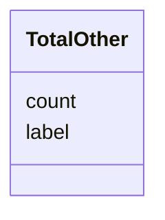

# Class: TotalOther 


_[en] Additional vote counts when multiple options are presented (e.g., Zurich uses 5 buttons)._

_[de] Zusätzliche Stimmzahlen, wenn mehrere Optionen zur Abstimmung gestellt werden (z.B. Zürich verwendet 5 Knöpfe)._

__


URI: [ops:TotalOther](https://ch.paf.link/schema/operations/TotalOther)





<!-- no inheritance hierarchy -->


## Slots

| Name | Cardinality and Range | Description | Inheritance |
| ---  | --- | --- | --- |
| [count](count.md) | 0..1 <br/> [Integer](Integer.md) | [en] The count of votes for the total other category | direct |
| [label](label.md) | 0..1 <br/> [String](String.md) | [en] The label or meaning of the vote in the total other category | direct |


## Usages

| used by | used in | type | used |
| ---  | --- | --- | --- |
| [Voting](Voting.md) | [total_other](total_other.md) | range | [TotalOther](TotalOther.md) |


## Identifier and Mapping Information


### Schema Source


* from schema: https://ch.paf.link/schema/operations


## Mappings

| Mapping Type | Mapped Value |
| ---  | ---  |
| self | ops:TotalOther |
| native | ops:TotalOther |


## LinkML Source

<!-- TODO: investigate https://stackoverflow.com/questions/37606292/how-to-create-tabbed-code-blocks-in-mkdocs-or-sphinx -->

### Direct

<details>
```yaml
name: TotalOther
description: '[en] Additional vote counts when multiple options are presented (e.g.,
  Zurich uses 5 buttons).

  [de] Zusätzliche Stimmzahlen, wenn mehrere Optionen zur Abstimmung gestellt werden
  (z.B. Zürich verwendet 5 Knöpfe).

  '
from_schema: https://ch.paf.link/schema/operations
slots:
- count
- label

```
</details>

### Induced

<details>
```yaml
name: TotalOther
description: '[en] Additional vote counts when multiple options are presented (e.g.,
  Zurich uses 5 buttons).

  [de] Zusätzliche Stimmzahlen, wenn mehrere Optionen zur Abstimmung gestellt werden
  (z.B. Zürich verwendet 5 Knöpfe).

  '
from_schema: https://ch.paf.link/schema/operations
attributes:
  count:
    name: count
    description: '[en] The count of votes for the total other category.

      [de] Die Anzahl der Stimmen für die Kategorie "Andere".

      '
    from_schema: https://ch.paf.link/schema/operations
    rank: 1000
    alias: count
    owner: TotalOther
    domain_of:
    - TotalOther
    range: integer
  label:
    name: label
    description: '[en] The label or meaning of the vote in the total other category.

      [de] Das Etikett oder die Bedeutung der Stimme in der Kategorie "Andere".

      '
    from_schema: https://ch.paf.link/schema/operations
    rank: 1000
    alias: label
    owner: TotalOther
    domain_of:
    - TotalOther
    range: string

```
</details>