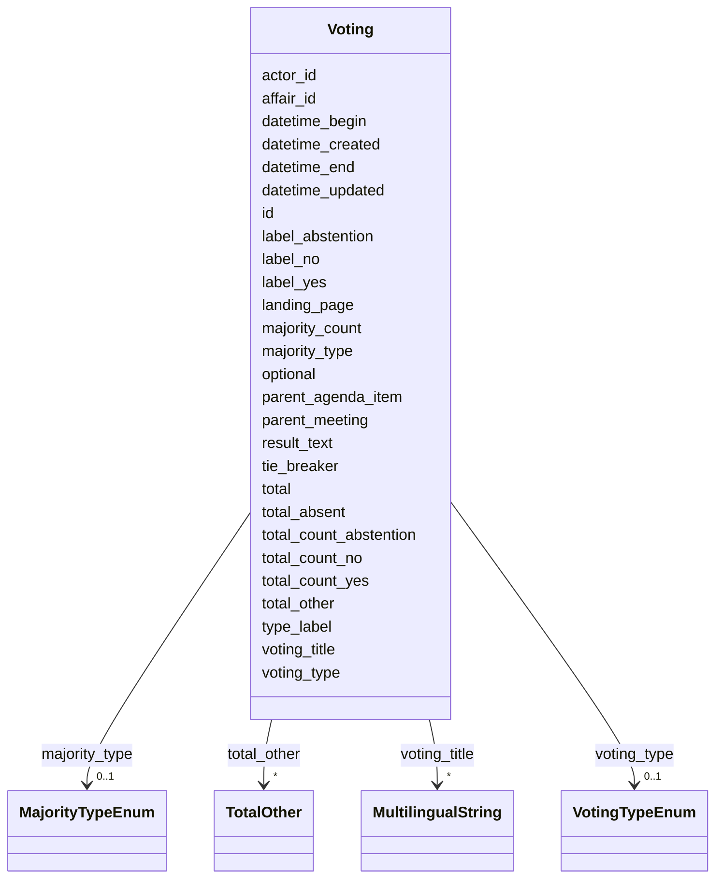

# Class: Voting 


_[en] A voting procedure with individual votes and results._

_[de] Ein Abstimmungsverfahren mit Einzelstimmen und Ergebnissen._

__


URI: [ops:Voting](https://ch.paf.link/schema/operations/Voting)





<!-- no inheritance hierarchy -->


## Slots

| Name | Cardinality and Range | Description | Inheritance |
| ---  | --- | --- | --- |
| [id](id.md) | 1 <br/> [String](String.md) |  | direct |
| [datetime_begin](datetime_begin.md) | 0..1 <br/> [Datetime](Datetime.md) | [en] The date and time when the meeting or voting begins | direct |
| [datetime_end](datetime_end.md) | 0..1 <br/> [Datetime](Datetime.md) | [en] The date and time when the meeting or voting ends | direct |
| [voting_type](voting_type.md) | 0..1 <br/> [VotingTypeEnum](VotingTypeEnum.md) | [en] Type of voting procedure (preliminary, final, secret, etc | direct |
| [type_label](type_label.md) | 0..1 <br/> [String](String.md) | [en] Custom type label when standard type values don't apply | direct |
| [voting_title](voting_title.md) | * <br/> [MultilingualString](MultilingualString.md) | [en] Title or question being voted on | direct |
| [optional](optional.md) | 0..1 <br/> [Boolean](Boolean.md) | [en] Indicates if the meeting or voting is optional | direct |
| [landing_page](landing_page.md) | 0..1 <br/> [String](String.md) | [en] URL providing further information | direct |
| [label_yes](label_yes.md) | 0..1 <br/> [String](String.md) | [en] Meaning of a 'yes' vote | direct |
| [label_no](label_no.md) | 0..1 <br/> [String](String.md) | [en] Meaning of a 'no' vote | direct |
| [label_abstention](label_abstention.md) | 0..1 <br/> [String](String.md) | [en] Meaning of an 'abstention' vote | direct |
| [tie_breaker](tie_breaker.md) | 0..1 <br/> [Boolean](Boolean.md) | [en] Indicates if a tie-breaker was used in the voting | direct |
| [total_count_yes](total_count_yes.md) | 0..1 <br/> [Integer](Integer.md) | [en] Total number of 'yes' votes | direct |
| [total_count_no](total_count_no.md) | 0..1 <br/> [Integer](Integer.md) | [en] Total number of 'no' votes | direct |
| [total_count_abstention](total_count_abstention.md) | 0..1 <br/> [Integer](Integer.md) | [en] Total number of abstentions | direct |
| [total_other](total_other.md) | * <br/> [TotalOther](TotalOther.md) | [en] Used when multiple options are presented for voting (e | direct |
| [total_absent](total_absent.md) | 0..1 <br/> [Integer](Integer.md) | [en] Total number of absent members | direct |
| [total](total.md) | 0..1 <br/> [Integer](Integer.md) | [en] Total number of votes, excluding absent and president's vote | direct |
| [majority_type](majority_type.md) | 0..1 <br/> [MajorityTypeEnum](MajorityTypeEnum.md) | [en] Type of majority required for the vote (absolute, two-thirds, etc | direct |
| [majority_count](majority_count.md) | 0..1 <br/> [Integer](Integer.md) | [en] Number of votes required for the relevant majority threshold | direct |
| [result_text](result_text.md) | 0..1 <br/> [String](String.md) | [en] Free text describing the outcome of the vote, e | direct |
| [parent_meeting](parent_meeting.md) | 0..1 <br/> [String](String.md) | [en] The linked meeting ID that groups the current meeting | direct |
| [parent_agenda_item](parent_agenda_item.md) | 0..1 <br/> [String](String.md) | [en] If needed, this slot builds a hierarchy of agenda items | direct |
| [affair_id](affair_id.md) | 0..1 <br/> [String](String.md) | [en] The connection to the affairs (business items) of the agenda item | direct |
| [actor_id](actor_id.md) | 0..1 <br/> [String](String.md) | [en] The political body organized by the term of office (e | direct |
| [datetime_updated](datetime_updated.md) | 0..1 <br/> [Datetime](Datetime.md) | The last time this record was updated | direct |
| [datetime_created](datetime_created.md) | 0..1 <br/> [Datetime](Datetime.md) | The time this record was created | direct |


## Usages

| used by | used in | type | used |
| ---  | --- | --- | --- |
| [Container](Container.md) | [votings](votings.md) | range | [Voting](Voting.md) |
| [IndividualVote](IndividualVote.md) | [parent_voting](parent_voting.md) | range | [Voting](Voting.md) |
| [IndividualAttendance](IndividualAttendance.md) | [parent_voting](parent_voting.md) | range | [Voting](Voting.md) |


## Identifier and Mapping Information


### Schema Source


* from schema: https://ch.paf.link/schema/operations


## Mappings

| Mapping Type | Mapped Value |
| ---  | ---  |
| self | ops:Voting |
| native | ops:Voting |


## LinkML Source

<!-- TODO: investigate https://stackoverflow.com/questions/37606292/how-to-create-tabbed-code-blocks-in-mkdocs-or-sphinx -->

### Direct

<details>
```yaml
name: Voting
description: '[en] A voting procedure with individual votes and results.

  [de] Ein Abstimmungsverfahren mit Einzelstimmen und Ergebnissen.

  '
from_schema: https://ch.paf.link/schema/operations
slots:
- id
- datetime_begin
- datetime_end
- voting_type
- type_label
- voting_title
- optional
- landing_page
- label_yes
- label_no
- label_abstention
- tie_breaker
- total_count_yes
- total_count_no
- total_count_abstention
- total_other
- total_absent
- total
- majority_type
- majority_count
- result_text
- parent_meeting
- parent_agenda_item
- affair_id
- actor_id
- datetime_updated
- datetime_created

```
</details>

### Induced

<details>
```yaml
name: Voting
description: '[en] A voting procedure with individual votes and results.

  [de] Ein Abstimmungsverfahren mit Einzelstimmen und Ergebnissen.

  '
from_schema: https://ch.paf.link/schema/operations
attributes:
  id:
    name: id
    from_schema: https://ch.paf.link/schema/operations
    rank: 1000
    slot_uri: dcterm:identifier
    identifier: true
    alias: id
    owner: Voting
    domain_of:
    - Container
    - Legislature
    - Session
    - Meeting
    - AgendaItem
    - Voting
    - IndividualVote
    - Election
    - Attendance
    - IndividualAttendance
    - Speech
    - TextSegment
    - Motion
    - Media
    range: string
    required: true
  datetime_begin:
    name: datetime_begin
    description: '[en] The date and time when the meeting or voting begins.

      [de] Das Datum und die Uhrzeit, zu der die Sitzung oder Abstimmung beginnt.

      '
    from_schema: https://ch.paf.link/schema/operations
    rank: 1000
    alias: datetime_begin
    owner: Voting
    domain_of:
    - Voting
    - Election
    - Attendance
    - Speech
    range: datetime
  datetime_end:
    name: datetime_end
    description: '[en] The date and time when the meeting or voting ends.

      [de] Das Datum und die Uhrzeit, zu der die Sitzung oder Abstimmung endet.

      '
    from_schema: https://ch.paf.link/schema/operations
    rank: 1000
    alias: datetime_end
    owner: Voting
    domain_of:
    - Voting
    - Election
    - Speech
    range: datetime
  voting_type:
    name: voting_type
    description: '[en] Type of voting procedure (preliminary, final, secret, etc.).

      [de] Art des Abstimmungsverfahrens (Zwischen-, Schlussabstimmung, geheim, etc.).

      '
    from_schema: https://ch.paf.link/schema/operations
    rank: 1000
    alias: voting_type
    owner: Voting
    domain_of:
    - Voting
    range: voting_type_enum
  type_label:
    name: type_label
    description: '[en] Custom type label when standard type values don''t apply.

      [de] Benutzerdefinierte Typbezeichnung, wenn Standardtypwerte nicht zutreffen.

      '
    from_schema: https://ch.paf.link/schema/operations
    rank: 1000
    alias: type_label
    owner: Voting
    domain_of:
    - Resolution
    - Voting
    - IndividualVote
    - Election
    range: string
  voting_title:
    name: voting_title
    description: '[en] Title or question being voted on. If no specific subject exists,
      do not use the business item title.

      [de] Abstimmungstitel bzw. Gegenstand oder Frage. Wenn kein Gegenstand vorhanden
      ist, sollte nicht der Geschäftstitel verwendet werden.

      '
    from_schema: https://ch.paf.link/schema/operations
    rank: 1000
    alias: voting_title
    owner: Voting
    domain_of:
    - Voting
    range: MultilingualString
    multivalued: true
    inlined: true
    inlined_as_list: true
  optional:
    name: optional
    description: '[en] Indicates if the meeting or voting is optional.

      [de] Gibt an, ob die Sitzung oder Abstimmung optional ist.

      '
    from_schema: https://ch.paf.link/schema/operations
    rank: 1000
    alias: optional
    owner: Voting
    domain_of:
    - Voting
    range: boolean
  landing_page:
    name: landing_page
    description: '[en] URL providing further information.

      [de] URL mit weiteren Informationen.

      '
    from_schema: https://ch.paf.link/schema/operations
    rank: 1000
    slot_uri: ops:landingPage
    alias: landing_page
    owner: Voting
    domain_of:
    - Legislature
    - Meeting
    - AgendaItem
    - Voting
    - Election
    - Speech
    range: string
  label_yes:
    name: label_yes
    description: '[en] Meaning of a ''yes'' vote.

      [de] Bedeutung einer ''Ja''-Stimme.

      '
    from_schema: https://ch.paf.link/schema/operations
    rank: 1000
    alias: label_yes
    owner: Voting
    domain_of:
    - Voting
    range: string
  label_no:
    name: label_no
    description: '[en] Meaning of a ''no'' vote.

      [de] Bedeutung einer ''Nein''-Stimme.

      '
    from_schema: https://ch.paf.link/schema/operations
    rank: 1000
    alias: label_no
    owner: Voting
    domain_of:
    - Voting
    range: string
  label_abstention:
    name: label_abstention
    description: '[en] Meaning of an ''abstention'' vote.

      [de] Bedeutung einer Enthaltungsstimme.

      '
    from_schema: https://ch.paf.link/schema/operations
    rank: 1000
    alias: label_abstention
    owner: Voting
    domain_of:
    - Voting
    range: string
  tie_breaker:
    name: tie_breaker
    description: '[en] Indicates if a tie-breaker was used in the voting.

      [de] Gibt an, ob ein Stichentscheid bei der Abstimmung verwendet wurde.

      '
    from_schema: https://ch.paf.link/schema/operations
    rank: 1000
    alias: tie_breaker
    owner: Voting
    domain_of:
    - Voting
    range: boolean
  total_count_yes:
    name: total_count_yes
    description: '[en] Total number of ''yes'' votes.

      [de] Gesamtzahl der ''Ja''-Stimmen.

      '
    from_schema: https://ch.paf.link/schema/operations
    rank: 1000
    alias: total_count_yes
    owner: Voting
    domain_of:
    - Voting
    range: integer
  total_count_no:
    name: total_count_no
    description: '[en] Total number of ''no'' votes.

      [de] Gesamtzahl der ''Nein''-Stimmen.

      '
    from_schema: https://ch.paf.link/schema/operations
    rank: 1000
    alias: total_count_no
    owner: Voting
    domain_of:
    - Voting
    range: integer
  total_count_abstention:
    name: total_count_abstention
    description: '[en] Total number of abstentions.

      [de] Gesamtzahl der Enthaltungen.

      '
    from_schema: https://ch.paf.link/schema/operations
    rank: 1000
    alias: total_count_abstention
    owner: Voting
    domain_of:
    - Voting
    range: integer
  total_other:
    name: total_other
    description: '[en] Used when multiple options are presented for voting (e.g.,
      5 buttons in Zurich).

      [de] Wird verwendet, wenn mehrere Optionen zur Abstimmung gestellt werden (z.B.
      5 Knöpfe in Zürich).

      '
    from_schema: https://ch.paf.link/schema/operations
    rank: 1000
    alias: total_other
    owner: Voting
    domain_of:
    - Voting
    range: TotalOther
    multivalued: true
    inlined: true
    inlined_as_list: true
  total_absent:
    name: total_absent
    description: '[en] Total number of absent members. Distinction between absent/excused
      absent - presence is tracked on attendance list.

      [de] Gesamtzahl abwesender Mitglieder. Unterscheidung zwischen abwesend/entschuldigt
      abwesend - Anwesenheit wird auf Anwesenheitsliste verfolgt.

      '
    from_schema: https://ch.paf.link/schema/operations
    rank: 1000
    alias: total_absent
    owner: Voting
    domain_of:
    - Voting
    - Election
    - Attendance
    range: integer
  total:
    name: total
    description: '[en] Total number of votes, excluding absent and president''s vote.

      [de] Gesamtzahl der Stimmen, ohne abwesende und Präsidentenstimmen.

      '
    from_schema: https://ch.paf.link/schema/operations
    rank: 1000
    alias: total
    owner: Voting
    domain_of:
    - Voting
    - Election
    range: integer
  majority_type:
    name: majority_type
    description: '[en] Type of majority required for the vote (absolute, two-thirds,
      etc.).

      [de] Art der für die Abstimmung erforderlichen Mehrheit (absolut, Zweidrittel
      usw.).

      '
    from_schema: https://ch.paf.link/schema/operations
    rank: 1000
    alias: majority_type
    owner: Voting
    domain_of:
    - Voting
    - Election
    range: majority_type_enum
  majority_count:
    name: majority_count
    description: '[en] Number of votes required for the relevant majority threshold.

      [de] Anzahl der Stimmen, die für die relevante Mehrheitsschwelle erforderlich
      sind.

      '
    from_schema: https://ch.paf.link/schema/operations
    rank: 1000
    alias: majority_count
    owner: Voting
    domain_of:
    - Voting
    - Election
    range: integer
  result_text:
    name: result_text
    description: '[en] Free text describing the outcome of the vote, e.g., "Accepted
      with 78 votes".

      [de] Freitext zur Beschreibung des Ergebnisses der Abstimmung, z.B. "Mit 78
      Stimmen angenommen".

      '
    from_schema: https://ch.paf.link/schema/operations
    rank: 1000
    alias: result_text
    owner: Voting
    domain_of:
    - Voting
    - Election
    range: string
  parent_meeting:
    name: parent_meeting
    description: '[en] The linked meeting ID that groups the current meeting.

      [de] Die verknüpfte Sitzungs-ID, die die aktuelle Sitzung gruppiert.

      '
    from_schema: https://ch.paf.link/schema/operations
    rank: 1000
    alias: parent_meeting
    owner: Voting
    domain_of:
    - Meeting
    - AgendaItem
    - Voting
    - Election
    range: string
  parent_agenda_item:
    name: parent_agenda_item
    description: '[en] If needed, this slot builds a hierarchy of agenda items.

      [de] Wenn erforderlich, baut dieser Slot eine Hierarchie von Tagesordnungspunkten
      auf.

      '
    from_schema: https://ch.paf.link/schema/operations
    rank: 1000
    alias: parent_agenda_item
    owner: Voting
    domain_of:
    - AgendaItem
    - Voting
    - Election
    range: string
  affair_id:
    name: affair_id
    description: '[en] The connection to the affairs (business items) of the agenda
      item.

      [de] Die Verbindung zu den Geschäften (Geschäftsgegenständen) des Tagesordnungspunkts.

      '
    from_schema: https://ch.paf.link/schema/operations
    rank: 1000
    alias: affair_id
    owner: Voting
    domain_of:
    - AgendaItem
    - Voting
    - Election
    range: string
  actor_id:
    name: actor_id
    description: '[en] The political body organized by the term of office (e.g., Regierungsrat,
      Nationalrat, Ständerat).

      [de] Das politische Organ, das durch die Amtsdauer organisiert wird (z.B. Regierungsrat,
      Nationalrat, Ständerat).

      '
    from_schema: https://ch.paf.link/schema/operations
    rank: 1000
    alias: actor_id
    owner: Voting
    domain_of:
    - Legislature
    - Meeting
    - Voting
    - IndividualVote
    - Election
    - Attendance
    - IndividualAttendance
    - Speech
    range: string
  datetime_updated:
    name: datetime_updated
    description: The last time this record was updated
    from_schema: https://ch.paf.link/schema/operations
    rank: 1000
    alias: datetime_updated
    owner: Voting
    domain_of:
    - Legislature
    - Session
    - Meeting
    - AgendaItem
    - Voting
    - IndividualVote
    - Election
    - Attendance
    - IndividualAttendance
    - Speech
    range: datetime
  datetime_created:
    name: datetime_created
    description: The time this record was created
    from_schema: https://ch.paf.link/schema/operations
    rank: 1000
    alias: datetime_created
    owner: Voting
    domain_of:
    - Legislature
    - Session
    - Meeting
    - AgendaItem
    - Voting
    - IndividualVote
    - Election
    - Attendance
    - IndividualAttendance
    - Speech
    range: datetime

```
</details>