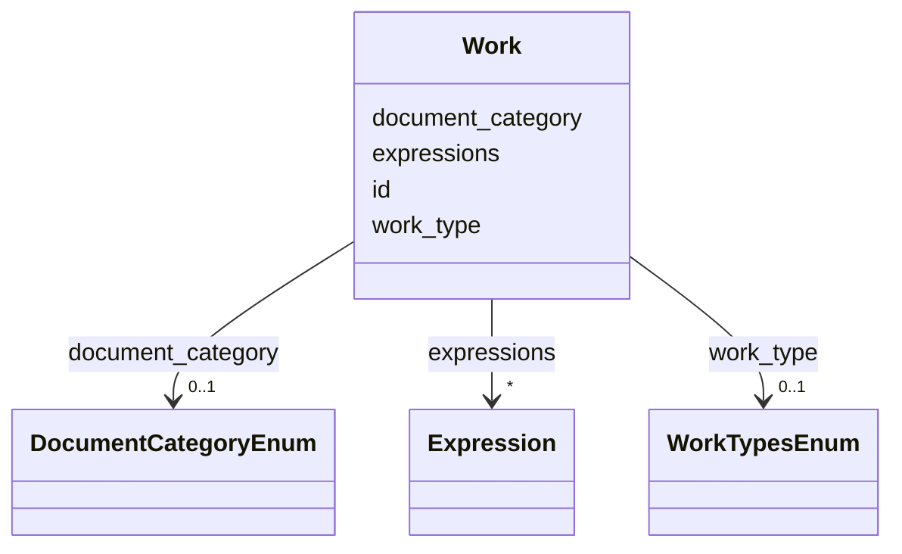

# Class: Work 


URI: [ops:Work](https://ch.paf.link/schema/operations/Work)





<!-- no inheritance hierarchy -->

## Slots

| Name | Cardinality and Range | Description | Inheritance |
| ---  | --- | --- | --- |
| [id](id.md) | 1 <br/> [String](String.md) |  | direct |
| [work_type](work_type.md) | 0..1 <br/> [WorkTypesEnum](WorkTypesEnum.md) |  | direct |
| [document_category](document_category.md) | 0..1 <br/> [DocumentCategoryEnum](DocumentCategoryEnum.md) | [de] Kategorie des Dokuments | direct |
| [expressions](expressions.md) | * <br/> [Expression](Expression.md) |  | direct |


## Usages

| used by | used in | type | used |
| ---  | --- | --- | --- |
| [Legislature](Legislature.md) | [documents](documents.md) | range | [Work](Work.md) |
| [Session](Session.md) | [documents](documents.md) | range | [Work](Work.md) |
| [Meeting](Meeting.md) | [documents](documents.md) | range | [Work](Work.md) |
| [AgendaItem](AgendaItem.md) | [documents](documents.md) | range | [Work](Work.md) |
| [Resolution](Resolution.md) | [documents](documents.md) | range | [Work](Work.md) |
| [Voting](Voting.md) | [documents](documents.md) | range | [Work](Work.md) |
| [Election](Election.md) | [documents](documents.md) | range | [Work](Work.md) |
| [Speech](Speech.md) | [documents](documents.md) | range | [Work](Work.md) |
| [Motion](Motion.md) | [documents](documents.md) | range | [Work](Work.md) |


## Identifier and Mapping Information


### Schema Source


* from schema: https://ch.paf.link/schema/operations


## Mappings

| Mapping Type | Mapped Value |
| ---  | ---  |
| self | ops:Work |
| native | ops:Work |


## LinkML Source

<!-- TODO: investigate https://stackoverflow.com/questions/37606292/how-to-create-tabbed-code-blocks-in-mkdocs-or-sphinx -->

### Direct

<details>
```yaml
name: Work
from_schema: https://ch.paf.link/schema/operations
slots:
- id
- work_type
- document_category
- expressions

```
</details>

### Induced

<details>
```yaml
name: Work
from_schema: https://ch.paf.link/schema/operations
attributes:
  id:
    name: id
    from_schema: https://ch.paf.link/schema/operations
    rank: 1000
    identifier: true
    alias: id
    owner: Work
    domain_of:
    - Work
    - Expression
    - Manifestation
    range: string
    required: true
  work_type:
    name: work_type
    from_schema: https://ch.paf.link/schema/operations
    rank: 1000
    slot_uri: meta:workType
    alias: work_type
    owner: Work
    domain_of:
    - Work
    range: WorkTypesEnum
  document_category:
    name: document_category
    description: '[de] Kategorie des Dokuments. Wenn nicht gesetzt, wird automatisch
      ''other'' verwendet.

      [en] Category of the document. If not set, ''other'' is automatically used.

      '
    from_schema: https://ch.paf.link/schema/operations
    rank: 1000
    slot_uri: meta:documentCategory
    ifabsent: string(other)
    alias: document_category
    owner: Work
    domain_of:
    - Work
    range: DocumentCategoryEnum
  expressions:
    name: expressions
    from_schema: https://ch.paf.link/schema/operations
    rank: 1000
    slot_uri: meta:expressions
    alias: expressions
    owner: Work
    domain_of:
    - Work
    range: Expression
    multivalued: true
    inlined: true
    inlined_as_list: true

```
</details>