| **Name**              | **Öffentlicher Ratsbetrieb**                                                                                               |
|-----------------------|----------------------------------------------------------------------------------------------------------------------------|
| **eCH-Nummer**        | eCH-XXXX                                                                                                                   |
| **Kategorie**         | Entwurf                                                                                                                    |
| **Reifegrad**         |                                                                                                                            |
| **Version**           | 0.1                                                                                                                        |
| **Status**            |                                                                                                                            |
| **Beschluss am**      |                                                                                                                            |
| **Ausgabedatum**      |                                                                                                                            |
| **Ersetzt Version**   | 0.0                                                                                                                        |
| **Voraussetzungen**   | ?                                                                                                                          |
| **Beilagen**          | -                                                                                                                          |
| **Sprachen**          | English (Original)                                                                                                         |
| **Autoren**           | Fachgruppe politische Geschäfte: Nicole Aeby, David Imseng, Jonas Schärer, Lena Mina Friedrich, Manuel Weingartner, Orhan Saeedi, Michel Moret, Laurens Abu-Talib |
| **Herausgeber / Vertrieb** | Verein eCH, Räffelstr. 20, 8045                                                                                       |

# Zusammenfassung

Der Standard eCH-0293 definiert ein gemeinsames Datenmodell für die Erfassung und Publikation von Informationen zum öffentlichen Ratsbetrieb in der Schweiz. Er deckt die zeitliche Organisation parlamentarischer Arbeit (Legislaturperioden, Sessionen), die Strukturierung von Sitzungen und Traktanden, Abstimmungen und Wahlen, Einzelstimmen, Anwesenheitslisten sowie Wortmeldungen und Resolutionen ab.

Dieser Standard richtet sich an Parlamentsdienste, Softwareanbieter von Parlamentsverwaltungssystemen, Datennutzer für Analysen und Visualisierungen sowie Open-Data-Plattformen.

eCH-0293 ist Teil einer Familie von Standards für politische Daten und arbeitet eng mit eCH-0294 (Actors), eCH-0295 (Affairs), eCH-0296 (Laws) und eCH-0297 (Consultations) zusammen.

# Table of Contents

< manually insert TOC here >

# Note

This document uses a gender-neutral formulation when referring to persons. This is based on the [guidelines](https://www.bk.admin.ch/bk/de/home/dokumentation/sprachen/hilfsmittel-textredaktion/leitfaden-zum-geschlechtergerechten-formulieren.html) (German) of the Federal Chancellery. Depending on the situation, paired forms (citizens), gender-abstract forms (insured person), gender-neutral forms (insured person) or paraphrases with-out personal reference are used. The generic masculine (citizen) is not permitted. Full forms are used in continuous texts, i.e. in texts consisting of formulated sentences. Short forms can be used in abbreviated text passages, namely in tables. The short form is used with a slash but without an ellipsis (referent). Gender asterisks and similar spellings are not used.

# Einleitung

## Kontext: Öffentlicher Ratsbetrieb

Auf Bundes-, Kantons- und Gemeindeebene tagen Räte und Versammlungen, beraten über politische Geschäfte, fassen Beschlüsse und kontrollieren die Exekutive.

## Zusammenhang mit anderen eCH-Standards

eCH-0293 ist Teil eines Ökosystems von Standards für politische Daten:

### eCH-0294: Politische Akteure (Actors)
Definiert Personen, Organe und Gruppen im politischen Kontext. eCH-0293 referenziert diese Akteure über `actor_id` (z.B. welches Parlament, welche Person hat abgestimmt).

### eCH-0295: Parlamentarische Geschäfte (Affairs)
Beschreibt den Lebenszyklus politischer Geschäfte. AgendaItems in eCH-0293 verweisen über `affair_id` auf die zugehörigen Geschäfte.

### eCH-0296: Erlasse und Gesetzestexte (Laws)
Erfasst die Resultate des parlamentarischen Prozesses - die verabschiedeten Gesetze und Erlasse.

### eCH-0297: Öffentliche Konsultationen (Consultations)
Strukturiert Vernehmlassungsverfahren, die oft Ausgangspunkt für parlamentarische Geschäfte sind.

ToDo: Christian

# Zeitliche Organisation des Ratsbetriebs

Der parlamentarische Betrieb ist zeitlich auf drei Ebenen organisiert: Legislaturperioden bilden den langfristigen Rahmen, Sessions strukturieren die Arbeit innerhalb einer Legislature, und Meetings sind die konkreten Sitzungen, in denen Geschäfte beraten werden. Diese Hierarchie ermöglicht sowohl langfristige Planung als auch flexible Anpassung an aktuelle Erfordernisse.

## Legislature (Legislaturperiode)

### Begriff und Bedeutung

Eine Legislaturperiode bezeichnet den Zeitraum, für den ein Parlament gewählt wird und in seiner aktuellen Zusammensetzung tätig ist. Sie bildet die oberste zeitliche Gliederungseinheit des parlamentarischen Betriebs und markiert den Rahmen für die legislative Arbeit eines Parlaments.

In der Schweiz variiert die Dauer von Legislaturperioden je nach Föderalebene:

- **Bundesebene**: 4 Jahre (Nationalrat und Ständerat)
- **Kantone**: Meist 4 Jahre, in einigen Kantonen auch 5 Jahre
- **Gemeinden**: Unterschiedlich, häufig 4 Jahre

### Struktur und Hierarchie

Die Legislaturperiode steht hierarchisch über den Sessions (Sessionen) und Meetings (Sitzungen):

```
Legislature (Legislaturperiode)
  └─ Sessions (z.B. Frühjahrssession, Herbstsession)
      └─ Meetings (einzelne Sitzungen)
          └─ Agenda Items (Traktanden)
```

### Parlamentarischer Kontext

Jede Legislature ist einem spezifischen parlamentarischen Organ zugeordnet, identifiziert durch:

- **group_id**: Verweis auf das Parlament (z.B. Nationalrat, Kantonsrat)
- **group_name**: Name des Organs für schnelle Referenz
- **body_key**: Optionaler Schlüssel zur Unterscheidung (z.B. "NR" für Nationalrat, "SR" für Ständerat)

Diese Verweise verwenden Identifikatoren aus dem eCH-0294 Actors Standard, der die politischen Akteure und Organe definiert.

### Zeitliche Einordnung

Eine Legislaturperiode wird charakterisiert durch:

- **begin_date**: Beginn der Legislaturperiode (meist nach Wahlen)
- **end_date**: Ende der Legislaturperiode (vor den nächsten Wahlen)

Beispiel Bundesebene: Die 51. Legislaturperiode des Schweizer Parlaments dauerte vom 5. Dezember 2019 bis zum 4. Dezember 2023.


# Class: Legislature 


_[en] Term of office of a parliament as a legislative assembly. Usually lasts four years._

_[de] Amtsdauer eines Parlaments als gesetzgebender Versammlung. Dauert in der Regel vier Jahre._

__


URI: [ops:Legislature](https://ch.paf.link/schema/operations/Legislature)


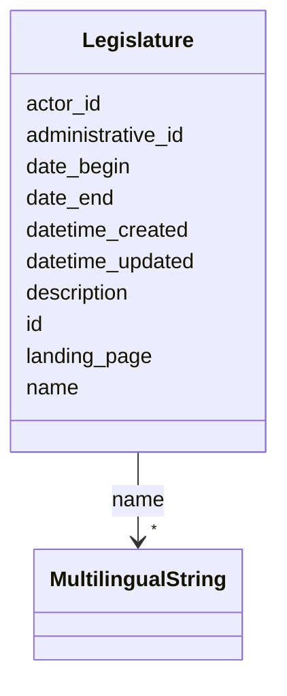


<!-- no inheritance hierarchy -->


## Slots

| Name | Cardinality and Range | Description | Inheritance |
| ---  | --- | --- | --- |
| [id](#id) | 1 <br/> [String](#String) |  | direct |
| [administrative_id](#administrative_id) | 0..1 <br/> [String](#String) | [en] Administrative ID of the legislative body, such as a municipality, canto... | direct |
| [name](#name) | * <br/> [MultilingualString](#MultilingualString) |  | direct |
| [description](#description) | 0..1 <br/> [String](#String) |  | direct |
| [landing_page](#landing_page) | 0..1 <br/> [String](#String) | [en] URL providing further information | direct |
| [actor_id](#actor_id) | 0..1 <br/> [String](#String) | [en] The political body organized by the term of office (e | direct |
| [date_begin](#date_begin) | 0..1 <br/> [Date](#Date) |  | direct |
| [date_end](#date_end) | 0..1 <br/> [Date](#Date) |  | direct |
| [datetime_updated](#datetime_updated) | 0..1 <br/> [Datetime](#Datetime) | The last time this record was updated | direct |
| [datetime_created](#datetime_created) | 0..1 <br/> [Datetime](#Datetime) | The time this record was created | direct |


## Usages

| used by | used in | type | used |
| ---  | --- | --- | --- |
| [Container](#Container) | [legislatures](#legislatures) | range | [Legislature](#Legislature) |


## Identifier and Mapping Information


### Schema Source


* from schema: https://ch.paf.link/schema/operations


## Mappings

| Mapping Type | Mapped Value |
| ---  | ---  |
| self | ops:Legislature |
| native | ops:Legislature |


## LinkML Source

<!-- TODO: investigate https://stackoverflow.com/questions/37606292/how-to-create-tabbed-code-blocks-in-mkdocs-or-sphinx -->

### Direct

<details>
```yaml
name: Legislature
description: '[en] Term of office of a parliament as a legislative assembly. Usually
  lasts four years.

  [de] Amtsdauer eines Parlaments als gesetzgebender Versammlung. Dauert in der Regel
  vier Jahre.

  '
from_schema: https://ch.paf.link/schema/operations
slots:
- id
- administrative_id
- name
- description
- landing_page
- actor_id
- date_begin
- date_end
- datetime_updated
- datetime_created

```
</details>

### Induced

<details>
```yaml
name: Legislature
description: '[en] Term of office of a parliament as a legislative assembly. Usually
  lasts four years.

  [de] Amtsdauer eines Parlaments als gesetzgebender Versammlung. Dauert in der Regel
  vier Jahre.

  '
from_schema: https://ch.paf.link/schema/operations
attributes:
  id:
    name: id
    from_schema: https://ch.paf.link/schema/operations
    rank: 1000
    slot_uri: dcterm:identifier
    identifier: true
    alias: id
    owner: Legislature
    domain_of:
    - Container
    - Legislature
    - Session
    - Meeting
    - AgendaItem
    - Voting
    - IndividualVote
    - Election
    - Attendance
    - IndividualAttendance
    - Speech
    - TextSegment
    - Motion
    - Media
    range: string
    required: true
  administrative_id:
    name: administrative_id
    description: '[en] Administrative ID of the legislative body, such as a municipality,
      canton, or country.

      [de] Verwaltungs-ID des gesetzgebenden Körpers, wie z.B. Gemeinde, Kanton oder
      Land.

      '
    from_schema: https://ch.paf.link/schema/operations
    rank: 1000
    alias: administrative_id
    owner: Legislature
    domain_of:
    - Legislature
    - Meeting
    range: string
  name:
    name: name
    from_schema: https://ch.paf.link/schema/operations
    rank: 1000
    alias: name
    owner: Legislature
    domain_of:
    - Legislature
    - Session
    - Meeting
    range: MultilingualString
    multivalued: true
    inlined: true
    inlined_as_list: true
  description:
    name: description
    from_schema: https://ch.paf.link/schema/operations
    rank: 1000
    alias: description
    owner: Legislature
    domain_of:
    - Legislature
    - Meeting
    - Motion
    range: string
  landing_page:
    name: landing_page
    description: '[en] URL providing further information.

      [de] URL mit weiteren Informationen.

      '
    from_schema: https://ch.paf.link/schema/operations
    rank: 1000
    slot_uri: ops:landingPage
    alias: landing_page
    owner: Legislature
    domain_of:
    - Legislature
    - Meeting
    - AgendaItem
    - Voting
    - Election
    - Speech
    range: string
  actor_id:
    name: actor_id
    description: '[en] The political body organized by the term of office (e.g., Regierungsrat,
      Nationalrat, Ständerat).

      [de] Das politische Organ, das durch die Amtsdauer organisiert wird (z.B. Regierungsrat,
      Nationalrat, Ständerat).

      '
    from_schema: https://ch.paf.link/schema/operations
    rank: 1000
    alias: actor_id
    owner: Legislature
    domain_of:
    - Legislature
    - Meeting
    - Voting
    - IndividualVote
    - Election
    - Attendance
    - IndividualAttendance
    - Speech
    range: string
  date_begin:
    name: date_begin
    from_schema: https://ch.paf.link/schema/operations
    rank: 1000
    alias: date_begin
    owner: Legislature
    domain_of:
    - Legislature
    range: date
  date_end:
    name: date_end
    from_schema: https://ch.paf.link/schema/operations
    rank: 1000
    alias: date_end
    owner: Legislature
    domain_of:
    - Legislature
    range: date
  datetime_updated:
    name: datetime_updated
    description: The last time this record was updated
    from_schema: https://ch.paf.link/schema/operations
    rank: 1000
    alias: datetime_updated
    owner: Legislature
    domain_of:
    - Legislature
    - Session
    - Meeting
    - AgendaItem
    - Voting
    - IndividualVote
    - Election
    - Attendance
    - IndividualAttendance
    - Speech
    range: datetime
  datetime_created:
    name: datetime_created
    description: The time this record was created
    from_schema: https://ch.paf.link/schema/operations
    rank: 1000
    alias: datetime_created
    owner: Legislature
    domain_of:
    - Legislature
    - Session
    - Meeting
    - AgendaItem
    - Voting
    - IndividualVote
    - Election
    - Attendance
    - IndividualAttendance
    - Speech
    range: datetime

```
</details>

## Session (Sitzungsperiode)

### Begriff und Bedeutung

Eine Session bezeichnet eine zusammenhängende Sitzungsperiode eines Parlaments, in der mehrere Meetings (Sitzungen) stattfinden. Sie bildet die mittlere zeitliche Gliederungseinheit zwischen der Legislaturperiode und den einzelnen Sitzungen.

### Unterscheidung: Session vs. Meeting

Diese Unterscheidung ist wichtig für das Verständnis des Standards:

- **Session**: Eine Sitzungsperiode, die sich typischerweise über mehrere Tage oder Wochen erstreckt
- **Meeting**: Eine einzelne Sitzung innerhalb einer Session

#### Beispiel Bundesebene

Die Bundesversammlung kennt vier ordentliche Sessions pro Jahr:

- **Frühjahrssession**: Typischerweise 3 Wochen im Februar/März
- **Sommersession**: Typischerweise 3 Wochen im Mai/Juni
- **Herbstsession**: Typischerweise 3 Wochen im September
- **Wintersession**: Typischerweise 2-3 Wochen im November/Dezember

Innerhalb der Frühjahrssession 2024 fanden beispielsweise separate Meetings des Nationalrats und des Ständerats an verschiedenen Tagen statt.

### Hierarchische Einordnung

```
Legislature (51. Legislaturperiode)
  └─ Session (Frühjahrssession 2024)
      ├─ Meeting (Nationalratssitzung 4. März 2024)
      ├─ Meeting (Ständeratssitzung 4. März 2024)
      ├─ Meeting (Nationalratssitzung 5. März 2024)
      └─ ...
```

### Zuordnung zu Organen

Eine Session kann sich auf verschiedene parlamentarische Organe beziehen:

- **Vollparlament**: Sessions des National- oder Kantonsrats
- **Kommissionen**: Sitzungsperioden parlamentarischer Kommissionen
- **Gemeinsame Gremien**: Z.B. Sessions der Vereinigten Bundesversammlung

Über **group_id** und **group_name** wird das betreffende Organ referenziert (gemäss eCH-0294 Actors).

### Identifikation und Nummerierung

Sessions werden üblicherweise nummeriert:

- **number**: Laufende Nummer innerhalb der Legislature oder des Jahres
- **abbreviation**: Kurze Bezeichnung (z.B. "FS24" für Frühjahrssession 2024)
- **name**: Mehrsprachige vollständige Bezeichnung

### Zeitliche Attribute

- **begin_date**: Geplanter Beginn der Session
- **end_date**: Geplantes Ende der Session

Im Gegensatz zu Meetings gibt es auf Session-Ebene keine "actual" Daten, da die übergeordnete Planung meist eingehalten wird.

### Verwendungszwecke

Die Session-Entität ermöglicht:

1. **Gruppierung**: Zusammenfassung mehrerer thematisch oder zeitlich verbundener Sitzungen
2. **Planung**: Vorausschauende Organisation des parlamentarischen Kalenders
3. **Kommunikation**: Bündelung von Informationen für Öffentlichkeit und Medien
4. **Analyse**: Auswertung parlamentarischer Aktivitäten nach Sitzungsperioden

### Flexibilität im Standard

Der Standard ist bewusst flexibel gestaltet, um verschiedene Organisationsformen abzubilden:

- Föderaleinheiten ohne formale Sessions können diese Entität optional nutzen oder direkt auf Meetings referenzieren
- Die Verwendung von **type**-Feldern erlaubt die Differenzierung verschiedener Session-Arten


# Class: Session 


_[en] A parliamentary session that groups multiple meetings and spans a specific time period._

_[de] Eine Parlamentssession, die mehrere Sitzungen gruppiert und sich über einen bestimmten Zeitraum erstreckt._

__


URI: [ops:Session](https://ch.paf.link/schema/operations/Session)


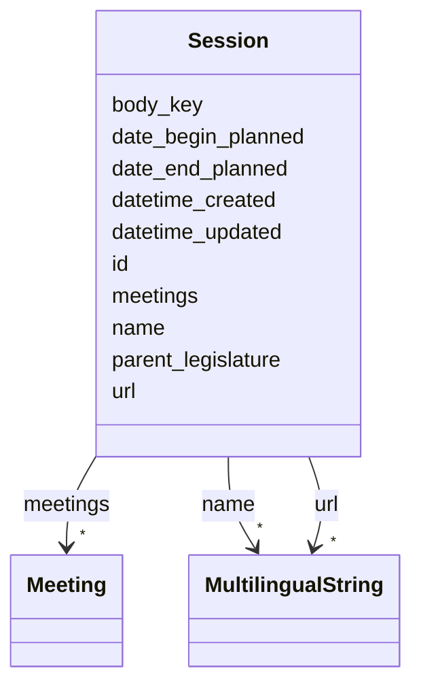


<!-- no inheritance hierarchy -->


## Slots

| Name | Cardinality and Range | Description | Inheritance |
| ---  | --- | --- | --- |
| [id](#id) | 1 <br/> [String](#String) |  | direct |
| [body_key](#body_key) | 0..1 <br/> [String](#String) | [en] Key identifying the political body or jurisdiction (e | direct |
| [name](#name) | * <br/> [MultilingualString](#MultilingualString) |  | direct |
| [url](#url) | * <br/> [MultilingualString](#MultilingualString) |  | direct |
| [date_begin_planned](#date_begin_planned) | 0..1 <br/> [Date](#Date) | [en] Planned start date of the meeting or session | direct |
| [date_end_planned](#date_end_planned) | 0..1 <br/> [Date](#Date) | [en] Planned end date of the meeting or session | direct |
| [parent_legislature](#parent_legislature) | 0..1 <br/> [String](#String) | [en] The legislative body in which the meeting is based | direct |
| [meetings](#meetings) | * <br/> [Meeting](#Meeting) |  | direct |
| [datetime_updated](#datetime_updated) | 0..1 <br/> [Datetime](#Datetime) | The last time this record was updated | direct |
| [datetime_created](#datetime_created) | 0..1 <br/> [Datetime](#Datetime) | The time this record was created | direct |


## Usages

| used by | used in | type | used |
| ---  | --- | --- | --- |
| [Container](#Container) | [sessions](#sessions) | range | [Session](#Session) |


## Identifier and Mapping Information


### Schema Source


* from schema: https://ch.paf.link/schema/operations


## Mappings

| Mapping Type | Mapped Value |
| ---  | ---  |
| self | ops:Session |
| native | ops:Session |


## LinkML Source

<!-- TODO: investigate https://stackoverflow.com/questions/37606292/how-to-create-tabbed-code-blocks-in-mkdocs-or-sphinx -->

### Direct

<details>
```yaml
name: Session
description: '[en] A parliamentary session that groups multiple meetings and spans
  a specific time period.

  [de] Eine Parlamentssession, die mehrere Sitzungen gruppiert und sich über einen
  bestimmten Zeitraum erstreckt.

  '
from_schema: https://ch.paf.link/schema/operations
slots:
- id
- body_key
- name
- url
- date_begin_planned
- date_end_planned
- parent_legislature
- meetings
- datetime_updated
- datetime_created

```
</details>

### Induced

<details>
```yaml
name: Session
description: '[en] A parliamentary session that groups multiple meetings and spans
  a specific time period.

  [de] Eine Parlamentssession, die mehrere Sitzungen gruppiert und sich über einen
  bestimmten Zeitraum erstreckt.

  '
from_schema: https://ch.paf.link/schema/operations
attributes:
  id:
    name: id
    from_schema: https://ch.paf.link/schema/operations
    rank: 1000
    slot_uri: dcterm:identifier
    identifier: true
    alias: id
    owner: Session
    domain_of:
    - Container
    - Legislature
    - Session
    - Meeting
    - AgendaItem
    - Voting
    - IndividualVote
    - Election
    - Attendance
    - IndividualAttendance
    - Speech
    - TextSegment
    - Motion
    - Media
    range: string
    required: true
  body_key:
    name: body_key
    description: '[en] Key identifying the political body or jurisdiction (e.g., BE
      for Bern, CHE for Switzerland).

      [de] Schlüssel zur Identifizierung des politischen Organs oder der Gerichtsbarkeit
      (z.B. BE für Bern, CHE für Schweiz).

      '
    from_schema: https://ch.paf.link/schema/operations
    rank: 1000
    alias: body_key
    owner: Session
    domain_of:
    - Session
    - Meeting
    range: string
  name:
    name: name
    from_schema: https://ch.paf.link/schema/operations
    rank: 1000
    alias: name
    owner: Session
    domain_of:
    - Legislature
    - Session
    - Meeting
    range: MultilingualString
    multivalued: true
    inlined: true
    inlined_as_list: true
  url:
    name: url
    from_schema: https://ch.paf.link/schema/operations
    rank: 1000
    alias: url
    owner: Session
    domain_of:
    - Session
    - Meeting
    - Media
    range: MultilingualString
    multivalued: true
    inlined: true
    inlined_as_list: true
  date_begin_planned:
    name: date_begin_planned
    description: '[en] Planned start date of the meeting or session.

      [de] Geplantes Startdatum der Sitzung oder Session.

      '
    from_schema: https://ch.paf.link/schema/operations
    rank: 1000
    alias: date_begin_planned
    owner: Session
    domain_of:
    - Session
    - Meeting
    range: date
  date_end_planned:
    name: date_end_planned
    description: '[en] Planned end date of the meeting or session.

      [de] Geplantes Enddatum der Sitzung oder Session.

      '
    from_schema: https://ch.paf.link/schema/operations
    rank: 1000
    alias: date_end_planned
    owner: Session
    domain_of:
    - Session
    - Meeting
    range: date
  parent_legislature:
    name: parent_legislature
    description: '[en] The legislative body in which the meeting is based.

      [de] Der gesetzgebende Körper, auf dem die Sitzung basiert.

      '
    from_schema: https://ch.paf.link/schema/operations
    rank: 1000
    alias: parent_legislature
    owner: Session
    domain_of:
    - Session
    - Meeting
    range: string
  meetings:
    name: meetings
    from_schema: https://ch.paf.link/schema/operations
    rank: 1000
    slot_uri: ops:meeting
    alias: meetings
    owner: Session
    domain_of:
    - Container
    - Session
    range: Meeting
    multivalued: true
    inlined: true
    inlined_as_list: true
  datetime_updated:
    name: datetime_updated
    description: The last time this record was updated
    from_schema: https://ch.paf.link/schema/operations
    rank: 1000
    alias: datetime_updated
    owner: Session
    domain_of:
    - Legislature
    - Session
    - Meeting
    - AgendaItem
    - Voting
    - IndividualVote
    - Election
    - Attendance
    - IndividualAttendance
    - Speech
    range: datetime
  datetime_created:
    name: datetime_created
    description: The time this record was created
    from_schema: https://ch.paf.link/schema/operations
    rank: 1000
    alias: datetime_created
    owner: Session
    domain_of:
    - Legislature
    - Session
    - Meeting
    - AgendaItem
    - Voting
    - IndividualVote
    - Election
    - Attendance
    - IndividualAttendance
    - Speech
    range: datetime

```
</details>

## Meeting (Einzelne Sitzung)

### Begriff und Bedeutung

Ein Meeting bezeichnet eine einzelne Sitzung eines parlamentarischen Organs. Dies ist die konkrete Veranstaltung, bei der sich die Mitglieder eines Parlaments, einer Kommission oder eines anderen Gremiums versammeln, um Geschäfte zu beraten und Beschlüsse zu fassen.

### Arten von Meetings

Der Standard unterscheidet verschiedene Meeting-Typen über das Feld **type**:

#### session
Plenarsitzungen des gesamten Parlaments oder einer Kammer

**Beispiele:**
- Nationalratssitzung während der Herbstsession
- Sitzung des Kantonsrats
- Sitzung der Vereinigten Bundesversammlung

#### committee
Sitzungen parlamentarischer Kommissionen

**Beispiele:**
- Sitzung der Kommission für Wirtschaft und Abgaben (WAK)
- Geschäftsprüfungskommission (GPK)
- Aussenpolitische Kommission (APK)

#### sitting
Spezielle Sitzungsformen

**Beispiele:**
- Landsgemeinden (in den Kantonen Glarus und Appenzell Innerrhoden)
- Bürgergemeindeversammlungen
- Gemeindeversammlungen

#### various
Andere Sitzungsformen, die nicht in die obigen Kategorien fallen

### Hierarchie und Struktur

Ein Meeting ist Teil einer Session (wenn verwendet) und enthält mehrere Agenda Items (Traktanden):

```
Session (Frühjahrssession 2024)
  └─ Meeting (Nationalratssitzung, 4. März 2024, 08:00)
      ├─ AgendaItem (Traktandum 1: Begrüssung)
      ├─ AgendaItem (Traktandum 2: Gesetzesberatung)
      └─ AgendaItem (Traktandum 3: Abstimmungen)
```

### Zeitliche Planung vs. Realität

Ein besonderes Merkmal der Meeting-Entität ist die Unterscheidung zwischen geplanten und tatsächlichen Zeitpunkten:

#### Geplante Daten
- **begin_date**: Geplanter Beginn
- **end_date**: Geplantes Ende

#### Tatsächliche Daten
- **begin_date_actual**: Tatsächlicher Beginn
- **end_date_actual**: Tatsächliches Ende

Diese Unterscheidung ist wichtig, da:
- Sitzungen sich verzögern können
- Traktanden vorgezogen oder verschoben werden
- Sitzungen früher als geplant enden können

**Anwendungsfall:** Eine für 14:00 geplante Sitzung beginnt aufgrund von Verzögerungen erst um 14:25 und endet statt um 18:00 bereits um 17:30.

### Sitzungsstatus

Das Feld **state** erfasst den aktuellen Status eines Meetings:

- **planned**: Die Sitzung ist geplant und wird wie vorgesehen stattfinden
- **canceled**: Die Sitzung wurde abgesagt
- **postponed**: Die Sitzung wurde verschoben

Dieser Status ist wichtig für:
- Aktuelle Informationen an Parlamentsmitglieder und Öffentlichkeit
- Historische Nachvollziehbarkeit von Planungsänderungen
- Automatische Benachrichtigungen bei Änderungen

### Identifikation und Nummerierung

Meetings werden identifiziert durch:

- **id**: Eindeutiger Identifikator
- **number**: Laufende Nummer (z.B. "5" für die 5. Sitzung einer Session)
- **abbreviation**: Kurze Bezeichnung (z.B. "NR-24-05")
- **name**: Mehrsprachige vollständige Bezeichnung

### Ort der Sitzung

Das Feld **location** erfasst den Sitzungsort:

- Physischer Ort: "Bundeshaus, Nationalratssaal"
- Virtuelle Sitzungen: "Videokonferenz via [Plattform]"
- Hybride Formate: "Bundeshaus und Videokonferenz"

### Zuordnung zu Organen

Wie bei Legislature und Session wird über **group_id**, **group_name** und **body_key** das zuständige Organ referenziert:

- Plenarsitzungen: Verweis auf das gesamte Parlament
- Kommissionssitzungen: Verweis auf die spezifische Kommission
- Gemeinsame Sitzungen: Verweis auf das gemeinsame Gremium

### Beziehungen zu anderen Entitäten

Ein Meeting verbindet verschiedene Elemente des parlamentarischen Betriebs:

- **Agenda Items**: Die behandelten Traktanden
- **Votings**: Abstimmungen während der Sitzung
- **Elections**: Wahlen während der Sitzung
- **Speeches**: Wortmeldungen und Voten
- **Attendance**: Anwesenheitslisten


# Class: Meeting 


_[en] A general meeting class used for Sessions, Comittee Meetings, individual session Sittings and other various Meetings._

_[de] Eine allgemeine Sitzungsklasse, die für Sessionen, Kommissionssitzungen, Sessionssitzung und andere verschiedene Versammlungen verwendet wird._

__


URI: [ops:Meeting](https://ch.paf.link/schema/operations/Meeting)


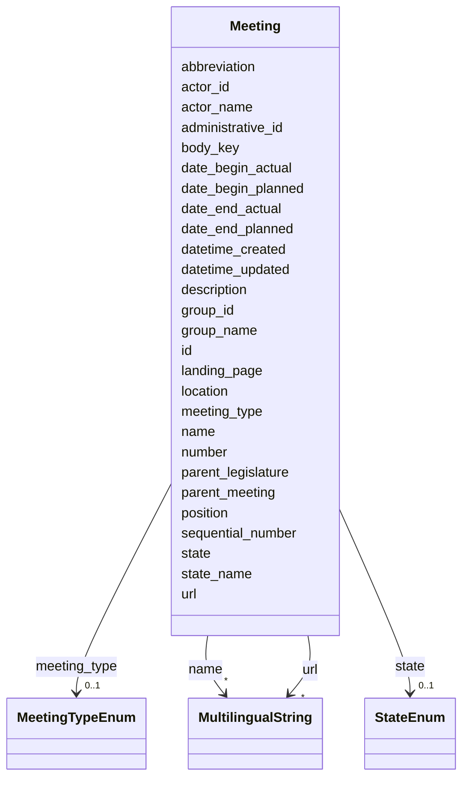


<!-- no inheritance hierarchy -->


## Slots

| Name | Cardinality and Range | Description | Inheritance |
| ---  | --- | --- | --- |
| [id](#id) | 1 <br/> [String](#String) |  | direct |
| [body_key](#body_key) | 0..1 <br/> [String](#String) | [en] Key identifying the political body or jurisdiction (e | direct |
| [meeting_type](#meeting_type) | 0..1 <br/> [MeetingTypeEnum](#MeetingTypeEnum) | Type of the meeting, e | direct |
| [administrative_id](#administrative_id) | 0..1 <br/> [String](#String) | [en] Administrative ID of the legislative body, such as a municipality, canto... | direct |
| [name](#name) | * <br/> [MultilingualString](#MultilingualString) |  | direct |
| [url](#url) | * <br/> [MultilingualString](#MultilingualString) |  | direct |
| [group_name](#group_name) | 0..1 <br/> [String](#String) | Name of the group or body | direct |
| [group_id](#group_id) | 0..1 <br/> [String](#String) | Identifier of the group or body | direct |
| [number](#number) | 0..1 <br/> [String](#String) |  | direct |
| [landing_page](#landing_page) | 0..1 <br/> [String](#String) | [en] URL providing further information | direct |
| [sequential_number](#sequential_number) | 0..1 <br/> [Integer](#Integer) | [en] Sequential number of the meeting, used for ordering | direct |
| [position](#position) | 0..1 <br/> [String](#String) |  | direct |
| [abbreviation](#abbreviation) | 0..1 <br/> [String](#String) |  | direct |
| [actor_name](#actor_name) | 0..1 <br/> [String](#String) | [en] Name of the political body (e | direct |
| [actor_id](#actor_id) | 0..1 <br/> [String](#String) | [en] The political body organized by the term of office (e | direct |
| [date_begin_planned](#date_begin_planned) | 0..1 <br/> [Date](#Date) | [en] Planned start date of the meeting or session | direct |
| [date_end_planned](#date_end_planned) | 0..1 <br/> [Date](#Date) | [en] Planned end date of the meeting or session | direct |
| [date_begin_actual](#date_begin_actual) | 0..1 <br/> [Date](#Date) |  | direct |
| [date_end_actual](#date_end_actual) | 0..1 <br/> [Date](#Date) | [en] Actual end date of the meeting or session | direct |
| [state](#state) | 0..1 <br/> [StateEnum](#StateEnum) |  | direct |
| [state_name](#state_name) | 0..1 <br/> [String](#String) | [en] Custom state description for the meeting | direct |
| [description](#description) | 0..1 <br/> [String](#String) |  | direct |
| [location](#location) | 0..1 <br/> [String](#String) |  | direct |
| [parent_meeting](#parent_meeting) | 0..1 <br/> [String](#String) | [en] The linked meeting ID that groups the current meeting | direct |
| [parent_legislature](#parent_legislature) | 0..1 <br/> [String](#String) | [en] The legislative body in which the meeting is based | direct |
| [datetime_updated](#datetime_updated) | 0..1 <br/> [Datetime](#Datetime) | The last time this record was updated | direct |
| [datetime_created](#datetime_created) | 0..1 <br/> [Datetime](#Datetime) | The time this record was created | direct |


## Usages

| used by | used in | type | used |
| ---  | --- | --- | --- |
| [Container](#Container) | [meetings](#meetings) | range | [Meeting](#Meeting) |
| [Session](#Session) | [meetings](#meetings) | range | [Meeting](#Meeting) |


## Identifier and Mapping Information


### Schema Source


* from schema: https://ch.paf.link/schema/operations


## Mappings

| Mapping Type | Mapped Value |
| ---  | ---  |
| self | ops:Meeting |
| native | ops:Meeting |


## LinkML Source

<!-- TODO: investigate https://stackoverflow.com/questions/37606292/how-to-create-tabbed-code-blocks-in-mkdocs-or-sphinx -->

### Direct

<details>
```yaml
name: Meeting
description: '[en] A general meeting class used for Sessions, Comittee Meetings, individual
  session Sittings and other various Meetings.

  [de] Eine allgemeine Sitzungsklasse, die für Sessionen, Kommissionssitzungen, Sessionssitzung
  und andere verschiedene Versammlungen verwendet wird.

  '
from_schema: https://ch.paf.link/schema/operations
slots:
- id
- body_key
- meeting_type
- administrative_id
- name
- url
- group_name
- group_id
- number
- landing_page
- sequential_number
- position
- abbreviation
- actor_name
- actor_id
- date_begin_planned
- date_end_planned
- date_begin_actual
- date_end_actual
- state
- state_name
- description
- location
- parent_meeting
- parent_legislature
- datetime_updated
- datetime_created

```
</details>

### Induced

<details>
```yaml
name: Meeting
description: '[en] A general meeting class used for Sessions, Comittee Meetings, individual
  session Sittings and other various Meetings.

  [de] Eine allgemeine Sitzungsklasse, die für Sessionen, Kommissionssitzungen, Sessionssitzung
  und andere verschiedene Versammlungen verwendet wird.

  '
from_schema: https://ch.paf.link/schema/operations
attributes:
  id:
    name: id
    from_schema: https://ch.paf.link/schema/operations
    rank: 1000
    slot_uri: dcterm:identifier
    identifier: true
    alias: id
    owner: Meeting
    domain_of:
    - Container
    - Legislature
    - Session
    - Meeting
    - AgendaItem
    - Voting
    - IndividualVote
    - Election
    - Attendance
    - IndividualAttendance
    - Speech
    - TextSegment
    - Motion
    - Media
    range: string
    required: true
  body_key:
    name: body_key
    description: '[en] Key identifying the political body or jurisdiction (e.g., BE
      for Bern, CHE for Switzerland).

      [de] Schlüssel zur Identifizierung des politischen Organs oder der Gerichtsbarkeit
      (z.B. BE für Bern, CHE für Schweiz).

      '
    from_schema: https://ch.paf.link/schema/operations
    rank: 1000
    alias: body_key
    owner: Meeting
    domain_of:
    - Session
    - Meeting
    range: string
  meeting_type:
    name: meeting_type
    description: Type of the meeting, e.g. session, committee, sitting, various
    from_schema: https://ch.paf.link/schema/operations
    rank: 1000
    slot_uri: ops:meetingType
    alias: meeting_type
    owner: Meeting
    domain_of:
    - Meeting
    range: meeting_type_enum
  administrative_id:
    name: administrative_id
    description: '[en] Administrative ID of the legislative body, such as a municipality,
      canton, or country.

      [de] Verwaltungs-ID des gesetzgebenden Körpers, wie z.B. Gemeinde, Kanton oder
      Land.

      '
    from_schema: https://ch.paf.link/schema/operations
    rank: 1000
    alias: administrative_id
    owner: Meeting
    domain_of:
    - Legislature
    - Meeting
    range: string
  name:
    name: name
    from_schema: https://ch.paf.link/schema/operations
    rank: 1000
    alias: name
    owner: Meeting
    domain_of:
    - Legislature
    - Session
    - Meeting
    range: MultilingualString
    multivalued: true
    inlined: true
    inlined_as_list: true
  url:
    name: url
    from_schema: https://ch.paf.link/schema/operations
    rank: 1000
    alias: url
    owner: Meeting
    domain_of:
    - Session
    - Meeting
    - Media
    range: MultilingualString
    multivalued: true
    inlined: true
    inlined_as_list: true
  group_name:
    name: group_name
    description: Name of the group or body
    from_schema: https://ch.paf.link/schema/operations
    rank: 1000
    alias: group_name
    owner: Meeting
    domain_of:
    - Meeting
    range: string
  group_id:
    name: group_id
    description: Identifier of the group or body
    from_schema: https://ch.paf.link/schema/operations
    rank: 1000
    alias: group_id
    owner: Meeting
    domain_of:
    - Meeting
    range: string
  number:
    name: number
    from_schema: https://ch.paf.link/schema/operations
    rank: 1000
    alias: number
    owner: Meeting
    domain_of:
    - Meeting
    range: string
  landing_page:
    name: landing_page
    description: '[en] URL providing further information.

      [de] URL mit weiteren Informationen.

      '
    from_schema: https://ch.paf.link/schema/operations
    rank: 1000
    slot_uri: ops:landingPage
    alias: landing_page
    owner: Meeting
    domain_of:
    - Legislature
    - Meeting
    - AgendaItem
    - Voting
    - Election
    - Speech
    range: string
  sequential_number:
    name: sequential_number
    description: '[en] Sequential number of the meeting, used for ordering.

      [de] Laufende Nummer der Sitzung, die zur Sortierung verwendet wird.

      '
    from_schema: https://ch.paf.link/schema/operations
    rank: 1000
    alias: sequential_number
    owner: Meeting
    domain_of:
    - Meeting
    range: integer
  position:
    name: position
    from_schema: https://ch.paf.link/schema/operations
    rank: 1000
    alias: position
    owner: Meeting
    domain_of:
    - Meeting
    range: string
  abbreviation:
    name: abbreviation
    from_schema: https://ch.paf.link/schema/operations
    rank: 1000
    alias: abbreviation
    owner: Meeting
    domain_of:
    - Meeting
    range: string
  actor_name:
    name: actor_name
    description: '[en] Name of the political body (e.g., Nationalrat).

      [de] Name des politischen Organs (z.B. Nationalrat).

      '
    from_schema: https://ch.paf.link/schema/operations
    rank: 1000
    alias: actor_name
    owner: Meeting
    domain_of:
    - Meeting
    range: string
  actor_id:
    name: actor_id
    description: '[en] The political body organized by the term of office (e.g., Regierungsrat,
      Nationalrat, Ständerat).

      [de] Das politische Organ, das durch die Amtsdauer organisiert wird (z.B. Regierungsrat,
      Nationalrat, Ständerat).

      '
    from_schema: https://ch.paf.link/schema/operations
    rank: 1000
    alias: actor_id
    owner: Meeting
    domain_of:
    - Legislature
    - Meeting
    - Voting
    - IndividualVote
    - Election
    - Attendance
    - IndividualAttendance
    - Speech
    range: string
  date_begin_planned:
    name: date_begin_planned
    description: '[en] Planned start date of the meeting or session.

      [de] Geplantes Startdatum der Sitzung oder Session.

      '
    from_schema: https://ch.paf.link/schema/operations
    rank: 1000
    alias: date_begin_planned
    owner: Meeting
    domain_of:
    - Session
    - Meeting
    range: date
  date_end_planned:
    name: date_end_planned
    description: '[en] Planned end date of the meeting or session.

      [de] Geplantes Enddatum der Sitzung oder Session.

      '
    from_schema: https://ch.paf.link/schema/operations
    rank: 1000
    alias: date_end_planned
    owner: Meeting
    domain_of:
    - Session
    - Meeting
    range: date
  date_begin_actual:
    name: date_begin_actual
    from_schema: https://ch.paf.link/schema/operations
    rank: 1000
    alias: date_begin_actual
    owner: Meeting
    domain_of:
    - Meeting
    range: date
  date_end_actual:
    name: date_end_actual
    description: '[en] Actual end date of the meeting or session.

      [de] Tatsächliches Enddatum der Sitzung oder Session.

      '
    from_schema: https://ch.paf.link/schema/operations
    rank: 1000
    alias: date_end_actual
    owner: Meeting
    domain_of:
    - Meeting
    range: date
  state:
    name: state
    from_schema: https://ch.paf.link/schema/operations
    rank: 1000
    alias: state
    owner: Meeting
    domain_of:
    - Meeting
    range: state_enum
  state_name:
    name: state_name
    description: '[en] Custom state description for the meeting.

      [de] Benutzerdefinierte Zustandsbeschreibung für die Sitzung.

      '
    from_schema: https://ch.paf.link/schema/operations
    rank: 1000
    alias: state_name
    owner: Meeting
    domain_of:
    - Meeting
    - AgendaItem
    range: string
  description:
    name: description
    from_schema: https://ch.paf.link/schema/operations
    rank: 1000
    alias: description
    owner: Meeting
    domain_of:
    - Legislature
    - Meeting
    - Motion
    range: string
  location:
    name: location
    from_schema: https://ch.paf.link/schema/operations
    rank: 1000
    alias: location
    owner: Meeting
    domain_of:
    - Meeting
    range: string
  parent_meeting:
    name: parent_meeting
    description: '[en] The linked meeting ID that groups the current meeting.

      [de] Die verknüpfte Sitzungs-ID, die die aktuelle Sitzung gruppiert.

      '
    from_schema: https://ch.paf.link/schema/operations
    rank: 1000
    alias: parent_meeting
    owner: Meeting
    domain_of:
    - Meeting
    - AgendaItem
    - Voting
    - Election
    range: string
  parent_legislature:
    name: parent_legislature
    description: '[en] The legislative body in which the meeting is based.

      [de] Der gesetzgebende Körper, auf dem die Sitzung basiert.

      '
    from_schema: https://ch.paf.link/schema/operations
    rank: 1000
    alias: parent_legislature
    owner: Meeting
    domain_of:
    - Session
    - Meeting
    range: string
  datetime_updated:
    name: datetime_updated
    description: The last time this record was updated
    from_schema: https://ch.paf.link/schema/operations
    rank: 1000
    alias: datetime_updated
    owner: Meeting
    domain_of:
    - Legislature
    - Session
    - Meeting
    - AgendaItem
    - Voting
    - IndividualVote
    - Election
    - Attendance
    - IndividualAttendance
    - Speech
    range: datetime
  datetime_created:
    name: datetime_created
    description: The time this record was created
    from_schema: https://ch.paf.link/schema/operations
    rank: 1000
    alias: datetime_created
    owner: Meeting
    domain_of:
    - Legislature
    - Session
    - Meeting
    - AgendaItem
    - Voting
    - IndividualVote
    - Election
    - Attendance
    - IndividualAttendance
    - Speech
    range: datetime

```
</details>

# Anwesenheit und Wortmeldungen

Neben den formalen Entscheidungen dokumentiert der Standard auch die Teilnahme an Sitzungen und die geführten Debatten. Anwesenheitslisten erfassen wer an einer Sitzung teilgenommen hat, während Wortmeldungen die parlamentarische Debatte mit Text- und Medienaufzeichnungen festhalten.

## Attendance (Anwesenheit)

## Begriff und Bedeutung

Die Attendance (Anwesenheit) erfasst, welche Mitglieder eines parlamentarischen Organs bei einer Sitzung anwesend, abwesend oder entschuldigt waren. Sie dient der Dokumentation der Teilnahme und ist Voraussetzung für die Beschlussfähigkeit (Quorum).

## Zweiebenen-Struktur

Der Standard unterscheidet zwischen zwei Ebenen der Anwesenheitserfassung:

### 1. Attendance (Aggregierte Ebene)
Zusammenfassung der Anwesenheit für ein Meeting:
- Gesamtzahl Anwesende
- Gesamtzahl Abwesende (entschuldigt/unentschuldigt)
- Beschlussfähigkeit

### 2. IndividualAttendance (Individuelle Ebene)
Detaillierte Erfassung für jede einzelne Person:
- Wer war anwesend?
- Wer war abwesend?
- War die Abwesenheit entschuldigt?

```
Meeting (Nationalratssitzung 4. März 2024)
  └─ Attendance (Aggregierte Anwesenheit)
      ├─ IndividualAttendance (Person A: anwesend)
      ├─ IndividualAttendance (Person B: entschuldigt)
      ├─ IndividualAttendance (Person C: abwesend)
      └─ ...
```

## Attendance (Aggregierte Ebene)

### Zuordnung zu Meeting und Organ

- **meeting_id**: Verweis auf die spezifische Sitzung
- **group_id**: Verweis auf das Organ (Parlament, Kommission)

### Arten der Anwesenheitserfassung

Das Feld **attendance_type** unterscheidet:

#### start
Anwesenheit zu Beginn der Sitzung

**Anwendung:**
- Feststellung der Beschlussfähigkeit
- Offizielle Eröffnung der Sitzung
- Basis für Präsenzlisten

#### continuous
Kontinuierliche Anwesenheitserfassung

**Anwendung:**
- Elektronische Systeme mit permanenter Erfassung
- Erkennung von Zu- und Weggängen während der Sitzung

#### end
Anwesenheit am Ende der Sitzung

**Anwendung:**
- Abschliessende Kontrolle
- Seltener verwendet

### Aggregierte Zahlen

- **present_count**: Anzahl anwesender Mitglieder
- **absent_count**: Anzahl abwesender Mitglieder (unentschuldigt)
- **excused_count**: Anzahl entschuldigter Mitglieder
- **total_count**: Gesamtzahl der Mitglieder

**Beispiel:**
- Anwesend: 185
- Entschuldigt: 12
- Abwesend: 3
- Total: 200

### Beschlussfähigkeit

Das Feld **quorum_reached** zeigt an, ob das erforderliche Quorum erreicht wurde:

- **true**: Sitzung ist beschlussfähig
- **false**: Sitzung ist nicht beschlussfähig

**Konsequenz bei nicht erreichtem Quorum:**
- Sitzung kann nicht stattfinden oder muss unterbrochen werden
- Keine gültigen Beschlüsse möglich
- Vertag auf spätere Sitzung

## IndividualAttendance (Individuelle Ebene)

### Identifikation der Person

- **person_id**: Verweis auf die Person gemäss eCH-0294 Actors
- **person_name**: Name für schnellen Zugriff

### Status der Anwesenheit

Das Feld **status** erfasst den Anwesenheitsstatus:

#### present
Anwesend

**Bedeutung:** Die Person war während der (gesamten) Sitzung anwesend

#### absent
Abwesend (unentschuldigt)

**Bedeutung:** Die Person war nicht anwesend und hatte keine Entschuldigung

**Mögliche Gründe:**
- Vergessen
- Private Gründe ohne Entschuldigung
- Politisches Signal (Fernbleiben als Protest)

#### excused
Entschuldigt abwesend

**Bedeutung:** Die Person war nicht anwesend, aber ordnungsgemäss entschuldigt

**Gründe:**
- Krankheit
- Anderweitige offizielle Verpflichtungen
- Persönliche Gründe (mit Genehmigung)

#### late
Verspätet eingetroffen

**Bedeutung:** Die Person kam nach Sitzungsbeginn

#### left_early
Vorzeitig gegangen

**Bedeutung:** Die Person verliess die Sitzung vor deren Ende

### Zeiterfassung

- **arrival_time**: Zeitpunkt der Ankunft (bei Verspätung)
- **departure_time**: Zeitpunkt des Verlassens (bei vorzeitigem Weggang)

### Grund der Abwesenheit

Das Feld **reason** kann den Grund für Abwesenheit oder Verspätung erfassen:

**Beispiele:**
- "Krankheit"
- "Offizieller Auslandbesuch"
- "Sitzung Kommission XY (Überschneidung)"
- "Familiärer Notfall"

### Stellvertretung

Das Feld **substitute_person_id** erfasst, ob eine Stellvertretung anwesend war:

**Anwendung:**
- In Systemen, die Stellvertretung erlauben
- Kantone mit Ersatzmitgliedern
- Vertretungsregelungen in Kommissionen

## Unterschied: Attendance vs. IndividualVote

Wichtige Abgrenzung:

| Aspekt | Attendance | IndividualVote |
|--------|------------|----------------|
| Erfasst | Anwesenheit bei Sitzung | Stimmabgabe bei Abstimmung |
| Zeitpunkt | Beginn/während Sitzung | Zeitpunkt der Abstimmung |
| Granularität | Pro Meeting | Pro Voting |

**Beispiel:** Eine Person kann bei der Sitzung anwesend sein (Attendance: present), aber bei einer spezifischen Abstimmung als absent erfasst werden (IndividualVote: absent), weil sie in diesem Moment kurz den Raum verlassen hat.

## Verwendungszwecke

Die Attendance-Entitäten ermöglichen:

1. **Dokumentation**: Nachvollziehbare Erfassung der Teilnahme
2. **Quorum-Prüfung**: Sicherstellung der Beschlussfähigkeit
3. **Transparenz**: Öffentliche Information über Anwesenheit
4. **Rechenschaft**: Kontrolle der Pflichtenerfüllung
5. **Statistik**: Auswertung von Anwesenheitsquoten
6. **Administration**: Berechnung von Entschädigungen und Spesen


# Class: Attendance 


_[en] Attendance record for a meeting or voting session._

_[de] Anwesenheitsliste für eine Sitzung oder Abstimmung._

__


URI: [ops:Attendance](https://ch.paf.link/schema/operations/Attendance)


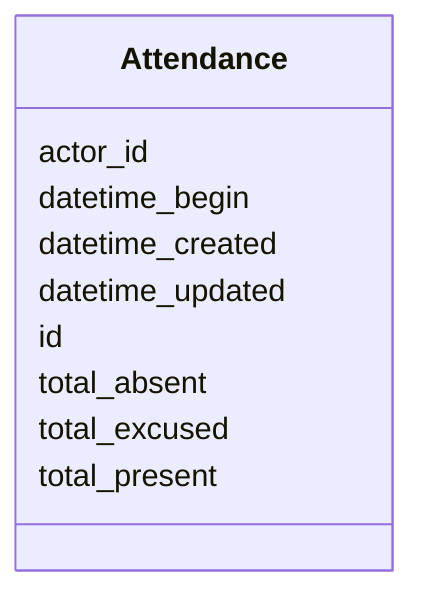


<!-- no inheritance hierarchy -->


## Slots

| Name | Cardinality and Range | Description | Inheritance |
| ---  | --- | --- | --- |
| [id](#id) | 1 <br/> [String](#String) |  | direct |
| [datetime_begin](#datetime_begin) | 0..1 <br/> [Datetime](#Datetime) | [en] The date and time when the meeting or voting begins | direct |
| [actor_id](#actor_id) | 0..1 <br/> [String](#String) | [en] The political body organized by the term of office (e | direct |
| [total_absent](#total_absent) | 0..1 <br/> [Integer](#Integer) | [en] Total number of absent members | direct |
| [total_present](#total_present) | 0..1 <br/> [Integer](#Integer) | Total number of members present | direct |
| [total_excused](#total_excused) | 0..1 <br/> [Integer](#Integer) | Total number of excused absences | direct |
| [datetime_updated](#datetime_updated) | 0..1 <br/> [Datetime](#Datetime) | The last time this record was updated | direct |
| [datetime_created](#datetime_created) | 0..1 <br/> [Datetime](#Datetime) | The time this record was created | direct |


## Usages

| used by | used in | type | used |
| ---  | --- | --- | --- |
| [Container](#Container) | [attendances](#attendances) | range | [Attendance](#Attendance) |


## Identifier and Mapping Information


### Schema Source


* from schema: https://ch.paf.link/schema/operations


## Mappings

| Mapping Type | Mapped Value |
| ---  | ---  |
| self | ops:Attendance |
| native | ops:Attendance |


## LinkML Source

<!-- TODO: investigate https://stackoverflow.com/questions/37606292/how-to-create-tabbed-code-blocks-in-mkdocs-or-sphinx -->

### Direct

<details>
```yaml
name: Attendance
description: '[en] Attendance record for a meeting or voting session.

  [de] Anwesenheitsliste für eine Sitzung oder Abstimmung.

  '
from_schema: https://ch.paf.link/schema/operations
slots:
- id
- datetime_begin
- actor_id
- total_absent
- total_present
- total_excused
- datetime_updated
- datetime_created

```
</details>

### Induced

<details>
```yaml
name: Attendance
description: '[en] Attendance record for a meeting or voting session.

  [de] Anwesenheitsliste für eine Sitzung oder Abstimmung.

  '
from_schema: https://ch.paf.link/schema/operations
attributes:
  id:
    name: id
    from_schema: https://ch.paf.link/schema/operations
    rank: 1000
    slot_uri: dcterm:identifier
    identifier: true
    alias: id
    owner: Attendance
    domain_of:
    - Container
    - Legislature
    - Session
    - Meeting
    - AgendaItem
    - Voting
    - IndividualVote
    - Election
    - Attendance
    - IndividualAttendance
    - Speech
    - TextSegment
    - Motion
    - Media
    range: string
    required: true
  datetime_begin:
    name: datetime_begin
    description: '[en] The date and time when the meeting or voting begins.

      [de] Das Datum und die Uhrzeit, zu der die Sitzung oder Abstimmung beginnt.

      '
    from_schema: https://ch.paf.link/schema/operations
    rank: 1000
    alias: datetime_begin
    owner: Attendance
    domain_of:
    - Voting
    - Election
    - Attendance
    - Speech
    range: datetime
  actor_id:
    name: actor_id
    description: '[en] The political body organized by the term of office (e.g., Regierungsrat,
      Nationalrat, Ständerat).

      [de] Das politische Organ, das durch die Amtsdauer organisiert wird (z.B. Regierungsrat,
      Nationalrat, Ständerat).

      '
    from_schema: https://ch.paf.link/schema/operations
    rank: 1000
    alias: actor_id
    owner: Attendance
    domain_of:
    - Legislature
    - Meeting
    - Voting
    - IndividualVote
    - Election
    - Attendance
    - IndividualAttendance
    - Speech
    range: string
  total_absent:
    name: total_absent
    description: '[en] Total number of absent members. Distinction between absent/excused
      absent - presence is tracked on attendance list.

      [de] Gesamtzahl abwesender Mitglieder. Unterscheidung zwischen abwesend/entschuldigt
      abwesend - Anwesenheit wird auf Anwesenheitsliste verfolgt.

      '
    from_schema: https://ch.paf.link/schema/operations
    rank: 1000
    alias: total_absent
    owner: Attendance
    domain_of:
    - Voting
    - Election
    - Attendance
    range: integer
  total_present:
    name: total_present
    description: Total number of members present
    from_schema: https://ch.paf.link/schema/operations
    rank: 1000
    alias: total_present
    owner: Attendance
    domain_of:
    - Attendance
    range: integer
  total_excused:
    name: total_excused
    description: Total number of excused absences
    from_schema: https://ch.paf.link/schema/operations
    rank: 1000
    alias: total_excused
    owner: Attendance
    domain_of:
    - Attendance
    range: integer
  datetime_updated:
    name: datetime_updated
    description: The last time this record was updated
    from_schema: https://ch.paf.link/schema/operations
    rank: 1000
    alias: datetime_updated
    owner: Attendance
    domain_of:
    - Legislature
    - Session
    - Meeting
    - AgendaItem
    - Voting
    - IndividualVote
    - Election
    - Attendance
    - IndividualAttendance
    - Speech
    range: datetime
  datetime_created:
    name: datetime_created
    description: The time this record was created
    from_schema: https://ch.paf.link/schema/operations
    rank: 1000
    alias: datetime_created
    owner: Attendance
    domain_of:
    - Legislature
    - Session
    - Meeting
    - AgendaItem
    - Voting
    - IndividualVote
    - Election
    - Attendance
    - IndividualAttendance
    - Speech
    range: datetime

```
</details>


# Class: IndividualAttendance 


_[en] Individual attendance record for a specific person._

_[de] Einzelne Anwesenheitsfeststellung für eine bestimmte Person._

__


URI: [ops:IndividualAttendance](https://ch.paf.link/schema/operations/IndividualAttendance)


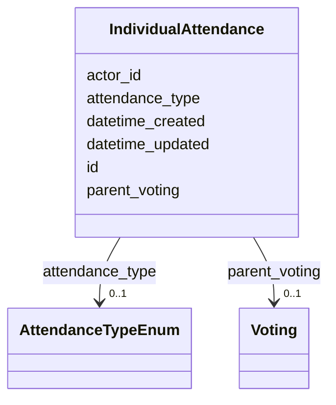


<!-- no inheritance hierarchy -->


## Slots

| Name | Cardinality and Range | Description | Inheritance |
| ---  | --- | --- | --- |
| [id](#id) | 1 <br/> [String](#String) |  | direct |
| [parent_voting](#parent_voting) | 0..1 <br/> [Voting](#Voting) | [en] The ID of the voting associated with the individual vote | direct |
| [actor_id](#actor_id) | 0..1 <br/> [String](#String) | [en] The political body organized by the term of office (e | direct |
| [attendance_type](#attendance_type) | 0..1 <br/> [AttendanceTypeEnum](#AttendanceTypeEnum) | Type of individual attendance | direct |
| [datetime_updated](#datetime_updated) | 0..1 <br/> [Datetime](#Datetime) | The last time this record was updated | direct |
| [datetime_created](#datetime_created) | 0..1 <br/> [Datetime](#Datetime) | The time this record was created | direct |


## Usages

| used by | used in | type | used |
| ---  | --- | --- | --- |
| [Container](#Container) | [individual_attendances](#individual_attendances) | range | [IndividualAttendance](#IndividualAttendance) |


## Identifier and Mapping Information


### Schema Source


* from schema: https://ch.paf.link/schema/operations


## Mappings

| Mapping Type | Mapped Value |
| ---  | ---  |
| self | ops:IndividualAttendance |
| native | ops:IndividualAttendance |


## LinkML Source

<!-- TODO: investigate https://stackoverflow.com/questions/37606292/how-to-create-tabbed-code-blocks-in-mkdocs-or-sphinx -->

### Direct

<details>
```yaml
name: IndividualAttendance
description: '[en] Individual attendance record for a specific person.

  [de] Einzelne Anwesenheitsfeststellung für eine bestimmte Person.

  '
from_schema: https://ch.paf.link/schema/operations
slots:
- id
- parent_voting
- actor_id
- attendance_type
- datetime_updated
- datetime_created

```
</details>

### Induced

<details>
```yaml
name: IndividualAttendance
description: '[en] Individual attendance record for a specific person.

  [de] Einzelne Anwesenheitsfeststellung für eine bestimmte Person.

  '
from_schema: https://ch.paf.link/schema/operations
attributes:
  id:
    name: id
    from_schema: https://ch.paf.link/schema/operations
    rank: 1000
    slot_uri: dcterm:identifier
    identifier: true
    alias: id
    owner: IndividualAttendance
    domain_of:
    - Container
    - Legislature
    - Session
    - Meeting
    - AgendaItem
    - Voting
    - IndividualVote
    - Election
    - Attendance
    - IndividualAttendance
    - Speech
    - TextSegment
    - Motion
    - Media
    range: string
    required: true
  parent_voting:
    name: parent_voting
    description: '[en] The ID of the voting associated with the individual vote.

      [de] Die ID der Abstimmung, die mit der Einzelstimme verbunden ist.

      '
    from_schema: https://ch.paf.link/schema/operations
    rank: 1000
    slot_uri: ops:parentVoting
    alias: parent_voting
    owner: IndividualAttendance
    domain_of:
    - IndividualVote
    - IndividualAttendance
    range: Voting
  actor_id:
    name: actor_id
    description: '[en] The political body organized by the term of office (e.g., Regierungsrat,
      Nationalrat, Ständerat).

      [de] Das politische Organ, das durch die Amtsdauer organisiert wird (z.B. Regierungsrat,
      Nationalrat, Ständerat).

      '
    from_schema: https://ch.paf.link/schema/operations
    rank: 1000
    alias: actor_id
    owner: IndividualAttendance
    domain_of:
    - Legislature
    - Meeting
    - Voting
    - IndividualVote
    - Election
    - Attendance
    - IndividualAttendance
    - Speech
    range: string
  attendance_type:
    name: attendance_type
    description: Type of individual attendance
    from_schema: https://ch.paf.link/schema/operations
    rank: 1000
    alias: attendance_type
    owner: IndividualAttendance
    domain_of:
    - IndividualAttendance
    range: attendance_type_enum
  datetime_updated:
    name: datetime_updated
    description: The last time this record was updated
    from_schema: https://ch.paf.link/schema/operations
    rank: 1000
    alias: datetime_updated
    owner: IndividualAttendance
    domain_of:
    - Legislature
    - Session
    - Meeting
    - AgendaItem
    - Voting
    - IndividualVote
    - Election
    - Attendance
    - IndividualAttendance
    - Speech
    range: datetime
  datetime_created:
    name: datetime_created
    description: The time this record was created
    from_schema: https://ch.paf.link/schema/operations
    rank: 1000
    alias: datetime_created
    owner: IndividualAttendance
    domain_of:
    - Legislature
    - Session
    - Meeting
    - AgendaItem
    - Voting
    - IndividualVote
    - Election
    - Attendance
    - IndividualAttendance
    - Speech
    range: datetime

```
</details>


ToDo: Michel

# Traktanden und Beschlüsse

Die Tagesordnung einer Sitzung wird durch Traktanden strukturiert. Zu jedem Traktandum können Anträge gestellt und Beschlüsse gefasst werden.

## AgendaItem (Traktandum)

### Zweck der Entität

AgendaItem strukturiert die Tagesordnung einer Sitzung und verbindet die zeitliche Organisation (Meeting) mit den inhaltlichen Geschäften (Affairs aus eCH-0295). Es ist die zentrale Entität zur Abbildung des Sitzungsablaufs.

### Hierarchie und Struktur

Agenda Items können hierarchisch organisiert sein, um die Struktur komplexer Tagesordnungen abzubilden:

```
Meeting (Sitzung vom 4. März 2024)
  ├─ AgendaItem 1: Mitteilungen und Begrüssung
  ├─ AgendaItem 2: Gesetzesberatungen
  │   ├─ AgendaItem 2.1: Energiegesetz (Detailberatung)
  │   ├─ AgendaItem 2.2: Energiegesetz (Schlussabstimmung)
  │   └─ AgendaItem 2.3: Gesundheitsgesetz (Eintretensdebatte)
  └─ AgendaItem 3: Verschiedenes
```

Die Hierarchie wird über das Feld **parent_agenda_item** abgebildet, das auf das übergeordnete Traktandum verweist.

### Identifikation und Nummerierung

- **id**: Eindeutiger Identifikator
- **number**: Traktandennummer auf der Tagesordnung (z.B. "2.1", "3")
- **position**: Sortierreihenfolge (für die Darstellung)
- **title**: Titel des Traktandums

### Typen von Agenda Items

Das Feld **agenda_item_type** unterscheidet verschiedene Arten:

- **item**: Ein reguläres Traktandum mit Beratung und ggf. Abstimmung
- **item_group**: Eine Gruppe von Traktanden (z.B. "Gesetzesberatungen")
- **note**: Informative Einträge ohne Abstimmung (z.B. "Mitteilungen")

### Beziehung zu parlamentarischen Geschäften

Das Feld **affairs** verweist auf die zugehörigen parlamentarischen Geschäfte gemäss eCH-0295. Ein Traktandum kann sich auf mehrere Geschäfte beziehen:

- **Einzelnes Geschäft**: Ein Traktandum behandelt eine spezifische Vorlage
- **Mehrere Geschäfte**: Ein Traktandum fasst zusammenhängende Geschäfte zusammen
- **Kein Geschäft**: Administrative Traktanden (z.B. "Genehmigung des Protokolls")

**Beispiel:** Das Traktandum "Energiegesetz - Schlussabstimmung" verweist auf das Geschäft "23.XXX Energiegesetz" in eCH-0295.

### Zeitliche Planung

- **date_time**: Geplanter Zeitpunkt der Behandlung
- **date_time_actual**: Tatsächlicher Zeitpunkt der Behandlung

Diese Unterscheidung ist wichtig, da:
- Die Tagesordnung im Voraus festgelegt wird
- Der tatsächliche Ablauf davon abweichen kann
- Traktanden vorgezogen, verschoben oder vertagt werden können

### Status und Ergebnis

#### Status
Das Feld **status** zeigt den Bearbeitungsstand:
- "pending": Noch nicht behandelt
- "in_progress": Aktuell in Beratung
- "completed": Behandlung abgeschlossen
- "postponed": Vertagt auf eine spätere Sitzung
- "withdrawn": Zurückgezogen

#### Ergebnis
Das Feld **result** erfasst das Ergebnis der Behandlung:
- "accepted": Angenommen
- "rejected": Abgelehnt
- "referred": Zurückgewiesen (z.B. an Kommission)
- "noted": Zur Kenntnis genommen
- "no_decision": Keine Beschlussfassung

### Kategorisierung

Das Feld **category** erlaubt die Gruppierung nach inhaltlichen Kriterien:
- "Gesetzgebung"
- "Budget und Finanzen"
- "Interpellationen und Anfragen"
- "Wahlen"
- "Diverses"

Diese Kategorisierung ist nicht standardisiert und kann je nach Föderaleinheit variieren.

### Resolutionen zu Traktanden

Das Feld **resolution** verweist auf die Resolution(en), die zu diesem Traktandum gefasst wurde(n). Eine Resolution dokumentiert den formalen Beschluss:

```
AgendaItem: "Energiegesetz - Schlussabstimmung"
  └─ Resolution: "Annahme des Energiegesetzes mit 120 zu 75 Stimmen bei 5 Enthaltungen"
      └─ Voting: Details der Abstimmung
```

### Beschreibung und URL

- **description**: Ausführliche Beschreibung des Traktandums
- **url**: Array von mehrsprachigen URLs zu Sitzungsunterlagen:
  - Botschaften und Berichte
  - Anträge
  - Änderungsanträge
  - Abstimmungsergebnisse

### Besonderheiten verschiedener Verfahren

#### Gesetzgebungsverfahren
Ein Geschäft durchläuft mehrere Traktanden:
1. Eintretensdebatte
2. Detailberatung
3. Schlussabstimmung
4. Ggf. Differenzbereinigung zwischen den Räten

#### Interpellationen und Anfragen
- Einreichung als Traktandum
- Antwort der Regierung
- Ggf. Diskussion

#### Wahlen
- Wahlvorschlag als Traktandum
- Durchführung der Wahl
- Verkündung des Ergebnisses

### Verknüpfung mit anderen Entitäten

Ein AgendaItem ist das zentrale Bindeglied zwischen:

- **Meeting**: Die Sitzung, in der es behandelt wird
- **Affairs** (eCH-0295): Die inhaltlichen Geschäfte
- **Resolution**: Der formale Beschluss
- **Voting**: Die Abstimmung(en) zum Traktandum
- **Speech**: Voten und Wortmeldungen zum Traktandum

### Anwendungsbeispiele

...

### Verwendungszwecke

1. Strukturierung des Sitzungsablaufs und Tagesordnung
2. Verknüpfung zwischen Meetings und Affairs (eCH-0295)
3. Dokumentation von Status und Ergebnis pro Traktandum
4. Grundlage für Sitzungsprotokolle und Publikationen


# Class: AgendaItem 


_[en] An agenda item of a meeting._

_[de] Ein Traktandum einer Sitzung.  _

__


URI: [ops:AgendaItem](https://ch.paf.link/schema/operations/AgendaItem)


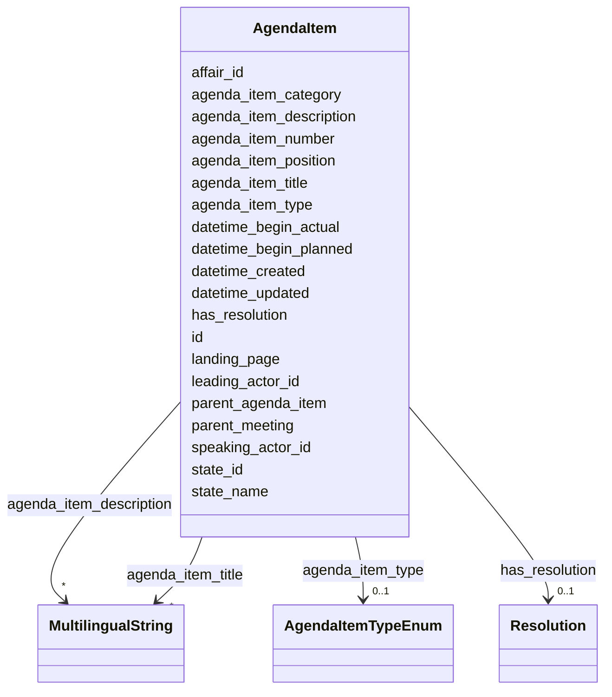


<!-- no inheritance hierarchy -->


## Slots

| Name | Cardinality and Range | Description | Inheritance |
| ---  | --- | --- | --- |
| [id](#id) | 1 <br/> [String](#String) |  | direct |
| [parent_meeting](#parent_meeting) | 0..1 <br/> [String](#String) | [en] The linked meeting ID that groups the current meeting | direct |
| [agenda_item_type](#agenda_item_type) | 0..1 <br/> [AgendaItemTypeEnum](#AgendaItemTypeEnum) | [en] Type of agenda item, distinguishing individual items from groups | direct |
| [datetime_begin_planned](#datetime_begin_planned) | 0..1 <br/> [Datetime](#Datetime) | [en] Planned date and time for the start of the meeting or agenda item | direct |
| [datetime_begin_actual](#datetime_begin_actual) | 0..1 <br/> [Datetime](#Datetime) | [en] Actual date and time for the start of the meeting or agenda item | direct |
| [agenda_item_number](#agenda_item_number) | 0..1 <br/> [String](#String) | [en] Sequential number of the agenda item (string type to support roman numer... | direct |
| [agenda_item_position](#agenda_item_position) | 0..1 <br/> [Integer](#Integer) | [en] Integer position of the agenda item in the meeting sequence | direct |
| [leading_actor_id](#leading_actor_id) | 0..1 <br/> [String](#String) | [en] The leading department for the agenda item | direct |
| [speaking_actor_id](#speaking_actor_id) | 0..1 <br/> [String](#String) | [en] The speaker or head of the department for the agenda item | direct |
| [agenda_item_title](#agenda_item_title) | * <br/> [MultilingualString](#MultilingualString) | [en] Title of the agenda item | direct |
| [affair_id](#affair_id) | 0..1 <br/> [String](#String) | [en] The connection to the affairs (business items) of the agenda item | direct |
| [agenda_item_description](#agenda_item_description) | * <br/> [MultilingualString](#MultilingualString) | [en] Subtitle or detailed description of the agenda item | direct |
| [state_id](#state_id) | 0..1 <br/> [String](#String) | State identifier (reference to state enum or custom state) | direct |
| [state_name](#state_name) | 0..1 <br/> [String](#String) | [en] Custom state description for the meeting | direct |
| [landing_page](#landing_page) | 0..1 <br/> [String](#String) | [en] URL providing further information | direct |
| [agenda_item_category](#agenda_item_category) | 0..1 <br/> [String](#String) | [en] Category for grouped agenda items (e | direct |
| [parent_agenda_item](#parent_agenda_item) | 0..1 <br/> [String](#String) | [en] If needed, this slot builds a hierarchy of agenda items | direct |
| [has_resolution](#has_resolution) | 0..1 <br/> [Resolution](#Resolution) | [en] The resolutionor decision taken on this agenda item | direct |
| [datetime_updated](#datetime_updated) | 0..1 <br/> [Datetime](#Datetime) | The last time this record was updated | direct |
| [datetime_created](#datetime_created) | 0..1 <br/> [Datetime](#Datetime) | The time this record was created | direct |


## Usages

| used by | used in | type | used |
| ---  | --- | --- | --- |
| [Container](#Container) | [agenda_items](#agenda_items) | range | [AgendaItem](#AgendaItem) |
| [JointDebate](#JointDebate) | [agenda_items](#agenda_items) | range | [AgendaItem](#AgendaItem) |


## Identifier and Mapping Information


### Schema Source


* from schema: https://ch.paf.link/schema/operations


## Mappings

| Mapping Type | Mapped Value |
| ---  | ---  |
| self | ops:AgendaItem |
| native | ops:AgendaItem |


## LinkML Source

<!-- TODO: investigate https://stackoverflow.com/questions/37606292/how-to-create-tabbed-code-blocks-in-mkdocs-or-sphinx -->

### Direct

<details>
```yaml
name: AgendaItem
description: "[en] An agenda item of a meeting.\n[de] Ein Traktandum einer Sitzung.\
  \  \n"
from_schema: https://ch.paf.link/schema/operations
slots:
- id
- parent_meeting
- agenda_item_type
- datetime_begin_planned
- datetime_begin_actual
- agenda_item_number
- agenda_item_position
- leading_actor_id
- speaking_actor_id
- agenda_item_title
- affair_id
- agenda_item_description
- state_id
- state_name
- landing_page
- agenda_item_category
- parent_agenda_item
- has_resolution
- datetime_updated
- datetime_created

```
</details>

### Induced

<details>
```yaml
name: AgendaItem
description: "[en] An agenda item of a meeting.\n[de] Ein Traktandum einer Sitzung.\
  \  \n"
from_schema: https://ch.paf.link/schema/operations
attributes:
  id:
    name: id
    from_schema: https://ch.paf.link/schema/operations
    rank: 1000
    slot_uri: dcterm:identifier
    identifier: true
    alias: id
    owner: AgendaItem
    domain_of:
    - Container
    - Legislature
    - Session
    - Meeting
    - AgendaItem
    - Voting
    - IndividualVote
    - Election
    - Attendance
    - IndividualAttendance
    - Speech
    - TextSegment
    - Motion
    - Media
    range: string
    required: true
  parent_meeting:
    name: parent_meeting
    description: '[en] The linked meeting ID that groups the current meeting.

      [de] Die verknüpfte Sitzungs-ID, die die aktuelle Sitzung gruppiert.

      '
    from_schema: https://ch.paf.link/schema/operations
    rank: 1000
    alias: parent_meeting
    owner: AgendaItem
    domain_of:
    - Meeting
    - AgendaItem
    - Voting
    - Election
    range: string
  agenda_item_type:
    name: agenda_item_type
    description: '[en] Type of agenda item, distinguishing individual items from groups.

      [de] Art des Traktandums, unterscheidet Einzeltraktanden von Traktandengruppen.

      '
    from_schema: https://ch.paf.link/schema/operations
    rank: 1000
    alias: agenda_item_type
    owner: AgendaItem
    domain_of:
    - AgendaItem
    range: agenda_item_type_enum
  datetime_begin_planned:
    name: datetime_begin_planned
    description: '[en] Planned date and time for the start of the meeting or agenda
      item.

      [de] Geplantes Datum und Uhrzeit für den Beginn der Sitzung oder des Tagesordnungspunkts.

      '
    from_schema: https://ch.paf.link/schema/operations
    rank: 1000
    alias: datetime_begin_planned
    owner: AgendaItem
    domain_of:
    - AgendaItem
    range: datetime
  datetime_begin_actual:
    name: datetime_begin_actual
    description: '[en] Actual date and time for the start of the meeting or agenda
      item.

      [de] Tatsächliches Datum und Uhrzeit für den Beginn der Sitzung oder des Tagesordnungspunkts.

      '
    from_schema: https://ch.paf.link/schema/operations
    rank: 1000
    alias: datetime_begin_actual
    owner: AgendaItem
    domain_of:
    - AgendaItem
    range: datetime
  agenda_item_number:
    name: agenda_item_number
    description: '[en] Sequential number of the agenda item (string type to support
      roman numerals).

      [de] Laufnummer des Traktandums (String-Typ zur Unterstützung römischer Ziffern).

      '
    from_schema: https://ch.paf.link/schema/operations
    rank: 1000
    alias: agenda_item_number
    owner: AgendaItem
    domain_of:
    - AgendaItem
    range: string
  agenda_item_position:
    name: agenda_item_position
    description: '[en] Integer position of the agenda item in the meeting sequence.

      [de] Ganzzahlige Position des Traktandums in der Sitzungsreihenfolge.

      '
    from_schema: https://ch.paf.link/schema/operations
    rank: 1000
    alias: agenda_item_position
    owner: AgendaItem
    domain_of:
    - AgendaItem
    range: integer
  leading_actor_id:
    name: leading_actor_id
    description: '[en] The leading department for the agenda item.

      [de] Das federführende Departement für den Tagesordnungspunkt.

      '
    from_schema: https://ch.paf.link/schema/operations
    rank: 1000
    alias: leading_actor_id
    owner: AgendaItem
    domain_of:
    - AgendaItem
    range: string
  speaking_actor_id:
    name: speaking_actor_id
    description: '[en] The speaker or head of the department for the agenda item.

      [de] Der Sprecher oder Departementsvorsteher für den Tagesordnungspunkt.

      '
    from_schema: https://ch.paf.link/schema/operations
    rank: 1000
    alias: speaking_actor_id
    owner: AgendaItem
    domain_of:
    - AgendaItem
    range: string
  agenda_item_title:
    name: agenda_item_title
    description: '[en] Title of the agenda item.

      [de] Titel des Traktandums.

      '
    from_schema: https://ch.paf.link/schema/operations
    rank: 1000
    alias: agenda_item_title
    owner: AgendaItem
    domain_of:
    - AgendaItem
    range: MultilingualString
    multivalued: true
    inlined: true
    inlined_as_list: true
  affair_id:
    name: affair_id
    description: '[en] The connection to the affairs (business items) of the agenda
      item.

      [de] Die Verbindung zu den Geschäften (Geschäftsgegenständen) des Tagesordnungspunkts.

      '
    from_schema: https://ch.paf.link/schema/operations
    rank: 1000
    alias: affair_id
    owner: AgendaItem
    domain_of:
    - AgendaItem
    - Voting
    - Election
    range: string
  agenda_item_description:
    name: agenda_item_description
    description: '[en] Subtitle or detailed description of the agenda item.

      [de] Untertitel oder ausführliche Beschreibung des Traktandums.

      '
    from_schema: https://ch.paf.link/schema/operations
    rank: 1000
    alias: agenda_item_description
    owner: AgendaItem
    domain_of:
    - AgendaItem
    range: MultilingualString
    multivalued: true
    inlined: true
    inlined_as_list: true
  state_id:
    name: state_id
    description: State identifier (reference to state enum or custom state)
    from_schema: https://ch.paf.link/schema/operations
    rank: 1000
    alias: state_id
    owner: AgendaItem
    domain_of:
    - AgendaItem
    range: string
  state_name:
    name: state_name
    description: '[en] Custom state description for the meeting.

      [de] Benutzerdefinierte Zustandsbeschreibung für die Sitzung.

      '
    from_schema: https://ch.paf.link/schema/operations
    rank: 1000
    alias: state_name
    owner: AgendaItem
    domain_of:
    - Meeting
    - AgendaItem
    range: string
  landing_page:
    name: landing_page
    description: '[en] URL providing further information.

      [de] URL mit weiteren Informationen.

      '
    from_schema: https://ch.paf.link/schema/operations
    rank: 1000
    slot_uri: ops:landingPage
    alias: landing_page
    owner: AgendaItem
    domain_of:
    - Legislature
    - Meeting
    - AgendaItem
    - Voting
    - Election
    - Speech
    range: string
  agenda_item_category:
    name: agenda_item_category
    description: '[en] Category for grouped agenda items (e.g., introduction, by department,
      technical agenda items).

      [de] Kategorie für gruppierte Traktanden (z.B. Einführung, nach Departement,
      technische Traktanden).

      '
    from_schema: https://ch.paf.link/schema/operations
    rank: 1000
    alias: agenda_item_category
    owner: AgendaItem
    domain_of:
    - AgendaItem
    range: string
  parent_agenda_item:
    name: parent_agenda_item
    description: '[en] If needed, this slot builds a hierarchy of agenda items.

      [de] Wenn erforderlich, baut dieser Slot eine Hierarchie von Tagesordnungspunkten
      auf.

      '
    from_schema: https://ch.paf.link/schema/operations
    rank: 1000
    alias: parent_agenda_item
    owner: AgendaItem
    domain_of:
    - AgendaItem
    - Voting
    - Election
    range: string
  has_resolution:
    name: has_resolution
    description: '[en] The resolutionor decision taken on this agenda item.

      [de] Die Resolution oder Entscheidung zu diesem Traktandum.

      '
    from_schema: https://ch.paf.link/schema/operations
    rank: 1000
    alias: has_resolution
    owner: AgendaItem
    domain_of:
    - AgendaItem
    range: Resolution
  datetime_updated:
    name: datetime_updated
    description: The last time this record was updated
    from_schema: https://ch.paf.link/schema/operations
    rank: 1000
    alias: datetime_updated
    owner: AgendaItem
    domain_of:
    - Legislature
    - Session
    - Meeting
    - AgendaItem
    - Voting
    - IndividualVote
    - Election
    - Attendance
    - IndividualAttendance
    - Speech
    range: datetime
  datetime_created:
    name: datetime_created
    description: The time this record was created
    from_schema: https://ch.paf.link/schema/operations
    rank: 1000
    alias: datetime_created
    owner: AgendaItem
    domain_of:
    - Legislature
    - Session
    - Meeting
    - AgendaItem
    - Voting
    - IndividualVote
    - Election
    - Attendance
    - IndividualAttendance
    - Speech
    range: datetime

```
</details>

## Resolution (Beschluss)

### Zweck der Entität

Die Resolution-Entität erfasst den formalen Beschluss zu einem Traktandum. Sie dokumentiert **was** entschieden wurde, während Voting dokumentiert **wie** (mit welchem Verfahren und Stimmenverhältnis) entschieden wurde.

### Beziehung zu AgendaItem und Voting

```
AgendaItem (Energiegesetz - Schlussabstimmung)
  ├─ Resolution (Annahme des Energiegesetzes)
  └─ Voting (120 Ja, 75 Nein, 5 Enthaltungen)
```

Ein AgendaItem kann mehrere Resolutions haben (z.B. bei mehreren Abstimmungen zum selben Traktandum). Jede Resolution referenziert typischerweise ein Voting, das die Abstimmungsdetails enthält.

### Typen von Resolutionen

Das **resolution_type**-Feld verwendet ein kontrolliertes Vokabular:

#### accepted
Das Traktandum wurde angenommen

**Anwendung:**
- Gesetzesvorlagen wurden angenommen
- Anträge wurden gutgeheissen
- Beschlüsse wurden gefasst

#### rejected
Das Traktandum wurde abgelehnt

**Anwendung:**
- Gesetzesvorlagen wurden abgelehnt
- Anträge wurden abgewiesen
- Ablehnungsbeschlüsse

#### referred_back
Rückweisung an ein anderes Gremium

**Anwendung:**
- Rückweisung an Kommission zur Überarbeitung
- Rückweisung an Regierung
- Zurück an andere Kammer (in Zweikammersystemen)

#### noted
Zur Kenntnis genommen

**Anwendung:**
- Berichte ohne Abstimmung
- Mitteilungen
- Informative Traktanden

#### postponed
Vertagt auf später

**Anwendung:**
- Aufschub der Behandlung
- Noch nicht entscheidungsreif
- Weitere Abklärungen nötig

#### withdrawn
Zurückgezogen

**Anwendung:**
- Antragsteller zieht Vorlage zurück
- Geschäft wird nicht weiterverfolgt

#### amended
Mit Änderungen angenommen

**Anwendung:**
- Gesetz mit Amendments angenommen
- Modifizierte Fassung beschlossen
- Kompromisslösung

#### no_decision
Kein Beschluss gefasst

**Anwendung:**
- Keine Mehrheit für irgendeinen Antrag
- Patt-Situation ohne Stichentscheid
- Nicht beschlussfähig

### Designentscheid: Warum separate Resolution-Entität?

**Alternative wäre gewesen:** Resolution-Typ direkt im AgendaItem speichern.

**Gründe für separate Entität:**

1. **Mehrere Beschlüsse pro Traktandum**: Ein Traktandum kann mehrere Beschlüsse haben (z.B. erst Änderungsantrag, dann Gesamtabstimmung)

2. **Strukturierte Verknüpfung zu Votings**: Klare 1:1-Beziehung zwischen Resolution und Voting

3. **Mehrsprachige Beschlusstexte**: Resolution kann ausführliche Beschlusstexte in mehreren Sprachen enthalten

4. **Zeitliche Flexibilität**: Resolution kann zeitlich vom AgendaItem getrennt erfasst werden

### Beschlusstext

- **title**: Kurze Zusammenfassung des Beschlusses
- **description**: Ausführlicher Beschlusstext

**Beispiel:**
- title: "Annahme Energiegesetz"
- description: "Der Nationalrat nimmt das Bundesgesetz über die Energiewende in der Fassung der Kommission mit 120 zu 75 Stimmen bei 5 Enthaltungen an."

### Verknüpfung zur Abstimmung

Das Feld **voting_id** verweist auf das zugehörige Voting, das die Abstimmungsdetails enthält:

- Stimmenverhältnis
- Abstimmungsverfahren
- Einzelstimmen (bei namentlichen Abstimmungen)

**Nicht alle Resolutions haben ein Voting:**
- "Zur Kenntnis genommen" erfolgt oft ohne formale Abstimmung
- Stille Annahmen
- Administrativbeschlüsse

### Zeitstempel

- **datetime_created**: Zeitpunkt des Beschlusses
- **datetime_updated**: Letzte Änderung (z.B. bei Korrekturen)

### URLs und Dokumentation

Das Feld **url** kann auf weiterführende Dokumente verweisen:
- Detaillierte Beschlusstexte
- Begründungen
- Rechtliche Grundlagen

### Anwendungsfälle in verschiedenen Kontexten

#### Gesetzgebungsverfahren
Mehrere Resolutions zu verschiedenen Phasen:
1. Resolution "Eintreten" (accepted/rejected)
2. Resolution zu Artikel 1 (accepted/amended)
3. Resolution zu Artikel 2 (accepted)
4. Resolution Gesamtabstimmung (accepted/rejected)

#### Differenzbereinigung (Zweikammersystem)
- Resolution "Zustimmung zur Fassung des Erstrats"
- Resolution "Festhalten an eigener Fassung"
- Resolution "Annahme Kompromissvorschlag"

#### Kommissionsarbeit
- Resolution "Rückweisung an Kommission mit Zusatzauftrag"
- Resolution "Annahme Kommissionsbericht"

### Technische Überlegungen

#### Granularität
Die Granularität der Resolution-Erfassung variiert:
- **Detailliert**: Jede Einzelabstimmung erhält eigene Resolution
- **Aggregiert**: Nur finaler Beschluss wird erfasst

Der Standard erlaubt beide Ansätze.

#### Mehrsprachigkeit
Bei mehrsprachigen Parlamenten (CH, BE, etc.) müssen Beschlusstexte in allen Amtssprachen erfasst werden. Dies erfolgt über MultilingualString-Arrays in title und description.

### Verwendungszwecke

1. **Offizielle Dokumentation**: Was wurde entschieden?
2. **Rechtliche Verbindlichkeit**: Formaler Beschlussnachweis
3. **Öffentliche Information**: Verständliche Zusammenfassung komplexer Abstimmungen
4. **Geschäftsführung**: Nachverfolgung von Beschlüssen und deren Umsetzung
5. **Statistische Auswertung**: Annahme-/Ablehnungsquoten


# Class: Resolution 


_[en] A resolutionor decision taken on an agenda item, including voting procedures._

_[de] Eine Resolution oder Entscheidung zu einem Traktandum, einschließlich Abstimmungsverfahren._

__


URI: [ops:Resolution](https://ch.paf.link/schema/operations/Resolution)


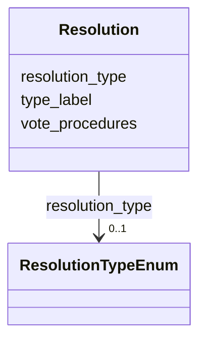


<!-- no inheritance hierarchy -->


## Slots

| Name | Cardinality and Range | Description | Inheritance |
| ---  | --- | --- | --- |
| [resolution_type](#resolution_type) | 0..1 <br/> [ResolutionTypeEnum](#ResolutionTypeEnum) | [en] Type of resolutiontaken on the agenda item | direct |
| [type_label](#type_label) | 0..1 <br/> [String](#String) | [en] Custom type label when standard type values don't apply | direct |
| [vote_procedures](#vote_procedures) | * <br/> [String](#String) | [en] Procedures for voting, such as secret ballot or open vote | direct |


## Usages

| used by | used in | type | used |
| ---  | --- | --- | --- |
| [Container](#Container) | [resolutions](#resolutions) | range | [Resolution](#Resolution) |
| [AgendaItem](#AgendaItem) | [has_resolution](#has_resolution) | range | [Resolution](#Resolution) |


## Identifier and Mapping Information


### Schema Source


* from schema: https://ch.paf.link/schema/operations


## Mappings

| Mapping Type | Mapped Value |
| ---  | ---  |
| self | ops:Resolution |
| native | ops:Resolution |


## LinkML Source

<!-- TODO: investigate https://stackoverflow.com/questions/37606292/how-to-create-tabbed-code-blocks-in-mkdocs-or-sphinx -->

### Direct

<details>
```yaml
name: Resolution
description: '[en] A resolutionor decision taken on an agenda item, including voting
  procedures.

  [de] Eine Resolution oder Entscheidung zu einem Traktandum, einschließlich Abstimmungsverfahren.

  '
from_schema: https://ch.paf.link/schema/operations
slots:
- resolution_type
- type_label
- vote_procedures

```
</details>

### Induced

<details>
```yaml
name: Resolution
description: '[en] A resolutionor decision taken on an agenda item, including voting
  procedures.

  [de] Eine Resolution oder Entscheidung zu einem Traktandum, einschließlich Abstimmungsverfahren.

  '
from_schema: https://ch.paf.link/schema/operations
attributes:
  resolution_type:
    name: resolution_type
    description: '[en] Type of resolutiontaken on the agenda item.

      [de] Art der Resolution zum Traktandum.

      '
    from_schema: https://ch.paf.link/schema/operations
    rank: 1000
    alias: resolution_type
    owner: Resolution
    domain_of:
    - Resolution
    range: resolution_type_enum
  type_label:
    name: type_label
    description: '[en] Custom type label when standard type values don''t apply.

      [de] Benutzerdefinierte Typbezeichnung, wenn Standardtypwerte nicht zutreffen.

      '
    from_schema: https://ch.paf.link/schema/operations
    rank: 1000
    alias: type_label
    owner: Resolution
    domain_of:
    - Resolution
    - Voting
    - IndividualVote
    - Election
    range: string
  vote_procedures:
    name: vote_procedures
    description: '[en] Procedures for voting, such as secret ballot or open vote.

      [de] Verfahren für die Abstimmung, wie geheime Abstimmung oder offene Abstimmung.

      '
    from_schema: https://ch.paf.link/schema/operations
    rank: 1000
    alias: vote_procedures
    owner: Resolution
    domain_of:
    - Resolution
    range: string
    multivalued: true
    inlined: true
    inlined_as_list: true

```
</details>

## Motion (Anträge)

### Zweck

Erfasst Anträge, die während der Sitzung gestellt werden (Änderungsanträge, Verfahrensanträge, etc.).

### Struktur

- **motion_type**: Art des Antrags
  - **amendment**: Änderungsantrag zu Gesetzestext
  - **procedural**: Verfahrensantrag (z.B. Schluss der Debatte)
  - **referral**: Rückweisungsantrag
  - **other**: Sonstige Anträge
- **title**: Kurztitel des Antrags
- **description**: Vollständiger Antragstext
- **proposer_person_id**: Antragsteller/in
- **seconder_person_id**: Mitstimmende (falls erforderlich)
- **result**: Ergebnis (accepted, rejected, withdrawn)

### Designentscheid

**Warum eigene Entität statt nur in AgendaItem?**
- Ein Traktandum kann mehrere Anträge enthalten
- Anträge haben eigene Lifecycle (gestellt, unterstützt, abgestimmt)
- Strukturierte Erfassung von Antragsteller und Unterstützern
- Separate Abstimmungen pro Antrag möglich

### Anwendung

Verknüpft mit AgendaItem und optional mit Voting:

```
AgendaItem (Energiegesetz - Art. 15)
  ├─ Motion (Änderungsantrag Person A)
  │   └─ Voting (Abstimmung über Änderungsantrag)
  ├─ Motion (Änderungsantrag Person B)
  │   └─ Voting (Abstimmung über Änderungsantrag)
  └─ Voting (Abstimmung über Artikel in Gesamtheit)
```


# Class: Motion 


_[en] A formal proposal or motion submitted during proceedings._

_[de] Ein formeller Antrag, der während der Verhandlungen eingereicht wird._

__


URI: [ops:Motion](https://ch.paf.link/schema/operations/Motion)


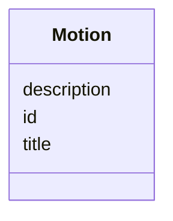


<!-- no inheritance hierarchy -->


## Slots

| Name | Cardinality and Range | Description | Inheritance |
| ---  | --- | --- | --- |
| [id](#id) | 1 <br/> [String](#String) |  | direct |
| [title](#title) | 0..1 <br/> [String](#String) |  | direct |
| [description](#description) | 0..1 <br/> [String](#String) |  | direct |


## Identifier and Mapping Information


### Schema Source


* from schema: https://ch.paf.link/schema/operations


## Mappings

| Mapping Type | Mapped Value |
| ---  | ---  |
| self | ops:Motion |
| native | ops:Motion |


## LinkML Source

<!-- TODO: investigate https://stackoverflow.com/questions/37606292/how-to-create-tabbed-code-blocks-in-mkdocs-or-sphinx -->

### Direct

<details>
```yaml
name: Motion
description: '[en] A formal proposal or motion submitted during proceedings.

  [de] Ein formeller Antrag, der während der Verhandlungen eingereicht wird.

  '
from_schema: https://ch.paf.link/schema/operations
slots:
- id
- title
- description

```
</details>

### Induced

<details>
```yaml
name: Motion
description: '[en] A formal proposal or motion submitted during proceedings.

  [de] Ein formeller Antrag, der während der Verhandlungen eingereicht wird.

  '
from_schema: https://ch.paf.link/schema/operations
attributes:
  id:
    name: id
    from_schema: https://ch.paf.link/schema/operations
    rank: 1000
    slot_uri: dcterm:identifier
    identifier: true
    alias: id
    owner: Motion
    domain_of:
    - Container
    - Legislature
    - Session
    - Meeting
    - AgendaItem
    - Voting
    - IndividualVote
    - Election
    - Attendance
    - IndividualAttendance
    - Speech
    - TextSegment
    - Motion
    - Media
    range: string
    required: true
  title:
    name: title
    from_schema: https://ch.paf.link/schema/operations
    rank: 1000
    alias: title
    owner: Motion
    domain_of:
    - Election
    - Motion
    - Media
    range: string
  description:
    name: description
    from_schema: https://ch.paf.link/schema/operations
    rank: 1000
    alias: description
    owner: Motion
    domain_of:
    - Legislature
    - Meeting
    - Motion
    range: string

```
</details>

ToDo: Nicole

# Abstimmungen und Wahlen

Parlamentarische Beschlussfassungen erfolgen entweder durch Abstimmungen über Sachfragen oder durch Wahlen von Personen. Der Standard unterscheidet diese beiden Mechanismen klar und erfasst bei offenen Verfahren zudem das individuelle Stimm- und Wahlverhalten jedes Parlamentsmitglieds. Parlamentspräsidentinnen oder Parlamentspräsidenten nehmen an Abstimmungen grundsätzlich nicht teil; sie stimmen nur bei Wahlen mit. Bei Abstimmungen mit Stimmengleichstand fällen sie den Stichentscheid. 

## Voting (Abstimmung)

## Zweck der Entität

"Voting" erfasst den Abstimmungsprozess und das Ergebnis einer formalen Entscheidung im Parlament. Die Entität dokumentiert sowohl den Abstimmungsgegenstand (Frage), als auch das Verfahren (wie wurde abgestimmt) und das Resultat (mit welchem Stimmenverhältnis).

## Arten von Abstimmungen

Der Standard unterscheidet verschiedene Abstimmungstypen über das Feld **voting_type**:

### intermediate
Zwischenabstimmungen während der Beratung.

**Beispiele:**
- Abstimmung über Eintreten auf ein Geschäft
- Abstimmung über einen Antrag
- Gegenüberstellung von zwei Anträgen, die sich gegenseitig ausschliessen oder sich auf denselben Textabschnitt beziehen
- Eventualabstimmung wenn zu einem Abstimmungsgegenstand mehr als zwei Anträge vorliegen
- Punktweise Abstimmung über einen Vorstoss (Nicole: eine punktweise Abstimmung ist keine Zwischenabstimmung, denn es gibt dabei keine Schlussabstimmung oder ein Endresultat über alle Punkte).
- Abstimmung über einen einzelnen Artikel eines Gesetzes
- Gesamtabstimmung nach der ersten Lesung eines Erlasses, der in zwei Lesungen beraten wird

### final
Schlussabstimmung über die gesamte Vorlage

**Beispiele:**
- Schlussabstimmung nach der letzten Lesung eines Erlasses 
- Gesamtabstimmung über einen Beschluss
- Annahme oder Ablehnung einer Vorlage in ihrer Gesamtheit

### casting
Stichentscheid des/der Vorsitzenden bei Stimmengleichheit. Vorsitzende nehmen an Abstimmungen nicht teil, haben bei Stimmengleichheit jedoch den Stichentscheid. Bei geheimer Abstimmung gilt bei Stimmengleichheit der Antrag des vorberatenden Ratsorgans als angenommen. 

### secret
Geheime Stimmabgabe bei Abstimmungen und Wahlen

**Anwendung:**
- Wahl von Personen
- Abstimmung über besonders heikles Sachgeschäft wie Gnadengesuch oder Aufhebung der Immunität
- Abstimmung nach geheimer Beratung
- Geheime Abstimmung auf Antrag 

## Struktur einer Abstimmung

Eine Abstimmung ist immer einer Sitzungsphase und/oder einer Sitzung, einem Traktandum (Agenda-Item) und einem Geschäft mit Geschäftsnummer zugeordnet. Sie umfasst den Abstimmungstyp, den Abstimmungsgegenstand (Frage), das Ergebnis und – bei nicht geheimer Abstimmung – die Einzelstimmen der Mitglieder. 
Sie kann entweder:

```
AgendaItem (15) Geschäft (Energiegesetz - Art. 15)
  └─ Voting (Zwischenabstimmung über Art. 15)
      ├─ IndividualVote (Person A: Ja)
      ├─ IndividualVote (Person B: Nein)
      └─ IndividualVote (Person C: Ja)
```


Beispiel Auswahl:
3 Optionen: https://www.gemeinderat-zuerich.ch/abstimmungen/detail.php?aid=aa10c137274f424fa4eda877e7644a89
5 Optionen: https://www.gemeinderat-zuerich.ch/abstimmungen/detail.php?aid=23f01ba9b3f3410cb9cfb85f32f3dfe0

## Abstimmungsverfahren

Das Feld **procedure** beschreibt die Art der Durchführung:

### Open procedures (Offene Abstimmungen)
- **show_of_hands**: Handzeichen (traditionell)
- **standing**: Aufstehen (seltener)
- **electronic**: Elektronische Abstimmung (häufig auf Bundesebene und Kantonsebene)
- **roll_call**: Namentliche Abstimmung mit Namensaufruf
  
***[Nicole: Die folgenden Abstimmungstypen haben wir vergessen]***
- **remote_voting**: Externe Stimmabgabe bei Krisen (Ratsmitglieder geben ihre Stimme dem Parlamentspräsidium im Vorfeld des Sitzungstags bekannt. Die extern abgegebenen Stimmen werden gleichzeitig mit der im Rat laufenden Abstimmung erfasst.
- **circulation_voting**: Zirkulationsverfahren bei Krisen (Das Parlamentspräsidium führt die Abstimmung im Zirkulationsverfahren durch und informiert über das Ergebnis)
- **virtual_voting**: Stimmabgabe an virtuellen Sitzungen in Krisenfällen.

### Secret procedures (Geheime Abstimmungen)
- **secret_ballot**: Geheime Wahl mit Stimmzetteln
- **electronic_secret**: Elektronische geheime Abstimmung

Die Wahl des Verfahrens beeinflusst, ob Einzelstimmen erfasst werden können:
- Offene Verfahren: Einzelstimmen dokumentierbar
- Geheime Verfahren: Nur Gesamtergebnis verfügbar


## Abstimmungsergebnis

Das Ergebnis wird auf zwei Arten erfasst:

### Gesamtergebnis (result)
- **passed**: Angenommen
- **failed**: Abgelehnt
- **tied**: Stimmengleichheit

### Detaillierte Zahlen
- **yes_count**: Anzahl Ja-Stimmen
- **no_count**: Anzahl Nein-Stimmen
- **abstention_count**: Anzahl Enthaltungen
- **absent_count**: Anzahl Abwesende (die nicht abstimmen konnten)
- **total_count**: Gesamtzahl der abstimmenden Mitglieder

**Beispiel:**
- Ja: 120
- Nein: 75
- Enthaltungen: 5
- Abwesend: 0
- Total: 200
- Ergebnis: passed

## Mehrheitstypen

Das Feld **majority_type** definiert die erforderliche Mehrheit:

### simple
Einfache Mehrheit (mehr Ja als Nein)

**Anwendung:**
- Standardfall für die meisten Beschlüsse
- Enthaltungen zählen nicht mit

**Beispiel:** 100 Ja, 80 Nein, 20 Enthaltungen → Angenommen

### absolute
Absolute Mehrheit (mehr als die Hälfte aller Mitglieder)

**Anwendung:**
- Wahlen
- Verfassungsänderungen in einigen Kantonen
- Besonders wichtige Beschlüsse

**Beispiel:** Bei 200 Mitgliedern sind mindestens 101 Ja-Stimmen erforderlich

### two_thirds
Zweidrittelmehrheit

**Anwendung:**
- Dringlichkeitsklauseln auf Bundesebene
- Verfassungsänderungen in einigen Kantonen
- Aufhebung der Immunität

**Beispiel:** Bei 200 Mitgliedern sind mindestens 134 Ja-Stimmen erforderlich

### qualified
Qualifizierte Mehrheit (andere Schwellenwerte)

**Anwendung:**
- Spezielle Anforderungen in einzelnen Kantonen oder Gemeinden
- Das konkrete Quorum wird in **majority_threshold** angegeben

## Schwellenwert

Das Feld **majority_threshold** gibt bei qualifizierten Mehrheiten den genauen Schwellenwert an (z.B. 0.6 für 60%).

## Quorum

Das Feld **quorum** definiert die Mindestanzahl anwesender Mitglieder für die Beschlussfähigkeit:

**Beispiel:** Ein Parlament mit 200 Mitgliedern ist beschlussfähig, wenn mindestens 100 Mitglieder anwesend sind (quorum: 100).

## Namentliche Abstimmungen
***[Nicole: "nominal" ist in diesem Zusammenhang unüblich - besser "named_vote" oder "is_named"]***
Das Feld **is_nominal** zeigt an, ob es sich um eine namentliche Abstimmung handelt: 

- **true**: Die Einzelstimmen werden erfasst und publiziert
- **false**: Nur das Gesamtergebnis wird erfasst

Namentliche Abstimmungen sind wichtig für:
- Transparenz des Abstimmungsverhaltens
- Analyse von Abstimmungsmustern
- Rechenschaftspflicht gegenüber Wählerinnen

## Beziehung zu Einzelstimmen

Bei namentlichen Abstimmungen verweist die Voting-Entität auf die einzelnen IndividualVote-Entitäten:

```
Voting
  ├─ IndividualVote (Person A)
  ├─ IndividualVote (Person B)
  └─ ...
```

**Beispiel:** Namensliste in Akkordeon https://www.tagblatt.gr.be.ch/shareparl?agendaItemUid=e65d81c90d1d43deb19ef078f7e363f3&segmentType=vote&unitName=default&scroll=true&autoplay=false 


## Beschreibung und Dokumentation

- **description**: Beschreibung worüber abgestimmt wurde
- **url**: Mehrsprachige URLs zu Abstimmungsdetails

## Zeitstempel

- **datetime_created**: Zeitpunkt der Durchführung der Abstimmung
- **datetime_updated**: Letzte Aktualisierung (z.B. bei Korrekturen)


# Class: Voting 


_[en] A voting procedure with individual votes and results._

_[de] Ein Abstimmungsverfahren mit Einzelstimmen und Ergebnissen._

__


URI: [ops:Voting](https://ch.paf.link/schema/operations/Voting)


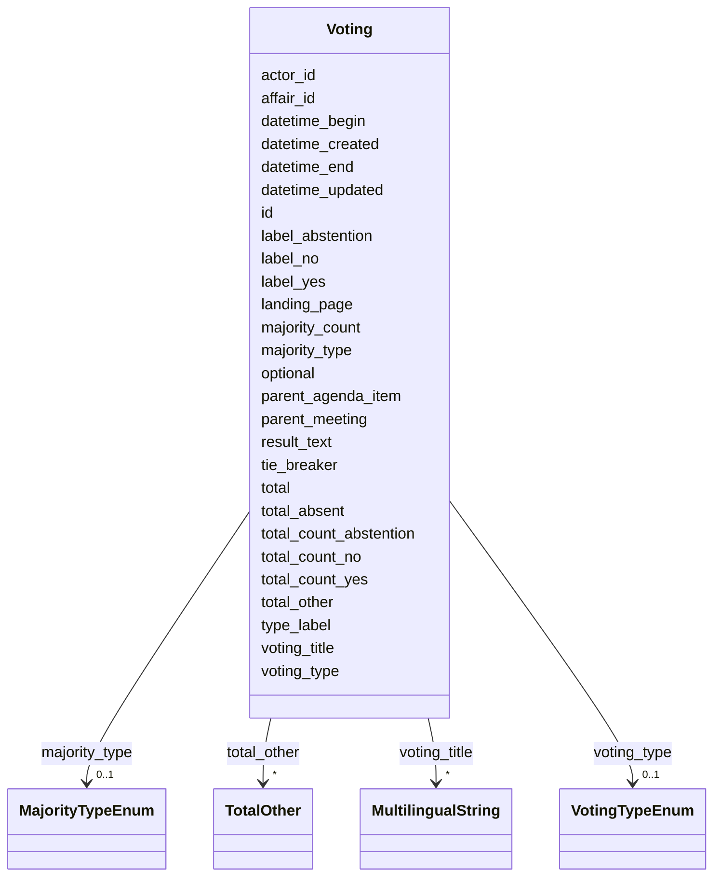


<!-- no inheritance hierarchy -->


## Slots

| Name | Cardinality and Range | Description | Inheritance |
| ---  | --- | --- | --- |
| [id](#id) | 1 <br/> [String](#String) |  | direct |
| [datetime_begin](#datetime_begin) | 0..1 <br/> [Datetime](#Datetime) | [en] The date and time when the meeting or voting begins | direct |
| [datetime_end](#datetime_end) | 0..1 <br/> [Datetime](#Datetime) | [en] The date and time when the meeting or voting ends | direct |
| [voting_type](#voting_type) | 0..1 <br/> [VotingTypeEnum](#VotingTypeEnum) | [en] Type of voting procedure (preliminary, final, secret, etc | direct |
| [type_label](#type_label) | 0..1 <br/> [String](#String) | [en] Custom type label when standard type values don't apply | direct |
| [voting_title](#voting_title) | * <br/> [MultilingualString](#MultilingualString) | [en] Title or question being voted on | direct |
| [optional](#optional) | 0..1 <br/> [Boolean](#Boolean) | [en] Indicates if the meeting or voting is optional | direct |
| [landing_page](#landing_page) | 0..1 <br/> [String](#String) | [en] URL providing further information | direct |
| [label_yes](#label_yes) | 0..1 <br/> [String](#String) | [en] Meaning of a 'yes' vote | direct |
| [label_no](#label_no) | 0..1 <br/> [String](#String) | [en] Meaning of a 'no' vote | direct |
| [label_abstention](#label_abstention) | 0..1 <br/> [String](#String) | [en] Meaning of an 'abstention' vote | direct |
| [tie_breaker](#tie_breaker) | 0..1 <br/> [Boolean](#Boolean) | [en] Indicates if a tie-breaker was used in the voting | direct |
| [total_count_yes](#total_count_yes) | 0..1 <br/> [Integer](#Integer) | [en] Total number of 'yes' votes | direct |
| [total_count_no](#total_count_no) | 0..1 <br/> [Integer](#Integer) | [en] Total number of 'no' votes | direct |
| [total_count_abstention](#total_count_abstention) | 0..1 <br/> [Integer](#Integer) | [en] Total number of abstentions | direct |
| [total_other](#total_other) | * <br/> [TotalOther](#TotalOther) | [en] Used when multiple options are presented for voting (e | direct |
| [total_absent](#total_absent) | 0..1 <br/> [Integer](#Integer) | [en] Total number of absent members | direct |
| [total](#total) | 0..1 <br/> [Integer](#Integer) | [en] Total number of votes, excluding absent and president's vote | direct |
| [majority_type](#majority_type) | 0..1 <br/> [MajorityTypeEnum](#MajorityTypeEnum) | [en] Type of majority required for the vote (absolute, two-thirds, etc | direct |
| [majority_count](#majority_count) | 0..1 <br/> [Integer](#Integer) | [en] Number of votes required for the relevant majority threshold | direct |
| [result_text](#result_text) | 0..1 <br/> [String](#String) | [en] Free text describing the outcome of the vote, e | direct |
| [parent_meeting](#parent_meeting) | 0..1 <br/> [String](#String) | [en] The linked meeting ID that groups the current meeting | direct |
| [parent_agenda_item](#parent_agenda_item) | 0..1 <br/> [String](#String) | [en] If needed, this slot builds a hierarchy of agenda items | direct |
| [affair_id](#affair_id) | 0..1 <br/> [String](#String) | [en] The connection to the affairs (business items) of the agenda item | direct |
| [actor_id](#actor_id) | 0..1 <br/> [String](#String) | [en] The political body organized by the term of office (e | direct |
| [datetime_updated](#datetime_updated) | 0..1 <br/> [Datetime](#Datetime) | The last time this record was updated | direct |
| [datetime_created](#datetime_created) | 0..1 <br/> [Datetime](#Datetime) | The time this record was created | direct |


## Usages

| used by | used in | type | used |
| ---  | --- | --- | --- |
| [Container](#Container) | [votings](#votings) | range | [Voting](#Voting) |
| [IndividualVote](#IndividualVote) | [parent_voting](#parent_voting) | range | [Voting](#Voting) |
| [IndividualAttendance](#IndividualAttendance) | [parent_voting](#parent_voting) | range | [Voting](#Voting) |


## Identifier and Mapping Information


### Schema Source


* from schema: https://ch.paf.link/schema/operations


## Mappings

| Mapping Type | Mapped Value |
| ---  | ---  |
| self | ops:Voting |
| native | ops:Voting |


## LinkML Source

<!-- TODO: investigate https://stackoverflow.com/questions/37606292/how-to-create-tabbed-code-blocks-in-mkdocs-or-sphinx -->

### Direct

<details>
```yaml
name: Voting
description: '[en] A voting procedure with individual votes and results.

  [de] Ein Abstimmungsverfahren mit Einzelstimmen und Ergebnissen.

  '
from_schema: https://ch.paf.link/schema/operations
slots:
- id
- datetime_begin
- datetime_end
- voting_type
- type_label
- voting_title
- optional
- landing_page
- label_yes
- label_no
- label_abstention
- tie_breaker
- total_count_yes
- total_count_no
- total_count_abstention
- total_other
- total_absent
- total
- majority_type
- majority_count
- result_text
- parent_meeting
- parent_agenda_item
- affair_id
- actor_id
- datetime_updated
- datetime_created

```
</details>

### Induced

<details>
```yaml
name: Voting
description: '[en] A voting procedure with individual votes and results.

  [de] Ein Abstimmungsverfahren mit Einzelstimmen und Ergebnissen.

  '
from_schema: https://ch.paf.link/schema/operations
attributes:
  id:
    name: id
    from_schema: https://ch.paf.link/schema/operations
    rank: 1000
    slot_uri: dcterm:identifier
    identifier: true
    alias: id
    owner: Voting
    domain_of:
    - Container
    - Legislature
    - Session
    - Meeting
    - AgendaItem
    - Voting
    - IndividualVote
    - Election
    - Attendance
    - IndividualAttendance
    - Speech
    - TextSegment
    - Motion
    - Media
    range: string
    required: true
  datetime_begin:
    name: datetime_begin
    description: '[en] The date and time when the meeting or voting begins.

      [de] Das Datum und die Uhrzeit, zu der die Sitzung oder Abstimmung beginnt.

      '
    from_schema: https://ch.paf.link/schema/operations
    rank: 1000
    alias: datetime_begin
    owner: Voting
    domain_of:
    - Voting
    - Election
    - Attendance
    - Speech
    range: datetime
  datetime_end:
    name: datetime_end
    description: '[en] The date and time when the meeting or voting ends.

      [de] Das Datum und die Uhrzeit, zu der die Sitzung oder Abstimmung endet.

      '
    from_schema: https://ch.paf.link/schema/operations
    rank: 1000
    alias: datetime_end
    owner: Voting
    domain_of:
    - Voting
    - Election
    - Speech
    range: datetime
  voting_type:
    name: voting_type
    description: '[en] Type of voting procedure (preliminary, final, secret, etc.).

      [de] Art des Abstimmungsverfahrens (Zwischen-, Schlussabstimmung, geheim, etc.).

      '
    from_schema: https://ch.paf.link/schema/operations
    rank: 1000
    alias: voting_type
    owner: Voting
    domain_of:
    - Voting
    range: voting_type_enum
  type_label:
    name: type_label
    description: '[en] Custom type label when standard type values don''t apply.

      [de] Benutzerdefinierte Typbezeichnung, wenn Standardtypwerte nicht zutreffen.

      '
    from_schema: https://ch.paf.link/schema/operations
    rank: 1000
    alias: type_label
    owner: Voting
    domain_of:
    - Resolution
    - Voting
    - IndividualVote
    - Election
    range: string
  voting_title:
    name: voting_title
    description: '[en] Title or question being voted on. If no specific subject exists,
      do not use the business item title.

      [de] Abstimmungstitel bzw. Gegenstand oder Frage. Wenn kein Gegenstand vorhanden
      ist, sollte nicht der Geschäftstitel verwendet werden.

      '
    from_schema: https://ch.paf.link/schema/operations
    rank: 1000
    alias: voting_title
    owner: Voting
    domain_of:
    - Voting
    range: MultilingualString
    multivalued: true
    inlined: true
    inlined_as_list: true
  optional:
    name: optional
    description: '[en] Indicates if the meeting or voting is optional.

      [de] Gibt an, ob die Sitzung oder Abstimmung optional ist.

      '
    from_schema: https://ch.paf.link/schema/operations
    rank: 1000
    alias: optional
    owner: Voting
    domain_of:
    - Voting
    range: boolean
  landing_page:
    name: landing_page
    description: '[en] URL providing further information.

      [de] URL mit weiteren Informationen.

      '
    from_schema: https://ch.paf.link/schema/operations
    rank: 1000
    slot_uri: ops:landingPage
    alias: landing_page
    owner: Voting
    domain_of:
    - Legislature
    - Meeting
    - AgendaItem
    - Voting
    - Election
    - Speech
    range: string
  label_yes:
    name: label_yes
    description: '[en] Meaning of a ''yes'' vote.

      [de] Bedeutung einer ''Ja''-Stimme.

      '
    from_schema: https://ch.paf.link/schema/operations
    rank: 1000
    alias: label_yes
    owner: Voting
    domain_of:
    - Voting
    range: string
  label_no:
    name: label_no
    description: '[en] Meaning of a ''no'' vote.

      [de] Bedeutung einer ''Nein''-Stimme.

      '
    from_schema: https://ch.paf.link/schema/operations
    rank: 1000
    alias: label_no
    owner: Voting
    domain_of:
    - Voting
    range: string
  label_abstention:
    name: label_abstention
    description: '[en] Meaning of an ''abstention'' vote.

      [de] Bedeutung einer Enthaltungsstimme.

      '
    from_schema: https://ch.paf.link/schema/operations
    rank: 1000
    alias: label_abstention
    owner: Voting
    domain_of:
    - Voting
    range: string
  tie_breaker:
    name: tie_breaker
    description: '[en] Indicates if a tie-breaker was used in the voting.

      [de] Gibt an, ob ein Stichentscheid bei der Abstimmung verwendet wurde.

      '
    from_schema: https://ch.paf.link/schema/operations
    rank: 1000
    alias: tie_breaker
    owner: Voting
    domain_of:
    - Voting
    range: boolean
  total_count_yes:
    name: total_count_yes
    description: '[en] Total number of ''yes'' votes.

      [de] Gesamtzahl der ''Ja''-Stimmen.

      '
    from_schema: https://ch.paf.link/schema/operations
    rank: 1000
    alias: total_count_yes
    owner: Voting
    domain_of:
    - Voting
    range: integer
  total_count_no:
    name: total_count_no
    description: '[en] Total number of ''no'' votes.

      [de] Gesamtzahl der ''Nein''-Stimmen.

      '
    from_schema: https://ch.paf.link/schema/operations
    rank: 1000
    alias: total_count_no
    owner: Voting
    domain_of:
    - Voting
    range: integer
  total_count_abstention:
    name: total_count_abstention
    description: '[en] Total number of abstentions.

      [de] Gesamtzahl der Enthaltungen.

      '
    from_schema: https://ch.paf.link/schema/operations
    rank: 1000
    alias: total_count_abstention
    owner: Voting
    domain_of:
    - Voting
    range: integer
  total_other:
    name: total_other
    description: '[en] Used when multiple options are presented for voting (e.g.,
      5 buttons in Zurich).

      [de] Wird verwendet, wenn mehrere Optionen zur Abstimmung gestellt werden (z.B.
      5 Knöpfe in Zürich).

      '
    from_schema: https://ch.paf.link/schema/operations
    rank: 1000
    alias: total_other
    owner: Voting
    domain_of:
    - Voting
    range: TotalOther
    multivalued: true
    inlined: true
    inlined_as_list: true
  total_absent:
    name: total_absent
    description: '[en] Total number of absent members. Distinction between absent/excused
      absent - presence is tracked on attendance list.

      [de] Gesamtzahl abwesender Mitglieder. Unterscheidung zwischen abwesend/entschuldigt
      abwesend - Anwesenheit wird auf Anwesenheitsliste verfolgt.

      '
    from_schema: https://ch.paf.link/schema/operations
    rank: 1000
    alias: total_absent
    owner: Voting
    domain_of:
    - Voting
    - Election
    - Attendance
    range: integer
  total:
    name: total
    description: '[en] Total number of votes, excluding absent and president''s vote.

      [de] Gesamtzahl der Stimmen, ohne abwesende und Präsidentenstimmen.

      '
    from_schema: https://ch.paf.link/schema/operations
    rank: 1000
    alias: total
    owner: Voting
    domain_of:
    - Voting
    - Election
    range: integer
  majority_type:
    name: majority_type
    description: '[en] Type of majority required for the vote (absolute, two-thirds,
      etc.).

      [de] Art der für die Abstimmung erforderlichen Mehrheit (absolut, Zweidrittel
      usw.).

      '
    from_schema: https://ch.paf.link/schema/operations
    rank: 1000
    alias: majority_type
    owner: Voting
    domain_of:
    - Voting
    - Election
    range: majority_type_enum
  majority_count:
    name: majority_count
    description: '[en] Number of votes required for the relevant majority threshold.

      [de] Anzahl der Stimmen, die für die relevante Mehrheitsschwelle erforderlich
      sind.

      '
    from_schema: https://ch.paf.link/schema/operations
    rank: 1000
    alias: majority_count
    owner: Voting
    domain_of:
    - Voting
    - Election
    range: integer
  result_text:
    name: result_text
    description: '[en] Free text describing the outcome of the vote, e.g., "Accepted
      with 78 votes".

      [de] Freitext zur Beschreibung des Ergebnisses der Abstimmung, z.B. "Mit 78
      Stimmen angenommen".

      '
    from_schema: https://ch.paf.link/schema/operations
    rank: 1000
    alias: result_text
    owner: Voting
    domain_of:
    - Voting
    - Election
    range: string
  parent_meeting:
    name: parent_meeting
    description: '[en] The linked meeting ID that groups the current meeting.

      [de] Die verknüpfte Sitzungs-ID, die die aktuelle Sitzung gruppiert.

      '
    from_schema: https://ch.paf.link/schema/operations
    rank: 1000
    alias: parent_meeting
    owner: Voting
    domain_of:
    - Meeting
    - AgendaItem
    - Voting
    - Election
    range: string
  parent_agenda_item:
    name: parent_agenda_item
    description: '[en] If needed, this slot builds a hierarchy of agenda items.

      [de] Wenn erforderlich, baut dieser Slot eine Hierarchie von Tagesordnungspunkten
      auf.

      '
    from_schema: https://ch.paf.link/schema/operations
    rank: 1000
    alias: parent_agenda_item
    owner: Voting
    domain_of:
    - AgendaItem
    - Voting
    - Election
    range: string
  affair_id:
    name: affair_id
    description: '[en] The connection to the affairs (business items) of the agenda
      item.

      [de] Die Verbindung zu den Geschäften (Geschäftsgegenständen) des Tagesordnungspunkts.

      '
    from_schema: https://ch.paf.link/schema/operations
    rank: 1000
    alias: affair_id
    owner: Voting
    domain_of:
    - AgendaItem
    - Voting
    - Election
    range: string
  actor_id:
    name: actor_id
    description: '[en] The political body organized by the term of office (e.g., Regierungsrat,
      Nationalrat, Ständerat).

      [de] Das politische Organ, das durch die Amtsdauer organisiert wird (z.B. Regierungsrat,
      Nationalrat, Ständerat).

      '
    from_schema: https://ch.paf.link/schema/operations
    rank: 1000
    alias: actor_id
    owner: Voting
    domain_of:
    - Legislature
    - Meeting
    - Voting
    - IndividualVote
    - Election
    - Attendance
    - IndividualAttendance
    - Speech
    range: string
  datetime_updated:
    name: datetime_updated
    description: The last time this record was updated
    from_schema: https://ch.paf.link/schema/operations
    rank: 1000
    alias: datetime_updated
    owner: Voting
    domain_of:
    - Legislature
    - Session
    - Meeting
    - AgendaItem
    - Voting
    - IndividualVote
    - Election
    - Attendance
    - IndividualAttendance
    - Speech
    range: datetime
  datetime_created:
    name: datetime_created
    description: The time this record was created
    from_schema: https://ch.paf.link/schema/operations
    rank: 1000
    alias: datetime_created
    owner: Voting
    domain_of:
    - Legislature
    - Session
    - Meeting
    - AgendaItem
    - Voting
    - IndividualVote
    - Election
    - Attendance
    - IndividualAttendance
    - Speech
    range: datetime

```
</details>

## Individual Vote (Einzelstimme)

## Zweck der Entität

IndividualVote erfasst das Stimmverhalten einzelner Parlamentsmitglieder bei namentlichen Abstimmungen. Die Entität wird nur erstellt, wenn eine Abstimmung namentlich durchgeführt wird (Voting.is_nominal = true).

## Beziehung zur Abstimmung

Jede Individual Vote ist Teil einer übergeordneten Voting (Abstimmung):

```
Voting (Schlussabstimmung Energiegesetz)
  ├─ IndividualVote (Nationalrätin Anna Müller: Ja)
  ├─ IndividualVote (Nationalrat Beat Schweizer: Nein)
  ├─ IndividualVote (Nationalrätin Carla Rossi: Enthaltung)
  └─ ...
```

## Identifikation der Person

Die stimmende Person wird über das Feld **person_id** referenziert. Diese ID entspricht einer Person gemäss eCH-0294 Actors Standard.

Zusätzlich können weitere Identifikationsdaten erfasst werden:
- **person_name**: Name der Person (für schnellen Zugriff)
- **person_number**: Interne Nummer (z.B. Mandatsnummer)
- **person_political_group**: Fraktionszugehörigkeit
- **person_party**: Parteizugehörigkeit

## Arten von Stimmen

Das Feld **vote** erfasst die Art der Stimmabgabe:

### yes
Ja-Stimme (Zustimmung)

**Bedeutung:** Die Person stimmt der Vorlage/dem Antrag zu.

### no
Nein-Stimme (Ablehnung)

**Bedeutung:** Die Person lehnt die Vorlage/den Antrag ab.

### abstention
Enthaltung

**Bedeutung:** Die Person nimmt an der Abstimmung teil, enthält sich aber der Stimme.

### absent
Nicht entschuldigt abwesend.

**Bedeutung:** Die Person war zum Zeitpunkt der Abstimmung nicht anwesend.

**Gründe für Abwesenheit:**
- Krankheit oder Unfall
- Anderweitige Verpflichtungen
- Ausstand (bei Interessenkonflikt)

### excused
Entschuldigt abwesend.

**Bedeutung:** Die Person war abwesend, aber ordnungsgemäss entschuldigt.

**Unterschied zu absent:**
- **excused**: Vorherige Meldung und Genehmigung.
- **absent**: Unentschuldigte Abwesenheit.

### did_not_vote
Hat nicht abgestimmt.

**Bedeutung:** Die Person war anwesend, hat aber nicht abgestimmt ***Nicole: Dieses Feld scheint mir überflüssig. Wie wollte man die Anwesenden denn zählen, wenn sie nicht abstimmen – wer sollte sie zählen? Mit "absent" ist dieser Fall meiner Meinung nach abgedeckt.***

**Unterschied zu abstention:**
- **abstention**: Bewusste Enthaltung (wird als aktive Handlung erfasst)
- **did_not_vote**: Passive Nicht-Teilnahme

### president
Präsident/in (stimmt nicht ab, aber fällt bei Stimmengleichheit den Stichentscheid)

**Bedeutung:** Die Person führt den Vorsitz und stimmt daher nicht ab

**Anwendung:**
- In vielen Parlamenten stimmt der/die Vorsitzende nur bei Stimmengleichheit (casting vote)
- Im Normalfall wird die Stimme als "president" erfasst

## Stimmgewicht

Das Feld **weight** erfasst das Stimmgewicht:

- **Standardfall**: 1.0 (eine Stimme)
- **Spezialfälle**: Andere Werte möglich

### Anwendungsfälle für abweichendes Stimmgewicht

1. **Stellvertretung**: In einigen Systemen kann eine Person für eine abwesende Person mitstimmen (weight: 2.0)
3. **Gemeindeversammlungen**: In speziellen Fällen können juristische Personen mehrere Stimmen haben
4. **Historische Systeme**: Früher hatten in einigen Kantonen verschiedene Personengruppen unterschiedliches Stimmgewicht

## Gruppenzugehörigkeit

Das Feld **group_id** erfasst die Fraktionszugehörigkeit zum Zeitpunkt der Abstimmung:

**Nutzen:**
- Analyse des Abstimmungsverhaltens nach Fraktionen
- Ermittlung der Parteidisziplin
- Identifikation von Koalitionen

**Beispiel:** Bei einer Abstimmung über das Energiegesetz stimmen 90% der SP-Fraktion mit Ja, 80% der SVP-Fraktion mit Nein.

## Position und Reihenfolge

Das Feld **position** definiert die Sortierreihenfolge bei der Darstellung:

**Anwendung:**
- Alphabetische Sortierung nach Nachname
- Sortierung nach Fraktion
- Sortierung nach Stimmabgabe (erst Ja, dann Nein, dann Enthaltungen)

## Beschreibung und Kontext

Das Feld **description** kann zusätzliche Informationen erfassen:

**Beispiele:**
- "Enthaltung wegen Interessenkonflikt (Verwaltungsrat Energieunternehmen)"
- "Abwesend wegen Krankheit"

## Zeitstempel

- **datetime_created**: Zeitpunkt der Stimmabgabe
- **datetime_updated**: Letzte Aktualisierung (z.B. bei Korrekturen)

## Anwesenheit vs. Stimmabgabe

Wichtiger Unterschied:

- **Attendance** (andere Entität): Erfasst die generelle Anwesenheit bei einer Sitzung
- **IndividualVote**: Erfasst die spezifische Stimmabgabe bei einer Abstimmung

Eine Person kann bei einer Sitzung anwesend sein (Attendance), aber bei einzelnen Abstimmungen mit "absent" oder "did_not_vote" erfasst werden (z.B. wenn sie kurz den Raum verlässt).

## Namentliche vs. geheime Abstimmungen

IndividualVote-Entitäten werden nur bei namentlichen (offenen) Abstimmungen erfasst:

- **Namentliche Abstimmung**: Jede Stimme wird erfasst und ist öffentlich
- **Geheime Abstimmung**: Nur das Gesamtergebnis wird erfasst, keine IndividualVotes


# Class: IndividualVote 


_[en] An individual vote cast by a member during a voting procedure._

_[de] Eine Einzelstimme eines Mitglieds während eines Abstimmungsverfahrens._

__


URI: [ops:IndividualVote](https://ch.paf.link/schema/operations/IndividualVote)


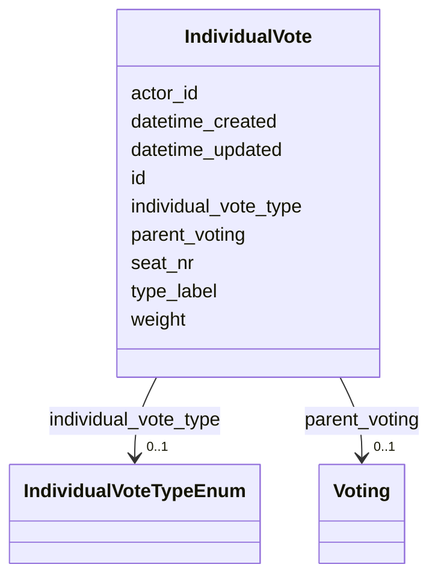


<!-- no inheritance hierarchy -->


## Slots

| Name | Cardinality and Range | Description | Inheritance |
| ---  | --- | --- | --- |
| [id](#id) | 1 <br/> [String](#String) |  | direct |
| [parent_voting](#parent_voting) | 0..1 <br/> [Voting](#Voting) | [en] The ID of the voting associated with the individual vote | direct |
| [actor_id](#actor_id) | 0..1 <br/> [String](#String) | [en] The political body organized by the term of office (e | direct |
| [seat_nr](#seat_nr) | 0..1 <br/> [String](#String) | [en] The seat number of the individual vote, if applicable | direct |
| [weight](#weight) | 0..1 <br/> [Integer](#Integer) | [en] The number of votes held by the individual, if applicable (e | direct |
| [individual_vote_type](#individual_vote_type) | 0..1 <br/> [IndividualVoteTypeEnum](#IndividualVoteTypeEnum) | [en] Type of vote cast (yes, no, abstention, absent, etc | direct |
| [type_label](#type_label) | 0..1 <br/> [String](#String) | [en] Custom type label when standard type values don't apply | direct |
| [datetime_updated](#datetime_updated) | 0..1 <br/> [Datetime](#Datetime) | The last time this record was updated | direct |
| [datetime_created](#datetime_created) | 0..1 <br/> [Datetime](#Datetime) | The time this record was created | direct |


## Usages

| used by | used in | type | used |
| ---  | --- | --- | --- |
| [Container](#Container) | [individual_votes](#individual_votes) | range | [IndividualVote](#IndividualVote) |


## Identifier and Mapping Information


### Schema Source


* from schema: https://ch.paf.link/schema/operations


## Mappings

| Mapping Type | Mapped Value |
| ---  | ---  |
| self | ops:IndividualVote |
| native | ops:IndividualVote |


## LinkML Source

<!-- TODO: investigate https://stackoverflow.com/questions/37606292/how-to-create-tabbed-code-blocks-in-mkdocs-or-sphinx -->

### Direct

<details>
```yaml
name: IndividualVote
description: '[en] An individual vote cast by a member during a voting procedure.

  [de] Eine Einzelstimme eines Mitglieds während eines Abstimmungsverfahrens.

  '
from_schema: https://ch.paf.link/schema/operations
slots:
- id
- parent_voting
- actor_id
- seat_nr
- weight
- individual_vote_type
- type_label
- datetime_updated
- datetime_created

```
</details>

### Induced

<details>
```yaml
name: IndividualVote
description: '[en] An individual vote cast by a member during a voting procedure.

  [de] Eine Einzelstimme eines Mitglieds während eines Abstimmungsverfahrens.

  '
from_schema: https://ch.paf.link/schema/operations
attributes:
  id:
    name: id
    from_schema: https://ch.paf.link/schema/operations
    rank: 1000
    slot_uri: dcterm:identifier
    identifier: true
    alias: id
    owner: IndividualVote
    domain_of:
    - Container
    - Legislature
    - Session
    - Meeting
    - AgendaItem
    - Voting
    - IndividualVote
    - Election
    - Attendance
    - IndividualAttendance
    - Speech
    - TextSegment
    - Motion
    - Media
    range: string
    required: true
  parent_voting:
    name: parent_voting
    description: '[en] The ID of the voting associated with the individual vote.

      [de] Die ID der Abstimmung, die mit der Einzelstimme verbunden ist.

      '
    from_schema: https://ch.paf.link/schema/operations
    rank: 1000
    slot_uri: ops:parentVoting
    alias: parent_voting
    owner: IndividualVote
    domain_of:
    - IndividualVote
    - IndividualAttendance
    range: Voting
  actor_id:
    name: actor_id
    description: '[en] The political body organized by the term of office (e.g., Regierungsrat,
      Nationalrat, Ständerat).

      [de] Das politische Organ, das durch die Amtsdauer organisiert wird (z.B. Regierungsrat,
      Nationalrat, Ständerat).

      '
    from_schema: https://ch.paf.link/schema/operations
    rank: 1000
    alias: actor_id
    owner: IndividualVote
    domain_of:
    - Legislature
    - Meeting
    - Voting
    - IndividualVote
    - Election
    - Attendance
    - IndividualAttendance
    - Speech
    range: string
  seat_nr:
    name: seat_nr
    description: '[en] The seat number of the individual vote, if applicable.

      [de] Die Sitznummer der Einzelstimme, falls zutreffend.

      '
    from_schema: https://ch.paf.link/schema/operations
    rank: 1000
    alias: seat_nr
    owner: IndividualVote
    domain_of:
    - IndividualVote
    range: string
  weight:
    name: weight
    description: '[en] The number of votes held by the individual, if applicable (e.g.,
      in cases where a person has multiple votes).

      [de] Die Anzahl der Stimmen, die die Einzelperson hat, falls zutreffend (z.B.
      in Fällen, in denen eine Person mehrere Stimmen hat).

      '
    from_schema: https://ch.paf.link/schema/operations
    rank: 1000
    alias: weight
    owner: IndividualVote
    domain_of:
    - IndividualVote
    range: integer
  individual_vote_type:
    name: individual_vote_type
    description: '[en] Type of vote cast (yes, no, abstention, absent, etc.).

      [de] Art der abgegebenen Stimme (ja, nein, Enthaltung, abwesend, etc.).

      '
    from_schema: https://ch.paf.link/schema/operations
    rank: 1000
    alias: individual_vote_type
    owner: IndividualVote
    domain_of:
    - IndividualVote
    range: individual_vote_type_enum
  type_label:
    name: type_label
    description: '[en] Custom type label when standard type values don''t apply.

      [de] Benutzerdefinierte Typbezeichnung, wenn Standardtypwerte nicht zutreffen.

      '
    from_schema: https://ch.paf.link/schema/operations
    rank: 1000
    alias: type_label
    owner: IndividualVote
    domain_of:
    - Resolution
    - Voting
    - IndividualVote
    - Election
    range: string
  datetime_updated:
    name: datetime_updated
    description: The last time this record was updated
    from_schema: https://ch.paf.link/schema/operations
    rank: 1000
    alias: datetime_updated
    owner: IndividualVote
    domain_of:
    - Legislature
    - Session
    - Meeting
    - AgendaItem
    - Voting
    - IndividualVote
    - Election
    - Attendance
    - IndividualAttendance
    - Speech
    range: datetime
  datetime_created:
    name: datetime_created
    description: The time this record was created
    from_schema: https://ch.paf.link/schema/operations
    rank: 1000
    alias: datetime_created
    owner: IndividualVote
    domain_of:
    - Legislature
    - Session
    - Meeting
    - AgendaItem
    - Voting
    - IndividualVote
    - Election
    - Attendance
    - IndividualAttendance
    - Speech
    range: datetime

```
</details>

## Election (Wahl)

## Begriff und Bedeutung

Eine Election (Wahl) bezeichnet die Bestimmung einer oder mehrerer Personen für ein Amt oder eine Funktion durch ein parlamentarisches Organ. Im Gegensatz zu Abstimmungen (Votings), bei denen über Sachfragen entschieden wird, geht es bei Wahlen um Personenentscheidungen.

## Unterschied: Wahl vs. Abstimmung

| Kriterium | Election (Wahl) | Voting (Abstimmung) |
|-----------|-----------------|---------------------|
| Gegenstand | Personen | Sachfragen, Vorlagen |
| Ergebnis | Gewählte Person(en) | Angenommen/Abgelehnt |
| Verfahren | Oft geheim | Oft offen |
| Mehrheit | Meist absolut | Meist einfach |

## Arten von Wahlen

Der Standard unterscheidet verschiedene Wahltypen über das Feld **election_type**:

### open
Offene Wahl

**Charakteristik:**
- Stimmabgabe ist öffentlich sichtbar
- Jedes Mitglied gibt seine Stimme offen ab
- Nachvollziehbar, wer wen gewählt hat

**Anwendung:**
- Wenn Transparenz gewünscht ist
- Bei unumstrittenen Wahlen
- In kleineren Gremien

### secret
Geheime Wahl

**Charakteristik:**
- Stimmabgabe ist anonym
- Wahlzettel oder elektronisches Geheimwahlsystem
- Nicht nachvollziehbar, wer wen gewählt hat

**Anwendung:**
- Personenwahlen (Standard)
- Wenn freie, unbeeinflusste Entscheidung gewährleistet werden soll
- Gesetzlich oft vorgeschrieben

**Beispiele auf Bundesebene:**
- Wahl des Bundesrats
- Wahl der Bundesrichter
- Wahl der Kommissionspräsidien

**Beispiele auf Kantonsebene:**
- Wahl der Parlamentspräsidentin oder des Parlamentspräsidenten
- Wahl der Regierungspräsidentin oder des Regierungspräsidenten
- Wahl der Präsidentinnen und Präsidenten der obersten kantonalen Gerichte
- Wahl der Richterinnen und Richter
- Wahl er Staatsschreiberin oder des Staatsschreibers
- Wahl der Kommissionspräsidentinnen oder der Kommissionspräsidenten
- Wahl idien
- Wahl der Kommissions

### tacit
Stille Wahl

**Charakteristik:**
- Keine formale Abstimmung erforderlich
- Wahl erfolgt durch Akklamation oder Konsens
- Nur wenn keine Gegenstimmen erhoben werden

**Anwendung:**
- Bei Einstimmigkeit
- Unumstrittene Wahlen
- Wiederwahlen ohne Gegenkandidaten

**Beispiel:** Wiederwahl eines Kommissionspräsidenten ohne Gegenkandidatur

## Zuordnung zu Traktanden

Jede Wahl ist einem AgendaItem zugeordnet:

```
AgendaItem (Wahl des Bundesrats)
  └─ Election (Wahl für Departement XY)
      ├─ Kandidat A: 120 Stimmen
      ├─ Kandidat B: 75 Stimmen
      └─ Leere Stimmzettel: 5
```

## Beschreibung und Titel

- **title**: Titel der Wahl (z.B. "Wahl Kommissionspräsidium WAK")
- **description**: Ausführliche Beschreibung, Kontext, besondere Umstände

## Wahlergebnis

Das Feld **result** erfasst das Ergebnis:

- **elected**: Person(en) gewählt
- **not_elected**: Keine Person gewählt (z.B. bei absoluter Mehrheit nicht erreicht)
- **deferred**: Wahl verschoben
- **withdrawn**: Wahl zurückgezogen

## Gewählte Person(en)

Das Feld **elected_person_id** enthält die ID(s) der gewählten Person(en) gemäss eCH-0294 Actors.

Bei Mehrfachwahlen (z.B. Wahl mehrerer Kommissionsmitglieder gleichzeitig) können mehrere IDs erfasst werden.

## Stimmenverteilung

Bei offenen Wahlen oder nach Publikation der Ergebnisse:

- **total_votes**: Gesamtzahl abgegebener Stimmen
- **valid_votes**: Gültige Stimmen
- **invalid_votes**: Ungültige Stimmen
- **blank_votes**: Leere Stimmzettel

Zusätzlich Details pro Kandidat (über separate Entitäten oder als strukturierte Daten).

## Wahlverfahren

Das Feld **procedure** beschreibt das konkrete Verfahren:

- **written_ballot**: Schriftliche Wahl mit Stimmzetteln
- **electronic**: Elektronische Wahl
- **show_of_hands**: Handzeichen (bei offenen Wahlen)
- **acclamation**: Akklamation (bei stillen Wahlen)

## Mehrheitsverhältnisse

Das Feld **majority_type** definiert die erforderliche Mehrheit:

### absolute
Absolute Mehrheit (mehr als die Hälfte der Stimmenden)

**Anwendung:**
- Bundesratswahl
- Wahl von Kommissionspräsidien
- Standardfall bei Personenwahlen

**Beispiel:** Bei 200 abgegebenen Stimmen sind mindestens 101 Stimmen erforderlich

**Besonderheit:** Wenn im ersten Wahlgang niemand die absolute Mehrheit erreicht, folgt meist ein zweiter Wahlgang, in dem die einfache Mehrheit genügt.

### simple
Einfache Mehrheit (mehr Stimmen als andere Kandidaten)

**Anwendung:**
- Zweiter Wahlgang nach erfolglosem ersten Wahlgang
- Einige Kommissionswahlen

### qualified
Qualifizierte Mehrheit

**Anwendung:**
- Seltener bei Wahlen
- Spezielle Funktionen mit erhöhten Anforderungen

## Wahlgänge

Bei Wahlen mit absoluter Mehrheit im ersten Wahlgang:

```
1. Wahlgang (absolute Mehrheit erforderlich)
   └─ Kein Kandidat erreicht absolute Mehrheit

2. Wahlgang (einfache Mehrheit genügt)
   └─ Kandidat A gewählt
```

Jeder Wahlgang wird als separate Election-Entität erfasst, verbunden über das gemeinsame AgendaItem.

## Zeitstempel

- **datetime_created**: Zeitpunkt der Durchführung
- **datetime_updated**: Letzte Aktualisierung

## URL und Dokumentation

- **url**: Mehrsprachige URLs zu Wahlunterlagen:
  - Kandidatenprofile
  - Wahlresultate
  - Protokolle

## Besonderheiten verschiedener Wahlen

### Bundesratswahl
- Geheime Wahl
- Absolute Mehrheit erforderlich (im 1. Wahlgang)
- Durch die Vereinigte Bundesversammlung

### Bundesrichterwahl
- Geheime Wahl
- Proporzprinzip (Berücksichtigung von Parteien, Landesteilen, Geschlechtern)

### Kommissionspräsidien
- Wahl durch das jeweilige Parlament
- Oft weniger öffentlich

### Kantons- und Gemeindeebene
- Grosse Vielfalt an Wahlverfahren
- Teilweise Volkswahl statt parlamentarische Wahl
- Unterschiedliche Mehrheitserfordernisse

## Transparenz und Geheimhaltung

Spannungsfeld:
- **Wahlgeheimnis**: Schutz der individuellen Wahlentscheidung
- **Transparenz**: Öffentliches Interesse am Wahlergebnis

Bei geheimen Wahlen:
- Nur Gesamtergebnis wird publiziert
- Keine IndividualVote-Entitäten
- Schutz der Wahlfreiheit

Bei offenen Wahlen:
- Individuelle Stimmabgaben können erfasst werden
- Höhere Transparenz
- Potenzielle soziale Druckeffekte


# Class: Election 


_[en] An election procedure for selecting persons to positions._

_[de] Ein Wahlverfahren zur Wahl von Personen in Positionen._

__


URI: [ops:Election](https://ch.paf.link/schema/operations/Election)


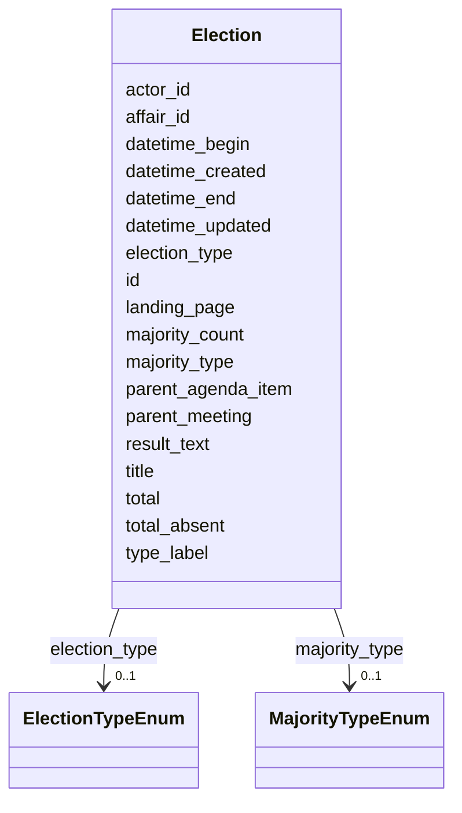


<!-- no inheritance hierarchy -->


## Slots

| Name | Cardinality and Range | Description | Inheritance |
| ---  | --- | --- | --- |
| [id](#id) | 1 <br/> [String](#String) |  | direct |
| [datetime_begin](#datetime_begin) | 0..1 <br/> [Datetime](#Datetime) | [en] The date and time when the meeting or voting begins | direct |
| [datetime_end](#datetime_end) | 0..1 <br/> [Datetime](#Datetime) | [en] The date and time when the meeting or voting ends | direct |
| [election_type](#election_type) | 0..1 <br/> [ElectionTypeEnum](#ElectionTypeEnum) | Type of election procedure | direct |
| [type_label](#type_label) | 0..1 <br/> [String](#String) | [en] Custom type label when standard type values don't apply | direct |
| [title](#title) | 0..1 <br/> [String](#String) |  | direct |
| [landing_page](#landing_page) | 0..1 <br/> [String](#String) | [en] URL providing further information | direct |
| [total_absent](#total_absent) | 0..1 <br/> [Integer](#Integer) | [en] Total number of absent members | direct |
| [total](#total) | 0..1 <br/> [Integer](#Integer) | [en] Total number of votes, excluding absent and president's vote | direct |
| [majority_type](#majority_type) | 0..1 <br/> [MajorityTypeEnum](#MajorityTypeEnum) | [en] Type of majority required for the vote (absolute, two-thirds, etc | direct |
| [majority_count](#majority_count) | 0..1 <br/> [Integer](#Integer) | [en] Number of votes required for the relevant majority threshold | direct |
| [result_text](#result_text) | 0..1 <br/> [String](#String) | [en] Free text describing the outcome of the vote, e | direct |
| [parent_meeting](#parent_meeting) | 0..1 <br/> [String](#String) | [en] The linked meeting ID that groups the current meeting | direct |
| [parent_agenda_item](#parent_agenda_item) | 0..1 <br/> [String](#String) | [en] If needed, this slot builds a hierarchy of agenda items | direct |
| [affair_id](#affair_id) | 0..1 <br/> [String](#String) | [en] The connection to the affairs (business items) of the agenda item | direct |
| [actor_id](#actor_id) | 0..1 <br/> [String](#String) | [en] The political body organized by the term of office (e | direct |
| [datetime_updated](#datetime_updated) | 0..1 <br/> [Datetime](#Datetime) | The last time this record was updated | direct |
| [datetime_created](#datetime_created) | 0..1 <br/> [Datetime](#Datetime) | The time this record was created | direct |


## Usages

| used by | used in | type | used |
| ---  | --- | --- | --- |
| [Container](#Container) | [elections](#elections) | range | [Election](#Election) |


## Identifier and Mapping Information


### Schema Source


* from schema: https://ch.paf.link/schema/operations


## Mappings

| Mapping Type | Mapped Value |
| ---  | ---  |
| self | ops:Election |
| native | ops:Election |


## LinkML Source

<!-- TODO: investigate https://stackoverflow.com/questions/37606292/how-to-create-tabbed-code-blocks-in-mkdocs-or-sphinx -->

### Direct

<details>
```yaml
name: Election
description: '[en] An election procedure for selecting persons to positions.

  [de] Ein Wahlverfahren zur Wahl von Personen in Positionen.

  '
from_schema: https://ch.paf.link/schema/operations
slots:
- id
- datetime_begin
- datetime_end
- election_type
- type_label
- title
- landing_page
- total_absent
- total
- majority_type
- majority_count
- result_text
- parent_meeting
- parent_agenda_item
- affair_id
- actor_id
- datetime_updated
- datetime_created

```
</details>

### Induced

<details>
```yaml
name: Election
description: '[en] An election procedure for selecting persons to positions.

  [de] Ein Wahlverfahren zur Wahl von Personen in Positionen.

  '
from_schema: https://ch.paf.link/schema/operations
attributes:
  id:
    name: id
    from_schema: https://ch.paf.link/schema/operations
    rank: 1000
    slot_uri: dcterm:identifier
    identifier: true
    alias: id
    owner: Election
    domain_of:
    - Container
    - Legislature
    - Session
    - Meeting
    - AgendaItem
    - Voting
    - IndividualVote
    - Election
    - Attendance
    - IndividualAttendance
    - Speech
    - TextSegment
    - Motion
    - Media
    range: string
    required: true
  datetime_begin:
    name: datetime_begin
    description: '[en] The date and time when the meeting or voting begins.

      [de] Das Datum und die Uhrzeit, zu der die Sitzung oder Abstimmung beginnt.

      '
    from_schema: https://ch.paf.link/schema/operations
    rank: 1000
    alias: datetime_begin
    owner: Election
    domain_of:
    - Voting
    - Election
    - Attendance
    - Speech
    range: datetime
  datetime_end:
    name: datetime_end
    description: '[en] The date and time when the meeting or voting ends.

      [de] Das Datum und die Uhrzeit, zu der die Sitzung oder Abstimmung endet.

      '
    from_schema: https://ch.paf.link/schema/operations
    rank: 1000
    alias: datetime_end
    owner: Election
    domain_of:
    - Voting
    - Election
    - Speech
    range: datetime
  election_type:
    name: election_type
    description: Type of election procedure
    from_schema: https://ch.paf.link/schema/operations
    rank: 1000
    alias: election_type
    owner: Election
    domain_of:
    - Election
    range: election_type_enum
  type_label:
    name: type_label
    description: '[en] Custom type label when standard type values don''t apply.

      [de] Benutzerdefinierte Typbezeichnung, wenn Standardtypwerte nicht zutreffen.

      '
    from_schema: https://ch.paf.link/schema/operations
    rank: 1000
    alias: type_label
    owner: Election
    domain_of:
    - Resolution
    - Voting
    - IndividualVote
    - Election
    range: string
  title:
    name: title
    from_schema: https://ch.paf.link/schema/operations
    rank: 1000
    alias: title
    owner: Election
    domain_of:
    - Election
    - Motion
    - Media
    range: string
  landing_page:
    name: landing_page
    description: '[en] URL providing further information.

      [de] URL mit weiteren Informationen.

      '
    from_schema: https://ch.paf.link/schema/operations
    rank: 1000
    slot_uri: ops:landingPage
    alias: landing_page
    owner: Election
    domain_of:
    - Legislature
    - Meeting
    - AgendaItem
    - Voting
    - Election
    - Speech
    range: string
  total_absent:
    name: total_absent
    description: '[en] Total number of absent members. Distinction between absent/excused
      absent - presence is tracked on attendance list.

      [de] Gesamtzahl abwesender Mitglieder. Unterscheidung zwischen abwesend/entschuldigt
      abwesend - Anwesenheit wird auf Anwesenheitsliste verfolgt.

      '
    from_schema: https://ch.paf.link/schema/operations
    rank: 1000
    alias: total_absent
    owner: Election
    domain_of:
    - Voting
    - Election
    - Attendance
    range: integer
  total:
    name: total
    description: '[en] Total number of votes, excluding absent and president''s vote.

      [de] Gesamtzahl der Stimmen, ohne abwesende und Präsidentenstimmen.

      '
    from_schema: https://ch.paf.link/schema/operations
    rank: 1000
    alias: total
    owner: Election
    domain_of:
    - Voting
    - Election
    range: integer
  majority_type:
    name: majority_type
    description: '[en] Type of majority required for the vote (absolute, two-thirds,
      etc.).

      [de] Art der für die Abstimmung erforderlichen Mehrheit (absolut, Zweidrittel
      usw.).

      '
    from_schema: https://ch.paf.link/schema/operations
    rank: 1000
    alias: majority_type
    owner: Election
    domain_of:
    - Voting
    - Election
    range: majority_type_enum
  majority_count:
    name: majority_count
    description: '[en] Number of votes required for the relevant majority threshold.

      [de] Anzahl der Stimmen, die für die relevante Mehrheitsschwelle erforderlich
      sind.

      '
    from_schema: https://ch.paf.link/schema/operations
    rank: 1000
    alias: majority_count
    owner: Election
    domain_of:
    - Voting
    - Election
    range: integer
  result_text:
    name: result_text
    description: '[en] Free text describing the outcome of the vote, e.g., "Accepted
      with 78 votes".

      [de] Freitext zur Beschreibung des Ergebnisses der Abstimmung, z.B. "Mit 78
      Stimmen angenommen".

      '
    from_schema: https://ch.paf.link/schema/operations
    rank: 1000
    alias: result_text
    owner: Election
    domain_of:
    - Voting
    - Election
    range: string
  parent_meeting:
    name: parent_meeting
    description: '[en] The linked meeting ID that groups the current meeting.

      [de] Die verknüpfte Sitzungs-ID, die die aktuelle Sitzung gruppiert.

      '
    from_schema: https://ch.paf.link/schema/operations
    rank: 1000
    alias: parent_meeting
    owner: Election
    domain_of:
    - Meeting
    - AgendaItem
    - Voting
    - Election
    range: string
  parent_agenda_item:
    name: parent_agenda_item
    description: '[en] If needed, this slot builds a hierarchy of agenda items.

      [de] Wenn erforderlich, baut dieser Slot eine Hierarchie von Tagesordnungspunkten
      auf.

      '
    from_schema: https://ch.paf.link/schema/operations
    rank: 1000
    alias: parent_agenda_item
    owner: Election
    domain_of:
    - AgendaItem
    - Voting
    - Election
    range: string
  affair_id:
    name: affair_id
    description: '[en] The connection to the affairs (business items) of the agenda
      item.

      [de] Die Verbindung zu den Geschäften (Geschäftsgegenständen) des Tagesordnungspunkts.

      '
    from_schema: https://ch.paf.link/schema/operations
    rank: 1000
    alias: affair_id
    owner: Election
    domain_of:
    - AgendaItem
    - Voting
    - Election
    range: string
  actor_id:
    name: actor_id
    description: '[en] The political body organized by the term of office (e.g., Regierungsrat,
      Nationalrat, Ständerat).

      [de] Das politische Organ, das durch die Amtsdauer organisiert wird (z.B. Regierungsrat,
      Nationalrat, Ständerat).

      '
    from_schema: https://ch.paf.link/schema/operations
    rank: 1000
    alias: actor_id
    owner: Election
    domain_of:
    - Legislature
    - Meeting
    - Voting
    - IndividualVote
    - Election
    - Attendance
    - IndividualAttendance
    - Speech
    range: string
  datetime_updated:
    name: datetime_updated
    description: The last time this record was updated
    from_schema: https://ch.paf.link/schema/operations
    rank: 1000
    alias: datetime_updated
    owner: Election
    domain_of:
    - Legislature
    - Session
    - Meeting
    - AgendaItem
    - Voting
    - IndividualVote
    - Election
    - Attendance
    - IndividualAttendance
    - Speech
    range: datetime
  datetime_created:
    name: datetime_created
    description: The time this record was created
    from_schema: https://ch.paf.link/schema/operations
    rank: 1000
    alias: datetime_created
    owner: Election
    domain_of:
    - Legislature
    - Session
    - Meeting
    - AgendaItem
    - Voting
    - IndividualVote
    - Election
    - Attendance
    - IndividualAttendance
    - Speech
    range: datetime

```
</details>

ToDo: David


## Speech (Wortmeldung, Votum)

## Begriff und Bedeutung

Eine Speech (Wortmeldung, Votum) bezeichnet einen mündlichen Beitrag einer Person während einer parlamentarischen Sitzung. Sie ist das zentrale Instrument der politischen Debatte und Meinungsäusserung im Parlament.

## Arten von Speeches

Parlamentarische Wortmeldungen haben verschiedene Formen:

### Hauptvoten
- Ausführliche Stellungnahmen zu einem Geschäft
- Begründung von Anträgen
- Darlegung der Fraktionsmeinung

### Kurzinterventionen
- Kurze Wortmeldungen
- Zwischenfragen
- Richtigstellungen

### Fraktionserklärungen
- Offizielle Stellungnahme einer Fraktion
- Vorgetragen durch Fraktionssprecher/in

### Regierungsvoten
- Stellungnahmen von Regierungsmitgliedern
- Beantwortung von Fragen
- Verteidigung von Vorlagen

## Struktur und Zuordnung

Eine Speech ist immer einem bestimmten Kontext zugeordnet:

```
Meeting (Sitzung)
  └─ AgendaItem (Traktandum)
      └─ Speech (Wortmeldung Person A)
          ├─ TextSegment (Transkription)
          ├─ Media (Audio-Aufzeichnung)
          └─ Media (Video-Aufzeichnung)
```

### Zuordnungsfelder

- **meeting_id**: Die Sitzung, in der die Wortmeldung erfolgte
- **agenda_item_id**: Das Traktandum, zu dem gesprochen wurde
- **person_id**: Die sprechende Person (gemäss eCH-0294 Actors)

## Identifikation der Sprechenden

- **person_id**: Eindeutige Identifikation der Person
- **person_name**: Name für schnellen Zugriff
- **role**: Rolle der Person (z.B. "Fraktionspräsident/in", "Berichterstatter/in", "Bundesrat/Bundesrätin")

## Zeitliche Erfassung

- **start_time**: Beginn der Wortmeldung
- **end_time**: Ende der Wortmeldung
- **duration**: Dauer in Sekunden (berechnet oder erfasst)

Diese Zeitangaben ermöglichen:
- Genaue Referenzierung in Audio-/Video-Aufzeichnungen
- Analyse der Redezeit pro Person/Fraktion
- Kontrolle der Einhaltung von Zeitlimiten

## Sprache der Wortmeldung

Das Feld **language** erfasst die Sprache, in der gesprochen wurde:

- **de**: Deutsch
- **fr**: Französisch
- **it**: Italienisch
- **rm**: Rätoromanisch
- **en**: Englisch

## Textdokumente

Das Feld **text_segments** verweist auf TextSegment-Entitäten, die den gesprochenen Text enthalten.

### Verschiedene Textversionen

#### Rohtranskript
- Wörtliche Niederschrift
- Unbearbeitet, mit Füllwörtern
- Direkt nach der Sitzung verfügbar

#### Bearbeitetes Transkript
- Redaktionell überarbeitet
- Grammatikalisch korrigiert
- Offizielle Protokollversion

#### Übersetzungen
- In andere Landessprachen
- Für internationale Publikationen

### TextSegment-Struktur

Jedes TextSegment kann enthalten:
- **text**: Der eigentliche Text
- **language**: Sprache des Texts
- **version**: Art der Version (raw, edited, translated)
- **format**: Format (plain, markdown, HTML)

## Multimedia-Aufzeichnungen

Das Feld **media** verweist auf Media-Entitäten mit Audio- und Video-Aufzeichnungen.

### Audio-Aufzeichnungen
- Originalton der Wortmeldung
- Format: MP3, WAV, etc.
- Technische Metadaten (Qualität, Bitrate)

### Video-Aufzeichnungen
- Visuelle Aufzeichnung (bei Plenarsitzungen)
- Format: MP4, WebM, etc.
- Verschiedene Auflösungen

### Livestreaming
- Echtzeit-Übertragung
- URL zum Stream
- Archivierung nach der Sitzung

## Titel und Beschreibung

- **title**: Kurzer Titel (z.B. "Votum zur Energiepolitik")
- **description**: Zusammenfassung oder Kontext der Wortmeldung

## Typ der Wortmeldung

Das Feld **speech_type** kann verschiedene Arten unterscheiden:

- **statement**: Stellungnahme
- **question**: Frage
- **response**: Antwort (z.B. Regierung auf Frage)
- **procedural**: Verfahrensantrag
- **declaration**: Erklärung


# Class: Speech 


_[en] A speech or statement made during a meeting (also called Votum or speaker segment)._

_[de] Eine Wortmeldung während einer Sitzung (auch Votum oder Redebeitrag genannt)._

__


URI: [ops:Speech](https://ch.paf.link/schema/operations/Speech)


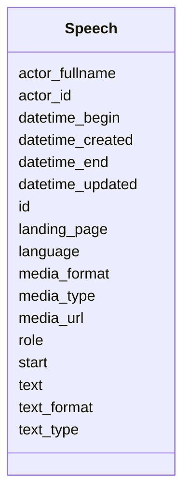


<!-- no inheritance hierarchy -->


## Slots

| Name | Cardinality and Range | Description | Inheritance |
| ---  | --- | --- | --- |
| [id](#id) | 1 <br/> [String](#String) |  | direct |
| [language](#language) | 1 <br/> [String](#String) | Language code in ISO 639-1 format | direct |
| [start](#start) | 0..1 <br/> [String](#String) | Start indicator or position | direct |
| [datetime_begin](#datetime_begin) | 0..1 <br/> [Datetime](#Datetime) | [en] The date and time when the meeting or voting begins | direct |
| [datetime_end](#datetime_end) | 0..1 <br/> [Datetime](#Datetime) | [en] The date and time when the meeting or voting ends | direct |
| [actor_fullname](#actor_fullname) | 0..1 <br/> [String](#String) | Full name of the actor/person | direct |
| [actor_id](#actor_id) | 0..1 <br/> [String](#String) | [en] The political body organized by the term of office (e | direct |
| [role](#role) | 0..1 <br/> [String](#String) | Role of the person (e | direct |
| [text](#text) | 1 <br/> [String](#String) |  | direct |
| [text_format](#text_format) | 0..1 <br/> [String](#String) | [en] Format of text (text, html, html_with_timestamps) | direct |
| [text_type](#text_type) | 0..1 <br/> [String](#String) | [en] Type of text (raw draft, edited version) | direct |
| [landing_page](#landing_page) | 0..1 <br/> [String](#String) | [en] URL providing further information | direct |
| [media_url](#media_url) | 0..1 <br/> [String](#String) | URL to media file (audio/video) | direct |
| [media_type](#media_type) | 0..1 <br/> [String](#String) | Type of media (audio, video, document) | direct |
| [media_format](#media_format) | 0..1 <br/> [String](#String) | MIME type of the media file | direct |
| [datetime_updated](#datetime_updated) | 0..1 <br/> [Datetime](#Datetime) | The last time this record was updated | direct |
| [datetime_created](#datetime_created) | 0..1 <br/> [Datetime](#Datetime) | The time this record was created | direct |


## Usages

| used by | used in | type | used |
| ---  | --- | --- | --- |
| [Container](#Container) | [speeches](#speeches) | range | [Speech](#Speech) |


## Identifier and Mapping Information


### Schema Source


* from schema: https://ch.paf.link/schema/operations


## Mappings

| Mapping Type | Mapped Value |
| ---  | ---  |
| self | ops:Speech |
| native | ops:Speech |


## LinkML Source

<!-- TODO: investigate https://stackoverflow.com/questions/37606292/how-to-create-tabbed-code-blocks-in-mkdocs-or-sphinx -->

### Direct

<details>
```yaml
name: Speech
description: '[en] A speech or statement made during a meeting (also called Votum
  or speaker segment).

  [de] Eine Wortmeldung während einer Sitzung (auch Votum oder Redebeitrag genannt).

  '
from_schema: https://ch.paf.link/schema/operations
slots:
- id
- language
- start
- datetime_begin
- datetime_end
- actor_fullname
- actor_id
- role
- text
- text_format
- text_type
- landing_page
- media_url
- media_type
- media_format
- datetime_updated
- datetime_created

```
</details>

### Induced

<details>
```yaml
name: Speech
description: '[en] A speech or statement made during a meeting (also called Votum
  or speaker segment).

  [de] Eine Wortmeldung während einer Sitzung (auch Votum oder Redebeitrag genannt).

  '
from_schema: https://ch.paf.link/schema/operations
attributes:
  id:
    name: id
    from_schema: https://ch.paf.link/schema/operations
    rank: 1000
    slot_uri: dcterm:identifier
    identifier: true
    alias: id
    owner: Speech
    domain_of:
    - Container
    - Legislature
    - Session
    - Meeting
    - AgendaItem
    - Voting
    - IndividualVote
    - Election
    - Attendance
    - IndividualAttendance
    - Speech
    - TextSegment
    - Motion
    - Media
    range: string
    required: true
  language:
    name: language
    description: Language code in ISO 639-1 format
    from_schema: https://ch.paf.link/schema/operations
    rank: 1000
    alias: language
    owner: Speech
    domain_of:
    - Speech
    - MultilingualString
    range: string
    required: true
    pattern: ^[a-z]{2}$
  start:
    name: start
    description: Start indicator or position
    from_schema: https://ch.paf.link/schema/operations
    rank: 1000
    alias: start
    owner: Speech
    domain_of:
    - Speech
    range: string
  datetime_begin:
    name: datetime_begin
    description: '[en] The date and time when the meeting or voting begins.

      [de] Das Datum und die Uhrzeit, zu der die Sitzung oder Abstimmung beginnt.

      '
    from_schema: https://ch.paf.link/schema/operations
    rank: 1000
    alias: datetime_begin
    owner: Speech
    domain_of:
    - Voting
    - Election
    - Attendance
    - Speech
    range: datetime
  datetime_end:
    name: datetime_end
    description: '[en] The date and time when the meeting or voting ends.

      [de] Das Datum und die Uhrzeit, zu der die Sitzung oder Abstimmung endet.

      '
    from_schema: https://ch.paf.link/schema/operations
    rank: 1000
    alias: datetime_end
    owner: Speech
    domain_of:
    - Voting
    - Election
    - Speech
    range: datetime
  actor_fullname:
    name: actor_fullname
    description: Full name of the actor/person
    from_schema: https://ch.paf.link/schema/operations
    rank: 1000
    alias: actor_fullname
    owner: Speech
    domain_of:
    - Speech
    range: string
  actor_id:
    name: actor_id
    description: '[en] The political body organized by the term of office (e.g., Regierungsrat,
      Nationalrat, Ständerat).

      [de] Das politische Organ, das durch die Amtsdauer organisiert wird (z.B. Regierungsrat,
      Nationalrat, Ständerat).

      '
    from_schema: https://ch.paf.link/schema/operations
    rank: 1000
    alias: actor_id
    owner: Speech
    domain_of:
    - Legislature
    - Meeting
    - Voting
    - IndividualVote
    - Election
    - Attendance
    - IndividualAttendance
    - Speech
    range: string
  role:
    name: role
    description: Role of the person (e.g., commission speaker)
    from_schema: https://ch.paf.link/schema/operations
    rank: 1000
    alias: role
    owner: Speech
    domain_of:
    - Speech
    range: string
  text:
    name: text
    from_schema: https://ch.paf.link/schema/operations
    rank: 1000
    alias: text
    owner: Speech
    domain_of:
    - Speech
    - TextSegment
    - MultilingualString
    range: string
    required: true
  text_format:
    name: text_format
    description: '[en] Format of text (text, html, html_with_timestamps)

      [de] Format des Textes (text, html, html_with_timestamps)

      '
    from_schema: https://ch.paf.link/schema/operations
    rank: 1000
    alias: text_format
    owner: Speech
    domain_of:
    - Speech
    range: string
  text_type:
    name: text_type
    description: '[en] Type of text (raw draft, edited version)

      [de] Typ des Textes (Rohfassung, bearbeitete Fassung)

      '
    from_schema: https://ch.paf.link/schema/operations
    rank: 1000
    alias: text_type
    owner: Speech
    domain_of:
    - Speech
    range: string
  landing_page:
    name: landing_page
    description: '[en] URL providing further information.

      [de] URL mit weiteren Informationen.

      '
    from_schema: https://ch.paf.link/schema/operations
    rank: 1000
    slot_uri: ops:landingPage
    alias: landing_page
    owner: Speech
    domain_of:
    - Legislature
    - Meeting
    - AgendaItem
    - Voting
    - Election
    - Speech
    range: string
  media_url:
    name: media_url
    description: URL to media file (audio/video)
    from_schema: https://ch.paf.link/schema/operations
    rank: 1000
    alias: media_url
    owner: Speech
    domain_of:
    - Speech
    range: string
  media_type:
    name: media_type
    description: Type of media (audio, video, document)
    from_schema: https://ch.paf.link/schema/operations
    rank: 1000
    alias: media_type
    owner: Speech
    domain_of:
    - Speech
    - Media
    range: string
  media_format:
    name: media_format
    description: MIME type of the media file
    from_schema: https://ch.paf.link/schema/operations
    rank: 1000
    alias: media_format
    owner: Speech
    domain_of:
    - Speech
    range: string
  datetime_updated:
    name: datetime_updated
    description: The last time this record was updated
    from_schema: https://ch.paf.link/schema/operations
    rank: 1000
    alias: datetime_updated
    owner: Speech
    domain_of:
    - Legislature
    - Session
    - Meeting
    - AgendaItem
    - Voting
    - IndividualVote
    - Election
    - Attendance
    - IndividualAttendance
    - Speech
    range: datetime
  datetime_created:
    name: datetime_created
    description: The time this record was created
    from_schema: https://ch.paf.link/schema/operations
    rank: 1000
    alias: datetime_created
    owner: Speech
    domain_of:
    - Legislature
    - Session
    - Meeting
    - AgendaItem
    - Voting
    - IndividualVote
    - Election
    - Attendance
    - IndividualAttendance
    - Speech
    range: datetime

```
</details>


# Texte und Medien

Parlamentarische Debatten werden nicht nur als strukturierte Daten erfasst, sondern auch als Texte und Multimedia-Aufzeichnungen. Diese Entitäten ermöglichen die Verwaltung von Transkripten, Audio-/Video-Aufzeichnungen und weiteren Medienformaten sowie die technische Infrastruktur für Datenaustausch und Mehrsprachigkeit.

## TextSegment

### Zweck
Erfasst Textabschnitte mit Versionierung und Sprachvarianten. Wird primär für Transkriptionen von Wortmeldungen verwendet, kann aber auch für andere Textdokumente eingesetzt werden.

### Struktur
- **text**: Der eigentliche Textinhalt
- **language**: Sprachcode (ISO 639-1)
- **format**: Format des Texts (plain, markdown, html)
- **version_type**: Art der Version
  - **raw**: Unbearbeitetes Rohtranskript
  - **edited**: Redaktionell bearbeitete Version
  - **translated**: Übersetzung in andere Sprache
  - **summary**: Zusammenfassung

### Designentscheid
**Warum separate Entität?**
- Ermöglicht mehrere Versionen desselben Texts (Rohfassung, bearbeitet, übersetzt)
- Versionskontrolle und Nachvollziehbarkeit von Änderungen
- Flexibilität bei Formaten (Plain, Markdown, HTML für unterschiedliche Ausgabekanäle)

### Anwendung
Hauptsächlich verknüpft mit Speech-Entitäten:
```
Speech
  ├─ TextSegment (Rohtranskript, de)
  ├─ TextSegment (Bearbeitetes Protokoll, de)
  ├─ TextSegment (Übersetzung, fr)
  └─ TextSegment (Zusammenfassung, de)
```

## Media

### Zweck
Referenziert Mediendateien (Audio, Video, Dokumente), die zu parlamentarischen Aktivitäten gehören.

### Struktur
- **media_type**: Art der Mediendatei
  - **audio**: Audio-Aufzeichnung
  - **video**: Video-Aufzeichnung
  - **document**: Dokumente (PDF, etc.)
  - **image**: Bilder
- **url**: URL zur Mediendatei
- **mime_type**: MIME-Type (audio/mp3, video/mp4, application/pdf, etc.)
- **title**: Titel der Mediendatei
- **description**: Beschreibung
- **language**: Sprache (bei sprachbasierten Medien)
- **duration**: Dauer (bei Audio/Video, in Sekunden)
- **file_size**: Dateigrösse in Bytes
- **quality**: Qualitätsangabe (z.B. "720p", "high", "low")

### Designentscheid
**Warum generische Media-Entität?**
- Einheitliche Struktur für alle Medientypen
- Erweiterbar für neue Formate
- Technische Metadaten zentral erfasst
- Mehrere Qualitätsstufen derselben Aufzeichnung möglich

### Anwendung
Kann an verschiedene Entitäten gehängt werden:
```
Speech
  ├─ Media (Audio-Aufzeichnung, MP3, 256kbps)
  ├─ Media (Audio-Aufzeichnung, MP3, 128kbps)
  ├─ Media (Video-Aufzeichnung, MP4, 1080p)
  └─ Media (Video-Aufzeichnung, MP4, 480p)

AgendaItem
  └─ Media (PDF der Vorlage)

Meeting
  └─ Media (Livestream-URL)


# Class: TextSegment 


_[en] A text segment such as cross-references or subtitles in meeting protocols._

_[de] Ein Textsegment wie Querverweise oder Zwischentitel in Sitzungsprotokollen._

__


URI: [ops:TextSegment](https://ch.paf.link/schema/operations/TextSegment)


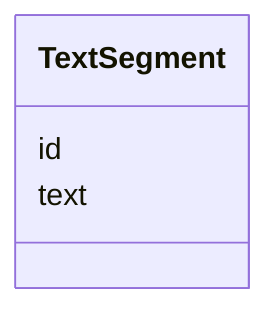


<!-- no inheritance hierarchy -->


## Slots

| Name | Cardinality and Range | Description | Inheritance |
| ---  | --- | --- | --- |
| [id](#id) | 1 <br/> [String](#String) |  | direct |
| [text](#text) | 1 <br/> [String](#String) |  | direct |


## Identifier and Mapping Information


### Schema Source


* from schema: https://ch.paf.link/schema/operations


## Mappings

| Mapping Type | Mapped Value |
| ---  | ---  |
| self | ops:TextSegment |
| native | ops:TextSegment |


## LinkML Source

<!-- TODO: investigate https://stackoverflow.com/questions/37606292/how-to-create-tabbed-code-blocks-in-mkdocs-or-sphinx -->

### Direct

<details>
```yaml
name: TextSegment
description: '[en] A text segment such as cross-references or subtitles in meeting
  protocols.

  [de] Ein Textsegment wie Querverweise oder Zwischentitel in Sitzungsprotokollen.

  '
from_schema: https://ch.paf.link/schema/operations
slots:
- id
- text

```
</details>

### Induced

<details>
```yaml
name: TextSegment
description: '[en] A text segment such as cross-references or subtitles in meeting
  protocols.

  [de] Ein Textsegment wie Querverweise oder Zwischentitel in Sitzungsprotokollen.

  '
from_schema: https://ch.paf.link/schema/operations
attributes:
  id:
    name: id
    from_schema: https://ch.paf.link/schema/operations
    rank: 1000
    slot_uri: dcterm:identifier
    identifier: true
    alias: id
    owner: TextSegment
    domain_of:
    - Container
    - Legislature
    - Session
    - Meeting
    - AgendaItem
    - Voting
    - IndividualVote
    - Election
    - Attendance
    - IndividualAttendance
    - Speech
    - TextSegment
    - Motion
    - Media
    range: string
    required: true
  text:
    name: text
    from_schema: https://ch.paf.link/schema/operations
    rank: 1000
    alias: text
    owner: TextSegment
    domain_of:
    - Speech
    - TextSegment
    - MultilingualString
    range: string
    required: true

```
</details>


# Class: Media 


_[en] Media files or documents (including protocols in PDF/HTML/WORD or links to audio/video)._

_[de] Mediendateien oder Dokumente (einschließlich Protokolle in PDF/HTML/WORD oder Links zu Audio/Video)._

__


URI: [ops:Media](https://ch.paf.link/schema/operations/Media)


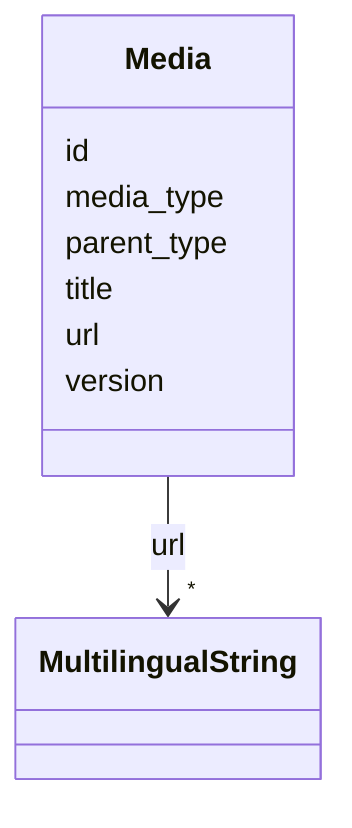


<!-- no inheritance hierarchy -->


## Slots

| Name | Cardinality and Range | Description | Inheritance |
| ---  | --- | --- | --- |
| [id](#id) | 1 <br/> [String](#String) |  | direct |
| [title](#title) | 0..1 <br/> [String](#String) |  | direct |
| [media_type](#media_type) | 0..1 <br/> [String](#String) | Type of media (audio, video, document) | direct |
| [url](#url) | * <br/> [MultilingualString](#MultilingualString) |  | direct |
| [version](#version) | 0..1 <br/> [String](#String) | Version number or identifier | direct |
| [parent_type](#parent_type) | 0..1 <br/> [String](#String) | Type of parent object (meeting, agenda, speech, affair) | direct |


## Identifier and Mapping Information


### Schema Source


* from schema: https://ch.paf.link/schema/operations


## Mappings

| Mapping Type | Mapped Value |
| ---  | ---  |
| self | ops:Media |
| native | ops:Media |


## LinkML Source

<!-- TODO: investigate https://stackoverflow.com/questions/37606292/how-to-create-tabbed-code-blocks-in-mkdocs-or-sphinx -->

### Direct

<details>
```yaml
name: Media
description: '[en] Media files or documents (including protocols in PDF/HTML/WORD
  or links to audio/video).

  [de] Mediendateien oder Dokumente (einschließlich Protokolle in PDF/HTML/WORD oder
  Links zu Audio/Video).

  '
from_schema: https://ch.paf.link/schema/operations
slots:
- id
- title
- media_type
- url
- version
- parent_type

```
</details>

### Induced

<details>
```yaml
name: Media
description: '[en] Media files or documents (including protocols in PDF/HTML/WORD
  or links to audio/video).

  [de] Mediendateien oder Dokumente (einschließlich Protokolle in PDF/HTML/WORD oder
  Links zu Audio/Video).

  '
from_schema: https://ch.paf.link/schema/operations
attributes:
  id:
    name: id
    from_schema: https://ch.paf.link/schema/operations
    rank: 1000
    slot_uri: dcterm:identifier
    identifier: true
    alias: id
    owner: Media
    domain_of:
    - Container
    - Legislature
    - Session
    - Meeting
    - AgendaItem
    - Voting
    - IndividualVote
    - Election
    - Attendance
    - IndividualAttendance
    - Speech
    - TextSegment
    - Motion
    - Media
    range: string
    required: true
  title:
    name: title
    from_schema: https://ch.paf.link/schema/operations
    rank: 1000
    alias: title
    owner: Media
    domain_of:
    - Election
    - Motion
    - Media
    range: string
  media_type:
    name: media_type
    description: Type of media (audio, video, document)
    from_schema: https://ch.paf.link/schema/operations
    rank: 1000
    alias: media_type
    owner: Media
    domain_of:
    - Speech
    - Media
    range: string
  url:
    name: url
    from_schema: https://ch.paf.link/schema/operations
    rank: 1000
    alias: url
    owner: Media
    domain_of:
    - Session
    - Meeting
    - Media
    range: MultilingualString
    multivalued: true
    inlined: true
    inlined_as_list: true
  version:
    name: version
    description: Version number or identifier
    from_schema: https://ch.paf.link/schema/operations
    rank: 1000
    alias: version
    owner: Media
    domain_of:
    - Media
    range: string
  parent_type:
    name: parent_type
    description: Type of parent object (meeting, agenda, speech, affair)
    from_schema: https://ch.paf.link/schema/operations
    rank: 1000
    alias: parent_type
    owner: Media
    domain_of:
    - Media
    range: string

```
</details>


# Class: MultilingualString 


_[en] A string that can contain text in multiple languages._

_[de] Ein String, der Text in mehreren Sprachen enthalten kann._

__


URI: [ops:MultilingualString](https://ch.paf.link/schema/operations/MultilingualString)


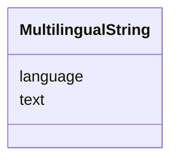


<!-- no inheritance hierarchy -->


## Slots

| Name | Cardinality and Range | Description | Inheritance |
| ---  | --- | --- | --- |
| [text](#text) | 1 <br/> [String](#String) |  | direct |
| [language](#language) | 1 <br/> [String](#String) | Language code in ISO 639-1 format | direct |


## Usages

| used by | used in | type | used |
| ---  | --- | --- | --- |
| [Legislature](#Legislature) | [name](#name) | range | [MultilingualString](#MultilingualString) |
| [Session](#Session) | [name](#name) | range | [MultilingualString](#MultilingualString) |
| [Session](#Session) | [url](#url) | range | [MultilingualString](#MultilingualString) |
| [Meeting](#Meeting) | [name](#name) | range | [MultilingualString](#MultilingualString) |
| [Meeting](#Meeting) | [url](#url) | range | [MultilingualString](#MultilingualString) |
| [AgendaItem](#AgendaItem) | [agenda_item_title](#agenda_item_title) | range | [MultilingualString](#MultilingualString) |
| [AgendaItem](#AgendaItem) | [agenda_item_description](#agenda_item_description) | range | [MultilingualString](#MultilingualString) |
| [Voting](#Voting) | [voting_title](#voting_title) | range | [MultilingualString](#MultilingualString) |
| [Media](#Media) | [url](#url) | range | [MultilingualString](#MultilingualString) |


## Identifier and Mapping Information


### Schema Source


* from schema: https://ch.paf.link/schema/operations


## Mappings

| Mapping Type | Mapped Value |
| ---  | ---  |
| self | ops:MultilingualString |
| native | ops:MultilingualString |


## LinkML Source

<!-- TODO: investigate https://stackoverflow.com/questions/37606292/how-to-create-tabbed-code-blocks-in-mkdocs-or-sphinx -->

### Direct

<details>
```yaml
name: MultilingualString
description: '[en] A string that can contain text in multiple languages.

  [de] Ein String, der Text in mehreren Sprachen enthalten kann.

  '
from_schema: https://ch.paf.link/schema/operations
slots:
- text
- language

```
</details>

### Induced

<details>
```yaml
name: MultilingualString
description: '[en] A string that can contain text in multiple languages.

  [de] Ein String, der Text in mehreren Sprachen enthalten kann.

  '
from_schema: https://ch.paf.link/schema/operations
attributes:
  text:
    name: text
    from_schema: https://ch.paf.link/schema/operations
    rank: 1000
    alias: text
    owner: MultilingualString
    domain_of:
    - Speech
    - TextSegment
    - MultilingualString
    range: string
    required: true
  language:
    name: language
    description: Language code in ISO 639-1 format
    from_schema: https://ch.paf.link/schema/operations
    rank: 1000
    alias: language
    owner: MultilingualString
    domain_of:
    - Speech
    - MultilingualString
    range: string
    required: true
    pattern: ^[a-z]{2}$

```
</details>


# Class: Container 


URI: [ops:Container](https://ch.paf.link/schema/operations/Container)


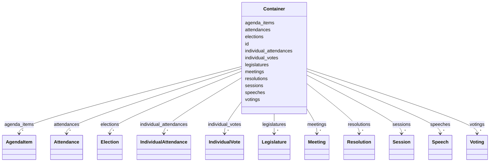


<!-- no inheritance hierarchy -->


## Slots

| Name | Cardinality and Range | Description | Inheritance |
| ---  | --- | --- | --- |
| [id](#id) | 1 <br/> [String](#String) |  | direct |
| [legislatures](#legislatures) | * <br/> [Legislature](#Legislature) |  | direct |
| [sessions](#sessions) | * <br/> [Session](#Session) |  | direct |
| [meetings](#meetings) | * <br/> [Meeting](#Meeting) |  | direct |
| [agenda_items](#agenda_items) | * <br/> [AgendaItem](#AgendaItem) |  | direct |
| [votings](#votings) | * <br/> [Voting](#Voting) | Collection of voting records | direct |
| [elections](#elections) | * <br/> [Election](#Election) | Collection of election records | direct |
| [individual_votes](#individual_votes) | * <br/> [IndividualVote](#IndividualVote) | Collection of individual vote records | direct |
| [attendances](#attendances) | * <br/> [Attendance](#Attendance) | Collection of attendance records | direct |
| [individual_attendances](#individual_attendances) | * <br/> [IndividualAttendance](#IndividualAttendance) | Collection of individual attendance records | direct |
| [speeches](#speeches) | * <br/> [Speech](#Speech) | Collection of speech records | direct |
| [resolutions](#resolutions) | * <br/> [Resolution](#Resolution) | Collection of resolutionrecords | direct |


## Identifier and Mapping Information


### Schema Source


* from schema: https://ch.paf.link/schema/operations


## Mappings

| Mapping Type | Mapped Value |
| ---  | ---  |
| self | ops:Container |
| native | ops:Container |


## LinkML Source

<!-- TODO: investigate https://stackoverflow.com/questions/37606292/how-to-create-tabbed-code-blocks-in-mkdocs-or-sphinx -->

### Direct

<details>
```yaml
name: Container
from_schema: https://ch.paf.link/schema/operations
slots:
- id
- legislatures
- sessions
- meetings
- agenda_items
- votings
- elections
- individual_votes
- attendances
- individual_attendances
- speeches
- resolutions
tree_root: true

```
</details>

### Induced

<details>
```yaml
name: Container
from_schema: https://ch.paf.link/schema/operations
attributes:
  id:
    name: id
    from_schema: https://ch.paf.link/schema/operations
    rank: 1000
    slot_uri: dcterm:identifier
    identifier: true
    alias: id
    owner: Container
    domain_of:
    - Container
    - Legislature
    - Session
    - Meeting
    - AgendaItem
    - Voting
    - IndividualVote
    - Election
    - Attendance
    - IndividualAttendance
    - Speech
    - TextSegment
    - Motion
    - Media
    range: string
    required: true
  legislatures:
    name: legislatures
    from_schema: https://ch.paf.link/schema/operations
    rank: 1000
    slot_uri: ops:legislature
    alias: legislatures
    owner: Container
    domain_of:
    - Container
    range: Legislature
    multivalued: true
    inlined_as_list: true
  sessions:
    name: sessions
    from_schema: https://ch.paf.link/schema/operations
    rank: 1000
    slot_uri: ops:session
    alias: sessions
    owner: Container
    domain_of:
    - Container
    range: Session
    multivalued: true
    inlined_as_list: true
  meetings:
    name: meetings
    from_schema: https://ch.paf.link/schema/operations
    rank: 1000
    slot_uri: ops:meeting
    alias: meetings
    owner: Container
    domain_of:
    - Container
    - Session
    range: Meeting
    multivalued: true
    inlined_as_list: true
  agenda_items:
    name: agenda_items
    from_schema: https://ch.paf.link/schema/operations
    rank: 1000
    slot_uri: ops:agendaItem
    alias: agenda_items
    owner: Container
    domain_of:
    - Container
    - JointDebate
    range: AgendaItem
    multivalued: true
    inlined_as_list: true
  votings:
    name: votings
    description: Collection of voting records
    from_schema: https://ch.paf.link/schema/operations
    rank: 1000
    slot_uri: ops:voting
    alias: votings
    owner: Container
    domain_of:
    - Container
    range: Voting
    multivalued: true
    inlined_as_list: true
  elections:
    name: elections
    description: Collection of election records
    from_schema: https://ch.paf.link/schema/operations
    rank: 1000
    slot_uri: ops:election
    alias: elections
    owner: Container
    domain_of:
    - Container
    range: Election
    multivalued: true
    inlined_as_list: true
  individual_votes:
    name: individual_votes
    description: Collection of individual vote records
    from_schema: https://ch.paf.link/schema/operations
    rank: 1000
    slot_uri: ops:individualVote
    alias: individual_votes
    owner: Container
    domain_of:
    - Container
    range: IndividualVote
    multivalued: true
    inlined_as_list: true
  attendances:
    name: attendances
    description: Collection of attendance records
    from_schema: https://ch.paf.link/schema/operations
    rank: 1000
    slot_uri: ops:attendance
    alias: attendances
    owner: Container
    domain_of:
    - Container
    range: Attendance
    multivalued: true
    inlined_as_list: true
  individual_attendances:
    name: individual_attendances
    description: Collection of individual attendance records
    from_schema: https://ch.paf.link/schema/operations
    rank: 1000
    slot_uri: ops:individualAttendance
    alias: individual_attendances
    owner: Container
    domain_of:
    - Container
    range: IndividualAttendance
    multivalued: true
    inlined_as_list: true
  speeches:
    name: speeches
    description: Collection of speech records
    from_schema: https://ch.paf.link/schema/operations
    rank: 1000
    slot_uri: ops:speech
    alias: speeches
    owner: Container
    domain_of:
    - Container
    range: Speech
    multivalued: true
    inlined_as_list: true
  resolutions:
    name: resolutions
    description: Collection of resolutionrecords
    from_schema: https://ch.paf.link/schema/operations
    rank: 1000
    slot_uri: ops:resolution
    alias: resolutions
    owner: Container
    domain_of:
    - Container
    range: Resolution
    multivalued: true
    inlined_as_list: true
tree_root: true

```
</details>


