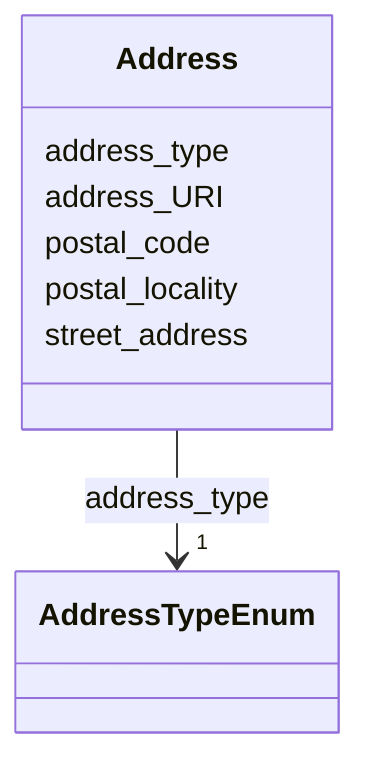

# Class: Address 


URI: [act:Address](https://ch.paf.link/schema/actors/Address)





<!-- no inheritance hierarchy -->


## Slots

| Name | Cardinality and Range | Description | Inheritance |
| ---  | --- | --- | --- |
| [address_type](address_type.md) | 1 <br/> [AddressTypeEnum](AddressTypeEnum.md) |  | direct |
| [address_URI](address_URI.md) | 0..1 <br/> [String](String.md) | Preferred URI of address | direct |
| [street_address](street_address.md) | 0..1 <br/> [String](String.md) |  | direct |
| [postal_code](postal_code.md) | 0..1 <br/> [String](String.md) |  | direct |
| [postal_locality](postal_locality.md) | 0..1 <br/> [String](String.md) |  | direct |


## Usages

| used by | used in | type | used |
| ---  | --- | --- | --- |
| [Person](Person.md) | [addresses](addresses.md) | range | [Address](Address.md) |


## Identifier and Mapping Information


### Schema Source


* from schema: https://ch.paf.link/schema/actors


## Mappings

| Mapping Type | Mapped Value |
| ---  | ---  |
| self | act:Address |
| native | act:Address |


## LinkML Source

<!-- TODO: investigate https://stackoverflow.com/questions/37606292/how-to-create-tabbed-code-blocks-in-mkdocs-or-sphinx -->

### Direct

<details>
```yaml
name: Address
from_schema: https://ch.paf.link/schema/actors
attributes:
  address-type:
    name: address-type
    from_schema: https://ch.paf.link/schema/actors
    rank: 1000
    slot_uri: act:addressType
    domain_of:
    - Address
    range: AddressTypeEnum
    required: true
  address-URI:
    name: address-URI
    description: Preferred URI of address
    from_schema: https://ch.paf.link/schema/actors
    rank: 1000
    slot_uri: act:addressURI
    domain_of:
    - Address
  street-address:
    name: street-address
    from_schema: https://ch.paf.link/schema/actors
    rank: 1000
    slot_uri: act:streetAddress
    domain_of:
    - Address
  postal-code:
    name: postal-code
    from_schema: https://ch.paf.link/schema/actors
    rank: 1000
    slot_uri: act:postalCode
    domain_of:
    - Address
  postal-locality:
    name: postal-locality
    from_schema: https://ch.paf.link/schema/actors
    rank: 1000
    slot_uri: act:postalLocality
    domain_of:
    - Address

```
</details>

### Induced

<details>
```yaml
name: Address
from_schema: https://ch.paf.link/schema/actors
attributes:
  address-type:
    name: address-type
    from_schema: https://ch.paf.link/schema/actors
    rank: 1000
    slot_uri: act:addressType
    alias: address_type
    owner: Address
    domain_of:
    - Address
    range: AddressTypeEnum
    required: true
  address-URI:
    name: address-URI
    description: Preferred URI of address
    from_schema: https://ch.paf.link/schema/actors
    rank: 1000
    slot_uri: act:addressURI
    alias: address_URI
    owner: Address
    domain_of:
    - Address
    range: string
  street-address:
    name: street-address
    from_schema: https://ch.paf.link/schema/actors
    rank: 1000
    slot_uri: act:streetAddress
    alias: street_address
    owner: Address
    domain_of:
    - Address
    range: string
  postal-code:
    name: postal-code
    from_schema: https://ch.paf.link/schema/actors
    rank: 1000
    slot_uri: act:postalCode
    alias: postal_code
    owner: Address
    domain_of:
    - Address
    range: string
  postal-locality:
    name: postal-locality
    from_schema: https://ch.paf.link/schema/actors
    rank: 1000
    slot_uri: act:postalLocality
    alias: postal_locality
    owner: Address
    domain_of:
    - Address
    range: string

```
</details>