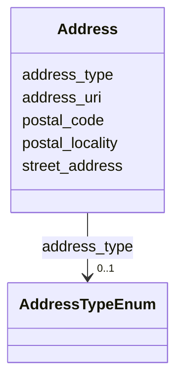

# Class: Address 


_[de] Eine Adresse mit einem Typ (z.B. Privatadresse, Geschäftsadresse) und einem Wert._

_[en] An address with a type (e.g., private address, business address) and a value._

__


URI: [act:Address](https://ld.ech.ch/schema/0294/actors/Address)



```mermaid
 classDiagram
    class Address
    click Address href "../Address/"
      Address : address_type
        
          
    
        
        
        Address --> "0..1" AddressTypeEnum : address_type
        click AddressTypeEnum href "../AddressTypeEnum/"
    

        
      Address : address_uri
        
      Address : postal_code
        
      Address : postal_locality
        
      Address : street_address
        
      
```


<!-- no inheritance hierarchy -->

## Slots

| Name | Cardinality and Range | Description | Inheritance |
| ---  | --- | --- | --- |
| [address_type](address_type.md) | 0..1 <br/> [AddressTypeEnum](AddressTypeEnum.md) | [de] Typ der Adresse | direct |
| [address_uri](address_uri.md) | 0..1 <br/> [Uriorcurie](Uriorcurie.md) | [de] URI der Adresse | direct |
| [street_address](street_address.md) | 0..1 <br/> [String](String.md) | [de] Strassenadresse | direct |
| [postal_code](postal_code.md) | 0..1 <br/> [Integer](Integer.md) | [de] Postleitzahl | direct |
| [postal_locality](postal_locality.md) | 0..1 <br/> [String](String.md) | [de] Ort | direct |


## Usages

| used by | used in | type | used |
| ---  | --- | --- | --- |
| [Person](Person.md) | [addresses](addresses.md) | range | [Address](Address.md) |
| [Group](Group.md) | [addresses](addresses.md) | range | [Address](Address.md) |


## Identifier and Mapping Information


### Schema Source


* from schema: https://ld.ech.ch/schema/0294/actors


## Mappings

| Mapping Type | Mapped Value |
| ---  | ---  |
| self | act:Address |
| native | act:Address |


## LinkML Source

<!-- TODO: investigate https://stackoverflow.com/questions/37606292/how-to-create-tabbed-code-blocks-in-mkdocs-or-sphinx -->

### Direct

<details>
```yaml
name: Address
description: '[de] Eine Adresse mit einem Typ (z.B. Privatadresse, Geschäftsadresse)
  und einem Wert.

  [en] An address with a type (e.g., private address, business address) and a value.

  '
from_schema: https://ld.ech.ch/schema/0294/actors
slots:
- address_type
- address_uri
- street_address
- postal_code
- postal_locality

```
</details>

### Induced

<details>
```yaml
name: Address
description: '[de] Eine Adresse mit einem Typ (z.B. Privatadresse, Geschäftsadresse)
  und einem Wert.

  [en] An address with a type (e.g., private address, business address) and a value.

  '
from_schema: https://ld.ech.ch/schema/0294/actors
attributes:
  address_type:
    name: address_type
    description: '[de] Typ der Adresse.

      [en] Type of address.

      '
    from_schema: https://ld.ech.ch/schema/0294/actors
    rank: 1000
    slot_uri: act:addressType
    alias: address_type
    owner: Address
    domain_of:
    - Address
    range: AddressTypeEnum
  address_uri:
    name: address_uri
    description: '[de] URI der Adresse.

      [en] URI of the address.

      '
    from_schema: https://ld.ech.ch/schema/0294/actors
    rank: 1000
    slot_uri: act:addressURI
    alias: address_uri
    owner: Address
    domain_of:
    - Address
    range: uriorcurie
  street_address:
    name: street_address
    description: '[de] Strassenadresse.

      [en] Street address.

      '
    from_schema: https://ld.ech.ch/schema/0294/actors
    rank: 1000
    slot_uri: act:streetAddress
    alias: street_address
    owner: Address
    domain_of:
    - Address
    range: string
  postal_code:
    name: postal_code
    description: '[de] Postleitzahl.

      [en] Postal code.

      '
    from_schema: https://ld.ech.ch/schema/0294/actors
    rank: 1000
    slot_uri: act:postalCode
    alias: postal_code
    owner: Address
    domain_of:
    - Address
    range: integer
  postal_locality:
    name: postal_locality
    description: '[de] Ort.

      [en] Locality.

      '
    from_schema: https://ld.ech.ch/schema/0294/actors
    rank: 1000
    slot_uri: act:postalLocality
    alias: postal_locality
    owner: Address
    domain_of:
    - Address
    range: string

```
</details>