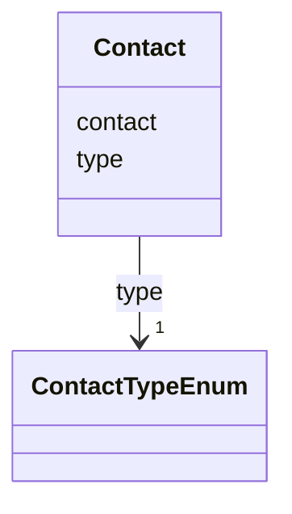

# Class: Contact 


URI: [act:Contact](https://ch.paf.link/schema/actors/Contact)





<!-- no inheritance hierarchy -->


## Slots

| Name | Cardinality and Range | Description | Inheritance |
| ---  | --- | --- | --- |
| [type](type.md) | 1 <br/> [ContactTypeEnum](ContactTypeEnum.md) |  | direct |
| [contact](contact.md) | 1 <br/> [String](String.md) |  | direct |


## Usages

| used by | used in | type | used |
| ---  | --- | --- | --- |
| [Person](Person.md) | [contacts](contacts.md) | range | [Contact](Contact.md) |


## Identifier and Mapping Information


### Schema Source


* from schema: https://ch.paf.link/schema/actors


## Mappings

| Mapping Type | Mapped Value |
| ---  | ---  |
| self | act:Contact |
| native | act:Contact |


## LinkML Source

<!-- TODO: investigate https://stackoverflow.com/questions/37606292/how-to-create-tabbed-code-blocks-in-mkdocs-or-sphinx -->

### Direct

<details>
```yaml
name: Contact
from_schema: https://ch.paf.link/schema/actors
attributes:
  type:
    name: type
    from_schema: https://ch.paf.link/schema/actors
    domain_of:
    - Training
    - Contact
    range: ContactTypeEnum
    required: true
  contact:
    name: contact
    from_schema: https://ch.paf.link/schema/actors
    rank: 1000
    domain_of:
    - Contact
    required: true

```
</details>

### Induced

<details>
```yaml
name: Contact
from_schema: https://ch.paf.link/schema/actors
attributes:
  type:
    name: type
    from_schema: https://ch.paf.link/schema/actors
    alias: type
    owner: Contact
    domain_of:
    - Training
    - Contact
    range: ContactTypeEnum
    required: true
  contact:
    name: contact
    from_schema: https://ch.paf.link/schema/actors
    rank: 1000
    alias: contact
    owner: Contact
    domain_of:
    - Contact
    range: string
    required: true

```
</details>