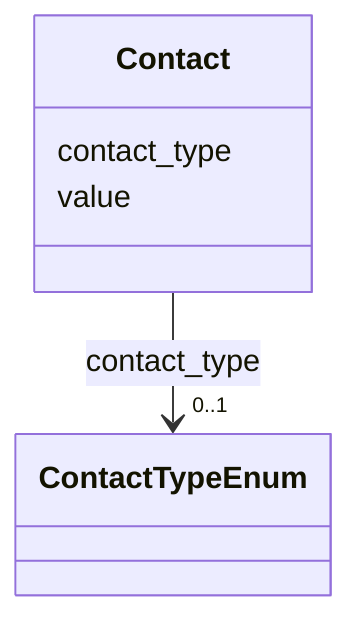

# Class: Contact 


_[de] Kontaktinformation einer Person mit Angabe eines Typs (z.B. E-Mail, LinkedIn) und eines Werts._

_[en] Contact information of a person indicating a type (e.g., email, LinkedIn) and a value._

__


URI: [act:Contact](https://ld.ech.ch/schema/0294/actors/Contact)



```mermaid
 classDiagram
    class Contact
    click Contact href "../Contact/"
      Contact : contact_type
        
          
    
        
        
        Contact --> "0..1" ContactTypeEnum : contact_type
        click ContactTypeEnum href "../ContactTypeEnum/"
    

        
      Contact : value
        
      
```


<!-- no inheritance hierarchy -->

## Slots

| Name | Cardinality and Range | Description | Inheritance |
| ---  | --- | --- | --- |
| [contact_type](contact_type.md) | 0..1 <br/> [ContactTypeEnum](ContactTypeEnum.md) | [de] Typ der Kontaktinformation | direct |
| [value](value.md) | 0..1 <br/> [String](String.md) | [de] Der eigentliche Wert einer Information neben weiteren attributen wie Typ... | direct |


## Usages

| used by | used in | type | used |
| ---  | --- | --- | --- |
| [Person](Person.md) | [contacts](contacts.md) | range | [Contact](Contact.md) |
| [Group](Group.md) | [contacts](contacts.md) | range | [Contact](Contact.md) |


## Identifier and Mapping Information


### Schema Source


* from schema: https://ld.ech.ch/schema/0294/actors


## Mappings

| Mapping Type | Mapped Value |
| ---  | ---  |
| self | act:Contact |
| native | act:Contact |


## LinkML Source

<!-- TODO: investigate https://stackoverflow.com/questions/37606292/how-to-create-tabbed-code-blocks-in-mkdocs-or-sphinx -->

### Direct

<details>
```yaml
name: Contact
description: '[de] Kontaktinformation einer Person mit Angabe eines Typs (z.B. E-Mail,
  LinkedIn) und eines Werts.

  [en] Contact information of a person indicating a type (e.g., email, LinkedIn) and
  a value.

  '
from_schema: https://ld.ech.ch/schema/0294/actors
slots:
- contact_type
- value

```
</details>

### Induced

<details>
```yaml
name: Contact
description: '[de] Kontaktinformation einer Person mit Angabe eines Typs (z.B. E-Mail,
  LinkedIn) und eines Werts.

  [en] Contact information of a person indicating a type (e.g., email, LinkedIn) and
  a value.

  '
from_schema: https://ld.ech.ch/schema/0294/actors
attributes:
  contact_type:
    name: contact_type
    description: '[de] Typ der Kontaktinformation.

      [en] Type of contact information.

      '
    from_schema: https://ld.ech.ch/schema/0294/actors
    rank: 1000
    slot_uri: act:contactType
    alias: contact_type
    owner: Contact
    domain_of:
    - Contact
    range: ContactTypeEnum
  value:
    name: value
    description: '[de] Der eigentliche Wert einer Information neben weiteren attributen
      wie Typ, Sprache, etc.

      [en] The value of an information besides other attributes such as type, language,
      etc.

      '
    from_schema: https://ld.ech.ch/schema/0294/actors
    rank: 1000
    slot_uri: mcm:value
    alias: value
    owner: Contact
    domain_of:
    - Name
    - Contact
    - MultilingualValue
    range: string

```
</details>