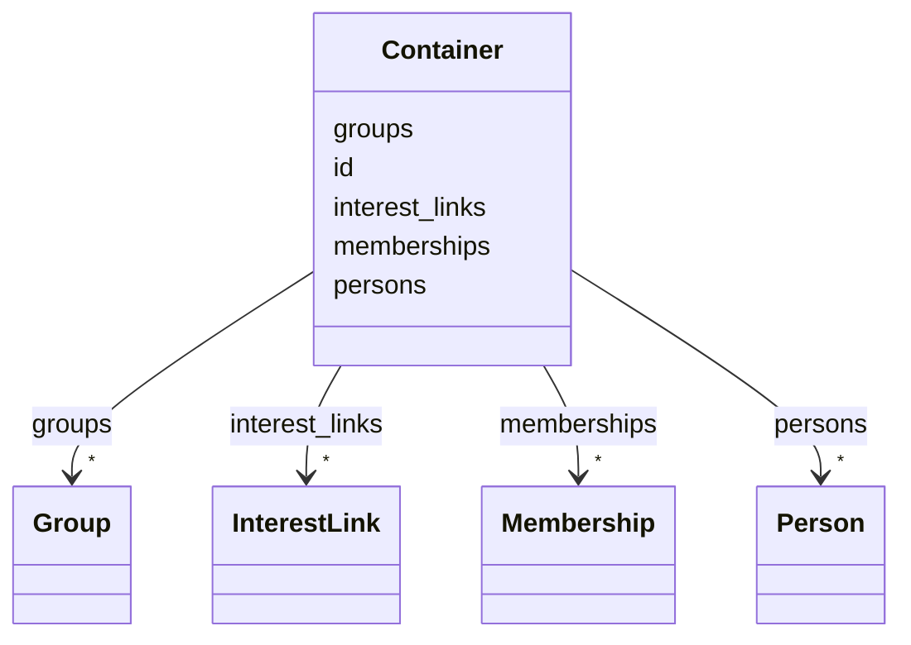

# Class: Container 


_[en] Root container holding all political actors, groups, and relationships._

_[de] Wurzelcontainer mit allen politischen Akteuren, Gruppen und Beziehungen._

__


URI: [act:Container](https://ch.paf.link/schema/actors/Container)





<!-- no inheritance hierarchy -->


## Slots

| Name | Cardinality and Range | Description | Inheritance |
| ---  | --- | --- | --- |
| [id](id.md) | 1 <br/> [String](String.md) | [en] Unique identifier (preferably Wikidata-ID or URI) | direct |
| [persons](persons.md) | * <br/> [Person](Person.md) | [en] Collection of persons | direct |
| [groups](groups.md) | * <br/> [Group](Group.md) | [en] Collection of groups | direct |
| [memberships](memberships.md) | * <br/> [Membership](Membership.md) | [en] Collection of memberships | direct |
| [interest_links](interest_links.md) | * <br/> [InterestLink](InterestLink.md) | [en] Collection of interest links | direct |


## Identifier and Mapping Information


### Schema Source


* from schema: https://ch.paf.link/schema/actors


## Mappings

| Mapping Type | Mapped Value |
| ---  | ---  |
| self | act:Container |
| native | act:Container |


## LinkML Source

<!-- TODO: investigate https://stackoverflow.com/questions/37606292/how-to-create-tabbed-code-blocks-in-mkdocs-or-sphinx -->

### Direct

<details>
```yaml
name: Container
description: '[en] Root container holding all political actors, groups, and relationships.

  [de] Wurzelcontainer mit allen politischen Akteuren, Gruppen und Beziehungen.

  '
from_schema: https://ch.paf.link/schema/actors
slots:
- id
- persons
- groups
- memberships
- interest_links
tree_root: true

```
</details>

### Induced

<details>
```yaml
name: Container
description: '[en] Root container holding all political actors, groups, and relationships.

  [de] Wurzelcontainer mit allen politischen Akteuren, Gruppen und Beziehungen.

  '
from_schema: https://ch.paf.link/schema/actors
attributes:
  id:
    name: id
    description: '[en] Unique identifier (preferably Wikidata-ID or URI).

      [de] Eindeutiger Identifikator (vorzugsweise Wikidata-ID oder URI).

      '
    from_schema: https://ch.paf.link/schema/actors
    rank: 1000
    slot_uri: dcterm:identifier
    identifier: true
    alias: id
    owner: Container
    domain_of:
    - Container
    - Person
    - Group
    - Membership
    - InterestLink
    - PersonReference
    - GroupReference
    range: string
    required: true
  persons:
    name: persons
    description: '[en] Collection of persons.

      [de] Sammlung von Personen.

      '
    from_schema: https://ch.paf.link/schema/actors
    rank: 1000
    slot_uri: act:person
    alias: persons
    owner: Container
    domain_of:
    - Container
    range: Person
    multivalued: true
    inlined_as_list: true
  groups:
    name: groups
    description: '[en] Collection of groups.

      [de] Sammlung von Gruppen.

      '
    from_schema: https://ch.paf.link/schema/actors
    rank: 1000
    slot_uri: act:group
    alias: groups
    owner: Container
    domain_of:
    - Container
    range: Group
    multivalued: true
    inlined_as_list: true
  memberships:
    name: memberships
    description: '[en] Collection of memberships.

      [de] Sammlung von Mitgliedschaften.

      '
    from_schema: https://ch.paf.link/schema/actors
    rank: 1000
    slot_uri: act:membership
    alias: memberships
    owner: Container
    domain_of:
    - Container
    range: Membership
    multivalued: true
    inlined_as_list: true
  interest_links:
    name: interest_links
    description: '[en] Collection of interest links.

      [de] Sammlung von Interessenbindungen.

      '
    from_schema: https://ch.paf.link/schema/actors
    rank: 1000
    slot_uri: act:interestLink
    alias: interest_links
    owner: Container
    domain_of:
    - Container
    range: InterestLink
    multivalued: true
    inlined_as_list: true
tree_root: true

```
</details>