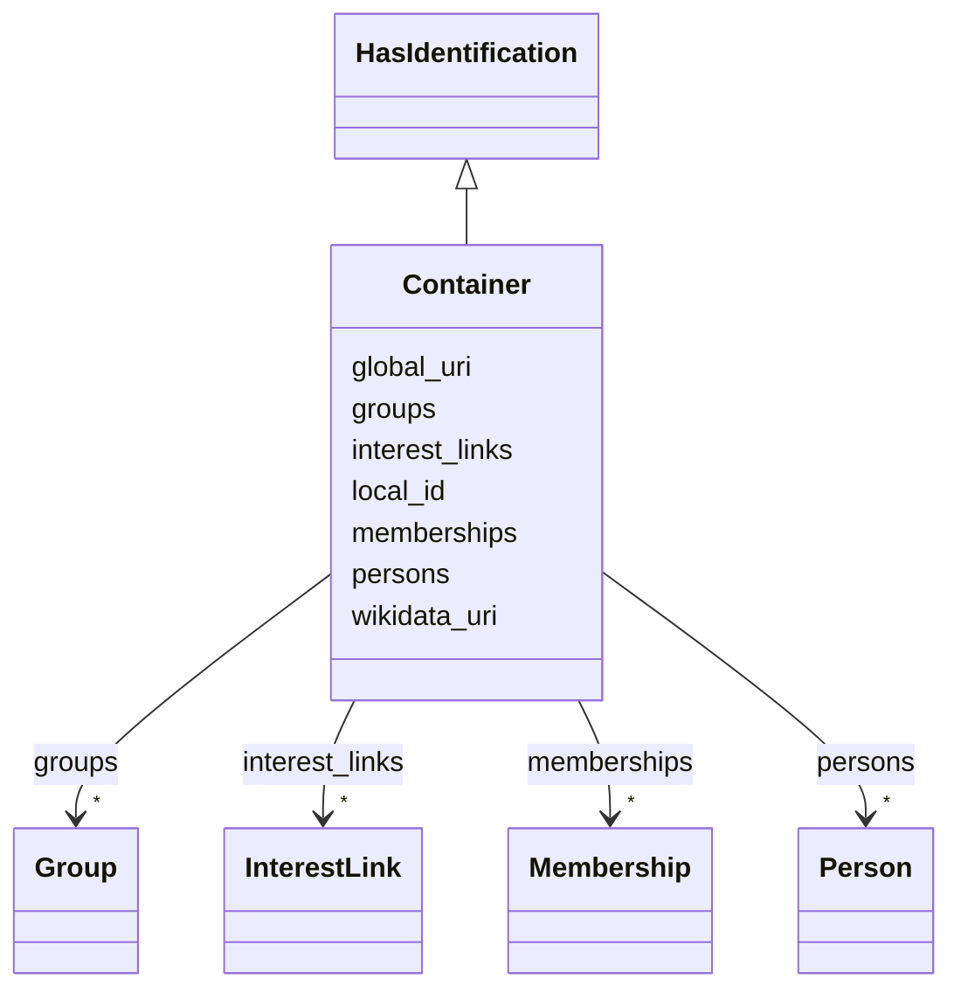

# Class: Container 


_[de] Container für politische Akteure, Gruppen und Beziehungen._

_[en] Container for political actors, groups, and relationships._

__


URI: [act:Container](https://ld.ech.ch/schema/0294/actors/Container)



```mermaid
 classDiagram
    class Container
    click Container href "../Container/"
      HasIdentification <|-- Container
        click HasIdentification href "../HasIdentification/"
      
      Container : global_uri
        
      Container : groups
        
          
    
        
        
        Container --> "*" Group : groups
        click Group href "../Group/"
    

        
      Container : interest_links
        
          
    
        
        
        Container --> "*" InterestLink : interest_links
        click InterestLink href "../InterestLink/"
    

        
      Container : local_id
        
      Container : memberships
        
          
    
        
        
        Container --> "*" Membership : memberships
        click Membership href "../Membership/"
    

        
      Container : persons
        
          
    
        
        
        Container --> "*" Person : persons
        click Person href "../Person/"
    

        
      Container : wikidata_uri
        
      
```


## Inheritance
* **Container** [ [HasIdentification](HasIdentification.md)]


## Class Properties

| Property | Value |
| --- | --- |
| Tree Root | Yes |


## Slots

| Name | Cardinality and Range | Description | Inheritance |
| ---  | --- | --- | --- |
| [persons](persons.md) | * <br/> [Person](Person.md) | [de] Sammlung von Personen | direct |
| [groups](groups.md) | * <br/> [Group](Group.md) | [de] Sammlung von Gruppen | direct |
| [memberships](memberships.md) | * <br/> [Membership](Membership.md) | [de] Sammlung von Mitgliedschaften | direct |
| [interest_links](interest_links.md) | * <br/> [InterestLink](InterestLink.md) | [de] Sammlung von Interessenbindungen | direct |
| [local_id](local_id.md) | 0..1 <br/> [String](String.md) | [de] Lokaler Identifikator | [HasIdentification](HasIdentification.md) |
| [global_uri](global_uri.md) | 1 <br/> [Uriorcurie](Uriorcurie.md) | [de] Eine eindeutige, global gültige URI für die Entität | [HasIdentification](HasIdentification.md) |
| [wikidata_uri](wikidata_uri.md) | 0..1 <br/> [Uriorcurie](Uriorcurie.md) | [de] Eine URI, die auf eine Wikidata-Entität verweist, z | [HasIdentification](HasIdentification.md) |


## Identifier and Mapping Information


### Schema Source


* from schema: https://ld.ech.ch/schema/0294/actors


## Mappings

| Mapping Type | Mapped Value |
| ---  | ---  |
| self | act:Container |
| native | act:Container |


## LinkML Source

<!-- TODO: investigate https://stackoverflow.com/questions/37606292/how-to-create-tabbed-code-blocks-in-mkdocs-or-sphinx -->

### Direct

<details>
```yaml
name: Container
description: '[de] Container für politische Akteure, Gruppen und Beziehungen.

  [en] Container for political actors, groups, and relationships.

  '
from_schema: https://ld.ech.ch/schema/0294/actors
mixins:
- HasIdentification
slots:
- persons
- groups
- memberships
- interest_links
tree_root: true

```
</details>

### Induced

<details>
```yaml
name: Container
description: '[de] Container für politische Akteure, Gruppen und Beziehungen.

  [en] Container for political actors, groups, and relationships.

  '
from_schema: https://ld.ech.ch/schema/0294/actors
mixins:
- HasIdentification
attributes:
  persons:
    name: persons
    description: '[de] Sammlung von Personen.

      [en] Collection of persons.

      '
    from_schema: https://ld.ech.ch/schema/0294/actors
    rank: 1000
    slot_uri: act:person
    alias: persons
    owner: Container
    domain_of:
    - Container
    range: Person
    multivalued: true
    inlined_as_list: true
  groups:
    name: groups
    description: '[de] Sammlung von Gruppen.

      [en] Collection of groups.

      '
    from_schema: https://ld.ech.ch/schema/0294/actors
    rank: 1000
    slot_uri: act:group
    alias: groups
    owner: Container
    domain_of:
    - Container
    range: Group
    multivalued: true
    inlined_as_list: true
  memberships:
    name: memberships
    description: '[de] Sammlung von Mitgliedschaften.

      [en] Collection of memberships.

      '
    from_schema: https://ld.ech.ch/schema/0294/actors
    rank: 1000
    slot_uri: act:membership
    alias: memberships
    owner: Container
    domain_of:
    - Container
    range: Membership
    multivalued: true
    inlined_as_list: true
  interest_links:
    name: interest_links
    description: '[de] Sammlung von Interessenbindungen.

      [en] Collection of interest links.range: InterestLink

      '
    from_schema: https://ld.ech.ch/schema/0294/actors
    rank: 1000
    slot_uri: act:interestLink
    alias: interest_links
    owner: Container
    domain_of:
    - Container
    - Person
    range: InterestLink
    multivalued: true
    inlined_as_list: true
  local_id:
    name: local_id
    description: '[de] Lokaler Identifikator. Bspw. eine UUID aus dem Ratsinformationssystem.

      [en] Local identifier. For example, a UUID from the council information system.

      '
    from_schema: https://ld.ech.ch/schema/0294/actors
    rank: 1000
    slot_uri: mcm:localId
    alias: local_id
    owner: Container
    domain_of:
    - HasIdentification
    range: string
  global_uri:
    name: global_uri
    description: '[de] Eine eindeutige, global gültige URI für die Entität.

      [en] A unique, globally valid URI for the entity.

      '
    from_schema: https://ld.ech.ch/schema/0294/actors
    rank: 1000
    slot_uri: mcm:globalURI
    identifier: true
    alias: global_uri
    owner: Container
    domain_of:
    - HasIdentification
    range: uriorcurie
    required: true
  wikidata_uri:
    name: wikidata_uri
    description: '[de] Eine URI, die auf eine Wikidata-Entität verweist, z.B. https://www.wikidata.org/wiki/Q39
      für die Schweiz.

      [en] A URI that refers to a Wikidata entity, e.g. https://www.wikidata.org/wiki/Q39
      for Switzerland.

      '
    from_schema: https://ld.ech.ch/schema/0294/actors
    rank: 1000
    slot_uri: mcm:wikidataUri
    alias: wikidata_uri
    owner: Container
    domain_of:
    - HasIdentification
    range: uriorcurie
tree_root: true

```
</details>