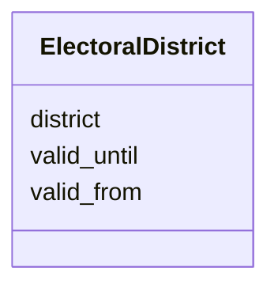

# Class: ElectoralDistrict 


URI: [act:ElectoralDistrict](https://ch.paf.link/schema/actors/ElectoralDistrict)





<!-- no inheritance hierarchy -->


## Slots

| Name | Cardinality and Range | Description | Inheritance |
| ---  | --- | --- | --- |
| [district](district.md) | 1 <br/> [String](String.md) |  | direct |
| [valid_from](valid_from.md) | 0..1 <br/> [Date](Date.md) |  | direct |
| [valid_until](valid_until.md) | 0..1 <br/> [Date](Date.md) |  | direct |


## Usages

| used by | used in | type | used |
| ---  | --- | --- | --- |
| [Person](Person.md) | [electoral_district](electoral_district.md) | range | [ElectoralDistrict](ElectoralDistrict.md) |


## Identifier and Mapping Information


### Schema Source


* from schema: https://ch.paf.link/schema/actors


## Mappings

| Mapping Type | Mapped Value |
| ---  | ---  |
| self | act:ElectoralDistrict |
| native | act:ElectoralDistrict |


## LinkML Source

<!-- TODO: investigate https://stackoverflow.com/questions/37606292/how-to-create-tabbed-code-blocks-in-mkdocs-or-sphinx -->

### Direct

<details>
```yaml
name: ElectoralDistrict
from_schema: https://ch.paf.link/schema/actors
attributes:
  district:
    name: district
    from_schema: https://ch.paf.link/schema/actors
    rank: 1000
    domain_of:
    - ElectoralDistrict
    required: true
  valid_from:
    name: valid_from
    from_schema: https://ch.paf.link/schema/actors
    slot_uri: act:validFrom
    domain_of:
    - Group
    - Membership
    - InterestLink
    - Name
    - Validity
    - ElectoralDistrict
    range: date
  valid-until:
    name: valid-until
    from_schema: https://ch.paf.link/schema/actors
    slot_uri: act:validUntil
    domain_of:
    - Validity
    - ElectoralDistrict
    range: date

```
</details>

### Induced

<details>
```yaml
name: ElectoralDistrict
from_schema: https://ch.paf.link/schema/actors
attributes:
  district:
    name: district
    from_schema: https://ch.paf.link/schema/actors
    rank: 1000
    alias: district
    owner: ElectoralDistrict
    domain_of:
    - ElectoralDistrict
    range: string
    required: true
  valid_from:
    name: valid_from
    from_schema: https://ch.paf.link/schema/actors
    slot_uri: act:validFrom
    alias: valid_from
    owner: ElectoralDistrict
    domain_of:
    - Group
    - Membership
    - InterestLink
    - Name
    - Validity
    - ElectoralDistrict
    range: date
  valid-until:
    name: valid-until
    from_schema: https://ch.paf.link/schema/actors
    slot_uri: act:validUntil
    alias: valid_until
    owner: ElectoralDistrict
    domain_of:
    - Validity
    - ElectoralDistrict
    range: date

```
</details>