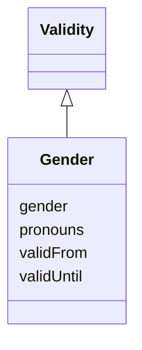

# Class: Gender 


URI: [act:Gender](https://ch.paf.link/schema/actors/Gender)





## Inheritance
* [Validity](Validity.md)
    * **Gender**


## Slots

| Name | Cardinality and Range | Description | Inheritance |
| ---  | --- | --- | --- |
| [gender](gender.md) | 1 <br/> [String](String.md) | Gender code | direct |
| [pronouns](pronouns.md) | * <br/> [String](String.md) | Pronouns used by the person | direct |
| [validFrom](validFrom.md) | 0..1 <br/> [Date](Date.md) |  | [Validity](Validity.md) |
| [validUntil](validUntil.md) | 0..1 <br/> [Date](Date.md) |  | [Validity](Validity.md) |


## Usages

| used by | used in | type | used |
| ---  | --- | --- | --- |
| [Person](Person.md) | [genders](genders.md) | range | [Gender](Gender.md) |


## Identifier and Mapping Information


### Schema Source


* from schema: https://ch.paf.link/schema/actors


## Mappings

| Mapping Type | Mapped Value |
| ---  | ---  |
| self | act:Gender |
| native | act:Gender |


## LinkML Source

<!-- TODO: investigate https://stackoverflow.com/questions/37606292/how-to-create-tabbed-code-blocks-in-mkdocs-or-sphinx -->

### Direct

<details>
```yaml
name: Gender
from_schema: https://ch.paf.link/schema/actors
is_a: Validity
attributes:
  gender:
    name: gender
    description: Gender code
    from_schema: https://ch.paf.link/schema/actors
    rank: 1000
    domain_of:
    - Gender
    required: true
  pronouns:
    name: pronouns
    description: Pronouns used by the person
    from_schema: https://ch.paf.link/schema/actors
    rank: 1000
    domain_of:
    - Gender
    multivalued: true
    inlined: true
    inlined_as_list: true

```
</details>

### Induced

<details>
```yaml
name: Gender
from_schema: https://ch.paf.link/schema/actors
is_a: Validity
attributes:
  gender:
    name: gender
    description: Gender code
    from_schema: https://ch.paf.link/schema/actors
    rank: 1000
    alias: gender
    owner: Gender
    domain_of:
    - Gender
    range: string
    required: true
  pronouns:
    name: pronouns
    description: Pronouns used by the person
    from_schema: https://ch.paf.link/schema/actors
    rank: 1000
    alias: pronouns
    owner: Gender
    domain_of:
    - Gender
    range: string
    multivalued: true
    inlined: true
    inlined_as_list: true
  validFrom:
    name: validFrom
    from_schema: https://ch.paf.link/schema/actors
    alias: validFrom
    owner: Gender
    domain_of:
    - Name
    - Validity
    - ElectoralDistrict
    range: date
  validUntil:
    name: validUntil
    from_schema: https://ch.paf.link/schema/actors
    alias: validUntil
    owner: Gender
    domain_of:
    - Name
    - Validity
    - ElectoralDistrict
    range: date

```
</details>